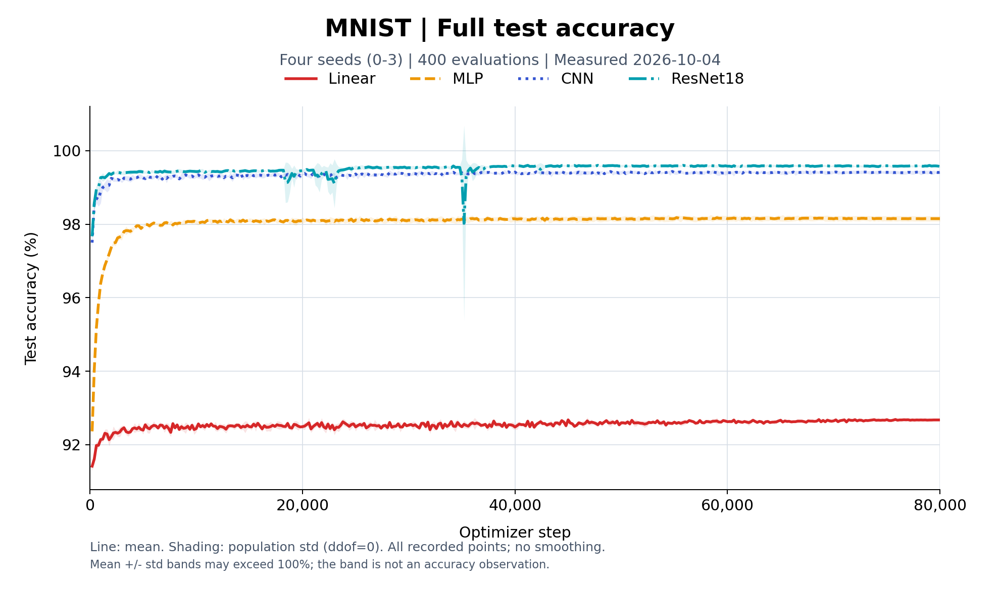
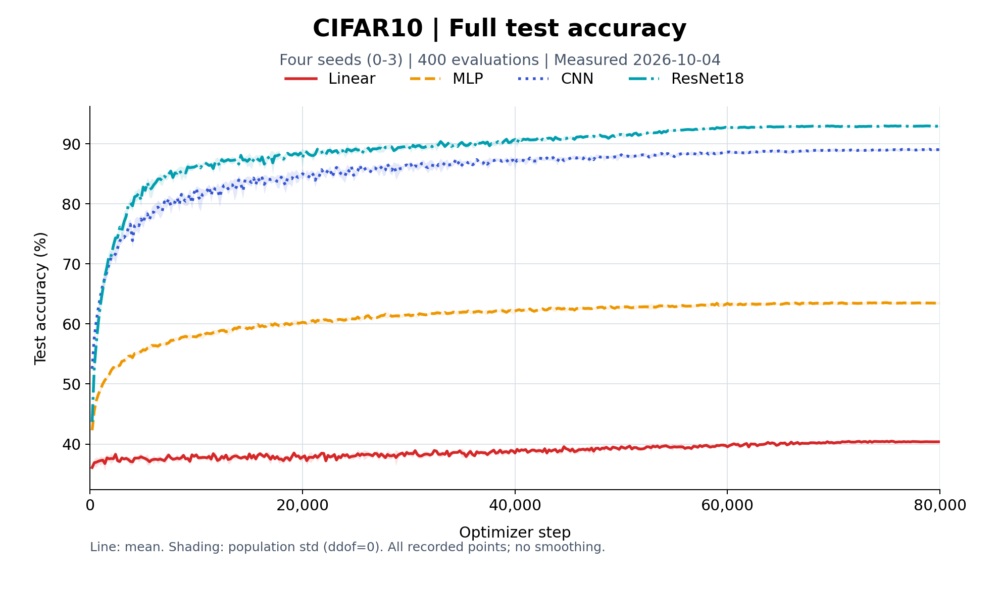

# RPipe

RPipe（Research Pipeline）是一个研究执行库，Python 包名为 `rpipe`。用 YAML 声明实验因素与 seed，展开并运行实验，再将配置、结果、日志、checkpoint 和跨 seed 汇总保存到同一 Study 中。

当前包版本为 **0.2.0（阶段版）**，提供可安装的 CLI、原生 PyTorch / Hugging Face Trainer 通路、checkpoint/resume、运行日志与跨 seed 聚合。

## 本机实测（2026-10-04）

### MNIST / CIFAR10 训练曲线

MNIST / CIFAR10 × linear / mlp / cnn / resnet18 × seeds 0–3：**32 条连续 80000-step 训练与 32 条自身 best 独立评测全部成功**。每条训练每 200 个 optimizer steps 完整评测 10000 张 test，共 400 个点。下图为本机实际训练曲线，横轴是 optimizer step，实线为四 seed mean，阴影为 **population std（ddof=0）**，保留全部点和瞬时波动。





两图使用训练中的完整 test history，独立 eval 的 best 没有替代曲线终点。实验使用 Study 专用配方与固定环境；完整配置、数值、环境和验收范围见 [实测报告](studies/main_historical/docs/STUDY_REPORT.md)。

## 核心模型

```text
Study
  └─ Experiment（axes 的一个取值组合，不含 seed）
       └─ Run（Experiment × seed 的一次实测）

src/rpipe/
  ├─ structure/   # control、data、model、algorithm、system、artifact、make
  └─ flow/        # prepare → execute → collect → summarize → write → process
```

- **structure** 定义一次 Run 如何组成，并由 `make` 将 Study 声明展开成 config、index 和调度计划。`artifact/readout/` 再把落下的 index、result、日志和 `process.json` 读成表。
- **flow** 是跑 Study 的入口：对每个 Run 执行固定阶段链，最后按 Experiment 跨 seed 聚合。`status` / `logs` / `report` 从 cli 进来，转给 readout。
- **artifact** 是磁盘契约：Study 级 `docs/`、`shared/`、index、process，以及 Run 级 config、result、tracker、log、checkpoint。

## 文档顺序

Agent 的文档导航与通用工作约定见 [AGENTS.md](AGENTS.md)。

设计与代码冲突时，先更新文档，再更新实现。权威阅读顺序是：

1. [concept.md](docs/code/concept.md)：概念、职责与边界
2. [layout.md](docs/code/layout.md)：仓库和 Study 的目录契约
3. [code.md](docs/code/code.md)：模块边界与依赖方向
4. [structure.md](docs/code/structure.md) / [flow.md](docs/code/flow.md)：两柱的详细契约
5. [studies/README.md](studies/README.md)：如何设计和运行一轮 Study，以及现有 Study 的计划、报告和代码
6. [testing.md](docs/development/testing.md)：测试策略、标签和结果持久化

已知缺陷见 [bugs.md](docs/development/bugs.md)，开发记录见 [record.md](docs/development/record.md)，阶段性想法见 [brainstorm.md](docs/development/brainstorm.md)。

## 安装

要求 Python 3.10 或更高版本。

```bash
python -m pip install -e ".[dev]"
```

使用 Hugging Face Trainer 通路时安装对应可选依赖：

```bash
python -m pip install -e ".[dev,hf]"
```

依赖声明以 [pyproject.toml](pyproject.toml) 为准。具体研究的额外依赖、数据准备和环境要求见对应 Study 的 README。

## 快速开始

先复制 `studies/_template/`，完成 `docs/PLAN.md`、`study.yaml` 和 `experiment_config.yaml`，再运行：

```bash
# 只展开 Experiment × seed，检查生成的 config 与 index
python -m rpipe run studies/<name> --skip-launch

# 生成调度计划；默认按任务类型和显存估计组成 wait 组
python -m rpipe make studies/<name> --num-gpus 1

# 复用 scripts/jobs.json，运行未完成的 Run，最后执行 Study 聚合
python -m rpipe launch studies/<name> --num-gpus 1

# 只重建 Study 级聚合与曲线
python -m rpipe process studies/<name>

# 查看完成状态与事件行；从已有聚合生成 docs/NUMBERS.md
python -m rpipe status studies/<name>
python -m rpipe logs studies/<name>
python -m rpipe report studies/<name>
```

需要最短的顺序执行路径时：

```bash
python -m rpipe run studies/<name>
```

完整字段、并行排班、失败续跑和报告约定见 [studies/README.md](studies/README.md)。

## Study 中什么进 Git

| **内容** | **是否入库** | **原因** |
|------|----------|------|
| `study.yaml`、`experiment_config.yaml`、`recipe.py` | 是 | 可复现实验声明与 Study 自己的注册配方 |
| `docs/PLAN.md`、`docs/STUDY_REPORT.md`、报告图片 | 是 | 人写的研究计划与结论 |
| `docs/NUMBERS.md` | 可以 | `rpipe report` 从 `process.json` 生成的数字表，不是结论 |
| `runs/`、`shared/`、`scripts/` | 否 | 可重新生成或体积较大的运行产物 |
| `index.json`、`process.json`、`activity.json`、`provenance.json` | 否 | make / process 重建；`activity.json` 只在 make 进行中存在 |
| `.tmp/` | 否 | 本地测试、缓存和临时验证 |
| `docs/*.tmp`、`docs/*.claim` | 否 | 本地事务暂存和执行占用标记；正式恢复/失败快照单独保留 |

数据、运行产物、计划、报告和复跑代码都保存在各自 Study 目录中，不放到 `docs/` 或仓库根目录。

`studies/` 保留正式研究和可复用验收案例。一次性的文件占用、环境开关等排错放 `.tmp/diagnostics/`，结论合并到相关 Study 报告；本地证据链接不会随 Git clone 提供。

## 开发与 CI

```bash
# 快速门：unit + p1 + c1，不跑 slow / external / gpu
python tests/run.py --fast

# 当前 PR 门：unit 的 c1 与 c2，不跑 slow / external / gpu
python tests/run.py --core

# 本地执行链：符合 c1/c2 的 integration/e2e，不跑 slow / external / gpu
python tests/run.py --all --cost-class c1 --cost-class c2 -- -m "(integration or e2e) and not external and not gpu and not slow"

# 显式运行所有已收集测试
python tests/run.py --all
```

pytest 的 base temp、cache 和测试结果都写入 `.tmp/`。测试入口与标记约定见 [tests/README.md](tests/README.md)。

GitHub Actions 配置包括：

- `Unit Tests`：Ubuntu/Windows × Python 3.10/3.13，安装 `.[dev]` 后执行 core 和本地 CPU 流程门；
- `Package Check`：在 Ubuntu/Windows 构建 wheel / sdist，在源码目录之外的全新虚拟环境中安装两种分发包，验证模块入口、console script 与离线 Toy/Stub Study 的 make / launch / process / readout。

各提交的检查状态见 [GitHub Actions](https://github.com/diaoenmao/RPipe/actions)。CPU 安装与流程验收不覆盖所有 GPU 或可选 HF 场景。分支顺序、必需检查和自行合并见 [cicd.md](docs/development/cicd.md)。

## 当前实现范围

- 数据：stub，以及 torchvision 的 MNIST、FashionMNIST、CIFAR10、CIFAR100、SVHN；
- 模型：`custom_torch` 的 linear、MLP、CNN、ResNet、WideResNet；
- 算法：原生 PyTorch train/eval，以及 `transformers_trainer`；
- 运行：顺序执行、按 GPU/wait 组并行、checkpoint/resume、Run 日志与 Study 聚合。

文档中列出的其他下游生态是扩展边界，不代表已经实现；以 Registry 和 [bugs.md](docs/development/bugs.md) 为准。

上述清单表示已有实现，不代表全部模型与数据组合已完成真实运行验收。六个指定组合的 30-step 验收见 [数据报告](https://github.com/diaoenmao/RPipe/blob/71143ab/studies/support_data_smoke/docs/STUDY_REPORT.md) 与 [模型报告](https://github.com/diaoenmao/RPipe/blob/71143ab/studies/support_model_smoke/docs/STUDY_REPORT.md)，模型报告保留 ResNet10 的 Accuracy 复算差异；未解决缺陷见 BUGS。
