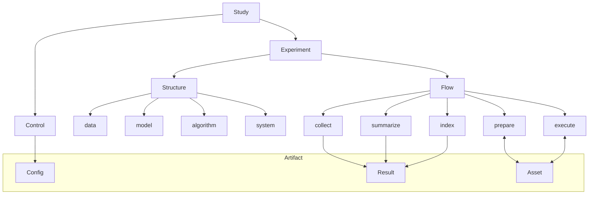
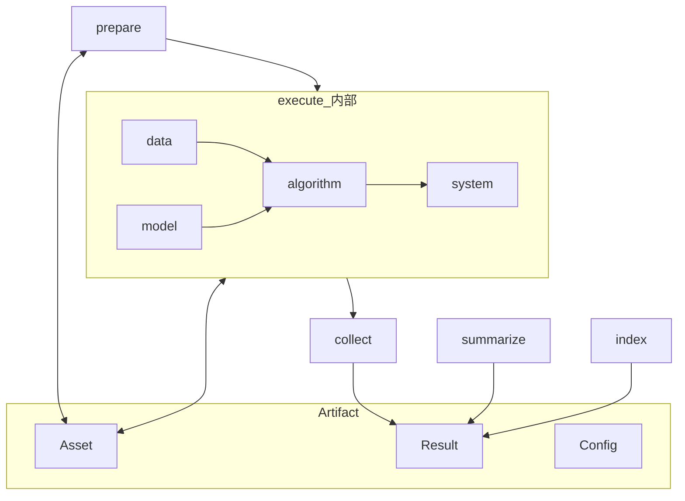
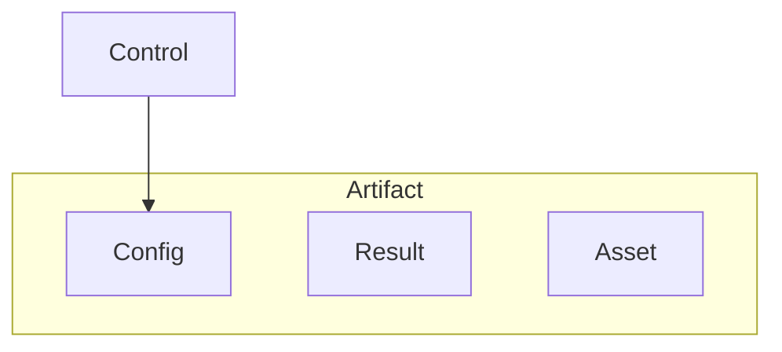

# Concept

---

## 1. 一句话定位

**可重复、可编排、可序列化的研究执行底座** — Study 编排 Control 与 Experiment，将一次运行落为 **Artifact**（Config、Result、Asset），供人复盘，供 autoresearch / AI 在下一轮决策时消费。

---

## 2. 与相邻系统的边界

| 相邻系统                     | 提供                                           |
| ------------------------ | -------------------------------------------- |
| **autoresearch**         | 稳定的 Experiment 入口、Result schema、可校验的结构化 JSON |
| **PyTorch / HF / 其他运行时** | 通过适配接入，保留其训练 / 评测 / 推理语义                     |
| `**examples/`（包外编排）**    | Study 编排、Control / Experiment 驱动、Artifact 落盘         |
| **研究者**                  | 定义 Control 与 Config、读取 Result、按 Control 对比结果     |

---

## 3. 核心概念

概念树两条支路并列于 **Study** 下，**Control 与 Experiment 互不直连**：

- `Study → Control → Config`（变量；Config 是 Artifact 成员，**由 Study 写入**，不经 Flow）
- `Study → Experiment → Structure / Flow → Result / Asset`（能力与过程；Result、Asset 是 Artifact 成员，**由 Flow 写入**）

Config、Result、Asset 共同组成一份 **Artifact**，但来源不同：**Study 控制 Config，Experiment 的 Flow 控制 Result 与 Asset**。Study 编排时将 Config 与 Experiment 组合执行。

| 概念 | 定义 |
|------|------|
| **Study** | 下挂平级的 Control 与 Experiment；展开 Control，编排 Experiment 与 Config 的组合执行（见 §3.1、§5.6） |
| **Control** | 实验变量指派（含 seed）；与 Experiment 平级；直达 Artifact 内的 Config（见 §3.2） |
| **Config** | Artifact 的一种；由 **Study 写入**；承载 Control 变量与 Structure 字段（见 §3.3、§6.3） |
| **Experiment** | Study 下的可运行单元：Structure 能力 + Flow + 实现；与 Control 平级（见 §3.4） |
| **Structure** | 四层静态组成：data、model、algorithm、system；字段由 Config 承载（见 §4） |
| **Flow** | prepare → execute → collect → summarize → index；归属 Experiment（见 §5） |
| **Artifact** | 持久化产物总称；含 Config（Study 写）、Result 与 Asset（Flow 写）（见 §6） |
| **Result** | 结构化摘要与路径索引；Artifact 一种（见 §6.1） |
| **Asset** | 磁盘文件；Artifact 一种（见 §6.2） |

### 3.1 Study

一组可比较尝试的设计。Study **下挂平级的 Control 与 Experiment**。

- **Control 支路**：在变量轴上展开多个 Control，各由 Study **写入** Artifact 内的 **Config**，**含 seed**
- **Experiment 支路**：定义或引用可运行单元（Structure 能力 + Flow + 实现），Flow 写入 Artifact 内的 **Result**、**Asset**

变量轴覆盖 Structure 各层中有意变化的字段，例如数据集、模型结构、学习率、**seed** 等。**seed 与其它变量同质**。

编排细节见 **§5.6**。结论通过各 Control 的 Artifact 内 Result 定位；autoresearch 消费 Result。

### 3.2 Control

某次对比所采用的**实验变量指派**：Structure 各层中有意设定的取值集合，**包含 seed**。

与 **Experiment 平级**，同属 Study，**概念上不直连 Experiment**。**直达** Artifact 内的 **Config**（不由 Flow 产生）；**Result**、**Asset** 由 Flow 写入同一份 Artifact。

summarize 将 Control 指派写入 Result（内容源于 Study 提供的 Config）。

### 3.3 Config

**Artifact** 的一种，通常是一份 YAML。逻辑上归属 **Control**，承载该 Control 的变量取值与 **Structure 四层字段**。

- **由 Study 写入** Artifact，属于 Study 编排域，**不属于 Flow**，prepare / execute 等阶段不产出 Config
- Study 编排时将 Config **作为输入**交给 Experiment 消费（只读）；Flow 据此跑 Structure，并写入 Result、Asset
- 可由人手编写，或由 Study 网格脚本批量生成

见 **§6.3**。

**示例**：`lr0.01_seed0` 与 `lr0.01_seed1` 是两个 Control、两份 Artifact（各含 Study 写的 Config，及 Flow 写的 Result、Asset）。Study 可用同一 Experiment 分别注入两份 Config 各跑一遍。

### 3.4 Experiment

Study 下的可运行研究单元，与 **Control 平级**：声明 **Structure 能力边界**（四层能做什么）与 **Flow**，并提供实现。

- 不持有 Control；Structure 取值由 Study 提供的 Config 注入（编排边界输入，非 Flow 产物）
- Study 编排时选定 Experiment，并传入某 Control 的 Config
- **prepare、execute** 与 Asset **双向**交互（Flow 不写 Config）
- **collect、summarize、index** **单向**写入 Artifact 内的 Result
- **prepare** 不写入 Result
- Result 归属该次编排对应的 Artifact，不挂在 Experiment 的对象树引用下
- 可通过 Flow 模块 preset 或模块列表裁剪重跑

### 3.5 Result

结构化摘要与产物路径索引；Artifact 的一种。collect、summarize、index **单向**写入。见 **§6.1**。

### 3.6 Artifact

持久化产物总称，含 **Config**、**Result**、**Asset** 三类：Config 由 **Study** 经 Control 写入；Result、Asset 由 **Flow** 写入。见 **§6**。

### 3.7 Asset

磁盘上的具体产物文件；Artifact 的一种。prepare、execute **双向**读写。collect、summarize、index 不操作 Asset。见 **§6.2**。

---

## 4. Structure

**Experiment** 的静态能力模型：data、model、algorithm、system 四层配置与职责。

- **能力**（能接什么数据、什么模型、哪些 algorithm 语义）由 Experiment 声明
- **取值**（本 Control 用哪份数据、多大学习率等）由 Study 写入 Artifact 内的 **Config**，编排时作为只读输入交给 Experiment
- prepare 按 Study 提供的 Config 校验并落地；execute 驱动计算；Structure 快照写入 Result

同一 Study 内，不同 Control 之间的差异应落在各自 Artifact 内 Config 所承载的 Structure 取值上。

### 4.1 data

| 字段     | 含义             | 例子                          |
| ------ | -------------- | --------------------------- |
| 数据集名称  | 使用哪份数据         | `MNIST`、`CIFAR10`、GSM8K     |
| 划分与用途  | 训练 / 验证 / 评测视图 | 训练集迭代、测试集 eval              |
| 批次与采样  | 与数据管线相关的规模设定   | batch size、test batch ratio |
| 预处理与增强 | 进入 model 前的变换  | 归一化、resize、随机增强、tokenize    |
| 加载方式   | data 层接入与并行读取  | num_workers、pin_memory      |

data 层把研究所需输入组织为可消费的数据流。

**在 Flow 中**  

- prepare：检查可达性，下载或缓存数据，**写入**数据缓存 Asset  
- execute：从 Asset 读取数据缓存或外部源，按 batch 供给 algorithm

**职责**  
声明数据集来源与版本；统一样本字段结构；提供迭代接口；完成进入 model 前的预处理与增强。

**例子**  
MNIST / CIFAR 图像批次；GSM8K 问答对；TTS `(text, audio)`；Diffusion `(image, caption)`；推理 prompt 列表。

### 4.2 model

| 字段        | 含义                  | 例子                            |
| --------- | ------------------- | ----------------------------- |
| 模型名称 / 结构 | 网络形态                | `linear`、`resnet18`、GPT、U-Net |
| 权重来源      | 初始化或加载位置            | 随机初始化、预训练 checkpoint、GGUF 文件  |
| 结构与变体     | 层冻结、adapter、head 替换 | LoRA 挂载、分类头维度                 |
| 前向相关设定    | 与 model 形态绑定的选项     | 上下文长度、输入分辨率、词表大小              |

model 层把可计算的参数化对象构建为可调用的模型句柄。

**在 Flow 中**  

- prepare：构建结构，从 Asset **读取**预训练权重或外部 checkpoint（若声明）  
- execute：从 Asset **读取** checkpoint；训练语义下 **写入** checkpoint Asset

**职责**  
定义结构与参数；加载权重；暴露范式特定的 forward 接口。

**例子**  
`linear`、`resnet18`、GPT Transformer、Diffusion U-Net、TTS 声学模型 + vocoder、GGUF 本地权重。

### 4.3 algorithm

| 字段     | 含义                  | 例子                                     |
| ------ | ------------------- | -------------------------------------- |
| 计算语义   | 本次编排执行哪些过程          | train、eval、inference 及其组合（Config 与 Study 编排声明） |
| 任务范式   | 算法所属范式              | 分类、AR、Diffusion、TTS、检测                 |
| 训练过程参数 | train 循环相关          | 学习率、优化器、scheduler、训练步数 / epoch、eval 间隔 |
| 评测设定   | eval 相关             | 评测集、metric 选择、benchmark 任务             |
| 推理设定   | inference 相关        | 解码策略、temperature、扩散步数、采样器              |

algorithm 层在任务范式下定义怎么算。

**在 Flow 中**  

- prepare：校验语义组合是否合法（如仅 eval 时是否有评测集）  
- execute：组织 train / eval / inference 循环，调用 data、model，经 system 在硬件上执行

algorithm 选型落在 AR、TTS、Diffusion、分类、检测等范式层面。

#### 4.3.1 train

更新模型参数；backward 主导。按 step / epoch 迭代，计算 loss，更新参数，触发 checkpoint 与日志写入（execute 阶段，经 system）。

例子：分类训练、AR 预训练、Diffusion 去噪训练、TTS 声学模型训练、LoRA 微调。

#### 4.3.2 eval

度量质量；forward 为主，对照 benchmark 或 ground truth。聚合准确率、BLEU、pass rate、FID 等 metric，结果进入 Result。

例子：MNIST 测试集准确率、标准评测任务集、BLEU 评测。

#### 4.3.3 inference

推理 / 生成；forward 为主，产出可用输出。生成文本、图像、音频等，由 execute **写入** Asset。

例子：AR 文本续写、Diffusion 文生图、TTS 文本转语音。

### 4.4 system

| 字段     | 含义      | 例子                         |
| ------ | ------- | -------------------------- |
| 设备     | 执行设备    | CPU、单卡 GPU、多卡              |
| 精度     | 数值与显存策略 | fp32、fp16、mixed precision  |
| 并行与分布式 | 跨设备执行方式 | 单卡、DDP、张量并行                |
| 内存与 IO | 执行节奏相关  | checkpoint 保存周期、日志间隔、输出根目录 |
| 恢复与调试  | 运行态控制   | resume、profile             |

system 层管理 forward / backward 在硬件上的执行关联。

**在 Flow 中**  

- prepare：确认设备与输出目录；从 Asset **读取** resume 状态  
- execute：落实设备、精度、并行；**写入** checkpoint / 日志 Asset

**职责**  
设备放置、精度策略、显存管理、分布式、数据预取与计算重叠。

**例子**  
单卡 mixed precision；四卡 DDP；CPU 量化推理；每 N step checkpoint；pin_memory + 多 worker。

---

## 5. Flow

**Experiment** 的动态过程：Study 在编排边界传入 Config（只读）后，prepare、execute 与 Asset **双向**交互；collect、summarize、index **单向**写入 Artifact 内的 Result。**Flow 不读写 Artifact 内的 Config。**

| Phase     | Asset                                             | Result                           |
| --------- | ------------------------------------------------- | -------------------------------- |
| prepare   | **双向**：读缓存 / checkpoint；写缓存、日志                    | —                                |
| execute   | **双向**：读权重 / 数据 / checkpoint；写 checkpoint、日志、生成文件 | —                                |
| collect   | —                                                 | **→** 写入 execute 过程观测            |
| summarize | —                                                 | **→** 整理 Control、Structure 快照、元数据 |
| index     | —                                                 | **→** 编入 Asset 路径，定稿             |

Flow 归属 Experiment。Study 编排选定 Experiment、传入 Config，执行 Flow（或子集）；index 结束后 Result、Asset 写入 Artifact。Config 早已由 Study 落位，不由 Flow 产生。

### 5.1 prepare

**目的**  
按 Study 在编排边界传入的 Config 校验 Structure，并落地为可执行、可复现的状态。不写入 Artifact 内的 Config。

**读取 Asset**  
已缓存数据集、resume checkpoint、同 Study 内上游权重（warm-start）。

**写入 Asset**  
数据缓存、prepare 日志、环境检查记录。

**Structure 落地**  

- data：可达性检查、下载与缓存  
- model：结构构建、从 Asset 加载权重  
- algorithm：语义组合校验  
- system：设备与输出目录确认、resume 状态读取

不写入 Result。

### 5.2 execute

**目的**  
按 Study 传入的 Config 中的 Structure 驱动真实计算。

**读取 Asset**  
prepare 缓存的数据、resume checkpoint、外部权重、同 Study 上游权重。

**写入 Asset**  
周期 checkpoint、执行期日志、inference 生成文件。

**四层协作**  
data 供批次 → model 提供句柄 → algorithm 组织循环 → system 落实硬件与 IO。

一次 execute 可依次跑多种 algorithm 语义（train / eval / inference），由 Config 与 Study 编排声明。

观测留在 execute 内存态，待 collect **单向**写入 Result。Asset 由 prepare、execute 落盘，collect 不触碰。

### 5.3 collect

**目的**  
收纳 **execute 过程观测**，**单向写入 Result**。不读写 Asset。

**写入 Result**  
metric 缓冲、学习曲线点、评测聚合值、部分逐步观测。Asset 路径待 index 阶段编入 Result。

### 5.4 summarize

**目的**  
在 collect 素材基础上整理 Result。不读写 Asset；**单向写入** Result。

**写入 Result**  
Control 指派（含 seed 等变量）；Structure 快照（源于 Study 提供的 Config）；可选 tag；聚合 metric；执行元数据（Experiment 标识、device、Phase 耗时、algorithm 语义列表）。

产物路径仍待 index 阶段补全。

### 5.5 index

**目的**  
将 prepare、execute 阶段产出的 Asset 路径编入 Result，**定稿**。不改动 Asset 文件；**单向写入** Result。

**写入 Result**  
checkpoint、日志、生成样本等 prepare / execute 产出的 Asset 路径与类型；Result 文件自身路径。

### 5.6 Study 编排

Study 在变量轴上展开多个 **Control**，为各 Control **写入** Artifact 内的 **Config**；并定义或引用若干 **Experiment**。

每次运行由 Study 指定：

1. 使用哪个 **Experiment**
2. 传入哪个 **Control** 的 **Config**（编排边界只读输入）

Experiment 据此执行 Flow，将 Result、Asset 写入 Artifact。Config 由 Study 预先落位，Flow 不参与其产生。Control 与 Experiment 本身不直连，绑定表由 Study 持有。

---

## 6. Artifact

持久化产物统称 **Artifact**，含 **Config**、**Result**、**Asset** 三类，来源分离：

| 成员 | 写入方 | 说明 |
|------|--------|------|
| **Config** | **Study**（经 Control） | declarative 原文；不经 Flow |
| **Result** | **Flow** | collect、summarize、index |
| **Asset** | **Flow** | prepare、execute |

磁盘布局见 REPO_LAYOUT；此处只约定概念关系。

| 类型 | 含义 | 典型内容 |
|------|------|----------|
| **Config** | declarative Artifact | Control 变量、Structure 四层字段（YAML） |
| **Result** | 结构化 Artifact | Control 指派、Structure 快照、metric、元数据（含 Experiment 标识）、Asset 路径 |
| **Asset** | 文件型 Artifact | 缓存、checkpoint、日志、生成样本 |

Result **不挂在** Experiment 的内存对象树下，与同份 Artifact 内的 Config 共存。autoresearch 以 Result 为首选输入；需还原运行前提时，可读 Study 写入的 Config。

**Config** 由 Study 经 Control 落位；**Result**、**Asset** 由 Flow 写入。Result 与 Asset 通过 index 阶段编入的路径关联；Flow 与 Artifact 的交互见 **§5**（仅 Result、Asset）。

### 6.1 Result

Flow 中 collect、summarize、index 三阶段**单向**写入；index 结束后定稿。

| 块            | 来源 Phase          | 内容                                             |
| ------------ | ----------------- | ---------------------------------------------- |
| Control      | summarize         | 实验变量指派（含 seed），源于同份 Artifact 内的 Config              |
| Structure 快照 | summarize         | 源于 Study 提供的 Config（Flow 不产出 Config）              |
| 可选 tag       | summarize         | 人类可读补充标识                                       |
| metric       | collect、summarize | train / eval / inference 聚合结果                  |
| 执行元数据        | summarize         | Experiment 标识、device、Phase 耗时、algorithm 语义列表    |
| 产物路径         | index             | prepare / execute 产出的 Asset 路径列表；Result 文件自身路径 |

**消费**  
Study 内按 Control 横向对比；autoresearch 排序与选优；AI 解读实验结论。一条 Result 即可还原 Control、所用 Experiment 与文件位置；完整 declarative 原文见同份 Artifact 内的 Config。

### 6.2 Asset

磁盘上的具体文件。prepare、execute_内部 **双向**读写；collect、summarize、index 不操作 Asset。

| 类型                 | 读                             | 写                   |
| ------------------ | ----------------------------- | ------------------- |
| 数据缓存               | execute（data）                 | prepare（data）       |
| 预训练权重 / checkpoint | prepare（model）、execute（model） | execute（system）周期保存 |
| 训练日志               | —                             | execute（system）     |
| prepare 日志         | —                             | prepare             |
| 生成样本               | —                             | execute（inference）  |
| Study 级聚合表         | —                             | Study 级后处理（可选）      |

index 阶段将上述 Asset 路径**单向**编入 Result，不在 Result 之外单独维护索引对象。

### 6.3 Config

**Artifact** 的 declarative 成员，通常是一份 YAML。逻辑上归属 **Control**，承载该 Control 的变量取值与 Structure 四层字段。

**写入**  
**Study** 经 Control **写入** Artifact。**不经 Flow**；prepare、execute、collect、summarize、index 均不产出或修改 Config。

**与 Result 的关系**  
Result 内的 Control 指派与 Structure 快照面向快速对比；Config 保留完整 declarative 原文，二者互补，不互相替代。

**与 Study 编排的关系**  
Study 先将 Config 落位到 Artifact，再在编排边界将 Config **只读传入** Experiment；Flow 消费 Config 取值，写入 Result、Asset。Config 与 Flow 无图上的连线。