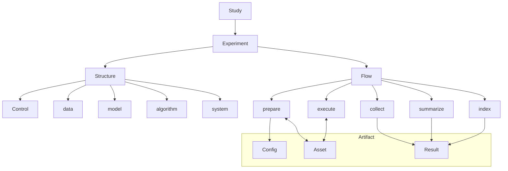
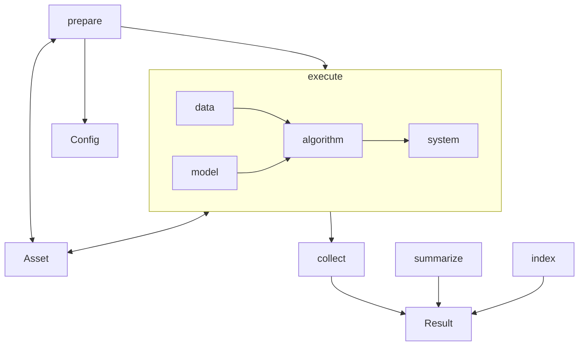
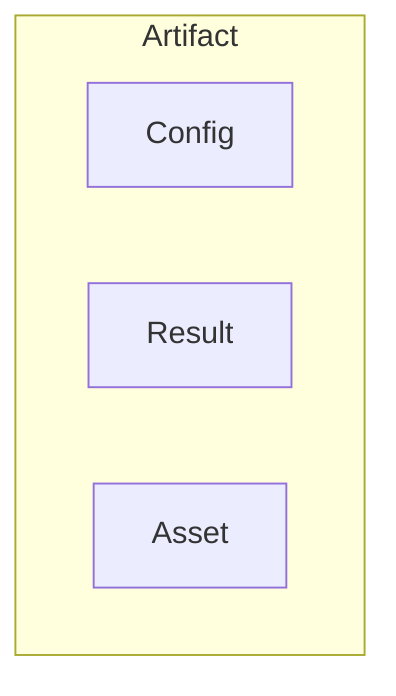

# Concept

---

## 1. 一句话定位

**可重复、可编排、可序列化的研究执行底座** — Study 编排 Experiment 并落盘 Config，经 Flow 将 Result、Asset 写入 **Artifact**，供人复盘，供 autoresearch / AI 在下一轮决策时消费。

---

## 2. 与相邻系统的边界

本底座不替代训练框架或评测套件，也不替代研究者的 Study 设计。它对外提供稳定的 Experiment 入口与 Result 契约，供 autoresearch 消费；对内通过适配接入 PyTorch、Hugging Face 等运行时，保留其训练 / 评测 / 推理语义。包外编排（如 `examples/`）负责 Study、驱动 Control 与 Experiment，并把需落盘的内容写入 Artifact。研究者侧声明 Control 与 Config，读取 Result，按 Control 对比结论。

| 相邻系统 | 提供 |
|------|------|
| **autoresearch** | Experiment 入口、Result schema、可校验的结构化产物 |
| **PyTorch / HF / 其他运行时** | 通过适配接入，保留其训练 / 评测 / 推理语义 |
| **包外编排** | Study 编排、Control / Experiment 驱动、Artifact 落盘 |
| **研究者** | 定义 Control 与 Config、读取 Result、按 Control 对比结果 |

---

## 3. 核心概念

概念树以 **Study → Experiment** 为主干。Experiment 下挂 **Structure** 与 **Flow**。**Control** 属于 Structure（与 data / model / algorithm / system 并列），表示各层取值指派。

- Structure 含 Control 与四层；Flow 经 prepare **读取** Artifact 内的 Config，再落地 Structure（含构造 Control）
- Flow 写入 Result、Asset；Config 由 Study 落盘，prepare 只读、不改写

需占存储位置的 Config、Result、Asset 都落在 **Artifact** 下。词表如下，细节见各小节。

| 概念 | 定义 |
|------|------|
| **Study** | 编排 Experiment；在变量轴上展开并落盘 Config（见 §3.1、§5.6） |
| **Experiment** | 可运行单元：Structure + Flow + 实现（见 §3.4） |
| **Structure** | 静态组成：Control 与 data、model、algorithm、system（见 §3.2、§4） |
| **Control** | Structure 内的实验变量指派（见 §3.2） |
| **Config** | Artifact 成员；declarative 配置实体；Study 落盘，prepare 读取（见 §3.3、§6.3） |
| **Flow** | prepare → execute → collect → summarize → index（见 §5） |
| **Artifact** | 持久化根；含 Config、Result、Asset（见 §6） |
| **Result** | 结构化摘要与路径索引；Artifact 成员（见 §6.1） |
| **Asset** | 文件型产物；Artifact 成员（见 §6.2） |

### 3.1 Study

一组可比较尝试的设计。Study **编排 Experiment**：在变量轴上展开多次运行所需的 Config，落盘到各 Artifact 子树，再选定 Experiment 执行 Flow。

变量轴覆盖 Structure 中有意变化的字段（含 Control 所指派的取值），例如数据集、模型结构、学习率、seed 等。seed 与其它变量同质，无特殊地位。

编排见 **§5.6**。结论通过各次运行对应 Artifact 中的 Result 定位；autoresearch 消费 Result。

### 3.2 Control

**Structure** 的一部分：某次运行所采用的**实验变量指派**，即 data / model / algorithm / system 中有意设定的取值集合。

概念树上 **Control 挂在 Structure 下**，不与 Experiment 平级直连，也不在图上连接 Config。Config 由 Study 落盘；prepare 读取 Config 后落地 Structure，并得到 Control 对象。同树 Result、Asset 由 Flow 写入。

库内对象代码见 [LAYOUT.md](LAYOUT.md)（`structure/control/`）。summarize 可将 Control 指派写入 Result（内容可源于同树 Config）。

### 3.3 Config

**Artifact** 成员，有实体落盘，通常为 declarative 文件（如 YAML）。承载一次运行的变量取值与 Structure 字段，供 prepare 读取并构造 Control / 落地四层。

由 **Study** 写入 Artifact；**prepare 读取，Flow 不修改**。人手编写或 Study 批量生成均可。见 **§6.3**。

**示例**：`lr0.01_seed0` 与 `lr0.01_seed1` 对应两份 Artifact（各含 Config，以及 Flow 写入的 Result、Asset）。Study 可用同一 Experiment 分别指定两份 Config 各跑一遍。

### 3.4 Experiment

Study 下的可运行研究单元：声明 **Structure**（含 Control 与四层）与 **Flow**，并提供实现。

Study 选定 Experiment 与 Artifact 中的 Config 后执行 Flow。prepare 读 Config、落地 Structure；prepare / execute 与 Asset 交互；collect、summarize、index 写入 Result。Result 归属 Artifact，不由 Experiment 对象树持有。

### 3.5 Result

结构化摘要与产物路径索引；Artifact 成员。由 collect、summarize、index 写入。见 **§6.1**。

### 3.6 Artifact

持久化根：Config、Result、Asset 均在其下。Config 由 Study 落盘、prepare 读取；Result、Asset 由 Flow 落盘。见 **§6**。

### 3.7 Asset

文件型产物；Artifact 成员。prepare、execute 读写；collect、summarize、index 不操作 Asset。见 **§6.2**。

---

## 4. Structure

**Experiment** 的静态组成：**Control** 与 data、model、algorithm、system。

- **Control**：各层有意设定的取值指派
- **能力**（能接什么数据、什么模型、哪些 algorithm 语义）由 Experiment 声明
- **取值**写在对应 Artifact 的 Config 中；prepare 读取 Config 后落地 Structure（含 Control）
- execute 驱动计算；相关快照可写入 Result

同一 Study 内，不同次运行的差异主要体现在各自 Config 所承载、经 prepare 落到 Control / 四层上的取值。

### 4.1 data

data 层把研究所需输入组织为可消费的数据流：来源与版本、样本字段、迭代接口、进入 model 前的预处理与增强等。

prepare 可检查可达性并缓存数据（写入 Asset）；execute 从 Asset 或外部源按 batch 供给 algorithm。

例子：MNIST / CIFAR 图像批次；GSM8K 问答对；TTS `(text, audio)`；Diffusion `(image, caption)`；推理 prompt 列表。

| 字段（例） | 含义 | 例子 |
|------|------|------|
| 数据集名称 | 使用哪份数据 | `MNIST`、`CIFAR10`、GSM8K |
| 划分与用途 | 训练 / 验证 / 评测视图 | 训练集迭代、测试集 eval |
| 批次与采样 | 数据管线规模 | batch size |
| 预处理与增强 | 进入 model 前的变换 | 归一化、resize、随机增强 |
| 加载方式 | 接入与并行读取 | num_workers、pin_memory |

### 4.2 model

model 层构建可调用的模型句柄：结构与参数、权重加载、范式相关的 forward 接口。

prepare 构建结构并可从 Asset 读取权重；execute 读写 checkpoint（训练语义下可写回 Asset）。

例子：`linear`、`resnet18`、GPT Transformer、Diffusion U-Net、TTS 声学模型 + vocoder、GGUF 本地权重。

| 字段（例） | 含义 | 例子 |
|------|------|------|
| 模型名称 / 结构 | 网络形态 | `linear`、`resnet18`、GPT、U-Net |
| 权重来源 | 初始化或加载位置 | 随机初始化、预训练 checkpoint、GGUF |
| 结构与变体 | 冻结、adapter、head | LoRA、分类头维度 |
| 前向相关设定 | 与形态绑定的选项 | 上下文长度、输入分辨率 |

### 4.3 algorithm

algorithm 层在任务范式下定义怎么算。范式可包括分类、AR、Diffusion、TTS、检测等；Config 与 Study 编排声明本次要跑的计算语义（如 train / eval / inference）及相关参数。

prepare 可做必要校验；execute 组织循环，调用 data、model，经 system 在硬件上执行。

| 字段（例） | 含义 | 例子 |
|------|------|------|
| 计算语义 | 本次执行哪些过程 | train、eval、inference 及其组合 |
| 任务范式 | 算法所属范式 | 分类、AR、Diffusion、TTS、检测 |
| 训练过程参数 | train 相关 | 学习率、优化器、步数 / epoch |
| 评测设定 | eval 相关 | 评测集、metric、benchmark |
| 推理设定 | inference 相关 | 解码策略、temperature、采样器 |

#### 4.3.1 train

更新模型参数；backward 主导。迭代计算 loss、更新参数，并可触发 checkpoint 与日志写入（经 system）。

例子：分类训练、AR 预训练、Diffusion 去噪训练、TTS 声学模型训练、LoRA 微调。

#### 4.3.2 eval

度量质量；forward 为主。聚合准确率、BLEU、pass rate、FID 等 metric，结果进入 Result。

例子：MNIST 测试集准确率、标准评测任务集、BLEU 评测。

#### 4.3.3 inference

推理 / 生成；forward 为主。生成文本、图像、音频等，可由 execute 写入 Asset。

例子：AR 文本续写、Diffusion 文生图、TTS 文本转语音。

### 4.4 system

system 层管理计算在硬件上的执行：设备、精度、并行、内存与 IO、恢复等。

prepare 可确认设备与输出位置，并读取 resume 相关 Asset；execute 落实执行策略并写入 checkpoint / 日志等 Asset。

例子：单卡 mixed precision；多卡 DDP；CPU 量化推理；周期 checkpoint。

| 字段（例） | 含义 | 例子 |
|------|------|------|
| 设备 | 执行设备 | CPU、单卡 GPU、多卡 |
| 精度 | 数值与显存策略 | fp32、fp16、mixed precision |
| 并行与分布式 | 跨设备执行方式 | 单卡、DDP、张量并行 |
| 内存与 IO | 执行节奏相关 | checkpoint 周期、日志间隔 |
| 恢复与调试 | 运行态控制 | resume、profile |

---

## 5. Flow

**Experiment** 的动态过程。Study 落盘 Config 后，Flow 按 prepare → execute → collect → summarize → index 推进。prepare **读取** Config 并落地 Structure（含 Control），同时与 Asset 交互；execute 与 Asset 交互；后三阶段写入 Result。**Flow 不修改 Config。**

Flow 归属 Experiment。可跑完整流程或子集；结束后 Result、Asset 落在 Artifact 下。读写关系概括如下。

| Phase | Config | Asset | Result |
|------|------|------|------|
| prepare | 读取 | 读写（如缓存、checkpoint、日志） | — |
| execute | — | 读写（如权重、数据、checkpoint、日志、生成文件） | — |
| collect | — | — | 写入过程观测 |
| summarize | — | — | 整理 Control、Structure 快照、元数据等 |
| index | — | — | 编入 Asset 路径，定稿 |

### 5.1 prepare

**读取** Artifact 内 Config，校验并落地 Structure（含构造 Control 与四层），使后续可执行、可复现。**不修改** Config。

可读写 Asset（如数据缓存、resume checkpoint、prepare 日志）。四层落地包括 data 可达性与缓存、model 构建与权重加载、algorithm 必要校验、system 设备与输出确认等。不写入 Result。

### 5.2 execute

按 Config 中的 Structure 驱动真实计算。

可读写 Asset（如数据、权重、周期 checkpoint、日志、生成文件）。四层协作：data 供批次 → model 提供句柄 → algorithm 组织循环 → system 落实硬件与 IO。一次 execute 可依次跑多种 algorithm 语义，由 Config 与 Study 编排声明。

观测可留在内存态，由 collect 写入 Result；collect 不触碰 Asset。

### 5.3 collect

收纳 execute 过程观测，写入 Result。不读写 Asset。典型内容包括 metric、学习曲线、评测聚合等；Asset 路径可由 index 再编入 Result。

### 5.4 summarize

在 collect 素材上整理 Result。不读写 Asset。典型内容包括 Control 指派、Structure 快照、聚合 metric、执行元数据等。产物路径可由 index 补全。

### 5.5 index

将 prepare、execute 产出的 Asset 路径编入 Result 并定稿。不改动 Asset 文件本身。

### 5.6 Study 编排

Study 在变量轴上展开多次运行，为各次运行落盘 Config；并定义或引用若干 Experiment。每次运行由 Study 指定 Experiment 与 Config；prepare 读 Config 得到 Control 并落地 Structure，随后 Flow 写入 Result、Asset。组合关系由 Study 持有。

---

## 6. Artifact

**Artifact** 是持久化根：需落盘的 Config、Result、Asset 放在其下。路径布局见 [LAYOUT.md](LAYOUT.md)（仓库 **RPipe**，包名 **rpipe**）。

来源分离：Config 由 Study 落盘、prepare 读取；Result、Asset 由 Flow 写入。Result 是 autoresearch 的首选输入；还原运行前提时可读同树 Config。Result 与 Asset 通过 index 编入的路径关联。

| 成员 | 写入方 | 说明 |
|------|--------|------|
| **Config** | Study 落盘；prepare 读取 | declarative 配置实体；Flow 不修改 |
| **Result** | Flow | 结构化摘要与路径索引 |
| **Asset** | Flow | 文件型产物 |

### 6.1 Result

结构化 Artifact。collect、summarize、index 写入；index 后可视为定稿。面向 Study 内对比、autoresearch 排序与选优、AI 解读。一条 Result 宜能还原 Control、所用 Experiment、结论与相关路径；完整 declarative 原文见同树 Config。

| 块（例） | 来源 Phase | 内容 |
|------|------|------|
| Control | summarize | 实验变量指派 |
| Structure 快照 | summarize | 源于 Config 的结构取值 |
| metric | collect、summarize | train / eval / inference 等聚合结果 |
| 执行元数据 | summarize | Experiment、device、耗时、语义列表等 |
| 产物路径 | index | Asset 路径；Result 自身路径 |

### 6.2 Asset

文件型 Artifact（缓存、checkpoint、日志、生成样本等）。prepare、execute 读写；collect、summarize、index 不操作 Asset 文件。index 可将路径编入 Result。

| 类型（例） | 读 | 写 |
|------|------|------|
| 数据缓存 | execute | prepare |
| 权重 / checkpoint | prepare、execute | execute |
| 日志 | — | prepare / execute |
| 生成样本 | — | execute（inference） |

### 6.3 Config

Artifact 的 declarative 成员，有实体落盘。承载变量取值与 Structure 字段，供 prepare 读取并构造 Control。

由 Study 落盘；prepare 读取，Flow 不修改。Result 中的快照便于对比；Config 保留 declarative 原文。
