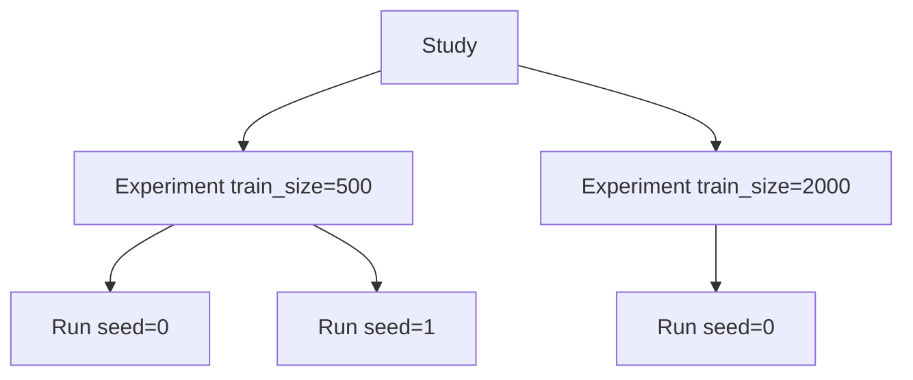
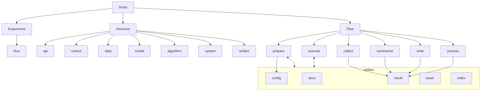
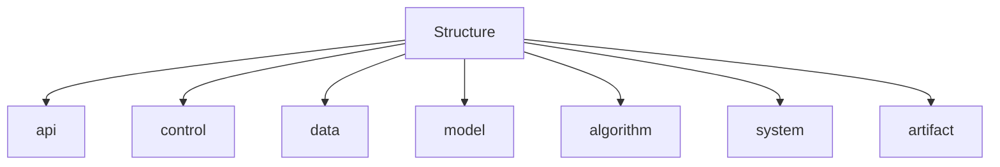
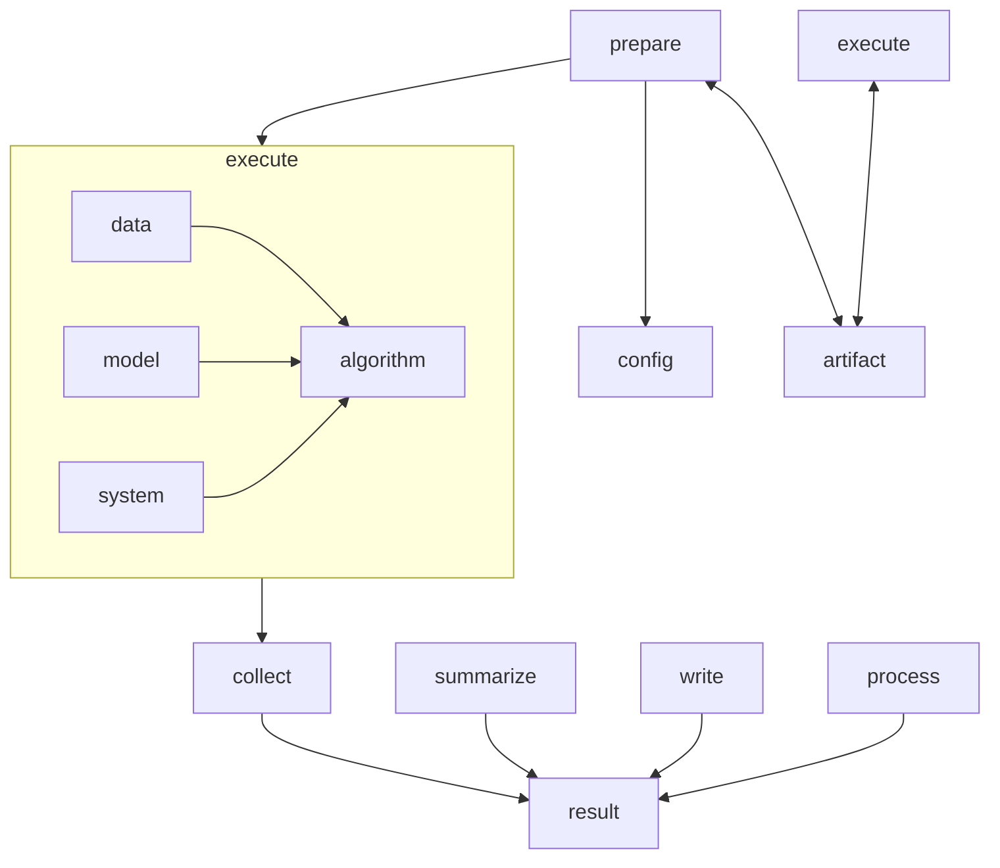

# Concept

RPipe 是**可重复、可编排、可序列化的研究执行底座**。

研究者用 **Study** 声明要比什么；展开为 **Experiment**（实验变量的一个取值点）与 **Run**（带 seed 的实测）；每次 Run 经 **Flow** 执行，产物落在该 Study 的 **artifact** 下，供人复盘与 autoresearch 消费。

目录见 [LAYOUT.md](LAYOUT.md)；操作见 [STUDY_GUIDE.md](STUDY_GUIDE.md)；structure 细节见 [code_structure/structure.md](code_structure/structure.md)。

---

## 1. 边界

对照相邻系统，而不是只谈职责。DeepScientist：[ResearAI/DeepScientist](https://github.com/ResearAI/DeepScientist)。

| | **RPipe** | **DeepScientist** | **Hugging Face** | **autoresearch** |
|--|-----------|-------------------|------------------|------------------|
| **定位** | 研究**执行底座**：可重复、可编排、可序列化 | local-first 研究 OS / 长程工作室 | 模型 / 数据 / 训练与推理**生态与库** | 包外**自动研究环**：选题、改实验、读产物、再决策 |
| **编排对象** | Study → Experiment → Run | Quest | 无研究编排（repo、pipeline、Trainer） | 调用 RPipe（或同类）的 Study / Run |
| **库内组成** | 只有 **structure** + **flow** | Agent + Memory + UI + 执行器 | transformers / datasets / hub 等 | 决策与搜索逻辑（不在本库） |
| **执行** | Flow：prepare → execute → collect → summarize → write → process | `bash_exec` 等通用 shell | Trainer / pipeline / 用户脚本 | 不自己训模型；触发执行底座 |
| **持久化** | Study 下 **artifact**（docs / config / result / asset / index） | Quest Git、memory、artifact 账本 | Hub 权重与数据集；本地 output_dir | 消费 artifact，自管记忆 / 假设 |
| **决策 / 下一步** | **不**内置 | Findings / Bayesian / Map | 无 | **负责**下一步实验 |
| **研究者怎么用** | 写 study 声明与基底配置；读 result；写报告 | 在 OS 里提 Quest、看 Canvas | 选模型 / 数据、写训练或推理代码 | 设目标与约束，审阅自动循环 |
| **训练 / 模型** | 经 structure 的 `data` / `model` 适配接入；**不**替代 HF / PyTorch | Agent 调外部命令接入 | 提供模型卡、权重、Trainer、推理 API | 不提供模型实现 |
| **数据** | 运行时是 structure **data**；落盘是 artifact **asset** | 由 Quest / 外部脚本处理 | Hub datasets、本地缓存 | 指定用哪份数据，不负责下载协议 |
| **产物契约** | 稳定的 Run 入口、config、result | Quest 账本 + 论文/实验产物 | 权重、metrics 日志，无 Study 契约 | 依赖 RPipe 的 result / index |
| **不做什么** | 不做 OS / UI / 决策器；不用通用 shell 取代 Flow | 不是薄执行库 | 不是研究编排底座 | 不替代 Flow / structure |

**借力原则**：相对 DeepScientist，学 durable 契约与编排纪律，不学 OS / UI / 决策器。相对 HF，只适配、不替代。相对 autoresearch，只提供可消费的执行契约。

包外研究根：`studies/<name>/`。

---

## 2. 主干：Study → Experiment → Run

```text
Study            一轮研究（编排壳 + artifact 根）
 └── Experiment  实验变量的一个取值点（不含 seed）
      └── Run    该点下的一次实测（至少含 seed）
```

| | **Study** | **Experiment** | **Run** |
|--|-----------|----------------|---------|
| **是什么** | 编排 + 落盘根 | 比较轴上的一个格子 | 该格子的一次抽样 |
| **seed** | 声明 `seeds` | **不含** | **必须有** |
| **例子** | `mnist_train_size` | `train_size=500` | `train_size=500, seed=0` |
| **磁盘** | `studies/<name>/` | 逻辑分组（**index**） | `runs/<id>/` |

- `axes` → 多个 Experiment；每个 × `seeds` → 多次 Run
- 聚合 / 对照：先按 Experiment，再在其 Runs 上统计
- 基底配置 = Study **默认值**，不是「一个 Experiment 实例」



---

## 3. 全局概念图

库内实现只有两柱：**structure**（静态）与 **flow**（动态）。structure 含 `api`、`control`、四层（data / model / algorithm / system）、以及 **artifact**（IO / 路径）。Study 下的持久化整体也叫 **artifact**；其中的 **config / result / asset / index / docs** 是落盘成员，不是第三柱。



| 概念 | 定义 |
|------|------|
| **Study** | 编排壳与 artifact 根 |
| **Experiment** | 实验变量的一个点（不含 seed） |
| **Run** | 一次实测；含 seed；有内容导出的 `id` |
| **structure** | 静态：`api` + `control` + data / model / algorithm / system + **artifact** |
| **api** | structure 对外门面 |
| **control** | 本 Run 对四层的取值指派（由 config 构造） |
| **config** | 一次 Run 的 declarative 配置；prepare 只读 |
| **flow** | prepare → execute → collect → summarize → write → process |
| **artifact** | Study 下的持久化整体；库内 IO / 路径在 structure 的 **artifact** |
| **result** | 可序列化的执行**摘要**（`status`、最终 metrics、路径）。逐步曲线不进 result |
| **asset** | **文件通道**（相对 result 正文）。数据集、权重、checkpoint、AlgorithmTracker 曲线、Logger 文本都是文件，因此走 asset |
| **AlgorithmTracker** | algorithm 层：只记数（batch mean / history / jsonl） |
| **Logger** | system 层：只打字（stdout 与 `assets/logs/` 同一套，必写） |
| **index** | Study 编排清单（launch 前）；**不是** Flow 阶段 |

读写：config 由编排写入、Flow 不改；result 由 Flow 的 **write** 写入；文件走 **asset**，经 artifact 由 prepare / execute 使用。index 由包外编排写入。

---

## 4. Study

路径：`studies/<name>/`（包外）。持有声明、index、文档、共享与各次 Run 产物。

| 轴 | 含义 | 结果 |
|----|------|------|
| **`axes`** | 有意比较的研究因素 | → Experiment |
| **`seeds`** | 随机复测 | → 每个 Experiment 下的 Run |

编排入口在包外 Study / CLI；**库内不设独立 `study` 包**（见 LAYOUT）。

---

## 5. Experiment 与 Run

**Experiment**：含研究因素（如 `train_size`、`lr`）；不含 seed；无顶层目录。

**Run**：Experiment × seed；一 Run ↔ 一 config ↔ `runs/<id>/`。  
`id` 由 config 内容导出（含 tags、seed；**不含** `id` 与 `description`）。`baseline` 等是 **tags**，不是独立对象。

---

## 6. Structure

Structure 是 Run 的**静态组成**，也是库内静态柱。能力由 Study 基底声明；取值来自该 Run 的 config。



| 成员 | 职责 |
|------|------|
| **api** | 对外门面 |
| **control** | 本 Run 对四层的指派 |
| **data** | 运行时：输入怎么组织。落盘：数据集等文件在 artifact 的 **asset** |
| **model** | 运行时：网络怎么构造。落盘：权重 / checkpoint 在 artifact 的 **asset** |
| **algorithm** | 怎么算。数字账本是本层的 **AlgorithmTracker**。循环插入点是本层 **hook**（如 train 的周期 test），不是新的 Flow 阶段 |
| **system** | 设备、精度、并行、执行节奏；文本日志是本层的 **Logger**（终端 + 必写 `assets/logs/`）。Logger 读 AlgorithmTracker 才能打出 Loss |
| **artifact** | IO 与路径：读写 config / result / asset，以及 Study 下的 layout |

同一 Study：不同 Experiment 差在实验变量；同一 Experiment 下不同 Run 差在 seed。  
字段与 result 快照契约见 [structure.md](code_structure/structure.md)。

---

## 7. Flow

Flow 作用于**一次 Run**：

**prepare → execute → collect → summarize → write → process**


| Phase | 做什么 |
|-------|--------|
| **prepare** | 读 **config**，落地 structure（含 `control`）；经 **artifact** 取用/写入所需文件（含 data / model 对应的 **asset**）；不改 config |
| **execute** | 按 structure 计算；每个 batch 更新 AlgorithmTracker；间隔由 system **Logger** 根据 tracker 打终端并 flush 日志文件 |
| **collect** | 从 AlgorithmTracker（及零星 observations）收出口径稳定的最终 metrics 摘要 |
| **summarize** | 整理可序列化的 result 草稿（含 `status`） |
| **write** | 把 result 写入 artifact（序列化 + 落盘） |
| **process** | 定稿后派生（Δ baseline、按 Experiment 聚合等）；可空 |



说明：

- Flow 只认 **config** 与 **artifact**
- 真数据须显式 `data.source`；`stub` 不得默认下载
- 失败时尽量写 `status: failed` + `error`
- **write** 是 Flow 阶段（写 result）。Study 的 **index** 是编排清单。旧阶段名曾叫 `index`，与清单撞名，故改为 write

---

## 8. Artifact

**artifact** 是该 Study 的持久化整体。路径见 [LAYOUT.md](LAYOUT.md)。

| 成员 | 说明 |
|------|------|
| **docs** | 计划与报告 |
| **config** | 每 Run 一份；编排写、prepare 读 |
| **result** | 每 Run 一份；可序列化；含 `status` |
| **asset** | 文件通道。共享数据 / 权重在 `shared/`；本 Run 的 tracker、logs、checkpoint、样本在 `runs/<id>/assets/` |
| **index** | 编排清单（launch 前；按 Experiment 列 Run） |

---

## 9. 编排生命周期

1. 写基底配置与 study 声明（`axes` + `seeds`）
2. 展开 Experiment × seed → 写各 Run config → 写 index
3. 对每个 Run 跑 Flow
4. 按 Experiment 读 result，写 Study 报告

---

## 10. 相关文档

| 文档 | 内容 |
|------|------|
| [LAYOUT.md](LAYOUT.md) | 仓库目录；库内仅 structure + flow |
| [CODE_STRUCTURE.md](CODE_STRUCTURE.md) | 库内树与依赖 |
| [STUDY_GUIDE.md](STUDY_GUIDE.md) | 怎么开一轮 Study |
| [code_structure/structure.md](code_structure/structure.md) | 四层 / control / AlgorithmTracker / Logger / artifact |
| [code_structure/flow.md](code_structure/flow.md) | Flow 阶段 |
| [TESTING.md](TESTING.md) | 测试目录与标签 |
| [BRAINSTORM_DEEPSCIENTIST.md](BRAINSTORM_DEEPSCIENTIST.md) | 非权威对照与路线图 |
