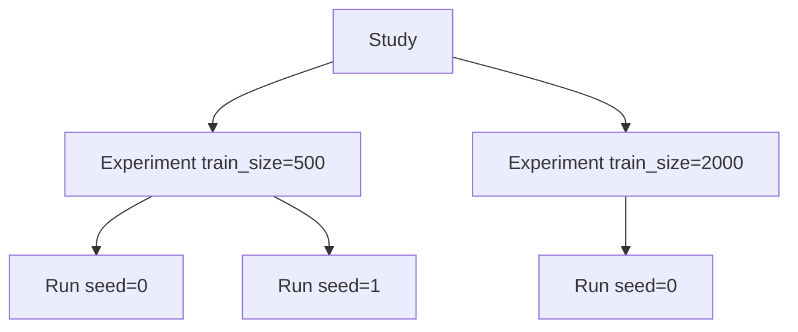
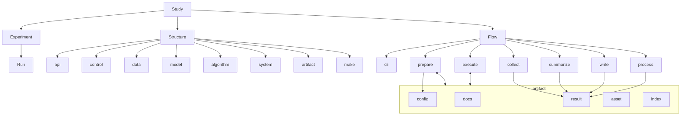
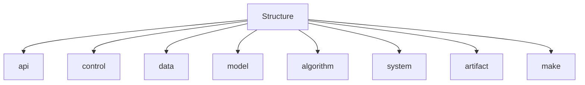
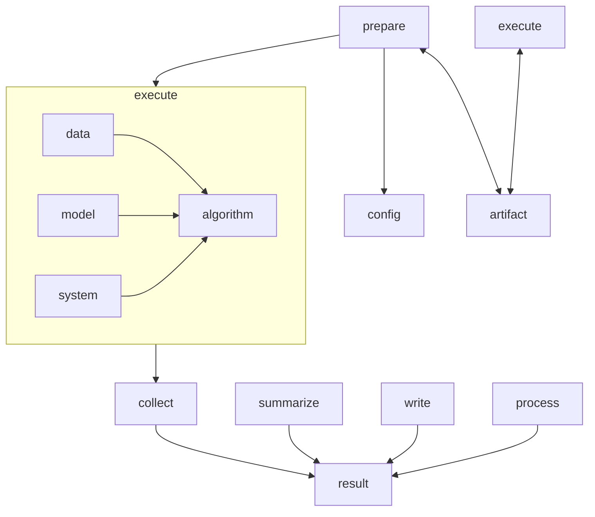

# Concept

RPipe 是**可重复、可编排、可序列化的研究执行底座**。

研究者用 **Study** 声明要比什么。structure 的 **make** 写出各 **Experiment** 与 **Run** 的 config，以及调度脚本。**Flow** 服务整个 Study：同一套执行，用参数选择阶段、顺序或按 `round` 并行。命令行入口是 flow 的 **cli**。产物落在该 Study 的 **artifact** 下。

目录见 [LAYOUT.md](LAYOUT.md)；操作见 [STUDY_GUIDE.md](STUDY_GUIDE.md)；structure 细节见 [code_structure/structure.md](code_structure/structure.md)。

---

## 1. 边界

对照相邻系统，而不是只谈职责。DeepScientist：[ResearAI/DeepScientist](https://github.com/ResearAI/DeepScientist)。

| | **RPipe** | **DeepScientist** | **Hugging Face** | **autoresearch** |
|--|-----------|-------------------|------------------|------------------|
| **定位** | 研究**执行底座**：可重复、可编排、可序列化 | local-first 研究 OS / 长程工作室 | 模型 / 数据 / 训练与推理**生态与库** | 包外**自动研究环**：选题、改实验、读产物、再决策 |
| **编排对象** | Study → Experiment → Run | Quest | 无研究编排（repo、pipeline、Trainer） | 调用 RPipe 或同类的 Study / Run |
| **库内组成** | **structure** + **flow** | Agent + Memory + UI + 执行器 | transformers / datasets / hub 等 | 决策与搜索逻辑，在本库之外 |
| **执行** | Flow 服务 Study；每个 Run 走 prepare → execute → collect → summarize → write → process | `bash_exec` 等通用 shell | Trainer / pipeline / 用户脚本 | 触发执行底座，自己不训模型 |
| **持久化** | Study 下 **artifact**：docs / config / result / asset / index | Quest Git、memory、artifact 账本 | Hub 权重与数据集；本地 output_dir | 消费 artifact，自管记忆 / 假设 |
| **决策 / 下一步** | 不内置 | Findings / Bayesian / Map | 无 | **负责**下一步实验 |
| **研究者怎么用** | 写声明与基底；经 flow cli 跑 Study；读 result；写报告 | 在 OS 里提 Quest、看 Canvas | 选模型 / 数据、写训练或推理代码 | 设目标与约束，审阅自动循环 |
| **训练 / 模型** | 经 structure 的 `data` / `model` 适配接入 | Agent 调外部命令接入 | 提供模型卡、权重、Trainer、推理 API | 不提供模型实现 |
| **数据** | 运行时是 structure **data**；落盘是 artifact **asset** | 由 Quest / 外部脚本处理 | Hub datasets、本地缓存 | 指定用哪份数据 |
| **产物契约** | 稳定的 Run 入口、config、result | Quest 账本 + 论文/实验产物 | 权重、metrics 日志 | 依赖 RPipe 的 result / index |
| **边界** | 执行经 Flow；make 脚本调度多次 Runner。不做 OS / UI / 决策器 | 不是薄执行库 | 不是研究编排底座 | 不替代 Flow / structure |

**借力原则**：相对 DeepScientist，学 durable 契约与编排纪律。相对 HF，只适配。相对 autoresearch，提供可消费的执行契约。

包外研究根：`studies/<name>/`。

---

## 2. 主干：Study → Experiment → Run

```text
Study            一轮研究：编排壳 + artifact 根
 └── Experiment  实验变量的一个取值点，不含 seed
      └── Run    该点下的一次实测，含 seed
```

| | **Study** | **Experiment** | **Run** |
|--|-----------|----------------|---------|
| **是什么** | 编排 + 落盘根 | 比较轴上的一个格子 | 该格子的一次抽样 |
| **seed** | 声明 `seeds` | 不含 | 必须有 |
| **例子** | `mnist_train_size` | `train_size=500` | `train_size=500, seed=0` |
| **磁盘** | `studies/<name>/` | 逻辑分组，见 **index** | `runs/<id>/` |

- `axes` → 多个 Experiment；每个 × `seeds` → 多次 Run
- 聚合 / 对照：先按 Experiment，再在其 Runs 上统计
- 基底配置是 Study 的默认值



---

## 3. 全局概念图

库内两柱：**structure** 与 **flow**。structure 含 `api`、`control`、四层、**artifact**、**make**。Flow 服务 Study；cli 是 Flow 的命令行入口。Study 下的 **config / result / asset / index / docs** 是落盘成员。



| 概念 | 定义 |
|------|------|
| **Study** | 编排壳与 artifact 根 |
| **Experiment** | 实验变量的一个点，不含 seed |
| **Run** | 一次实测；含 seed；`id` 由内容导出 |
| **structure** | `api` + `control` + 四层 + **artifact** + **make** |
| **api** | 四层对外门面 |
| **control** | 本 Run 对四层的取值指派；一次合并 |
| **make** | 声明 → N 份 config 与 index；按 GPU 与 `round` 写出 `&` / **`wait`** 脚本（一组结束才开下一组，避免显存叠加） |
| **config** | 一次 Run 的 declarative 配置；prepare 只读 |
| **flow** | 服务 Study 的执行。同一套阶段链，用参数选择行为。每个 Run：prepare → execute → collect → summarize → write → process |
| **cli** | Flow 的命令行入口 |
| **artifact** | Study 下的持久化整体；IO 在 structure 的 artifact |
| **result** | 可序列化摘要：`status`、最终 metrics、路径。逐步曲线另见 asset |
| **asset** | 文件通道：数据集、权重、checkpoint、AlgorithmTracker 曲线、Logger 文本 |
| **AlgorithmTracker** | algorithm 层，只记数 |
| **Logger** | system 层，只打字；stdout 与 `assets/logs/` 同一套；`report` 拼 epoch / `elapsed` / `eta` / Loss |
| **index** | Study 编排清单；make 写入；按 Experiment 列 Run |

读写：config 由 **make** 写入；result 由 Flow 的 **write** 写入；文件走 **asset**。index 由 make 写入。

---

## 4. Study

路径：`studies/<name>/`。持有声明、index、文档、共享与各次 Run 产物。

| 轴 | 含义 | 结果 |
|----|------|------|
| **`axes`** | 有意比较的研究因素 | → Experiment |
| **`seeds`** | 随机复测 | → 每个 Experiment 下的 Run |

入口是 flow 的 cli：`python -m rpipe`。格子由 **make** 从本目录的声明生成。

---

## 5. Experiment 与 Run

**Experiment**：含研究因素，如 `train_size`、`lr`；不含 seed；无顶层目录。

**Run**：Experiment × seed；一 Run 对应一份 config 与 `runs/<id>/`。  
`id` 由 config 内容导出，含 tags、seed，不含 `id` 与 `description`。`baseline` 等是 **tags**。

---

## 6. Structure

Structure 是静态柱。四层与 **control** 描述一次 Run；**artifact** 与 **make** 覆盖整个 Study 树。能力由 Study 基底声明；每个 Run 的取值来自该次 config。



| 成员 | 职责 |
|------|------|
| **api** | 对外门面 |
| **control** | 本 Run 对四层的指派；一次 `RunConfig` |
| **make** | 循环调用 control 与 artifact，写出 N 份 config、index，以及 `&` / **`wait`** 脚本（`wait` 拦住下一组，防止显存叠加） |
| **data** | 运行时组织输入。落盘在 artifact 的 **asset** |
| **model** | 运行时构造网络。权重 / checkpoint 在 **asset** |
| **algorithm** | 怎么算。数字账本是 **AlgorithmTracker**；metric 名（Loss / Accuracy / MSE / RMSE / GLUE）在本层 `evaluate`；循环插入点是 **AlgorithmHook**。优化器、调度器、梯度裁剪、resume 是本层接口 |
| **system** | 设备、精度、并行、执行节奏；prepare 最先落地 seed / deterministic / cudnn。文本日志是 **Logger** |
| **artifact** | IO 与路径：config / result / asset，以及 Study layout |

同一 Study：不同 Experiment 差在实验变量；同一 Experiment 下不同 Run 差在 seed。  
字段与 result 快照见 [structure.md](code_structure/structure.md)。

---

## 7. Flow

Flow 服务 **Study**。同一套执行，用参数选择阶段子集、是否先 make、顺序或按 `round` 并行。

命令行入口是 **cli**。每个已写出的 Run 走：

**prepare → execute → collect → summarize → write → process**


| Phase | 做什么 |
|-------|--------|
| **prepare** | 读 **config**，落地 structure；经 **artifact** 取用文件；保持 config 不变 |
| **execute** | 按 structure 计算；每个 batch 更新 AlgorithmTracker；Logger 按间隔打终端（含 `elapsed` / `eta`）并 flush 日志 |
| **collect** | 从 AlgorithmTracker 收最终 metrics 摘要 |
| **summarize** | 整理可序列化的 result 草稿，含 `status` |
| **write** | 把 result 写入 artifact |
| **process** | 定稿后派生：本 Run 只写自己的旁路；Study 级 `rpipe process` 再按 Experiment 聚合 |



说明：

- 跑某一个 Run 时，阶段链认该 Run 的 **config** 与 **artifact**
- 真数据须显式 `data.source`
- 失败时写 `status: failed` 与 `error`
- **write** 写该 Run 的 result；**index** 由 make 写在 Study 根
- `process`：每个 Run 只处理自己的结果；Study 总表由单独的 `rpipe process` 收口

---

## 8. Artifact

**artifact** 是该 Study 的持久化整体。路径见 [LAYOUT.md](LAYOUT.md)。

| 成员 | 说明 |
|------|------|
| **docs** | 计划与报告 |
| **config** | 每 Run 一份；make 写、prepare 读 |
| **result** | 每 Run 一份；可序列化；含 `status` |
| **asset** | 文件通道。共享数据 / 权重在 `shared/`；本 Run 的 tracker、logs、checkpoint、样本在 `runs/<id>/assets/` |
| **index** | 编排清单；make 写入；按 Experiment 列 Run |

---

## 9. 编排生命周期

1. 写基底配置与 study 声明：`axes` 与 `seeds`
2. **make**：展开 Experiment × seed → 各 Run config 与 index；按 STUDY_GUIDE §3 同类装箱写出 `&` / `wait` 脚本。一组 `wait` 完才开下一组，免得下一波挤进还占着的显存。有独立 eval 时先并行全部 train，再跑 eval。
3. **Flow**：经 cli，按参数对 Study 下各 Run 跑阶段链；全部 wait 完后跑 Study 级 `process`
4. 按 Experiment 读 result 与曲线，写 Study 报告，报告里要有图

---

## 10. 相关文档

| 文档 | 内容 |
|------|------|
| [LAYOUT.md](LAYOUT.md) | 仓库目录 |
| [CODE_STRUCTURE.md](CODE_STRUCTURE.md) | 库内树与依赖 |
| [STUDY_GUIDE.md](STUDY_GUIDE.md) | 怎么开一轮 Study |
| [code_structure/structure.md](code_structure/structure.md) | 四层 / control / make / AlgorithmTracker / Logger / artifact |
| [code_structure/flow.md](code_structure/flow.md) | Flow：cli 与阶段链 |
| [TESTING.md](TESTING.md) | 测试目录与标签 |
| [BRAINSTORM_DEEPSCIENTIST.md](BRAINSTORM_DEEPSCIENTIST.md) | 对照笔记 |
