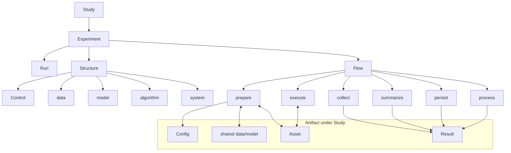
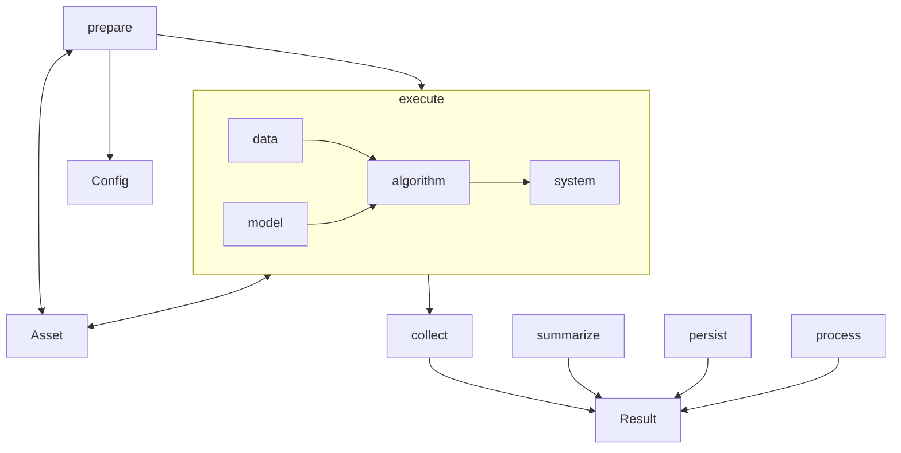

# Concept

---

## 1. 一句话定位

**可重复、可编排、可序列化的研究执行底座** — Study 编排 Experiment 与多次 **Run**，落盘 Config；经 Flow 将 Result、Asset 写入 **Artifact**，供人复盘，供 autoresearch / AI 在下一轮决策时消费。

---

## 2. 与相邻系统的边界

本底座不替代训练框架或评测套件，也不替代研究者的 Study 设计。它对外提供稳定的 Experiment 入口与 Result 契约，供 autoresearch 消费；对内通过适配接入 PyTorch、Hugging Face 等运行时，保留其训练 / 评测 / 推理语义。包外编排（如 `examples/`）负责 Study、驱动 Experiment / Run 与 Control，并把需落盘的内容写入 Artifact。研究者侧声明 Control 与 Config，读取 Result，按 Run 对比结论。


| 相邻系统 | 提供 |
|------|------|
| **autoresearch** | Experiment 入口、Result schema、可校验的结构化产物 |
| **PyTorch / HF / 其他运行时** | 通过适配接入，保留其训练 / 评测 / 推理语义 |
| **包外编排** | Study 编排、Experiment / Run / Control 驱动、Artifact 落盘 |
| **研究者** | 定义 Control 与 Config、读取 Result、按 Run 对比 |


---


## 3. 核心概念

概念树以 **Study → Experiment → Run** 为主干。Experiment 下挂 **Structure** 与 **Flow**。**Control** 属于 Structure（与 data / model / algorithm / system 并列），表示本 Run 对各层的取值指派。

- Structure 含 Control 与四层；Flow 经 prepare **读取** Artifact 内的 Config，再落地 Structure（含构造 Control）
- Flow 写入 Result、Asset；Config 由 Study 落盘，prepare 只读、不改写

需占存储位置的 Config、Result、Asset 都落在 **Artifact** 下。词表如下，细节见各小节。


| 概念 | 定义 |
|------|------|
| **Study** | 一类 / 一轮研究：编排若干 Experiment 与多次 Run（见 §3.1、§5.6） |
| **Experiment** | 一种实验类型：Structure + Flow + 实现（见 §3.4） |
| **Run** | 某 Experiment 下的一次具体运行；有 **`id`**（见 §3.5） |
| **Structure** | 静态组成：Control 与 data、model、algorithm、system（见 §3.2、§4） |
| **Control** | Structure 内的层变量指派（见 §3.2） |
| **Config** | Artifact 成员；declarative 配置；Study 落盘，prepare 读取（见 §3.3、§6.3） |
| **Flow** | prepare → execute → collect → summarize → persist → process（见 §5） |
| **Artifact** | **Study 下**持久化根；共享 data/model + 按 Run 的 Config/Result（见 §6） |
| **Result** | 结构化摘要与路径索引；Artifact 成员（见 §6.1） |
| **Asset** | 文件型产物；Artifact 成员（见 §6.2） |





### 3.1 Study

一类 / 一轮可比较研究的设计。Study **编排 Experiment 与 Run**：在变量轴上展开多次 Run，为各次 Run 落盘 Config，再选定 Experiment 执行 Flow。

变量轴覆盖有意变化的字段（数据集、模型、学习率、seed、algorithm mode 等）。seed 与其它变量同质，无特殊地位。

编排见 **§5.6**。结论通过各次 Run 对应 Artifact 中的 Result 定位；autoresearch 消费 Result。

### 3.2 Control

**Structure** 的一部分：某次 **Run** 对 data / model / algorithm / system 的取值指派。

概念树上 **Control 挂在 Structure 下**，不与 Experiment 平级直连。Config 由 Study 落盘；prepare 读取 Config 后构造 Control 并落地四层。同树 Result、Asset 由 Flow 写入。

库内对象见 [LAYOUT.md](LAYOUT.md)（`structure/control/`）。字段与编解码等实现细节见 [structure.md](code_structure/structure.md)。summarize 可将 Control 指派写入 Result（内容可源于同树 Config）。

### 3.3 Config

**Artifact** 成员，有实体落盘，通常为 declarative 文件（如 YAML）。承载一次 **Run** 的变量取值与 Structure 相关字段，供 prepare 读取并构造 Control / 落地四层。

由 **Study** 写入 Artifact；**prepare 读取，Flow 不修改**。人手编写或 Study 批量生成均可。Config 如何分层、如何与 Experiment 侧默认合并，属实现细节，见代码结构分册，不在本层展开。

**示例**：同一 Experiment 下两次 Run（Config 不同，因而 `id` 不同）各有一份 Artifact（各含 Config，以及 Flow 写入的 Result、Asset）。

### 3.4 Experiment

Study 下的一种**实验类型**：声明 **Structure**（含 Control 与四层）与 **Flow**，并提供实现。

Study 选定 Experiment，并为各次 Run 落盘 Config 后执行 Flow。prepare 读该 Run 的 Config、落地 Structure；prepare / execute 与 Asset 交互；collect、summarize、index 写入 Result。Result 归属该 Run 的 Artifact，不由 Experiment 对象树持有。

### 3.5 Run

某 Experiment 下的**一次具体运行**。

- 有 **`id`**，用来区分不同配置内容的运行（实现上可由配置内容导出，见代码结构分册）
- 一次 Run 对应一份 Config 与一份 Artifact（Config / Result / Asset）
- 同一 Experiment 可有很多次 Run；差异主要在各次 Config 的取值（如不同 seed）

### 3.6 Result

结构化摘要与产物路径索引；Artifact 中按 Run 存放的成员。由 collect、summarize、**persist** 写入（失败时可由 Runner 直接落盘）；**process** 可读/可补写派生字段。定稿须含 **`status`**（`succeeded` / `failed`）。**只含可 JSON 化内容**（见 [structure.md](code_structure/structure.md) §9.1）。见 **§6.1**。

### 3.7 Artifact

**挂在 Study 下**的持久化根：本 Study 共享的 data/model 等资源 + 各次 Run 子树（Config / Result / 按 Run 的 Asset）。不再默认挂在 Experiment 下（避免多 Study 共用一个 Experiment 时目录互相污染）。见 **§6**。

### 3.8 Asset

文件型产物。分两类：**Study 共享**（如 MNIST 下载缓存、可复用权重）与 **Run 专有**（日志、本 Run checkpoint）。prepare / execute 读写；collect / summarize / persist 不改写 Asset 文件内容（persist 只登记路径）。见 **§6.2**。

---


## 4. Structure

**Experiment** 的静态组成：**Control** 与 data、model、algorithm、system。

- **Control**：本 Run 对各层的取值指派
- **能力**（能接什么数据、什么模型、哪些 algorithm mode）由 Experiment 声明
- **取值**写在对应 Run 的 Config 中；prepare 读取后落地 Structure（含 Control）
- execute 驱动计算；相关快照可写入 Result

同一 Study 内，不同 Run 的差异主要体现在各自 Config 所承载、经 prepare 落到 Control / 四层上的取值。

### 4.1 data

data 层把研究所需输入组织为可消费的数据流：来源与版本、样本字段、迭代接口、进入 model 前的预处理与增强等。

prepare 可检查可达性并缓存数据（写入 Asset）；execute 从 Asset 或外部源按 batch 供给 algorithm。

例子：MNIST / CIFAR 图像批次；GSM8K 问答对；TTS `(text, audio)`；Diffusion `(image, caption)`；推理 prompt 列表。


| 字段（例） | 含义 | 例子 |
|------|------|------|
| 数据集名称 | 使用哪份数据 | `MNIST`、`CIFAR10`、GSM8K |
| 划分与用途 | 训练 / 验证 / 评测视图 | 训练集迭代、测试集 eval |
| 批次与采样 | 数据管线规模 | batch size |
| 预处理与增强 | 进入 model 前的变换 | 归一化、resize、随机增强 |
| 加载方式 | 接入与并行读取 | num_workers、pin_memory |


### 4.2 model

model 层构建可调用的模型句柄：结构与参数、权重加载、范式相关的 forward 接口。

prepare 构建结构并可从 Asset 读取权重；execute 读写 checkpoint（训练语义下可写回 Asset）。

例子：`linear`、`resnet18`、GPT Transformer、Diffusion U-Net、TTS 声学模型 + vocoder、GGUF 本地权重。


| 字段（例） | 含义 | 例子 |
|------|------|------|
| 模型名称 / 结构 | 网络形态 | `linear`、`resnet18`、GPT、U-Net |
| 权重来源 | 初始化或加载位置 | 随机初始化、预训练 checkpoint、GGUF |
| 结构与变体 | 冻结、adapter、head | LoRA、分类头维度 |
| 前向相关设定 | 与形态绑定的选项 | 上下文长度、输入分辨率 |


### 4.3 algorithm

algorithm 层在任务范式下定义怎么算。一次 Run 的 algorithm 由 **`mode`** 区分：**train** / **eval** / **inference**（一次配置一个 mode；要组合多种 mode 由 Study 安排多次 Run 或多次执行）。相关超参写在 Config 中。

prepare 可做必要校验；execute 组织循环，调用 data、model，经 system 在硬件上执行。


| 字段（例） | 含义 | 例子 |
|------|------|------|
| mode | 本次 Run 的计算模式 | train、eval、inference |
| 训练过程参数 | train 相关 | 学习率、优化器、步数 / epoch |
| 评测设定 | eval 相关 | 评测集、metric、benchmark |
| 推理设定 | inference 相关 | 解码策略、temperature、采样器 |


#### 4.3.1 train

更新模型参数；backward 主导。迭代计算 loss、更新参数，并可触发 checkpoint 与日志写入（经 system）。

例子：分类训练、AR 预训练、Diffusion 去噪训练、TTS 声学模型训练、LoRA 微调。

#### 4.3.2 eval

度量质量；forward 为主。聚合准确率、BLEU、pass rate、FID 等 metric，结果进入 Result。

例子：MNIST 测试集准确率、标准评测任务集、BLEU 评测。

#### 4.3.3 inference

推理 / 生成；forward 为主。生成文本、图像、音频等，可由 execute 写入 Asset。

例子：AR 文本续写、Diffusion 文生图、TTS 文本转语音。

### 4.4 system

system 层管理计算在硬件上的执行：设备、精度、并行、内存与 IO、恢复等。

prepare 可确认设备与输出位置，并读取 resume 相关 Asset；execute 落实执行策略并写入 checkpoint / 日志等 Asset。

例子：单卡 mixed precision；多卡 DDP；CPU 量化推理；周期 checkpoint。


| 字段（例） | 含义 | 例子 |
|------|------|------|
| 设备 | 执行设备 | CPU、单卡 GPU、多卡 |
| 精度 | 数值与显存策略 | fp32、fp16、mixed precision |
| 并行与分布式 | 跨设备执行方式 | 单卡、DDP、张量并行 |
| 内存与 IO | 执行节奏相关 | checkpoint 周期、日志间隔 |
| 恢复与调试 | 运行态控制 | resume、profile |

---


## 5. Flow

**Experiment** 的动态过程。Study 为各次 Run 落盘 Config 后，Flow 按  
**prepare → execute → collect → summarize → persist → process**  
推进。prepare **读取** 该 Run 的 Config 并落地 Structure（含 Control），同时与共享 / 按 Run 的 Asset 交互；execute 与 Asset 交互；summarize / persist 写入 Result；process 在 Result 定稿后做派生处理。**Flow 不修改 Config。**

> 旧名 **`index`（阶段）** 已更名为 **`persist`**：职责是定稿并**序列化写入** `result.json`，不是「建索引」 alone。Study 目录下的编排清单仍叫 **`index.json`**（§6.4），二者勿混。

Flow 归属 Experiment，作用于一次 **Run**。可跑完整流程或子集；结束后 Result 与按 Run 的 Asset 落在 **该 Study 的 Artifact** 下。


| Phase | Config | Asset | Result |
|------|------|------|------|
| prepare | 读取 | 读写（共享缓存 + 本 Run） | — |
| execute | — | 读写 | — |
| collect | — | — | 过程观测（内存） |
| summarize | — | — | 可序列化草稿（含 status） |
| persist | — | 登记路径 | **定稿写入 `result.json`** |
| process | — | 可选读 | 读定稿；可写派生 / 回填 |





### 5.1 prepare

**读取** 该 Run 的 Config，校验并落地 Structure（含构造 Control 与四层）。**不修改** Config。

可读写 **Study 共享 Asset**（如数据集缓存）与 **本 Run Asset**（日志等）。真数据路径应由 Config 显式 `source`（如 `torch`）触发；`stub` / `Toy` 不得默认下载。不写入 Result。

### 5.2 execute

按本 Run 的 Structure 驱动真实计算。可读写 Asset。观测留在内存，由 collect 收纳。

### 5.3 collect

收纳 execute 观测到内存缓冲。不读写 Asset。典型：metric、loss、accuracy。

### 5.4 summarize

整理 **可 JSON 化** Result 草稿（Control、Structure 快照、metrics、`status`）。**禁止**把 DataLoader / Module 等 runtime 写入草稿（见 structure.md §9.1）。

### 5.5 persist（原 index）

登记 Asset 路径，将 Result **序列化定稿**为 `result.json`。成功时 `status: succeeded`。

若某阶段抛错：Runner 应尽量写入 `status: failed` + `error`，再向上抛出。

### 5.6 process

在 **persist 之后**：基于已定稿 Result 做派生处理（例如相对 `tags` 含 `baseline` 的 Δ、写 Study 级摘要片段、回填 index 条目的 metrics）。不替代 persist；不改写 Config。可裁剪跳过。

### 5.7 Study 编排

Study 在变量轴上展开多次 **Run**，为各次 Run 落盘 Config；引用 Experiment。组合关系与 **Artifact 根**由 Study 持有。

**编排顺序**：

1. 填写 **`study.yaml`**（描述、Experiment、变量轴、tags 规则）— 见 [STUDY_GUIDE.md](STUDY_GUIDE.md)  
2. 展开并落盘各 Run Config（含 description / tags）到 Study Artifact  
3. 写 **`index.json`**（编排清单；launch 之前）  
4. launch Flow（含 persist → process）  
5. 人 / 工具读 Result 与（可选）Study 级产物  

`index.json` 是编排契约；Result 是执行结局。

---


## 6. Artifact

**Artifact 挂在 Study 下**（不是默认挂在 Experiment 下）。同一 Study 内多次 Run **共享** data / model 等只读资源；用 **Run `id`** 区分各次 Config / Result / 专有 Asset。路径见 [LAYOUT.md](LAYOUT.md)。

```text
examples/studies/<study>/
  study.yaml                 # Study 声明（变量轴、tags…）
  index.json                 # 编排清单（launch 前）
  artifact/
    shared/
      data/                  # 如 MNIST 下载缓存（Study 内共享）
      model/                 # 可复用权重等（按需）
    runs/
      <run_id>/
        config.yaml
        result.json
        assets/              # 本 Run 日志 / checkpoint 等
```

| 成员 | 写入方 | 说明 |
|------|--------|------|
| **shared/** | prepare（只读复用优先） | Study 内共享 data/model 内容 |
| **Config** | Study；prepare 读取 | 每 Run 一份；Flow 不修改 |
| **Result** | Flow persist（失败时 Runner） | 每 Run；可 JSON；见 §6.1 |
| **Run assets** | Flow prepare/execute | 每 Run 专有文件 |

Experiment 目录仍持有 **代码**（Structure/Flow 适配、`experiment_config` 基底、`grid`/`launch`），**不再**作为默认 Artifact 根。

### 6.1 Result

collect → summarize → **persist** 写入；成功路径下 persist 后定稿。**process** 可追加派生字段。只含可 JSON 化内容（structure.md §9.1）。


| 块（例） | 来源 Phase | 内容 |
|------|------|------|
| **status** | summarize / Runner | `succeeded` 或 `failed` |
| **error** | Runner（失败时） | 失败原因摘要 |
| Control | summarize | 本 Run 的变量指派 |
| Structure 快照 | summarize | **可序列化**投影（无 Loader/Module） |
| metric | collect、summarize | 聚合结果 |
| 产物路径 | persist | shared / run assets 路径；Result 自身路径 |


### 6.2 Asset

| 类型 | 位置 | 说明 |
|------|------|------|
| 数据集缓存 | `artifact/shared/data/` | Study 内各 Run 共用 |
| 可复用权重 | `artifact/shared/model/` | 按需 |
| 本 Run checkpoint / 日志 | `artifact/runs/<id>/assets/` | 不共享 |

### 6.3 Config

每 Run 一份，落在 `runs/<id>/config.yaml`。含 `description`（**不**进 id hash）、`tags`（**进** id hash）。由 Study 根据 `study.yaml` 展开写入。

### 6.4 统一 `index.json`（Study 编排清单）

Study 在 **launch 之前** 写出；内含 Study + Experiment + 各计划 Run（id / description / tags / 路径）。**不是** Flow 的 `persist` 阶段。process 之后可回填 metrics / status，但主清单仍以编排时写出为准。

用法与 `study.yaml` 模版见 [STUDY_GUIDE.md](STUDY_GUIDE.md)。
