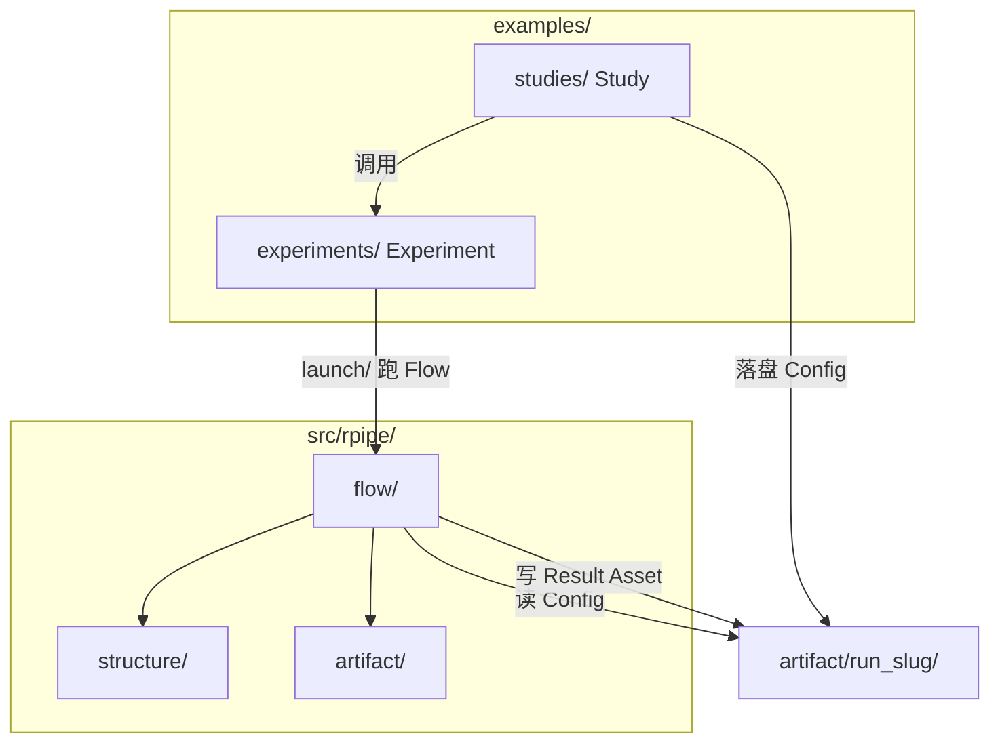

# Layout

本文定义 **RPipe** 仓库的目录约定（不含最底层文件）。前置阅读 [CONCEPT.md](CONCEPT.md)。模块职责见 [CODE_STRUCTURE.md](CODE_STRUCTURE.md)。

可安装库包名为 **`rpipe`**，源码根为 `src/rpipe/`。目录只映射 CONCEPT 概念树，不按现状实现或第三方名单倒推。

---

## 1. 导读

本文一次定清目录树：哪些目录存在、每个概念落在哪条路径。不列叶文件（如具体 `.py` / `.yaml` / `.json`）。

与 CONCEPT 对齐的要点：

| 概念 | 目录落点 |
|------|----------|
| **Study** | `examples/studies/…` — 编排 Experiment，在变量轴上展开并**落盘 Config** |
| **Experiment** | `examples/experiments/…` — 声明 Structure + Flow 的可运行单元 |
| **Structure** | `src/rpipe/structure/` — Control 与 data / model / algorithm / system |
| **Flow** | `src/rpipe/flow/` — prepare → execute → collect → summarize → index |
| **Artifact** | 各次运行的持久化子树 — Config、Result、Asset 同树共存 |
| **Control** | Structure 成员；对象代码在 `structure/control/`；**无**独立 examples 代码目录 |

读写边界（与 CONCEPT §5、§6 一致）：

- **Config**：Study（或 Experiment 的 `grid/`）写入 Artifact；**prepare 只读**；Flow 其余阶段不修改
- **Result**：collect / summarize / index 写入 Artifact
- **Asset**：prepare / execute 读写；collect / summarize / index 不操作 Asset 文件

---

## 2. 概念与路径总览



| 概念 | 仓库路径 | 说明 |
|------|----------|------|
| Study | `examples/studies/<study_slug>/` | 变量轴展开、落盘 Config、选定 Experiment 与运行 |
| Experiment | `examples/experiments/<experiment_slug>/` | 含 `launch/`、`grid/`、本实验 `artifact/` |
| Control（对象） | `src/rpipe/structure/control/` | prepare 读 Config 后构造；summarize 可写入 Result |
| Structure 四层 | `src/rpipe/structure/{data,model,algorithm,system}/` | algorithm 下分 `train/`、`eval/`、`inference/` |
| Flow 五阶段 | `src/rpipe/flow/{prepare,execute,collect,summarize,index}/` | Experiment `launch/` import 并驱动 |
| Artifact IO | `src/rpipe/artifact/{config,result,asset}/` | 库内读写门面，对应磁盘上的 Artifact 成员 |
| Result 契约 | `src/rpipe/schema/` | Result 定稿校验；非业务层，服务 autoresearch 消费 |

---

## 3. 完整目录树

下列为**目标**目录布局。实例名用示例 slug（可换）；叶文件不列出。

```
RPipe/
  src/
    rpipe/
      structure/
        control/
        data/
        model/
        algorithm/
          train/
          eval/
          inference/
        system/
      flow/
        prepare/
        execute/
        collect/
        summarize/
        index/
      artifact/
        config/
        result/
        asset/
      schema/
      defaults/              # 包级默认（非概念 Config）；过渡期可仍名 config/
  examples/
    studies/
      mnist_lr_seed/         # Study：展开 lr × seed，落盘多份 Config
    experiments/
      mnist_linear/          # Experiment
        launch/                # 指定 run_slug，调用库内 Flow
        grid/                  # 按本 Experiment Structure 展开变量轴 → 写 Config
        artifact/
          lr0.01_seed0/        # 一次运行的 Artifact 子树（run_slug）
            assets/
          lr0.01_seed1/
            assets/
  configs/
    suites/                    # 包外 suite 定义（过渡编排，非 CONCEPT 核心）
  docs/
  tests/
    unit/
      structure/
      flow/
      artifact/
    integration/
    e2e/
    fixtures/
      artifact/
        lr0.01_seed0/
          assets/
```

根下另有工程元数据（`.gitignore`、`pyproject.toml` 等），不进入概念映射。

**同一 run_slug 目录内**（与 `assets/` 同级，叶文件名可约定）：

| 成员 | 典型叶路径 | 写入方 |
|------|------------|--------|
| Config | `<run_slug>/config.yaml` | Study / `grid/` |
| Result | `<run_slug>/result.json`（或 `result/` 目录） | Flow：collect → summarize → index |
| Asset | `<run_slug>/assets/` | Flow：prepare / execute |

Config 与 Result 均在 Artifact 子树内，**不在** Artifact 外另设平行配置目录。

---

## 4. examples：Study 与 Experiment

### 4.1 分工

**Study**（`examples/studies/<study_slug>/`）只做编排，不实现 Structure / Flow：

- 在变量轴上展开多次运行（含 Control 所指派的 data / model / algorithm / system 取值）
- 为各次运行落盘 Config 到对应 `artifact/<run_slug>/`
- 选定 Experiment，调用其 `launch/`（或先经 `grid/` 再 `launch/`）

**Experiment**（`examples/experiments/<experiment_slug>/`）是可运行单元，各自独立持有：

| 子目录 | 职责 |
|--------|------|
| `launch/` | 接收 run_slug（或 Config 路径），import 库内 Flow，prepare 读 Config、写 Result / Asset |
| `grid/` | 按本 Experiment 的 Structure 字段做变量轴展开，向 `artifact/<run_slug>/` 写入 Config |
| `artifact/` | 各次运行的 Artifact 子树根 |

同一套 Experiment 代码可服务多个 Control / run_slug，**不为每个 Control 再建代码目录**。Study 与 Experiment 之间不设跨 Experiment 的 `_common/`；共性逻辑进 `rpipe` 库。

### 4.2 Artifact 子树示例

```
examples/experiments/mnist_linear/artifact/lr0.01_seed0/
  config.yaml       # Config（Study / grid 写；prepare 读）
  result.json       # Result（index 定稿后）
  assets/           # Asset（checkpoint、缓存、日志、生成样本等）
```

`lr0.01_seed1/` 等同构，差异仅在 Config 承载的变量取值。

### 4.3 调用关系

```
examples/studies/mnist_lr_seed/
        │
        ├─► examples/experiments/mnist_linear/grid/    → 写 artifact/<run_slug>/config.yaml
        └─► examples/experiments/mnist_linear/launch/   → 跑 Flow
                    │
                    ▼
            src/rpipe/flow/          prepare 读 Config → 落地 Structure（含 Control）
            src/rpipe/structure/     execute 驱动四层计算
            src/rpipe/artifact/      读写 Config / Result / Asset
                    │
                    ▼
            artifact/<run_slug>/       Result、Asset 落盘；Config 不被 Flow 修改
```

绑定关系（哪次运行用哪份 Config、哪个 Experiment）由 **Study** 持有。

---

## 5. 可安装库 `src/rpipe/`

仓库名 **RPipe**，包名 **`rpipe`**。库一级目录与 CONCEPT 三柱对齐：**Structure**、**Flow**、**Artifact**（加 schema / defaults 支撑）。

| 目录 | 对应 CONCEPT | 职责 |
|------|--------------|------|
| `structure/control/` | Control | 变量指派对象；prepare 读 Config 后构造 |
| `structure/data/` 等 | Structure 四层 | 静态能力：数据、模型、算法语义、系统运行时 |
| `structure/algorithm/train/` | algorithm §4.3.1 | 训练：backward、参数更新、checkpoint |
| `structure/algorithm/eval/` | algorithm §4.3.2 | 评测：metric、benchmark 聚合 |
| `structure/algorithm/inference/` | algorithm §4.3.3 | 推理 / 生成 |
| `flow/prepare/` … `flow/index/` | Flow 五阶段 | 见 CONCEPT §5.1–§5.5 |
| `artifact/config/` | Config IO | 读取 Study 落盘的 declarative 配置 |
| `artifact/result/` | Result IO | collect / summarize / index 写入与定稿 |
| `artifact/asset/` | Asset IO | prepare / execute 读写文件型产物 |
| `schema/` | Result 契约 | autoresearch 可校验的结构化 Result |
| `defaults/` | （包级） | 与概念 Config 区分；库内默认 YAML / 运行时过渡 |

第三方运行时（PyTorch、HF、`datasets` 等）在 **Structure 各层内部**按需适配，不单独占与 CONCEPT 无关的一级目录（如平行 `provider/` 树）。

### 5.1 Flow 与 Artifact 的库内边界

| Phase | `artifact/config/` | `artifact/asset/` | `artifact/result/` |
|-------|-------------------|-------------------|---------------------|
| prepare | 读 | 读写 | — |
| execute | — | 读写 | — |
| collect | — | — | 写 |
| summarize | — | — | 写 |
| index | — | 读（登记路径） | 写（定稿） |

---

## 6. tests

| 目录 | 对齐 |
|------|------|
| `tests/unit/structure/` | Control、四层 Structure |
| `tests/unit/flow/` | 五阶段模块与编排 |
| `tests/unit/artifact/` | Config / Result / Asset IO |
| `tests/integration/` | prepare → execute 等跨模块链 |
| `tests/e2e/` | Study → Experiment → Artifact 整链 |
| `tests/fixtures/artifact/` | 模拟 `artifact/<run_slug>/` 子树 |

---

## 7. docs

| 文档 | 内容 |
|------|------|
| [CONCEPT.md](CONCEPT.md) | 概念与关系（主文档） |
| [LAYOUT.md](LAYOUT.md) | 本文：目录树与落盘 |
| [CODE_STRUCTURE.md](CODE_STRUCTURE.md) | 模块、类与方法职责 |
| [HANDOVER.md](HANDOVER.md) | v0.2 历史交接 |

---

## 8. 版本库与忽略

忽略缓存与 Artifact 下大体积 Asset（`assets/` 内 checkpoint、生成样本等）。`config.yaml` 等小体积 declarative 是否进 git 由 Study / Experiment 约定。

---

## 9. 与当前实现的差距（过渡）

当前分支仍保留 v0.2 实现痕迹，与本文目标布局尚未完全一致，迁移时参考：

| 目标（本文） | 当前实现（过渡） |
|--------------|------------------|
| `examples/studies/` + `examples/experiments/` | 根目录 `experiments/` CLI + `examples/run_smoke.py` |
| `structure/` + `flow/` + `artifact/` | `data/`、`model/`、`algorithm/`、`system/` + `provider/` |
| `artifact/<run_slug>/` 在 Experiment 下 | `output/` 或 suite 驱动路径 |
| algorithm：`train` / `eval` / `inference` | algorithm：`train` / `metric` / `generate` |

以 [CONCEPT.md](CONCEPT.md) 为准逐步收敛；本文描述的是目标落点，而非现状快照。
