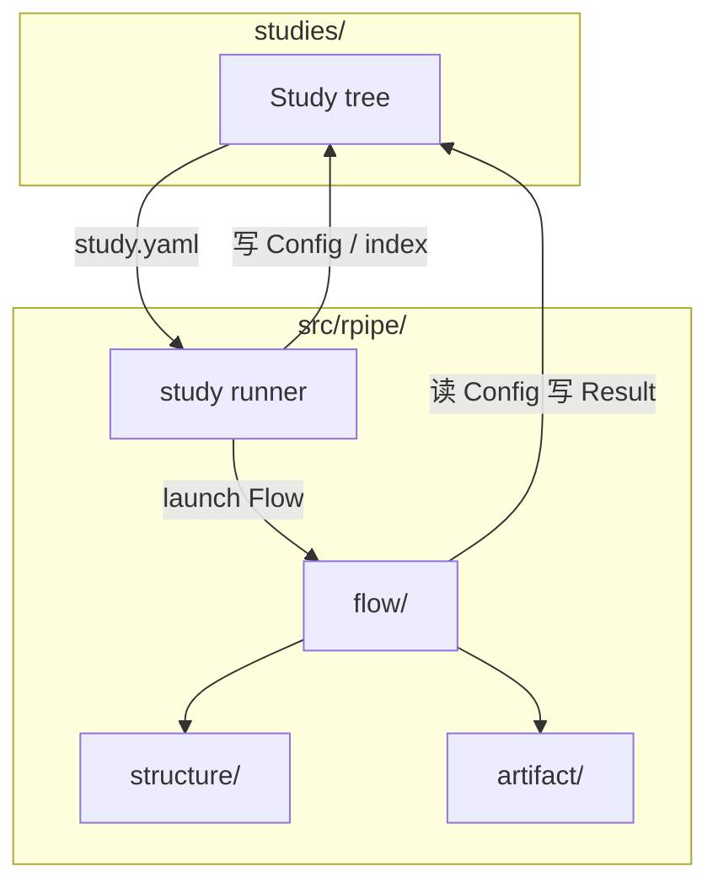

# Layout

本文定义 **RPipe** 仓库的目录约定（不含最底层文件）。前置阅读 [CONCEPT.md](CONCEPT.md)。模块职责见 [CODE_STRUCTURE.md](CODE_STRUCTURE.md)。

可安装库包名为 **`rpipe`**，源码根为 `src/rpipe/`。目录只映射 CONCEPT 概念树，不按现状实现或第三方名单倒推。

---

## 1. 导读

本文定清目录树：`src/rpipe/` 与 `tests/rpipe/` 同构；`structure/` 只到下一层。不列叶文件；Study 实例见 §4。

与 CONCEPT 对齐的要点：

| 概念 | 目录落点 |
|------|----------|
| **Study** | `studies/<name>/` — 一轮研究的编排与产物根 |
| **Experiment（配方）** | **概念**；磁盘上是 Study 内的 `experiment_config.yaml`（**没有**顶层 `experiments/`） |
| **Run** | `studies/<name>/runs/<id>/` — Config / Result / 本 Run assets |
| **Structure** | `src/rpipe/structure/` |
| **Flow** | `src/rpipe/flow/` — prepare → … → **persist** → **process** |
| **Artifact（逻辑）** | Study 下的 `shared/` + `runs/`；人文材料在 `docs/` |
| **Study runner** | `src/rpipe/study/` — `python -m rpipe study run <study_dir>` |

**Run 目录名：** Config 内 **`id`** = 除 `id`/`description` 外内容的 hash（**含 tags**）；同 `id` 多次存储时用 **`<id>_<timestamp>`**。

读写边界：

- **Config**：Study runner 写入 `runs/<id>/`；**prepare 只读**
- **Result**：collect / summarize / **persist**；**process** 可派生
- **Asset**：`shared/` Study 内复用；`runs/<id>/assets/` 本 Run

---

## 2. 概念与路径总览



| 概念 | 仓库路径 | 说明 |
|------|----------|------|
| Study | `studies/<study>/` | 编排 + 产物；入口 `rpipe study run` |
| 配方文件 | `…/experiment_config.yaml` | Experiment 概念的落盘 |
| Run | `…/runs/<id>/` | Config / Result / assets |
| 共享资源 | `…/shared/{data,model}/` | Study 内各 Run 共用 |
| 人文文档 | `…/docs/` | PLAN / STUDY_REPORT |
| Flow | `src/rpipe/flow/{prepare,execute,collect,summarize,persist,process}/` | |
| Study 编排 | `src/rpipe/study/` | 解析 study.yaml、展开、launch |
| Artifact IO | `src/rpipe/artifact/` | layout / config / result / index.json |

---

## 3. 目录树

```
RPipe/
  src/
    rpipe/
      structure/
        api/
        control/
        data/
        model/
        algorithm/
        system/
      flow/
        prepare/
        execute/
        collect/
        summarize/
        persist/
        process/
        index/                 # 兼容别名 → persist
      study/                   # Study runner
      artifact/
        config/
        result/
        asset/
  studies/                     # 包外 Study（原 examples/）
  docs/
  tests/
    rpipe/                     # 与 src/rpipe/ 同构镜像
```

### 3.1 每个 Study 的固定 layout（权威）

```text
studies/<study>/
  study.yaml
  index.json
  experiment_config.yaml
  run.py                      # 可选薄包装；推荐 CLI
  docs/
    PLAN.md
    STUDY_REPORT.md
  shared/
    data/
    model/
  runs/
    <run_id>/
      config.yaml
      result.json
      assets/
```

由 `ensure_study_layout` / `artifact_layout` 保证 `docs/`、`shared/`、`runs/` 存在。

| 成员 | 写入方 | 说明 |
|------|--------|------|
| `docs/` | 人 / process | 计划与报告；**可入库** |
| `shared/` | prepare | 数据与可复用模型缓存；默认不入库 |
| `runs/` | Study runner / Flow | 每次 Run；默认不入库 |
| `index.json` | Study runner（launch 前） | 编排清单 |

---

## 4. 调用关系

```
python -m rpipe study run studies/mnist_train_size
        │
        ├─► 读 study.yaml + experiment_config.yaml
        ├─► 写 runs/<id>/config.yaml
        ├─► 写 index.json
        └─► FlowRunner → persist → process
                    │
                    ▼
            runs/<id>/result.json
            shared/data/…（如 MNIST 缓存）
```

---

## 5. 测试镜像

| 测试树 | 对应 |
|--------|------|
| `tests/rpipe/` | `src/rpipe/` |
| Study 入口 e2e | `tests/e2e/`（指向 `studies/…`） |

不再镜像已删除的 `examples/`。
