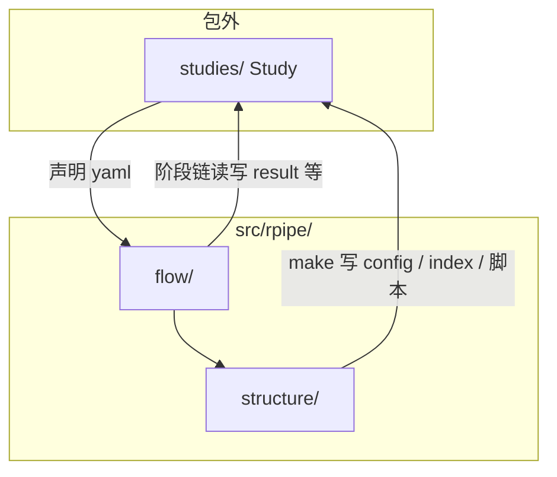

# Layout

本文定义 **RPipe** 仓库目录约定（不含最底层叶文件）。前置阅读 [CONCEPT.md](CONCEPT.md)。模块细则见 [CODE_STRUCTURE.md](CODE_STRUCTURE.md)。

可安装包名 **`rpipe`**，源码根 `src/rpipe/`。目录只映射 CONCEPT。

---

## 1. 导读

库内两柱：`structure/`、`flow/`。artifact 在 `structure/artifact/`，make 在 `structure/make/`。cli 在 `flow/cli.py`。Study 在包外 `studies/`。

| 概念 | 目录落点 |
|------|----------|
| **Study** | `studies/<name>/` |
| **Experiment** | 逻辑分组（**index**）；无顶层文件夹 |
| **Run** | `studies/<name>/runs/<id>/` |
| **structure** | `src/rpipe/structure/`：`api`、`control`、四层、**artifact**、**make** |
| **flow** | `src/rpipe/flow/`：阶段子包与 cli |

**Run 目录名：** config 的 `id` = 除 `id` / `description` 外内容的 hash（含 tags、seed）。同 id 多次存储可用时间戳后缀。

读写：

- **config**：**make** 写入 `runs/<id>/`；prepare 只读
- **result**：summarize / **write** 写入；process 可派生
- **asset**：文件通道。data / model 文件、checkpoint、AlgorithmTracker 曲线、Logger 文本，落在 `shared/` 或 `runs/<id>/assets/`

---

## 2. 概念与路径



| 概念 | 路径 | 说明 |
|------|------|------|
| Study | `studies/<study>/` | 编排壳 + artifact 根 |
| 基底配置 | Study 目录下的 experiment 基底文件 | Study 默认值 |
| Run | `…/runs/<id>/` | config / result / assets |
| 共享与文档 | `…/shared/`、`…/docs/` | Study 级。`shared/` 里的 data / model 文件属于 **asset** |
| structure | `src/rpipe/structure/` | api、control、data、model、algorithm、system、artifact、**make** |
| flow | `src/rpipe/flow/` | cli；prepare / execute / collect / summarize / write / process |

---

## 3. 库内目录树

`src/rpipe/` 与 `tests/rpipe/` 同构。`structure/` 只展到下一层。

```
RPipe/
  src/
    rpipe/
      structure/
        api/
        control/
        data/
        model/
        algorithm/
        system/
        artifact/
        make/
      flow/
        cli.py
        prepare/
        execute/
        collect/
        summarize/
        write/
        process/
  studies/
  docs/
  tests/
    rpipe/
```

| flow 子包 | 阶段 |
|-----------|------|
| `prepare/` | 读 config，落地 structure |
| `execute/` | 计算 |
| `collect/` | 收观测 |
| `summarize/` | result 草稿 |
| `write/` | 把 result 写入 artifact |
| `process/` | write 后派生（可空） |

---

## 4. Study 目录

```text
studies/<study>/
  study.yaml
  index
  experiment_config.yaml
  docs/
    PLAN.md
    STUDY_REPORT.md
  shared/
    data/
    model/
  scripts/
  runs/
    <run_id>/
      config.yaml
      result.json              # 摘要；曲线不在这里
      assets/
        tracker/               # AlgorithmTracker：state / scalars.jsonl
        logs/                  # Logger（system）：与终端同款，必写
        checkpoints/           # 训练 checkpoint（有则写）
```

| 成员 | 说明 |
|------|------|
| `docs/` | 计划与报告；可入库 |
| `shared/` | Study 内共享 asset（data / model 文件）；默认不入库 |
| `runs/` | 每次 Run；默认不入库 |
| `scripts/` | make 生成的调度脚本；默认不入库 |
| `index` | make 写入的编排清单 |
| `shared/data/`、`shared/model/` | structure data / model 的落盘 |
| `runs/<id>/assets/` | 本 Run 的 asset：`tracker/`（数字曲线）、`logs/`（文本）、checkpoint、样本等 |

---

## 5. 调用关系

```
studies/<name>/study.yaml
        │
        ▼
  flow cli
        │
        ├─► structure.make → runs/<id>/config.yaml、index、scripts/
        └─► FlowRunner
                    │
                    ▼
            runs/<id>/ 下的 result 与 assets
            shared/ 下的 data / model asset
```

---

## 6. 测试镜像

| 测试树 | 对应 |
|--------|------|
| `tests/rpipe/structure/` | `src/rpipe/structure/` |
| `tests/rpipe/flow/` | `src/rpipe/flow/` |
| e2e | `tests/e2e/` → `studies/…` |
