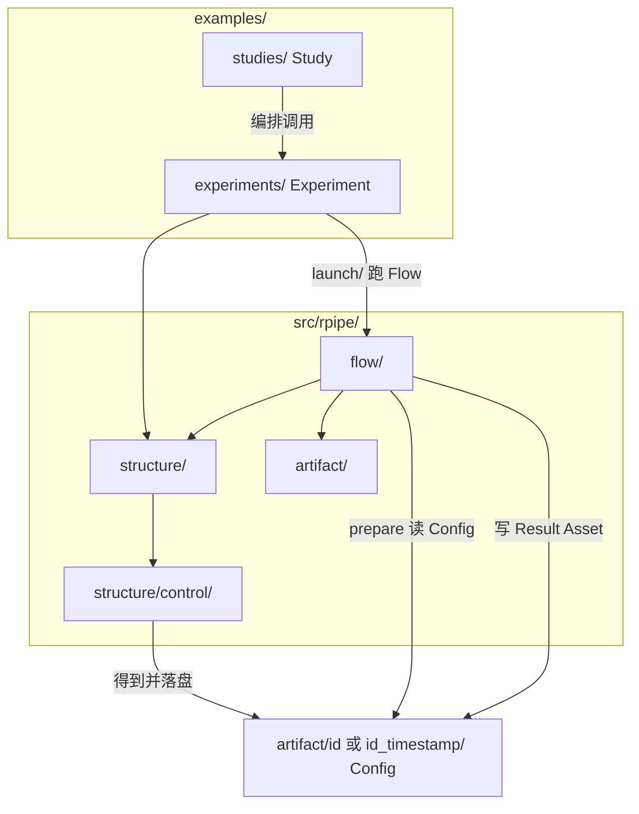

# Layout

本文定义 **RPipe** 仓库的目录约定（不含最底层文件）。前置阅读 [CONCEPT.md](CONCEPT.md)。模块职责见 [CODE_STRUCTURE.md](CODE_STRUCTURE.md)。

可安装库包名为 **`rpipe`**，源码根为 `src/rpipe/`。目录只映射 CONCEPT 概念树，不按现状实现或第三方名单倒推。

---

## 1. 导读

本文定清目录树：`src/rpipe/` 与 `tests/rpipe/` 同构；`structure/` 只到下一层。不列叶文件；`examples/` 实例细节见 §4。

与 CONCEPT 对齐的要点：

| 概念 | 目录落点 |
|------|----------|
| **Study** | `examples/studies/…` — 编排 Experiment 与多次 Run |
| **Experiment** | `examples/experiments/…` — 声明 Structure + Flow；经 `grid/` 等落盘 Config |
| **Run** | 一次具体运行；有 **`id`**（由 Config 内容导出）；每次 Run 对应一份 Artifact |
| **Structure** | `src/rpipe/structure/` — Control、四层实现与 `api/` 门面 |
| **Flow** | `src/rpipe/flow/` — prepare → execute → collect → summarize → persist → process |
| **Artifact** | `examples/studies/<study>/artifact/…` — Study 下共享 data/model + `runs/<id>/`（Config/Result） |
| **Control** | Structure 成员；对象代码在 `structure/control/`；由 Config 构造 / 导出 Config |

**Artifact 目录名（对齐 structure 分册）：** Config 内 **`id`** 为除 `id`/`description` 外内容的 hash（**含 tags**）；Run 子目录用 `<id>`，同 `id` 多次存储时用 **`<id>_<timestamp>`**。

读写边界（与 CONCEPT §5、§6 一致）：

- **Config**：Study 写入 `artifact/runs/<id>/`；**prepare 只读**；Flow 其余阶段不修改
- **Result**：collect / summarize / **persist** 写入；**process** 可派生
- **Asset**：`shared/` 供 Study 内复用；`runs/<id>/assets/` 为本 Run；prepare / execute 读写

---

## 2. 概念与路径总览

Config **不是** Study 树上的独立支路产物，而是由 **Experiment 侧 Structure 中的 Control** 得到并落盘到该次 **Run** 的 Artifact；prepare 再读回 Config 构造 Control。





| 概念 | 仓库路径 | 说明 |
|------|----------|------|
| Study | `examples/studies/<study>/` | 编排：选定 Experiment、展开 Run、触发 `grid/` / `launch/` |
| Experiment | `examples/experiments/<experiment>/` | 含 `launch/`、`grid/`、本实验 `artifact/` |
| Artifact | `…/artifact/<id>/` 或 `…/artifact/<id>_<timestamp>/` | Config / Result / Asset；每次 Run 一份 |
| Control（对象） | `src/rpipe/structure/control/` | Structure 成员；Config ↔ Control；prepare 读 Config 后构造 |
| Structure 四层 | `src/rpipe/structure/{data,model,algorithm,system}/` | 层实现；对外经 `structure/api/` |
| Structure API | `src/rpipe/structure/api/` | 层间与外部调用门面：`data_api`、`model_api` 等 |
| Flow 五阶段 | `src/rpipe/flow/{prepare,execute,collect,summarize,index}/` | Experiment `launch/` import 并驱动 |
| Artifact IO | `src/rpipe/artifact/{config,result,asset}/` | 库内读写门面 |

---

## 3. 目录树

`src/rpipe/` 与 `tests/rpipe/` **目录骨架保持一致**（镜像）。`structure/` **只展开到下一层**（`api` / `control` / 四层）；更深层由 [code_structure/structure.md](code_structure/structure.md) 管理。**不**在此展开 `examples/` 下的 Study / Experiment 实例名（见 §4）。

```
RPipe/
  src/
    rpipe/
      structure/
        api/
        control/
        data/
        model/
        algorithm/
        system/
      flow/
        prepare/
        execute/
        collect/
        summarize/
        index/
      artifact/
        config/
        result/
        asset/
  examples/
  docs/
  tests/
    rpipe/                       # 与 src/rpipe/ 同构镜像
      structure/
        api/
        control/
        data/
        model/
        algorithm/
        system/
      flow/
        prepare/
        execute/
        collect/
        summarize/
        index/
      artifact/
        config/
        result/
        asset/
    examples/                    # 镜像 examples/ 入口（实例细节见 §4 / 实测布局）
    _fixtures/                   # 共享测试数据（不参与源码镜像）
    _helpers/                    # 测试辅助（不得以 test_ 命名）
    README.md
```

根下另有工程元数据（`.gitignore`、`pyproject.toml` 等），不进入概念映射。

**同一 Run 的 Artifact 目录内**（与 `assets/` 同级，叶文件名可约定）：

| 成员 | 典型叶路径 | 写入方 |
|------|------------|--------|
| Config | `<run_dir>/config.yaml` | Experiment：经 Control / `grid/` 等（可含 `description`） |
| Result | `<run_dir>/result.json`（或 `result/` 目录） | Flow：collect → summarize → index；失败时 Runner 尽量写入 |
| Asset | `<run_dir>/assets/` | Flow：prepare / execute |

其中 `<run_dir>` 为 `<id>` 或 `<id>_<timestamp>`。Config 正文内带有字段 **`id`**（hash）；目录名与之对齐或在同 id 多次存储时附加 timestamp。

**Study 目录下的统一编排清单**（不是某次 Run Artifact 的成员）：

| 成员 | 典型叶路径 | 写入方 |
|------|------------|--------|
| `index.json` | `examples/studies/<study>/index.json` | Study：展开 Config 之后、launch 之前（CONCEPT §6.4） |

Config 与 Result 均在 Artifact 子树内，**不在** Artifact 外另设平行配置目录。

---

## 4. examples：Study 与 Experiment

### 4.1 分工

**Study**（`examples/studies/<study>/`）只做编排，持有 **Artifact 根**：

- 填写 `study.yaml`（见 [STUDY_GUIDE.md](STUDY_GUIDE.md)）
- 展开变量轴，落盘 `artifact/runs/<id>/config.yaml`
- **先**写 `index.json`，**再** launch
- 共享数据 / 模型落在 `artifact/shared/`

**Experiment**（`examples/experiments/<experiment>/`）提供类型实现：

| 子目录 | 职责 |
|--------|------|
| `launch/` | 按 Study 给出的 run 路径跑 Flow |
| `grid/` | 合并 experiment_config ⊕ patch → Config |
| （可选）旧 `artifact/` | 迁移期内并存；新 Study 不再写入此处 |

同一套 Experiment 代码服务多次 Run，**不为每次 Run 再建代码目录**。Study 与 Experiment 之间不设跨 Experiment 的 `_common/`；共性逻辑进 `rpipe` 库。

Experiment 侧还可放**默认配置文件**（实现上的基底 Config；文件名与合并规则见 [structure.md](code_structure/structure.md) §8）。LAYOUT **不**展开其内部键名。

### 4.2 Artifact 子树示例

```
examples/studies/mnist_train_size/
  study.yaml
  index.json
  artifact/
    shared/data/
    runs/<id>/
      config.yaml
      result.json
      assets/
```

### 4.3 调用关系

```
examples/studies/mnist_lr_seed/
        │
        ├─► examples/experiments/mnist_linear/grid/    → 写 artifact/<run_dir>/config.yaml
        └─► examples/experiments/mnist_linear/launch/   → 跑 Flow
                    │
                    ▼
            src/rpipe/flow/          prepare 读 Config → 落地 Structure（含 Control）
            src/rpipe/structure/     execute 驱动四层计算
            src/rpipe/artifact/      读写 Config / Result / Asset
                    │
                    ▼
            artifact/<run_dir>/        Result、Asset 落盘；Config 不被 Flow 修改
```

绑定关系（哪次 Run、哪份 Config、哪个 Experiment）由 **Study** 持有。

---

## 5. 可安装库 `src/rpipe/`

仓库名 **RPipe**，包名 **`rpipe`**。库一级与 CONCEPT 三柱对齐：**Structure**、**Flow**、**Artifact**。

LAYOUT 对 **Structure** 只管到其**下一层**目录；`algorithm` 等更深层、类与模块见 [code_structure/structure.md](code_structure/structure.md)，避免本文件堆积实现细节。

| 目录 | 对应 CONCEPT | 职责 |
|------|--------------|------|
| `structure/api/` | （门面） | `data_api` / `model_api` 等；跨层与外部只经此交流 |
| `structure/control/` | Control | 变量指派；Config ↔ Control；契约校验 |
| `structure/data/` | Structure · data | 数据层实现 |
| `structure/model/` | Structure · model | 模型层实现 |
| `structure/algorithm/` | Structure · algorithm | 算法层实现（更下层暂不在 LAYOUT 展开） |
| `structure/system/` | Structure · system | 系统层实现 |
| `flow/` | Flow | 五阶段过程（阶段子目录见 CONCEPT；细节见 flow 分册） |
| `artifact/` | Artifact IO | Config / Result / Asset 库内读写门面 |

**Schema（不单立目录）：** Result / Config 的结构契约由 **Control 侧代码**声明与校验，视为 Config 能力的一部分（落盘仍走 Artifact Config / Result），不在 `src/rpipe/` 下另建 `schema/` 包。

第三方运行时（PyTorch、HF、`datasets` 等）在 **Structure 各层实现内部**按需适配，经 `structure/api/` 对外；不单独占与 CONCEPT 无关的一级目录（如平行 `provider/`）。

### 5.1 Flow 与 Artifact 的库内边界

| Phase | `artifact/config/` | `artifact/asset/` | `artifact/result/` |
|-------|-------------------|-------------------|---------------------|
| prepare | 读 | 读写 | — |
| execute | — | 读写 | — |
| collect | — | — | 写 |
| summarize | — | — | 写 |
| index | — | 读（登记路径） | 写（定稿） |

---

## 6. tests

测试目录遵循「测试结构映射代码结构」：在 `tests/` 下建立与被测程序同名的镜像目录，复制有效目录骨架与相对路径。**`unit` / `integration` / `e2e` 是强制标签，不得作为 `tests/` 下额外一级分类目录。**

### 6.1 镜像范围

| 镜像根 | 对应被测根 | 用途 |
|--------|------------|------|
| `tests/rpipe/` | `src/rpipe/` | 库：Structure / Flow / Artifact |
| `tests/examples/` | `examples/` | 包外 Study / Experiment 入口（launch、grid、Study 脚本） |

尚无测试的源目录也应保留占位或在 `tests/README.md` 登记。构建产物、缓存、虚拟环境、`.test-results/` 等不镜像，排除项必须登记。

共享数据与辅助代码放在镜像外：

- `_fixtures/` — 稳定公共数据（如预制 Artifact Config）
- `_helpers/` — 辅助函数（禁止 `test_` 前缀，避免被收集为用例）

### 6.2 落位规则

| 层级（标签） | 落位 | 说明 |
|--------------|------|------|
| `unit` | 被测源文件镜像位置 | 如 `src/rpipe/structure/control/` → `tests/rpipe/structure/control/test_control.py` |
| `integration` | 调用路径起点的镜像位置 | 不建 `integration/` 目录；跨 `flow`+`structure` 的路径落在起点包下 |
| `e2e` | 系统外部入口镜像位置 | 如 Study / launch 入口 → `tests/examples/studies/…` 或 `tests/examples/experiments/…/launch/`；无法归单入口时放镜像根 |

每项测试必须且只能带一个测试层级标签、一个主要类型标签、一个优先级标签（见 CODE_STRUCTURE 与 `tests/README.md`）。

### 6.3 与本仓库概念的对齐

| 被测区域 | 镜像下典型覆盖 |
|----------|----------------|
| `structure/api` | 经 `data_api` 等的跨层调用契约 |
| `structure/control` | Control ↔ Config 往返；`id` hash；契约校验 |
| `structure` 四层 / algorithm | 经 api 的 prepare / `mode` |
| `flow/*` | 各阶段 `run(ctx)`；Runner 子集 |
| `artifact/*` | layout 与 Config / Result / Asset IO（含 `id` / `id_timestamp` 路径） |
| Experiment `grid` / `launch` | 展开落盘、驱动 Flow |
| Study | 编排整链（多为 `e2e`） |

---

## 7. docs

| 文档 | 内容 |
|------|------|
| [CONCEPT.md](CONCEPT.md) | 概念与关系（主文档） |
| [LAYOUT.md](LAYOUT.md) | 本文：目录树与落盘 |
| [CODE_STRUCTURE.md](CODE_STRUCTURE.md) | 代码结构总览与依赖；细则见分册 |
| [code_structure/structure.md](code_structure/structure.md) | Structure：`structure/` 更深层、模块与类（LAYOUT 只到下一层） |
| [code_structure/flow.md](code_structure/flow.md) | Flow：上下文、Runner、五阶段模块与叶文件 |
| [code_structure/artifact.md](code_structure/artifact.md) | Artifact：layout 与 Config / Result / Asset IO |
| [TESTING.md](TESTING.md) | 测试规范（目录镜像、标签、优先级、执行与结果持久化） |
| [HANDOVER.md](HANDOVER.md) | v0.2 历史交接 |
