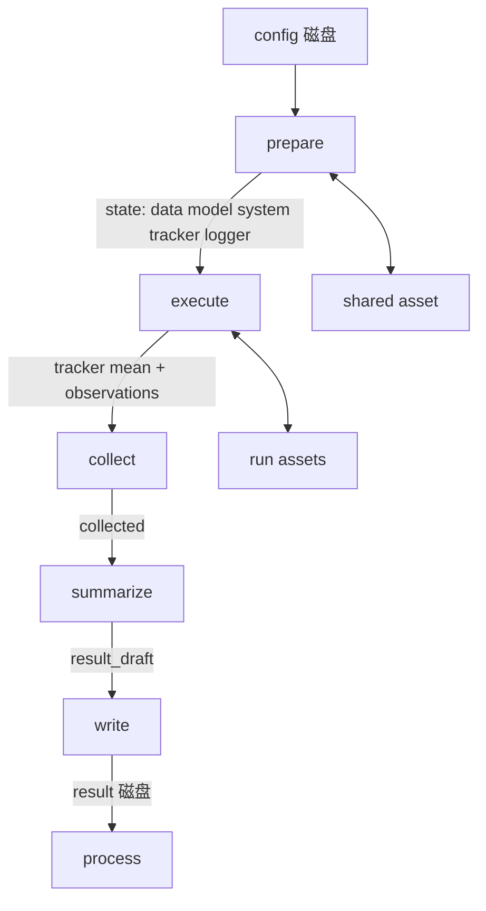

# Code structure · Flow

前置：[concept.md](concept.md) §7、[layout.md](layout.md)、[code.md](code.md)。

并列：[structure.md](structure.md)（含 artifact、make）。

Flow 服务 Study。同一套执行，用参数选择阶段子集、是否先 make、顺序或按 `round` 并行。cli 在 `flow/cli.py`。

make 写出 config、index 与调度脚本，见 `structure.make`。每个 Run 的阶段链：

**prepare → execute → collect → summarize → write → process**

flow 可 import `structure`。阶段保持 config 不变。四层业务在 structure。

**write** 写该 Run 的 result。**index** 由 make 写在 Study 根。

---

## 1. 目录与入口

```
flow/
  cli.py
  context.py
  runner.py
  prepare/
  execute/
  collect/
  summarize/
  write/
  process/
```

每阶段一个包，约定 `run(ctx: FlowContext) -> None`。`FlowRunner` 按 `PHASES` 动态 import 并调用。cli 解析参数后：`make` 调 `structure.make`；`launch` 优先读 `scripts/jobs.json`，没有或 `--remake` 才再 make，再对选定 Run 调 `FlowRunner`。

| **符号** | **位置** | **职责** |
|------|------|------|
| `FlowContext` | `context.py` | 贯穿各阶段的上下文 |
| `FlowRunner` / `PHASES` | `runner.py` | 对一个 Run 按序执行阶段；可裁剪阶段；失败时写 failed result |
| cli | `cli.py` | argv → 同一套 Flow；`make` / `launch`（复用 `jobs.json`）/ `--remake` / `--mode`、阶段子集、`round`、GPU、`--console`。`process` 不走单条 Run 的阶段链。`status` / `logs` / `report` / `compare` 转给 `structure.artifact.readout`。`launch` 先过来源清单核对（§14.2） |

`PHASES = ('prepare', 'execute', 'collect', 'summarize', 'write', 'process')`。允许传入子集（例如只跑 prepare 做干检查），但不得打乱相对顺序。

---

## 2. `FlowContext`

| **字段** | **含义** |
|------|------|
| `study_dir` | Study 根（`docs/`、`shared/`、`runs/`、index） |
| `layout` | 本 Run 的 `ArtifactLayout`（`runs/<id>/`） |
| `config` | 本 Run 的 config mapping；prepare 从磁盘读入后覆盖内存副本 |
| `control` | prepare 之后才有；由 config 构造 |
| `state` | 本 Run 内存黑板；**不**直接当 result 落盘 |

`layout` 提供：`config_path`、`result_path`、`assets_dir`、`shared_data_dir`、`shared_model_dir`。data / model 文件走 **asset**（见 structure.md §9.6）。

### 2.1 `state` 约定（谁写、谁读）

| **键** | **写入阶段** | **读取阶段** | **内容** |
|----|----------|----------|------|
| `algorithm` | prepare | execute | 注册的 Algorithm 实例 |
| `runtime` / `recipe` | prepare | summarize / Study hook | 运行时配置记录 / 是否应用 recipe |
| `seed` | prepare | execute 等 | 已落地的 seed |
| `data` / `model` / `system` | prepare | execute、summarize | 运行时对象（可含 Loader / Module） |
| `tracker` | prepare 构造 AlgorithmTracker；execute 每个 batch 更新 | execute、collect、Logger.report | 数字；**不**整棵进 result |
| `logger` | prepare 经 **System** 构造 | execute | 文本；`report(tracker, split, extra)` 打终端并写 `assets/logs/` |
| `observations` | prepare 初始化；execute 可追加短备注 | collect | 非 AlgorithmTracker 的零星观测 |
| `execute` | execute | collect（可选） | 本阶段返回值 |
| `collected` | collect | summarize | `{metrics, observations}` |
| `result_draft` | summarize | write；失败回写 | 可序列化草稿 |
| `result` | write（或 Runner 失败路径） | process | 已定稿 mapping |

规则：runtime handle 只活在 `state`；进 `result_draft` / `result` 必须先投影（structure.md §9.4）。

---

## 3. Runner 与失败

```mermaid
flowchart TD
  start[FlowRunner.run] --> loop{下一阶段}
  loop -->|有| call[module.run ctx]
  call -->|成功| loop
  call -->|异常| fail[尽量 write failed result]
  fail --> rethrow[再抛出原异常]
  loop -->|无| done[返回 result 路径]
```

- 成功：跑完 write 后 `status: succeeded`，再 process。
- 失败：`_write_failed_result` 尽最大努力写入 `status: failed` + `error`（类型名 + 消息），补齐已知 `paths`；**不得吞掉原异常**。落盘自己再失败则静默，优先保证异常向上。
- 失败时 **traceback 进该 Run 的 `run.log`**（与 stdout 同一套；每一行都是 `[error]`，并带时间和 Run `id`）。execute 失败由 execute 写；prepare 等阶段由 Runner 写。prepare 尚未挂 System 时 Runner 先打开同一路径的 Logger。
- 失败时若已有 `control` / `collected.metrics`，写入 result，便于对照哪次 Run 挂了。
- write 之后发生异常时，Runner 保留已有 `status: succeeded` 的 result，记录日志并重新抛出异常。影响本 Run 成功判定的门限须在 write 之前执行；process 的派生失败另行报告。

---

## 4. 读写总表

| **阶段** | **config** | **asset** | **result** |
|------|--------|-------|--------|
| prepare | **只读**磁盘 config | 读写 `shared/` + 本 Run `assets/` | — |
| execute | — | 读写（checkpoint、日志、生成物） | — |
| collect | — | **不**动文件 | 内存 |
| summarize | — | **不**动文件 | 内存草稿 |
| write | — | 只列举/登记路径 | **定稿写入** |
| process | **不改** | 可选读；可写派生文件（非 config） | 只读定稿；派生内容另写文件 |

---

## 5. prepare

**目的：** 让这次 Run 在内存里「站起来」：config → control → 四层实例；需要的文件在 artifact 里就位。

**做：**

1. Runner 在进入阶段链前核对 freeze；prepare 读 `config.yaml`，构造并校验 control。
2. 创建本 Run 的 assets，应用 Python / NumPy / Torch seed 与确定性配置。
3. 经 system_api 构造 System，记录 runtime 元数据。
4. prepare 再核对 freeze，调用可选 recipe 的 `register(ctx)`。必须在 Data / Model 构造前完成注册和必要的隔离准备。
5. 经 data_api 构造 Data，将 seed 传给 train DataLoader 的 shuffle generator。普通 source 使用 `shared/data/`，专用 source 可使用自己的隔离缓存。
6. 经 model_api 构造 Model，将 Data meta 传给模型，并将 module 放到 System 的设备。
7. 经 algorithm_api 构造 Algorithm 与 AlgorithmTracker，保存 data/model/system/algorithm/tracker/logger 到 state，初始化 observations。

真实数据使用已注册 source。stub 不下载。Logger 写本 Run 的 `assets/logs/run.log`，Tracker 写 `assets/tracker/`。

**不做：** 改 config；跑训练循环；写 result。

**失败点：** 缺 config、契约失败、数据不可达、设备不可用。此时还没有 metrics，failed result 至少要有 `error` 和路径。

---

## 6. execute

**目的：** 按本 Run 的 algorithm **做计算**。原生算法支持 train / eval。专用 Algorithm 可在同一 Run 内封装成对计算与评测，但不得隐式重复执行整轮 Study。原生算法的 `run()` 开头走算法层 **resume**（structure.md §6.11.3）。周期 test / early stop 是 train 的 **AlgorithmHook**（§6.10），不是再跑一个 Flow mode。独立评测是另一次 `mode=eval` 的 Run。

**做：**

1. 要求 `ctx.control` 已在（否则视为未 prepare）。
2. 经 `algorithm_api` 调用实现，传入 data / model / system 与 **`state['tracker']`**。Logger 在 `system` 上。算法内部：`resume` →（train 则）`make_optimizer` / `make_scheduler` → 循环。checkpoint **文件**经 system 读写；**策略**在 algorithm。
3. **每个 batch**：`tracker.evaluate` + `append(split, n=batch_size)`。
4. **按 report 间隔**：`system.logger.report(tracker, …, extra=…)`（stdout + `run.log` **立即 flush**；`[epoch]` `[split]` `[metric]` `[time]`）。`extra` 含本进程 **`elapsed` / `eta`**（algorithm 进度时钟）。AlgorithmTracker 往 jsonl 追加并 flush；写出 `tracker_state.json` 并 flush。
5. **epoch 末**：`tracker.save()` + `reset()`，再 flush state。预算主口径是 `num_steps`（`step_period>1` 时按 optimizer step 计）；若配置 `num_epochs` 且可推导 steps/epoch，会先换算成步数。周期 test / checkpoint 按 `progress_unit`（默认 step）。checkpoint 经 `on_checkpoint` → system 写 `assets/checkpoints/`（默认覆盖 `latest`）。
6. **execute 结束（含失败路径尽量）**：再 flush 一遍。
7. 短备注可进 `state['observations']`。不要把 Module / Tensor / AlgorithmTracker / Logger 整棵丢进 result。

**不做：** 读改 config；跨 Run 聚合；写 `result.json`。

---

## 7. collect

**目的：** 收出口径稳定的最终 **metrics 摘要**，仍只在内存。逐步曲线已在 execute 写入 tracker asset；终端文本由 Logger 写出。

**做：**

1. 若有 `state['tracker']`（AlgorithmTracker）：从 `mean` 抽出 `train_loss` 等；若本 Run 实际跑过 test/eval，再抽对应键（如 `accuracy` = 最后一段 test）。`state['execute'].best_accuracy` 有则写入 `metrics.best_accuracy`（过往最好 test，与 last-segment 不是同一个数）。
2. 复制 `state['observations']`，保留零星观测；不将观测自动展开为 metrics。
3. 写入 `state['collected'] = {metrics, observations}`。`paths.tracker` / `paths.logs` 留给 summarize/write 登记。

**不做：** 改 tracker/log 文件；把 `history` 整棵拷进 metrics；读其他 Run。

没有观测且 tracker 为空时 `metrics` 为空 dict，不要假装成功指标。

---

## 8. summarize

**目的：** 拼出 **可序列化** 的 `result_draft`，作为 write 的唯一输入。

**建议草稿键：**

| **键** | **来源** |
|----|------|
| `status` | 成功路径先标 `succeeded`（write 前若 Runner 失败会改） |
| `control` | `control.to_dict()` 或等价投影 |
| `structure` | data / model / system 的 **快照**，不是 runtime |
| `metrics` | `collected.metrics` |
| `paths` | run 根、config、assets、tracker、logs、checkpoints；result 路径可留给 write 补 |
| `study` | `study_dir` |

**必守：** 丢弃 `train_loader`、`module`、`optimizer`、Tensor 等。实现可集中 `_safe_snapshot` 或调用各层 `to_result_snapshot()`（structure.md §9.4）。无法投影的值写成类型占位，或直接省略，禁止塞进草稿等 write 时崩。

**不做：** 落盘；改 config；二次训练。

---

## 9. write

**目的：** result **定稿落盘**。这是「这次 Run 算不算跑完」的磁盘事实。

**做：**

1. 取 `result_draft`；若为空应失败或写成明确的 failed（不要写半截）。
2. 列举本 Run asset 文件名，把 `paths.result` / `paths.assets` / `paths.shared` / `paths.asset_files` 写进草稿。
3. `write_result(layout.result_path, draft)`（原子写）。
4. `state['result'] = draft`。

**不做：** 改 config；改 asset 文件内容；读其他 Run 做对比（那是 process）。

与 **index** 的区别：index 由 **make** 写在 Study 根；write 在 Run **后**写 `runs/<id>/` 下的 result。

---

## 10. process

**目的：** 在 **已经 write 的 result** 上做派生。可空。分两层，都在 `flow/process/`：

| **比较项** | ****Run process**（阶段链最后一步）** | ****Study process**（单独进程）** |
|--|-----------------------------------|------------------------------|
| 入口 | `FlowRunner` 的 `process`；每条 `run-one` | `python -m rpipe process <study>`；`launch` / `run` 全部 wait 完再调一次 |
| 写哪里 | `runs/<id>/process.json`，`scope: run` | Study 根 `process.json`，`scope: study`（**信封**） |
| 读什么 | 本 Run 的 result + 本 Run tracker `history` | 当前 index 列出的 result + 各 Run history |
| 统计 | 这一次的 metrics / history（**Run 级**） | 正文 `experiments[]` 才是 **Experiment 级**：跨 seed 的 mean / std / min / max；Δ baseline。图 `docs/figures/learning_curves.png` 是 Study 级可视化 |

**不做：** 改 config；重跑 execute；覆盖 write 已成功的 `status: succeeded` 正文；**不**改写 `STUDY_REPORT.md`；Run process **不**写 Study 根（避免并行抢文件）。

Study process 必须读取当前 `index.json`，不回退扫描 `runs/`。index 缺失、不能读取/解析，或不是含 `experiments` 列表的对象时，明确失败并提示重新 make；不改已有 process、图或 Run result。当前 index 之外的旧 version Run 不参加统计。Run process 仍只依赖自身，不要求 Study index。

学习曲线与 history 聚合共用 `scalars.jsonl` 的有效轨迹（start / checkpoint 日志位置规则见 structure §6.9.2）；无对应有效记录时回退到 `tracker_state.json` 的 history。只聚合当前 index 中 succeeded 的 Run。真实记录优先以 `optimizer_step` 为坐标，仅有显式 epoch 时用 epoch；旧记录仍为 observation，不猜 batch 计数。不同单位分开统计与绘图，不混合平均。同一有效轨迹的同坐标重复观测取最后一条，不按数值相同去重。

新坐标曲线取各 Run 坐标的并集，仅对该坐标上实际存在的观测计算 mean / std / min / max，记录 `x`、`unit` 与逐点 `n_at_point`；缺失点不插值，不截短其他 Run。n=1 的 std=0 仅是描述。旧 observation 保留按序号、最短长度对齐的口径。混合单位的 metric 以 `by_unit` 分组；Run history 保留数值列表，另写对应 `history_coordinates`。图例注明 n，逐点 n 不同则在点旁标注。原始 JSONL 保留完整诊断记录，学习曲线只画有效轨迹。

Accuracy 仍用当前百分制（0–100），纵轴标注 `Accuracy (%)`；Loss 保持原值，单点显示 marker。历史 0–1 数据不自动转换。process 不改变训练、result、指标收口或原始 tracker；不自动重绘历史 Study。

Run process 仍排在该 Run 的 write 之后。Study process 排在整轮 launch 之后，由 CLI 在当前进程调用；也可通过独立的 `rpipe process` 命令执行。

---

## 11. 阶段串起来（数据流）



生命周期：cli → `structure.make` → 对每个 Run 调 `FlowRunner` → 按 Experiment 读 result。

---

## 12. 测试

| **意图** | **做法** |
|------|------|
| 全链 | stub data，跑满 PHASES，磁盘上有可加载 result |
| 失败落盘 | execute 抛错 → result `failed` + `error`，异常仍抛出 |
| 快照 | result 无 Loader / Module / AlgorithmTracker / Logger 对象 |
| 不改 config | prepare 前后 config 字节一致 |
| write vs index | index 在 Study 根；result 在 `runs/<id>/` |
| process | Run 派生文件与 Study 聚合分别落盘；派生失败保留成功 result |
| AlgorithmTracker + Logger | 短训：`assets/tracker/` 有 train mean；终端与 `run.log` 有 Run `id` 和 `[metric] Loss=`；result 的 `train_loss` 为段均值而非 last-batch |

测试树：`tests/rpipe/flow/` 镜像各阶段包。

---

## 13. cli：`make` / `launch` 与 `wait`

`python -m rpipe make` 先按 `system.device` 分流：CPU Run 不绑定 GPU，CUDA Run 才按显存装箱；随后按 `round` 把未完成 Run 切成 **wait 组** 并写入 `scripts/jobs.json`（同时打印 pack / 墙钟）。`python -m rpipe launch` 复用这份清单跑组内并行、组末 **wait**；缺清单或 `--remake` 才再 make。不 wait 则后一批会挤进还在跑的实验，显存叠加，容易 OOM。默认一次 launch 有独立 eval 时先全部 train wait 完再开 eval。`--mode eval` 只发 eval 波，不改写 `jobs.json`；已成功的加 `--include-done`。

conservative 墙钟只在 **make** 打印。本进程实测时间在 Logger 行的 `elapsed`。

`--console`：Windows 默认 `new`（每条 `run-one` 一个控制台，并行 printout 分开）；`shared` 混在当前终端。不改变 wait 语义。

`python -m rpipe status <study>` **不是** Flow 阶段。它只读 `index.json` 和各 `runs/<id>/result.json`，打 planned / succeeded / failed / pending 和一张表。没有 result 的格子是 `pending`。`note` 只填 `pending` 和 `failed`：`pending` 是 `run.log` 最后一条 `[epoch]` 或 `[error]`（没有就用最后一条 `[flow]`，跳过 `Traceback` / `File ` 续行）；`failed` 只取最后一条 `[error]`，`error` 列仍是 result。`succeeded` 的 `note` 是 `-`。`--mode` 只滤行。若存在 `activity.json`（make 进行中写入，成功后删除），第一行是当前阶段，例如 `make: shared CIFAR10 download`；这时还没有 index 也退出 0。缺 index 且没有 activity 则退出 2。读表在 `structure/artifact/readout/`。make 的活动行写入在 `structure/artifact/activity.py`。

`python -m rpipe logs <study>` 只读，把各 Run 的事件行按行首时间打到终端，不写 Study 级总 log。缺 index 退出 2。

`python -m rpipe report <study>` 读 `process.json`，写 `docs/NUMBERS.md`（Experiment 的 mean / std / min / max，以及 Run 表）。不改 `STUDY_REPORT.md`。缺 `process.json` 退出 2。

`launch` 每一组开始前打 `launch: wait i/n mode=`，失败再试打 `launch: retry`。全部 wait 完再打一行和 status 相同的计数。不改 `jobs.json`。

失败重试属于本波：先结束 train 的初次执行与重试，再放行 eval。按 index 匹配的 sibling train 最终未成功时，其 eval 不启动且不算成功；重跑 train 前失效旧的 sibling eval 结果。后续 launch 对父结果较新的旧 eval 重新执行。具体匹配、独立 eval 的例外与手动改文件的边界见 [README.md](../../studies/README.md) §4。

---

## 14. Study 扩展：recipe、来源清单、Run 对比

Study 保存声明、专用配方、阶段扩展、研究证据与结论报告。库提供调度、阶段链、来源记录和通用 Run 对比。研究特有的数值门与外部实现适配放在 Study 阶段或注册的 Algorithm 内，复用库 artifact/compare；完整矩阵由统一 CLI 调度。

### 14.0 Study 阶段目录

Study 在 `study.yaml` 显式声明 `flow: {study_phases: true}` 后，可添加与库同名的阶段包：`prepare/`、`execute/`、`collect/`、`summarize/`、`write/`、`process/`。缺省或 `false` 不加载这些目录；已存在的普通辅助目录不会自动执行。`flow` 必须是 mapping，`study_phases` 必须是 boolean。

每个存在的阶段目录必须有 `__init__.py`，定义 `run(ctx) -> None`。对选中的阶段，Runner 先调用库的 `run(ctx)`，再调用 Study 的 `run(ctx)`；未选中的阶段不执行。阶段不能改变顺序。包支持相对导入，用独立的模块命名空间加载，调用后清理该命名空间，避免不同 Study 的同名 helper 串用。阶段路径及其源码必须留在 Study 根目录内。

单条 Run 的 ctx 是 `FlowContext`，`scope == 'run'`。Study process 在库完成当前 index 的聚合后调用同一个 `process.run(ctx)` 一次，此时 ctx 是 `StudyProcessContext`，`scope == 'study'`、`study_dir` 是根路径，`state['process']` 是聚合正文；没有单条 Run 的 layout/control。终验必须判断 scope，只在 Study 聚合后执行，派生文件写入 Study 的 docs，不能修改已定稿 Run result。Study 阶段抛错时保留原异常和失败日志；write 后的成功 result 不因派生失败被覆盖。Study process 抛错时保留已完成的通用聚合，不报告终验成功。

启用时，来源清单自动包含六个阶段目录下全部 Python 源码，新增、修改或删除 helper 都能被 freeze 检出。Runner 在执行任何阶段前、Study process 在聚合前核对 freeze。阶段代码不进入 Run ID，修改后需重新 make 接受新的来源清单；需要独立实测时仍使用新 version。

recipe 继续负责 **Data/Model 建构前** 的注册、runtime 设置与必须提前拒绝的运行条件；Study prepare 是库 prepare **之后**的实验特有检查，不能承担建构前注册。数据下载、原代码导出和显式前缀预检等 make 前操作保留在 Study 根，不因加载阶段包自动启动。原训练循环、RNG 与数值门限不随目录拆分改变。

### 14.1 recipe

`study.yaml` 可写 `recipe: recipe.py`。路径相对 Study 根，必须落在 Study 目录内。模块必须定义：

```python
def register(ctx) -> None: ...
```

`ctx` 是 `RecipeContext`，只读：

| **字段** | **含义** |
|------|------|
| `study_dir` | Study 根 |
| `run_id` | 本 Run id |
| `seed` | 本 Run seed |
| `config` | 本 Run config 的副本 |
| `shared_data_dir` / `shared_model_dir` | `shared/data`、`shared/model` |
| `assets_dir` | 本 Run `assets/` |

prepare 在 `apply_runtime` 之后、建构 Data / Model 之前调用 `register`（§5）。每个进程、每条 Run 都会调用一次，所以 `run-one`、`launch` 的子进程和顺序 `run` 行为一致。`register` 用来向 `DataRegistry` / `ModelRegistry` / `AlgorithmRegistry` 注册 Study 自己的 `source`，也可完成构造前必需的 CPU 检查、缓存准备与运行条件校验。最终运行时对象仍由库 prepare 经 Factory 构造。recipe 不执行正式训练，不写 result，不改 config。加载时 Study 根临时加入 `sys.path`，配方可以 import 同目录的模块。

`recipe` 只写在 `study.yaml`，不进 Run config，所以不改变 Run id。配方文件进入来源清单（§14.2），内容改了能被发现。make 检查文件存在且定义了 `register`，不存在则失败。

### 14.2 来源清单

make 在 Study 根写 `provenance.json`（与 `index.json` 同级，不进 Git）：

| **键** | **内容** |
|----|------|
| `files` | 库源码 `rpipe/**/*.py`、`study.yaml`、`experiment_config.yaml`、recipe 文件、已启用阶段目录下的全部 Python 文件，以及 `study.yaml` 的 `provenance.include` 列出的 Study 内文件，各自 SHA-256 |
| `plan` | 当前 `index.json` 与其中各 Run `config.yaml` 的 SHA-256 |
| `environment` | Python、平台、torch / torchvision / numpy 版本、CUDA、GPU 名称 |
| `git` | 仓库 HEAD 与工作区是否有未提交改动；不在 Git 仓库内则为空 |
| `created_at` | UTC 时间 |

文件键用相对路径：库源码相对 `rpipe` 包根，加前缀 `rpipe/`；Study 文件相对 Study 根。

`launch` 开始前核对一次。`study.yaml` 写 `freeze: true` 时，`files` 或 `plan` 有任何差异就退出 2，不启动 Run；prepare 也做同样核对（§5 第 4.1 步），防止直接 `run-one` 绕过。没有 `freeze` 时只打印 `provenance: N changed`，照常运行。要接受改动，重新 make。

每条 Run 的 result 写入 `environment`（同一份环境字段）和 `provenance`（`provenance.json` 中 `files` 与 `plan` 的整体摘要），便于事后核对这条 Run 是在哪份来源上跑的。

### 14.3 Run 对比

`python -m rpipe compare <run_a> <run_b>` 只读，参数是两个 Run 目录（可跨 Study）。比较：

| **项** | **规则** |
|----|------|
| `metrics` | 两边 result 都有的数值键，按 `atol` / `rtol` 判定 |
| `history` | tracker 的 `history`，同一 split / metric 的长度与逐点数值 |
| `checkpoint` | 同名 checkpoint（默认 `latest`，可重复 `--checkpoint best`）的 `model`、`optimizer`、`scheduler`：键集合一致，张量形状一致，最大绝对差在容差内；非张量值要求相等 |

缺失项记为 `missing`，不算通过。`--atol` 默认 `0`，`--rtol` 默认 `0`，即逐位一致。`--out <file>` 把完整结果写成 JSON；终端只打每项的通过与最大差。全部通过退出 0，任一不通过退出 1，参数或文件错误退出 2。

compare 不重跑计算，不改任何 Run 文件。和外部实现（例如旧 `main` 代码）对比时，先让 Study 的适配逻辑把外部观测投影为同样的 Run 目录格式，再用 compare。

### 14.4 Study 专用数据准备

`flow.prepare_shared: false` 关闭 make/launch 的通用共享数据预构建（默认 true）。仅用于 recipe 必须在每个 Run 的 prepare 内先生成隔离数据或统计的 Study；此时 recipe / Data builder 负责准备并报告缺失原始数据。该字段必须是布尔值，不能因为未知 source 自动吞掉构造错误。main_probe 使用此选项，make 不加载探针，launch 的每个 Run 才准备一个组合。
