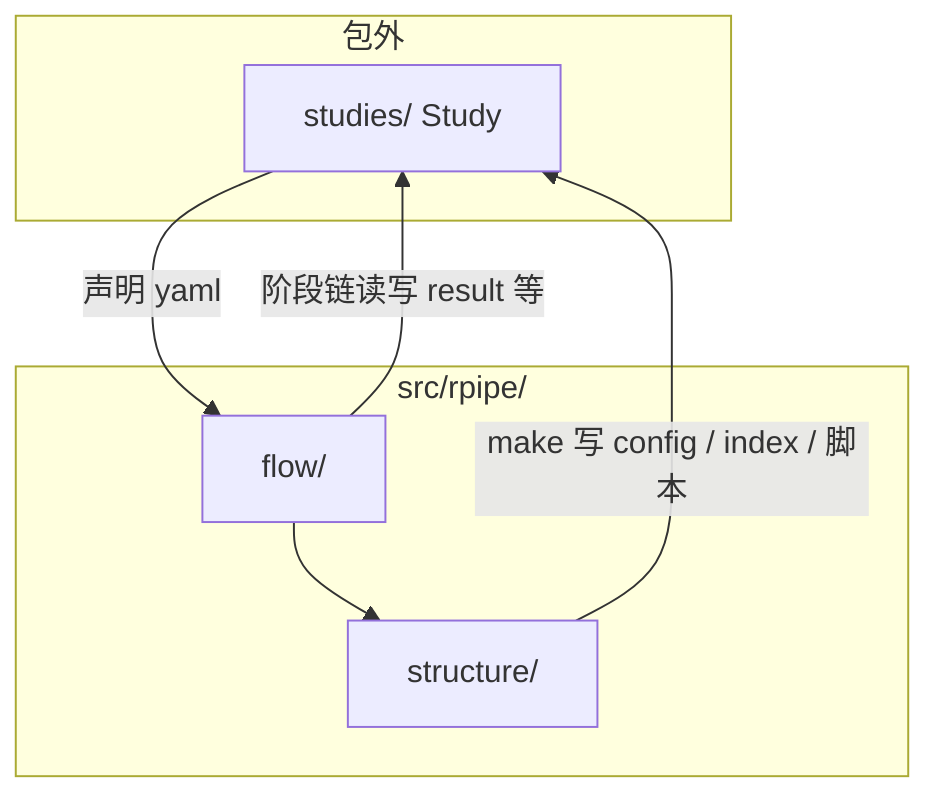

# Layout

本文定义 **RPipe** 仓库目录约定（不含最底层叶文件）。前置阅读 [CONCEPT.md](concept.md)。模块细则见 [CODE_STRUCTURE.md](code.md)。

可安装包名 **`rpipe`**，源码根 `src/rpipe/`。目录只映射 CONCEPT。

---

## 1. 导读

库内两柱：`structure/`、`flow/`。artifact 在 `structure/artifact/`，make 在 `structure/make/`。cli 在 `flow/cli.py`。Study 在包外 `studies/`。

| **仓库入口** | **用途与交付边界** |
| --- | --- |
| `src/rpipe/`、`pyproject.toml` | 可安装库、公共 CLI 与依赖声明 |
| `docs/code/` | 设计：concept、layout、code，以及 structure / flow 分册 |
| `docs/development/` | 开发记录：brainstorm、bugs、testing、cicd、record |
| `studies/` | [Study 使用指南](../../studies/README.md)、声明、复跑入口与正式报告；本地产物另按第四节管理 |
| `tests/` | 统一测试入口、源码镜像测试与安装后 CLI 验收，见 [测试入口](../../tests/README.md) |
| `.github/workflows/` | CPU 测试和 wheel / sdist 构建、安装验收 |
| `asset/` | README 展示本次实测的 MNIST / CIFAR10 曲线；旧参考图与来源保存在 [历史图归档](../../studies/main_historical/docs/reference/README.md)，不作为新 Run 的资产根 |
| `.tmp/` | 本机运行环境、诊断与临时验证输出，不随 Git clone 提供 |

| 概念 | 目录落点 |
|------|----------|
| **Study** | `studies/<name>/` |
| **Experiment** | 逻辑分组（**index** + process 里跨 seed 摘要）；无顶层文件夹 |
| **Run** | `studies/<name>/runs/<id>/` |
| **structure** | `src/rpipe/structure/`：`api`、`control`、四层、**artifact**、**make** |
| **flow** | `src/rpipe/flow/`：阶段子包与 cli |

**Run 目录名：** config 的 `id` = 除 `id` / `description` 外内容的 hash（含 tags、seed、可选 `version`）。Run 是最底层的一次实测。需要避免相同实验参数与 seed 的不同实测发生 ID 冲突时，声明新的 `version`，生成新的 `runs/<id>/`；不再增加 version / attempt 子目录。

读写：

- **config**：**make** 写入 `runs/<id>/`；prepare 只读
- **result**：summarize / **write** 写入；process 可派生
- **asset**：文件通道。data / model 文件、checkpoint、AlgorithmTracker 曲线、Logger 文本，落在 `shared/` 或 `runs/<id>/assets/`

`version` 是 RunConfig 的可选内容字段，只用于区分实际 Run 并参与 `run_id` hash；它不是目录层级或序列化格式版本。timestamp 只是可采用的字段内容之一。

---

## 2. 概念与路径



| 概念 | 路径 | 说明 |
|------|------|------|
| Study | `studies/<study>/` | 编排壳 + artifact 根 |
| 基底配置 | Study 目录下的 experiment 基底文件 | Study 默认值 |
| Run | `…/runs/<id>/` | config / result / assets |
| 共享与文档 | `…/shared/`、`…/docs/` | Study 级。`shared/` 里的 data / model 文件属于 **asset** |
| structure | `src/rpipe/structure/` | api、control、data、model、algorithm、system、artifact（含 `readout/`）、**make** |
| flow | `src/rpipe/flow/` | cli；prepare / execute / collect / summarize / write / process。`status` / `logs` / `report` 由 cli 转给 artifact readout |

---

## 3. 库内目录树

`src/rpipe/` 与 `tests/rpipe/` 同构。`structure/` 只展到下一层。

```
RPipe/
  src/
    rpipe/
      structure/
        api/
        control/
        data/
        model/
        algorithm/
        system/
        artifact/
        make/
      flow/
        cli.py
        prepare/
        execute/
        collect/
        summarize/
        write/
        process/
  studies/
  docs/
  tests/
    rpipe/
```

| flow 子包 | 阶段 |
|-----------|------|
| `prepare/` | 读 config，落地 structure |
| `execute/` | 计算 |
| `collect/` | 收观测 |
| `summarize/` | result 草稿 |
| `write/` | 把 result 写入 artifact |
| `process/` | write 后派生（可空） |

`rpipe status` / `logs` / `report` 的实现在 `structure/artifact/readout/`。cli 只调用它们。

---

## 4. Study 目录

```text
studies/<study>/
  study.yaml
  experiment_config.yaml
  index.json                 # make 写入；不入库
  process.json               # launch / process 写入；不入库
  docs/
    PLAN.md
    STUDY_REPORT.md          # 人写的结论
    NUMBERS.md               # rpipe report 从 process.json 生成的数字表
    figures/
  shared/
    data/
    model/
  scripts/
  runs/
    <run_id>/
      config.yaml
      result.json              # 摘要；曲线不在这里
      assets/
        tracker/               # AlgorithmTracker：state / scalars.jsonl
        logs/run.log           # Logger（system）：这一次 Run；index.log 指向这里
        checkpoints/           # 训练 checkpoint（有则写）
```

| 成员 | 说明 |
|------|------|
| `docs/` | 计划、人写的 `STUDY_REPORT.md`、图；可入库。`NUMBERS.md` 由 `rpipe report` 生成，也可以入库，它不是结论 |
| `shared/` | Study 内共享 asset（data / model 文件）；默认不入库 |
| `runs/` | 每次 Run；默认不入库 |
| `scripts/` | make 生成的调度脚本与 `jobs.json`；默认不入库 |
| `index.json` | make 写入的编排清单（每条 Run 含 `config` 与 `log`）；不入库 |
| `process.json` | Study 级聚合信封；不入库 |
| `activity.json` | 只在 make 进行中出现，成功后删除；不入库。`rpipe status` 在它还在时把第一行打成当前阶段 |
| `provenance.json` | make 写入的来源清单：源码、声明、recipe 与计划的哈希，环境和 git 提交；不入库。规则见 [flow.md](flow.md) §14.2 |
| `recipe.py` | 可选；Study 自己注册的 data / model / algorithm `source`，由 `study.yaml` 的 `recipe` 指向，入库。见 [flow.md](flow.md) §14.1 |
| `shared/data/`、`shared/model/` | structure data / model 的落盘 |
| `runs/<id>/assets/` | 本 Run 的 asset：`tracker/`（数字曲线）、`logs/`（文本）、checkpoint、样本等 |

上表也是目标布局：Run 已是最底层。不同实测使用不同 `version` 导出不同 `run_id`，各自保存在独立的 `runs/<id>/`。

---

## 5. 调用关系

```
studies/<name>/study.yaml
        │
        ▼
  flow cli
        │
        ├─► structure.make → runs/<id>/config.yaml、index、scripts/jobs.json、shared/data
        └─► FlowRunner（launch 复用 jobs.json）
                    │
                    ▼
            runs/<id>/ 下的 result 与 assets
            shared/ 下的 data / model asset
```

---

## 6. 测试镜像

| 测试树 | 对应 |
|--------|------|
| `tests/rpipe/structure/` | `src/rpipe/structure/` |
| `tests/rpipe/flow/` | `src/rpipe/flow/` |

`unit` / `integration` / `e2e` 是标签，不是 `tests/` 下的一级目录。e2e 落在系统入口 `tests/rpipe/flow/`，指向包外 `studies/`。细则见 [TESTING.md](../development/testing.md) 与 [tests/README.md](../../tests/README.md)。
