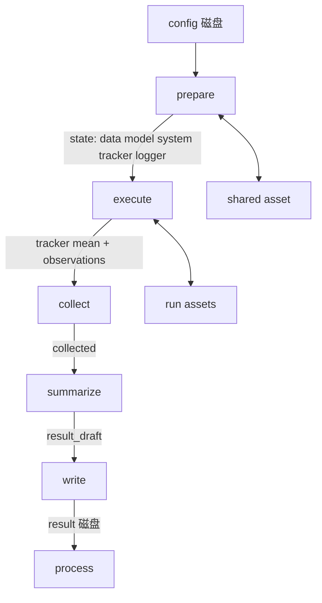

# Code structure · Flow

前置：[CONCEPT.md](../CONCEPT.md) §7、[LAYOUT.md](../LAYOUT.md)、[CODE_STRUCTURE.md](../CODE_STRUCTURE.md)。

并列：[structure.md](structure.md)（含 artifact）。

Flow **只服务一次 Run**。编排（展开 Experiment × seed、写 config、写 **index**）在包外。库内顺序：

**prepare → execute → collect → summarize → write → process**

可 import `structure`（含 `structure.artifact`）。**禁止改 config。** 四层业务在 structure，Flow 只编排调用。

**write** = 把 result 写入 artifact。Study 的 **index** = 编排清单。二者不要混。

---

## 1. 目录与入口

```
flow/
  context.py
  runner.py
  prepare/
  execute/
  collect/
  summarize/
  write/
  process/
```

每阶段一个包，约定 `run(ctx: FlowContext) -> None`。`FlowRunner` 按 `PHASES` 动态 import 并调用。

| 符号 | 位置 | 职责 |
|------|------|------|
| `FlowContext` | `context.py` | 贯穿各阶段的上下文 |
| `FlowRunner` / `PHASES` | `runner.py` | 按序执行；可裁剪阶段；失败时尽量落盘 failed result |

`PHASES = ('prepare', 'execute', 'collect', 'summarize', 'write', 'process')`。允许传入子集（例如只跑 prepare 做干检查），但不得打乱相对顺序。

---

## 2. `FlowContext`

| 字段 | 含义 |
|------|------|
| `study_dir` | Study 根（`docs/`、`shared/`、`runs/`、index） |
| `layout` | 本 Run 的 `ArtifactLayout`（`runs/<id>/`） |
| `config` | 本 Run 的 config mapping；prepare 从磁盘读入后覆盖内存副本 |
| `control` | prepare 之后才有；由 config 构造 |
| `state` | 本 Run 内存黑板；**不**直接当 result 落盘 |

`layout` 提供：`config_path`、`result_path`、`assets_dir`、`shared_data_dir`、`shared_model_dir`。data / model 文件走 **asset**（见 structure.md §9.6）。

### 2.1 `state` 约定（谁写、谁读）

| 键 | 写入阶段 | 读取阶段 | 内容 |
|----|----------|----------|------|
| `seed` | prepare | execute 等 | 已落地的 seed |
| `data` / `model` / `system` | prepare | execute、summarize | 运行时对象（可含 Loader / Module） |
| `tracker` | prepare 构造 AlgorithmTracker；execute 每个 batch 更新 | execute、collect、Logger.report | 数字；**不**整棵进 result |
| `logger` | prepare 经 **System** 构造 | execute | 文本；`report(tracker, split, extra)` 打终端并写 `assets/logs/` |
| `observations` | prepare 初始化；execute 可追加短备注 | collect | 非 AlgorithmTracker 的零星观测 |
| `execute` | execute | collect（可选） | 本阶段返回值 |
| `collected` | collect | summarize | `{metrics, observations}` |
| `result_draft` | summarize | write；失败回写 | 可序列化草稿 |
| `result` | write（或 Runner 失败路径） | process | 已定稿 mapping |

规则：runtime handle 只活在 `state`；进 `result_draft` / `result` 必须先投影（structure.md §9.4）。

---

## 3. Runner 与失败

```mermaid
flowchart TD
  start[FlowRunner.run] --> loop{下一阶段}
  loop -->|有| call[module.run ctx]
  call -->|成功| loop
  call -->|异常| fail[尽量 write failed result]
  fail --> rethrow[再抛出原异常]
  loop -->|无| done[返回 result 路径]
```

- 成功：跑完 write 后 `status: succeeded`，再 process。
- 失败：`_write_failed_result` 尽最大努力写入 `status: failed` + `error`（类型名 + 消息），补齐已知 `paths`；**不得吞掉原异常**。落盘自己再失败则静默，优先保证异常向上。
- 失败时若已有 `control` / `collected.metrics`，写入 result，便于对照哪次 Run 挂了。
- process 里的异常同样走失败路径；此时 result 往往已经 write 过，失败草稿不应无故覆盖 succeeded 正文——实现上宜：仅当尚未有合法 result 时才写 failed；或把 process 失败记到独立派生文件。文档约定：**process 失败不得毁掉已经 write 成功的 result**。

---

## 4. 读写总表

| 阶段 | config | asset | result |
|------|--------|-------|--------|
| prepare | **只读**磁盘 config | 读写 `shared/` + 本 Run `assets/` | — |
| execute | — | 读写（checkpoint、日志、生成物） | — |
| collect | — | **不**动文件 | 内存 |
| summarize | — | **不**动文件 | 内存草稿 |
| write | — | 只列举/登记路径 | **定稿写入** |
| process | **不改** | 可选读；可写派生文件（非 config） | 读定稿；可追加派生字段或旁路文件 |

---

## 5. prepare

**目的：** 让这次 Run 在内存里「站起来」：config → control → 四层实例；需要的文件在 artifact 里就位。

**做：**

1. `load_config(layout.config_path)` → `ctx.config`。文件不存在则失败（`MissingConfigError`）。
2. `control_from_config`；可选 `validate` 契约。
3. `layout.ensure()` / `ensure_assets`。
4. **先** `system.apply_runtime(seed, system_config)`：python / numpy / torch seed，以及 `deterministic` / cudnn 开关（structure.md §7.9）。必须在建构 Data / Model **之前**。
5. 按 control 经 `structure.api` 建构：建议 **system → data → model**（设备与输出根先就绪）。`data_api.build(..., seed=)`，train DataLoader 的 shuffle generator 绑同一 seed。data 缓存进 `shared/data/`，可复用权重进 `shared/model/`。
6. `data.source`：`stub` 不得下载；真数据必须显式（如 `torch`）。
7. 把运行时对象放进 `state['data'|'model'|'system']`；构造 **AlgorithmTracker**（写 `assets/tracker/`）与 **Logger**（挂在 System 上：stdout **且** `assets/logs/`）；初始化 `observations`。

**不做：** 改 config；跑训练循环；写 result。

**失败点：** 缺 config、契约失败、数据不可达、设备不可用。此时还没有 metrics，failed result 至少要有 `error` 和路径。

---

## 6. execute

**目的：** 按本 Run 的 algorithm **做计算**。一次 Run 一个 mode（train / eval / inference）。周期 test / early stop / 以后其它插入点都是 **AlgorithmHook**（structure.md §6.10），不是再跑一个 Flow mode。

**做：**

1. 要求 `ctx.control` 已在（否则视为未 prepare）。
2. 经 `algorithm_api` 调用实现，传入 data / model / system 与 **`state['tracker']`**（AlgorithmTracker）。Logger 在 `system` 上。
3. **每个 batch**：`tracker.evaluate` + `append(split, n=batch_size)`。
4. **按 report 间隔**：`system.logger.report(tracker, …)`（stdout + `run.log` **立即 flush**）；AlgorithmTracker 往 jsonl 追加并 flush；写出 `tracker_state.json` 并 flush。
5. **epoch 末**：`tracker.save()` + `reset()`，再 flush state。
6. **execute 结束（含失败路径尽量）**：再 flush 一遍。
7. 短备注可进 `state['observations']`。不要把 Module / Tensor / AlgorithmTracker / Logger 整棵丢进 result。

**不做：** 读改 config；跨 Run 聚合；写 `result.json`。

---

## 7. collect

**目的：** 收出口径稳定的最终 **metrics 摘要**，仍只在内存。逐步曲线已在 execute 写入 tracker asset；终端文本由 Logger 写出。

**做：**

1. 若有 `state['tracker']`（AlgorithmTracker）：从 `mean` 抽出 `train_loss` 等；若本 Run 实际跑过 test/eval，再抽对应键（如 `accuracy`）。
2. 仍可扫 `state['observations']` 补零星键；同一键后写覆盖先写。
3. 写入 `state['collected'] = {metrics, observations}`。`paths.tracker` / `paths.logs` 留给 summarize/write 登记。

**不做：** 改 tracker/log 文件；把 `history` 整棵拷进 metrics；读其他 Run。

没有观测且 tracker 为空时 `metrics` 为空 dict，不要假装成功指标。

---

## 8. summarize

**目的：** 拼出 **可序列化** 的 `result_draft`，作为 write 的唯一输入。

**建议草稿键：**

| 键 | 来源 |
|----|------|
| `status` | 成功路径先标 `succeeded`（write 前若 Runner 失败会改） |
| `control` | `control.to_dict()` 或等价投影 |
| `structure` | data / model / system 的 **快照**，不是 runtime |
| `metrics` | `collected.metrics` |
| `paths` | run 根、config、assets；result 路径可留给 write 补 |
| `study` | `study_dir` |

**必守：** 丢弃 `train_loader`、`module`、`optimizer`、Tensor 等。实现可集中 `_safe_snapshot` 或调用各层 `to_result_snapshot()`（structure.md §9.4）。无法投影的值写成类型占位，或直接省略，禁止塞进草稿等 write 时崩。

**不做：** 落盘；改 config；二次训练。

---

## 9. write

**目的：** result **定稿落盘**。这是「这次 Run 算不算跑完」的磁盘事实。

**做：**

1. 取 `result_draft`；若为空应失败或写成明确的 failed（不要写半截）。
2. 列举本 Run asset 文件名，把 `paths.result` / `paths.assets` / `paths.shared` / `paths.asset_files` 写进草稿。
3. `write_result(layout.result_path, draft)`（原子写）。
4. `state['result'] = draft`。

**不做：** 改 config；改 asset 文件内容；读其他 Run 做对比（那是 process）。

与 **index** 的区别：index 在 launch **前**由编排写在 Study 根；write 在 Run **后**写 `runs/<id>/` 下的 result。

---

## 10. process

**目的：** 在 **已经 write 的 result** 上做派生。可空。

**做：**

- 按 Experiment 读 sibling result，写 Study 根 `process.json`（mean / std / Δ baseline）
- 读各 Run `assets/tracker/tracker_state.json` 的 epoch `history`，画 **`docs/figures/learning_curves.png`**（mean±std）。Study 报告必须嵌这张图，不能只有表
- 本 Run `derived.json`（相对 baseline 的 Δ）

**不做：** 改 config；重跑 execute；覆盖 write 已成功的 `status: succeeded` 正文；**不**改写 `STUDY_REPORT.md`。

process 依赖「result 已在磁盘」，因此必须排在 write 之后。

---

## 11. 阶段串起来（数据流）



包外生命周期（对照 CONCEPT §9）：写 config + index → 对每个 Run 调 `FlowRunner` → 按 Experiment 读 result。

---

## 12. 测试

| 意图 | 做法 |
|------|------|
| 全链 | stub data，跑满 PHASES，磁盘上有可加载 result |
| 失败落盘 | execute 抛错 → result `failed` + `error`，异常仍抛出 |
| 快照 | result 无 Loader / Module / AlgorithmTracker / Logger 对象 |
| 不改 config | prepare 前后 config 字节一致 |
| write vs index | index 在 Study 根；result 在 `runs/<id>/` |
| process 可空 | 默认 no-op 仍退出 0 |
| AlgorithmTracker + Logger | 短训：`assets/tracker/` 有 train mean；终端与 `run.log` 有含 Loss 的行；result 的 `train_loss` 为段均值而非 last-batch |

测试树：`tests/rpipe/flow/` 镜像各阶段包。
