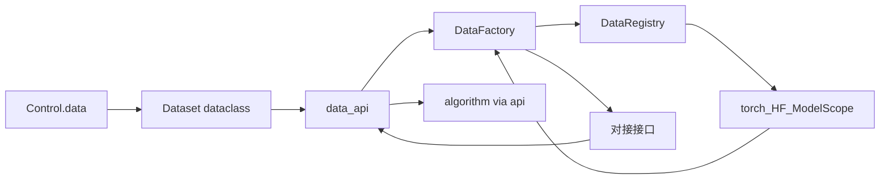

# Code structure · Structure

前置：[CONCEPT.md](../CONCEPT.md) §4、[LAYOUT.md](../LAYOUT.md) §5、[CODE_STRUCTURE.md](../CODE_STRUCTURE.md)。  
并列分册：[flow.md](flow.md)、[artifact.md](artifact.md)。

本文按层推进：**模块 → 类 → 叶文件**。当前 **data** 已定到**类**；control / model / algorithm / system 待定。

**层间只经** `structure/api/` **交流。** 各层实现（`data/`、`model/` 等）不互相直接 import；Flow、algorithm、其它层消费方只依赖对应 `*_api`（`data_api`、`model_api`、`system_api`、`algorithm_api`）。第三方适配留在各层实现内部，由该层 Factory / Registry 使用。**不设** `control_api`：Control 留在 `control/`。

---

## 1. 柱职责与原则

### 1.1 本柱做什么

- 承载 **Control** 与 data / model / algorithm / system
- 在 `api/` 暴露各层对外接口（`data_api`、`model_api`、…）
- 由 Config mapping 构造 Control，并由 Control 导出 Config mapping
- 在 prepare 经各层 api 落地可消费实例；在 execute 期经 api 使用它们
- 在 Control 侧声明并执行 Config / Result **契约校验**
- 经 Asset 路径读写缓存、权重、checkpoint、样本、日志
- 将可 JSON 化的观测写入 `state`，供 Flow 后续阶段写入 Result


### 1.2 能力 vs 取值（对齐 CONCEPT §4）


| 概念                     | 谁声明                                 | 落在哪                                          |
| ---------------------- | ----------------------------------- | -------------------------------------------- |
| **能力**（能接什么数据、模型、哪些语义） | Experiment + 各层 Registry（经 api 可查询） | 注册名解析到第三方实现                                  |
| **取值**（这次跑什么）          | Study / grid 展开写入                   | Artifact `config.yaml` → prepare → `Control` |
| **层间调用**               | Flow / 其它 Structure 层               | 只 import `structure.api.`*                   |


同一套 Experiment 代码服务多次运行；各次差异体现在 Config / Control 取值上。

### 1.3 柱内依赖方向

```
api/                 → 四层门面：data_api / model_api / system_api / algorithm_api
control/             → Control 与编解码/契约；无 control_api
data/                → 实现 Dataset / DataRegistry / DataFactory；只被 data_api 引用
model/               → 实现细节只被 model_api 引用（待定）
system/              → 实现细节只被 system_api 引用（待定）
algorithm/           → 经 data_api / model_api / system_api 消费其它层；实现只被 algorithm_api 引用
flow / examples      → 依赖 structure.api 与 control（及 artifact）
```

正向约定：

- **四层跨层调用只走** `api/` 的 `data_api`、`model_api`、`system_api`、`algorithm_api`
- 层实现目录（`data/`、`model/`、…）之间不直连
- Control 经 `control/` 使用，不设 `control_api`
- Structure 可依赖 `artifact`（路径约定）；不依赖 `flow`
- algorithm 把观测写入 `state`；Result 落盘由 Flow 完成
- 第三方（torch / HF / ModelScope 等）只出现在对应层实现内，经该层 Factory 接到 api 上的对接接口


### 1.4 分册推进状态


| 区域        | 状态                                               |
| --------- | ------------------------------------------------ |
| **api**   | 约定已定：门面目录；`data_api` 随 data 类定稿；其余 `*_api` 随各层补齐 |
| **data**  | 自有三类 + 经 `data_api` 暴露的对接接口（本文 data 节） |
| control   | 待定                                               |
| model     | 待定                                               |
| algorithm | 待定                                               |
| system    | 待定                                               |


叶文件在类清单稳定后再对齐落地。

---


## 2. 目录骨架（仅到层 / api）

```
structure/
  api/          # 层间与对外门面：data_api、model_api、…
  control/      # 待定
  data/         # 实现；见下文 data 节
  model/        # 待定
  algorithm/    # 待定（更下层在定 algorithm 时再写）
  system/       # 待定
```

`api/` 与 `data/`、`model/` 等**同级**（在四层「外面」那一层级），不是某层子目录。

---


## 3. `structure/api/`（门面）


### 3.1 职责


| 单元 | 职责 |
|------|------|
| `data_api` | 暴露 data 层稳定入口与类型：如 `Dataset`、对接接口、`DataFactory.build`（或等价 prepare 入口） |
| `model_api` | 暴露 model 层稳定入口（待该层定类后补） |
| `system_api` | 暴露 system 层稳定入口（待定） |
| `algorithm_api` | 暴露 train/eval/inference 调度入口（待定） |

消费方经 **`structure.api.*`** 使用四层能力；Control 走 `control/`，不设 `control_api`。  
`DataRegistry` 等装配细节可留在 `data/` 内，是否再导出由 `data_api` 决定（默认仅导出消费与构造所需符号）。

### 3.2 依赖

```
flow / algorithm / …  →  api.data_api / api.model_api / …
api.data_api          →  data（实现）
api.model_api         →  model（实现）
data                  ↛  model / algorithm / …（不直连）
```

---


## 4. `structure/data/`（实现 + 类）

把研究所需输入组织为可消费数据流（CONCEPT §4.1）。**数据集本体由第三方提供**；本层实现声明取值、注册来源、工厂装配，并将结果接到 `data_api` **上的对接接口**，兼容至少：

- `torch.utils.data.Dataset`（及 DataLoader）
- Hugging Face `datasets`
- ModelScope dataset

预处理、增强、batch、workers 等**复用**各生态已有能力。本层不另建 Transform / BatchLoader / 自有第三方 Dataset 类树。

### 4.1 本层自有类（仅此三个）


| 类              | 形态        | 职责                                                             |
| -------------- | --------- | -------------------------------------------------------------- |
| `Dataset`      | dataclass | 一次运行的 data **取值声明**（对应 Control.data / Config）；不是第三方 Dataset 本体 |
| `DataRegistry` | 类         | name（及可选来源标识）→ 如何向第三方要数据；`register` / `get` / `list`           |
| `DataFactory`  | 类         | 读 `Dataset` + `assets_dir`，经 registry 拉取第三方数据、按需缓存，装配为对接接口实例   |


对外主路径经 `data_api`：`DataFactory.build(dataset, assets_dir) → 对接接口实例`（Flow 调 api，不调 `data` 包内部路径）。

### 4.2 对接接口（挂在 `data_api`）

消费侧 **一个** Protocol / ABC（名称可定为 `DataHandle` 等），定义在或再导出自 `data_api`。algorithm / Flow 只依赖该接口。


| 能力（例）              | 含义                            |
| ------------------ | ----------------------------- |
| 按 split 取可迭代 batch | execute 供给 algorithm          |
| 暴露底层第三方对象（可选）      | 调试时取出原生 Dataset / DatasetDict |
| 只读元信息              | name、来源、split 规模等             |


各第三方来源用薄适配接到该接口；适配逻辑在 `data/` 实现内（registry 注册项或 Factory），经 `data_api` 交出实例。


| 来源           | 复用什么                                                              |
| ------------ | ----------------------------------------------------------------- |
| PyTorch      | `torch.utils.data.Dataset`、`DataLoader`；transform 用 torchvision 等 |
| Hugging Face | `datasets.Dataset` / `DatasetDict` 及其加载与格式化 API                   |
| ModelScope   | ModelScope 数据集加载 API                                              |


### 4.3 各类要点


#### `Dataset`（dataclass）


| 字段（例）                                   | 含义                                                    |
| --------------------------------------- | ----------------------------------------------------- |
| `name`                                  | 注册名 / 第三方数据集标识                                        |
| `source`                                | `torch` / `hf` / `modelscope` 等（原 backend 语义，表示第三方来源） |
| `split` / `splits`                      | 划分与用途                                                 |
| `batch_size`、`num_workers`、`pin_memory` | 交给第三方 Loader 的参数                                      |
| `transforms`                            | 声明或配置片段，交给第三方 transform 管线                            |
| `cache`                                 | 是否写入 Asset 缓存（由 Factory 解释）                           |
| 其它                                      | 版本、子集、HF config 名等按来源扩展                               |


`Control.data` 即该 dataclass 的 mapping 形态（或与之往返）。

#### `DataRegistry`


| 能力                           | 含义            |
| ---------------------------- | ------------- |
| `register(name, …)`          | 登记如何构造某第三方数据集 |
| `get(name)` / `list()`       | 查询            |
| 解析 `Dataset.source` + `name` | 选出对应加载路径      |


#### `DataFactory`


| 能力                                             | 含义                                                                  |
| ---------------------------------------------- | ------------------------------------------------------------------- |
| `build(dataset: Dataset, assets_dir) → 对接接口实例` | prepare 主路径（经 data_api 暴露）                                          |
| 内部分步                                           | 查 registry → 第三方 load → 按需 Asset 缓存 → 第三方 transform/batch → 包装为对接接口 |


### 4.4 协作




### 4.5 Asset 触点


| 操作      | 阶段                   | 谁发起           | 路径意图                                     |
| ------- | -------------------- | ------------- | ---------------------------------------- |
| 写/读数据缓存 | prepare（及按需 execute） | `DataFactory` | `assets/cache/…`（经 artifact.asset.kinds） |


### 4.6 测试镜像


| 镜像位置                          | 覆盖                                     |
| ----------------------------- | -------------------------------------- |
| `tests/rpipe/structure/data/` | `Dataset`、`DataRegistry`、`DataFactory` |
| `tests/rpipe/structure/api/`  | `data_api` 导出与经 api 的 build 路径         |


多来源 / 外网标 `external`。强制标签见 [TESTING.md](../TESTING.md)。

---


## 5. 其余层（待定）


| 层 | CONCEPT | 下一步 |
|----|---------|--------|
| `control/` | 变量指派；Config 编解码与契约（无 control_api） | 模块 → 类 |
| `model/` + `model_api` | 模型句柄、权重、结构 | 模块 → 类 → api 导出 |
| `algorithm/` + `algorithm_api` | train / eval / inference | 同上；经其它 `*_api` 消费 |
| `system/` + `system_api` | 设备、精度、并行、IO、resume | 同上 |


---


## 6. 与 Artifact / Flow 的触点（摘要）


| 触点            | Structure 侧（已定部分）                             | 对端                                 |
| ------------- | --------------------------------------------- | ---------------------------------- |
| Config        | Control 取值中的 `data` 字段 / `Dataset`            | `artifact.config`；grid 写、prepare 读 |
| Asset         | `DataFactory` 缓存                              | `artifact.asset`（cache 等）          |
| Result        | （待 control / algorithm 定稿）                    | flow summarize / index             |
| Context.state | 经 `data_api` build → `state["data"]` = 对接接口实例 | `flow.context`                     |


---


## 7. 演进

1. 新层：实现目录 + 对应 `*_api`（Control 除外）；跨层经 api 导出。
2. data 叶文件：对齐三类、`data_api`、对接接口。
3. 字段键更名时同步 `Dataset`、Control、Experiment grid、`data_api` 与测试。

