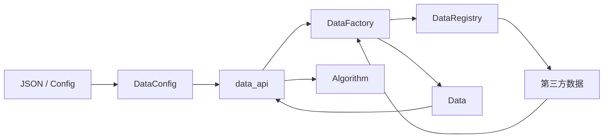
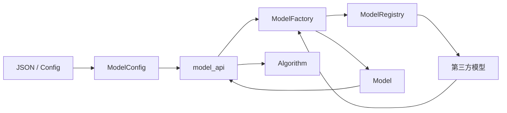
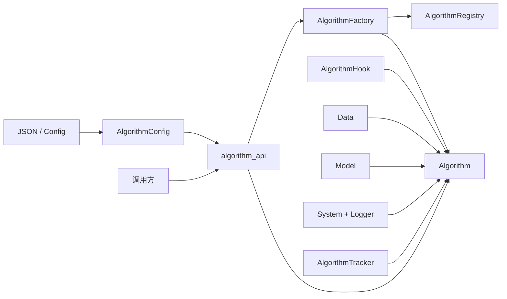
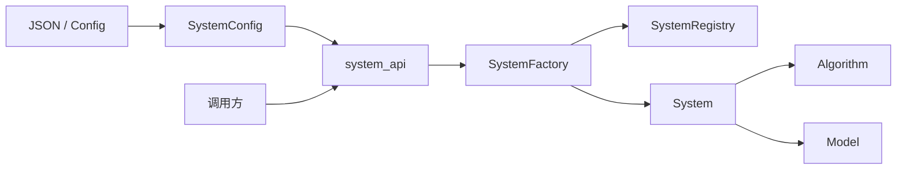
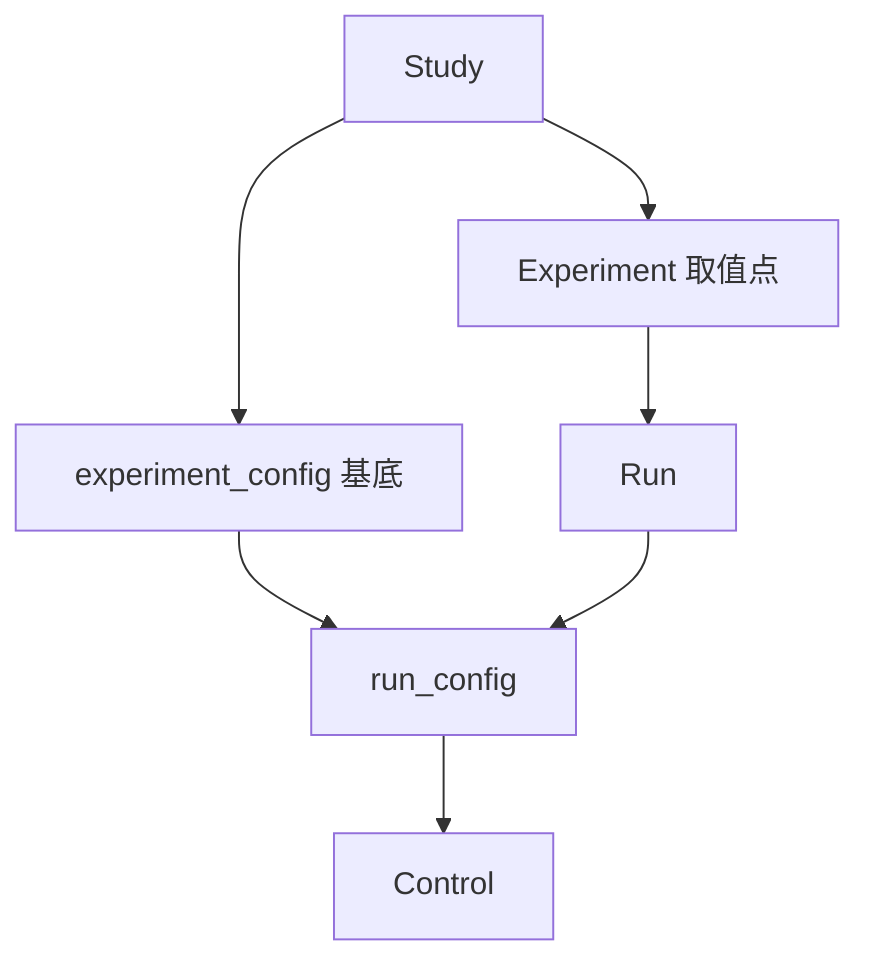
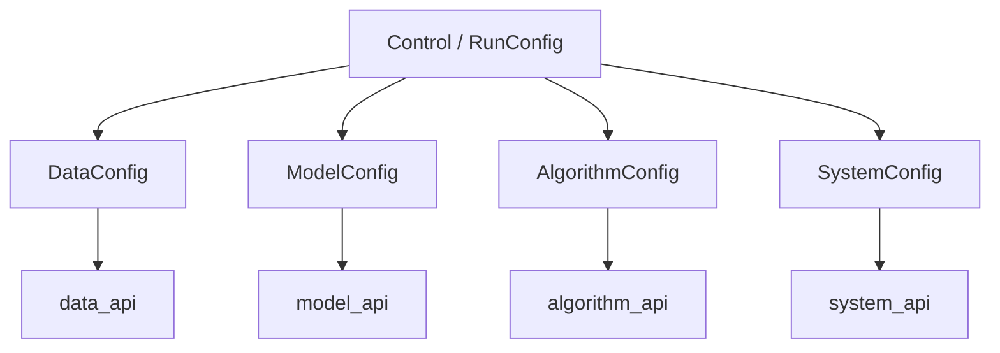

# Code structure · Structure

前置：[CONCEPT.md](../CONCEPT.md) §6、[LAYOUT.md](../LAYOUT.md)、[CODE_STRUCTURE.md](../CODE_STRUCTURE.md)。  
并列分册：[flow.md](flow.md)。

本文按层推进：**模块 → 类 → 叶文件**。data / model / algorithm / system / control 定到类（control 见 §8）。**artifact** IO 见 §9。**make** 见 §10。

**层间只经** `structure/api/` **交流。** 各层实现不互相直接 import；跨层与外部调用方只依赖对应 `*_api`。**不设** `control_api`：control 留在 `control/`。

运行时类（`Data`、`Model`、`Algorithm`、`System`）与配置 dataclass 分开：前者供 prepare/execute 消费；后者为 **`DataConfig` / `ModelConfig` / `AlgorithmConfig` / `SystemConfig`**，专责从 JSON / Artifact Config 加载声明字段。

**Config 字段约定：** 各 `*Config` **只规定必须字段**。其余键为可选扩展，由对应 `source` / 注册项解释。

各层统一还有两类约定（字段名可微调，语义固定）：

| 约定 | 落在哪 | 说明 |
|------|--------|------|
| **内容配置** `config` | 每一层 `*Config` | 可装入从 `path` 读出的超参/子配置，也可由 Control / 实验侧**覆写**；合并与优先级做到更下游细节时再定 |
| **向上兼容** | Model → Data；Algorithm → Model；System → Algorithm | **下一层声明对上一层的兼容**；Data 无更上一层，不设此项 |

`path` 仍是资源/超参文件根；读出来的内容应能进入本层 `config`，并允许被覆写。

---

## 1. 柱职责与原则

### 1.1 本柱做什么

- 承载 **control** 与 data / model / algorithm / system，以及 **artifact** IO 与 **make**
- 在 `api/` 暴露各层对外接口（`data_api`、`model_api`、…）
- 由 config mapping 构造 control，并由 control 导出 config mapping
- 在 prepare 经各层 api 落地可消费实例；在 execute 期经 api 使用它们
- 在 control 侧声明并执行 config / result **契约校验**
- 经 **asset** 路径读写缓存、权重、checkpoint、样本、日志（data / model 落盘都在 asset）
- 经 api 产出可序列化观测（loss、metric、路径等），供写入 result

### 1.2 能力 vs 取值（对齐 CONCEPT §6）

| 概念 | 谁声明 | 落在哪 |
|------|--------|--------|
| **能力** | Experiment + 各层 Registry（经 api 可查询） | 注册名解析到第三方实现 |
| **取值** | **make**（`axes` × `seeds`）写入 | Artifact Config → prepare → `Control` |
| **层间调用** | Structure 柱内 / 外部调用方 | 四层经 `structure.api.*`；Control 经 `control/` |

### 1.3 柱内依赖方向

```
api/                 → data_api / model_api / system_api / algorithm_api
control/             → Control 与编解码/契约；无 control_api
data/                → Data / DataRegistry / DataFactory / DataConfig
model/               → Model / ModelRegistry / ModelFactory / ModelConfig
system/              → System / Logger / SystemRegistry / SystemFactory / SystemConfig
algorithm/           → Algorithm / AlgorithmTracker / AlgorithmRegistry / AlgorithmFactory / AlgorithmConfig
artifact/            → layout / config / result / asset / index IO；不 import 四层实现
make/                → 多实验：展开、写 config/index、调度脚本；调 control + artifact；不 import 四层、不 import flow
```

- 四层跨层只走对应 `*_api`
- 层实现目录之间不直连
- 第三方建构在各层实现内完成；经 Factory 得到运行时对象再经 api 交出
- algorithm 经 `data_api` / `model_api` / `system_api` 使用 `Data` / `Model` / `System`（含 System 上的 Logger）；数字观测走 **AlgorithmTracker**

### 1.4 分册推进状态

| 区域 | 状态 |
|------|------|
| **api** | 门面已定 |
| **data** | `Data` + `DataRegistry` + `DataFactory` + `DataConfig` |
| **model** | `Model` + `ModelRegistry` + `ModelFactory` + `ModelConfig` |
| **algorithm** | `Algorithm` + **AlgorithmTracker** + Registry / Factory / `AlgorithmConfig` |
| **system** | `System` + **Logger** + Registry / Factory / `SystemConfig` |
| **control** | `ExperimentConfig` + `RunConfig` + `Control` + 四层 `*Config` + 合并/编解码/契约（§8） |
| **artifact** | layout / config / result / asset / index（§9） |
| **make** | 多实验 config 网格 + 调度脚本（§10） |

---

## 2. 目录骨架（仅到层 / api）

```
structure/
  api/
  control/
  data/
  model/
  algorithm/
  system/
  artifact/     # §9
  make/         # §10
```

---

## 3. `structure/api/`（门面）

| 单元 | 职责 |
|------|------|
| `data_api` | 暴露 `Data`、`DataFactory.build`、`DataConfig` |
| `model_api` | 暴露 `Model`、`ModelFactory.build`、`ModelConfig` |
| `system_api` | 暴露 `System`、`Logger`、`SystemFactory.build`、`SystemConfig` |
| `algorithm_api` | 暴露 `Algorithm`、`AlgorithmTracker`、`AlgorithmFactory.build`、`AlgorithmConfig` |

---

## 4. `structure/data/`（实现 + 类）

把研究所需输入组织为可消费数据流（CONCEPT §6 **data**）。数据集本体由第三方提供；本层负责注册、建构与对外可消费的 **`Data`**。声明字段由 **`DataConfig`** 从 JSON / Config 加载。

### 4.1 本层自有类型

| 类型 | 职责 |
|------|------|
| **`Data`** | 对上提供统一的数据消费能力（划分、batch 迭代、元信息等）；持有并使用第三方已建构的数据对象 / loader |
| **`DataRegistry`** | name + source → 如何向第三方建构数据；`register` / `get` / `list` |
| **`DataFactory`** | 读 `DataConfig` + `assets_dir` → 经 registry 建构 → 得到 **`Data`** |
| **`DataConfig`** | dataclass；从 JSON / Artifact Config / Control.data 加载声明字段 |

对外：`DataFactory.build(data_config, assets_dir) → Data`。

### 4.2 `Data` 职责要点

- 按 split 提供可迭代 batch（供 algorithm）
- 暴露来源、划分规模等只读元信息
- 需要时取出底层第三方对象（调试 / 进阶）
- **step 预算续训**：`rebind_train_steps(step, num_steps, step_period)` 按 main 的 `make_data_loader` 重建 train sampler（剩余 sample 数；generator 重新绑同一 seed）
- 不承载「配置字段表」本身（那是 `DataConfig`）

### 4.3 下游来源（至少）

| 来源 | 复用什么 |
|------|----------|
| PyTorch Dataset | `torch.utils.data.Dataset`、`DataLoader`；transform 可用 torchvision 等 |
| Hugging Face | `datasets.Dataset` / `DatasetDict` 及加载、格式化 API |
| ModelScope | ModelScope 数据集加载 API |

已注册 `source: torch`：`MNIST`、`CIFAR10`、`SVHN`（ToTensor + Normalize；CIFAR10/SVHN 默认 train 增强对齐 main `Base`：CIFAR flip+pad-4 crop，SVHN 仅 pad-4 crop）。`Data.meta` 带 `data_size` / `target_size`，供 prepare 传给 model factory。`config.augment: false` 可关掉随机增强。

其它来源经 Registry 注册即可。

### 4.4 `DataConfig`

dataclass，从 JSON / Artifact Config 加载（经 Control 可覆写）。**必须字段：**

| 字段 | 说明 |
|------|------|
| `name` | Registry 查找用的数据集标识 |
| `source` | 下游来源（如 `torch` / `hf` / `modelscope`） |
| `path` | 数据相关路径（资源或该侧超参/清单所在位置） |
| `config` | **内容配置**：可装入 `path` 内读出的配置，或由上层覆写；合并规则下游再定 |

Data 是兼容链最上游，**不设**对更上层的兼容字段。`batch_size`、`test_batch_ratio`、`split`、`transforms` 等不进必须表；优先进 `path` / `config`。

### 4.5 Registry / Factory

| 类 | 能力 |
|----|------|
| `DataRegistry` | `register` / `get` / `list` |
| `DataFactory` | `build(data_config: DataConfig, assets_dir) → Data` |

### 4.6 协作



### 4.7 落盘与测试

本层会把数据集等文件写到 Study 的 **asset**（通常 `shared/data/` 下的缓存），不把整份数据塞进 result。单测在 `tests/rpipe/structure/data/` 与 `tests/rpipe/structure/api/`（`data_api`）：Config 往返、Registry、Factory→`Data`。

---

## 5. `structure/model/`（实现 + 类）

构建可调用模型能力（CONCEPT §6 **model**）。网络本体由第三方提供；本层负责注册、建构与对外可消费的 **`Model`**。声明字段由 **`ModelConfig`** 从 JSON / Config 加载。

### 5.1 本层自有类型

| 类型 | 职责 |
|------|------|
| **`Model`** | 对上提供 forward、模式切换、参数与权重协作等；持有并使用第三方已建构的模型 / 推理句柄 |
| **`ModelRegistry`** | name + source → 如何向第三方建构模型 |
| **`ModelFactory`** | 读 `ModelConfig` + `assets_dir` → 建构/加载 → 得到 **`Model`** |
| **`ModelConfig`** | dataclass；从 JSON / Config / Control.model 加载声明字段 |

对外：`ModelFactory.build(model_config, assets_dir, data_meta=None) → Model`。`data_meta` 是 dict（通常 `Data.meta`），**不是** Data 对象；prepare 经 `model_api` 传入。`model.config.data_size` / `target_size` 优先于 meta。

已注册 `source: custom_torch`：`linear`、`mlp`、`cnn`、`resnet18`（别名 `resnet`）、`resnet10`，结构对齐 git main `src/model/`（含 `init_param`）。linear/mlp 在模块内 flatten；cnn/resnet 吃 NCHW。默认超参对齐 `hyper.py`（mlp 128×2 层；cnn/resnet hidden `[64,128,256,512]`）。

### 5.2 `Model` 职责要点

- 前向调用；train / eval 模式
- 可训练参数（供优化器）
- 权重加载 / 导出（与 asset、checkpoint 协作）
- 需要时取出底层第三方对象
- 设备等精细放置经 `system_api` 的 `System` 协作
- 不承载配置字段表本身（那是 `ModelConfig`）

### 5.3 下游来源（至少）

| 来源 | 复用什么 |
|------|----------|
| Custom PyTorch | 用户/实验侧 `torch.nn.Module`，经 Registry 注册 |
| `torchvision.models` | torchvision 预置结构与权重接口 |
| `timm` | timm 模型创建与权重接口 |
| **Diffusers** | Hugging Face `diffusers` 管线 / 模型 |
| **DiffSynth** | DiffSynth 等扩散合成相关加载与推理 API |
| llama.cpp | llama.cpp / Python 绑定 |
| Hugging Face Transformers | `transformers`；PEFT 用官方包装 |
| ModelScope | ModelScope 模型加载 API |

均可经同一 Registry 注册；Factory 产出统一的 `Model`。来源列表可随接入继续加，不改本层类型结构。

### 5.4 `ModelConfig`

dataclass，从 JSON / Artifact Config 加载（经 Control 可覆写）。**必须字段：**

| 字段 | 说明 |
|------|------|
| `name` | Registry 查找用的模型标识 |
| `source` | 下游来源（如 `custom_torch` / `torchvision` / `timm` / `hf` / …） |
| `path` | 模型资源根路径：其下可含权重、模型超参配置及其它 source 约定文件；**不**假定只有 weights |
| `config` | **内容配置**：可装入 `path` 内读出的配置，或由上层覆写；合并规则下游再定 |
| `compat_data` | **兼容的 Data**（如允许的 `name` / `source` 集合；空表示不限制——形状下游再定） |

结构变体、freeze、adapter 等不进必须表；优先进 `path` / `config`。

### 5.5 Registry / Factory

| 类 | 能力 |
|----|------|
| `ModelRegistry` | `register` / `get` / `list` |
| `ModelFactory` | `build(model_config: ModelConfig, assets_dir, data_meta=None) → Model` |

### 5.6 协作



### 5.7 落盘与测试

读权重 / 超参走 `ModelConfig.path` 及约定的 asset 位置；训练中的 checkpoint 由 algorithm 触发、**system** 协助写到本 Run `assets/checkpoints/`。result 只记路径。单测在 `tests/rpipe/structure/model/` 与 `model_api`。

---

## 6. `structure/algorithm/`（实现 + 类）

在任务范式下定义怎么算（CONCEPT §6 **algorithm**）。本层用 **`mode`** 区分 **train / eval / inference**（一次配置一个 mode；要组合多种 mode 由 Study / 多次运行或 Control 切换）。经 `data_api` / `model_api` / `system_api` 使用已落地的 `Data` / `Model` / `System`。声明字段由 **`AlgorithmConfig`** 加载。

更下层目录（若实现时按 mode 拆分）由本分册后续补，**不在 LAYOUT 展开**。

### 6.1 本层自有类型

| 类型 | 职责 |
|------|------|
| **`Algorithm`** | 按当前 `mode` 执行；**优化器 / 调度器 / resume** 接口（§6.11）；AlgorithmTracker；AlgorithmHook |
| **`AlgorithmTracker`** | 本层数字观测（勿与 **Logger** 混淆）：每 batch `append`，周期 `save`/`reset`，曲线 jsonl / state 落盘 |
| **`AlgorithmHook`** | 循环插入点合同：命名方法、共用签名；挂在 `Algorithm` 上，不是插件总线，也不是 Flow 阶段 |
| **`AlgorithmRegistry`** | `mode` + `source` → 具体执行能力；`register` / `get` / `list` |
| **`AlgorithmFactory`** | 读 `AlgorithmConfig` → 经 registry 装配 → 得到 **`Algorithm`** |
| **`AlgorithmConfig`** | dataclass；从 JSON / Config / Control 加载 |

对外：`AlgorithmFactory.build(algorithm_config, …) → Algorithm`。  
execute 典型调用：`algorithm.run(data, model, system, tracker=…) → observations`。数字走 **AlgorithmTracker**；终端与 `run.log` 走 **`system.Logger.report(tracker, …)`**（§7.8）。

### 6.2 `Algorithm` 职责要点

- 按 `mode` 执行 train **或** eval **或** inference（三者行为不同；一次 Run 一个 mode）
- 从 `Data` 取 batch；调用 `Model`；经 `System` 做设备 / IO 协作。native 监督循环：有 `module` + `iter_batches` 即训，不按 `data.name` 特判 MNIST
- **每个计算 batch** 更新 AlgorithmTracker（§6.9）；按间隔把 tracker 交给 `system.Logger` 打终端并写 `assets/logs/`
- train：更新参数；tracker 曲线进 `assets/tracker/`；checkpoint 经 system 写 asset；循环点上调 **AlgorithmHook**（§6.10），不另开 Flow 阶段
- **优化器 / 调度器 / resume**：本层接口（§6.11），各 `source` 自己落实；native 手写 loop 与 HF Trainer 走同一套名字
- eval：独立的 `mode=eval` 算法（§6.3、§6.11.4），通常经 resume 加载 `best` / `latest`；**不是** train 循环里的 `on_eval_period`
- inference：生成；可写样本到 asset
- 不承载配置字段表本身（那是 `AlgorithmConfig`）；超参主要进 `path` / `config`

### 6.3 `mode`

| 取值 | 含义 |
|------|------|
| `train` | 训练（可含循环内周期 test，仍是 train） |
| `eval` | **独立评测算法**：另一次 Run、另一个 `Algorithm`；默认 resume `best` |
| `inference` | 推理 / 生成 |

不设 `paradigm` 必须字段。train 与 eval 都实现 **resume** 接口（§6.11.3）：train 续训，eval 加载权重再评。不要把独立 eval 做成 Flow 里的第二个阶段。

### 6.4 下游来源（至少）

循环、优化器、调度器、resume、metric、生成管线等**复用生态能力**，经 Registry 按 **mode + source** 挂接。**算法层接口统一**（§6.11）：各 source 映射到同一套 `optimizer` / `scheduler` / `resume` 语义，不在 system / model 另造一套。对照 main 只约束 **native（`custom_torch`）** 这一支；HF Trainer / Accelerate 等是并列实现，不是 native 的特例。

| 来源 | 典型用于 | 复用什么 |
|------|----------|----------|
| Custom PyTorch（native） | train / eval / inference | 手写 loop；本层 `make_optimizer` / `make_scheduler` / `resume`；手写 metric |
| Transformers Trainer | train / eval | 真跑 `Trainer` + `TrainingArguments`：`optim` / `lr_scheduler_type` 映射到 §6.11；优化器 / cosine 仍可由算法接口给出（本实现如此，便于与 native 对齐 epoch 调度） |
| Accelerate | train（及需其封装的执行） | 在 PyTorch 之上的分布式 / 混合精度等编排；底层仍是 PyTorch；优化器仍由算法接口给出 |
| Diffusers | train / inference（扩散） | diffusers 训练与 pipeline 推理；optimizer / scheduler 仍走算法接口 |
| DiffSynth | train / inference（扩散合成） | DiffSynth 相关 API |
| TorchMetrics / HF Evaluate | eval | 现成 metric 与聚合 |
| lm-eval 等 harness | eval | 标准评测任务集 |
| Transformers generate | inference | `generate` 等解码 API |
| **vLLM** | inference | 高吞吐 LLM 推理 |
| **SGLang** | inference | 结构化生成 / LLM 推理运行时 |
| llama.cpp | inference | 本地 LLM 推理（亦可与 system 侧句柄协作） |

其它来源按同样方式注册；不在本层另造完整训练框架。Accelerate 属**算法层**编排，不放入 system 下游。

### 6.5 `AlgorithmConfig`

dataclass，从 JSON / Artifact Config 加载（经 Control 可覆写）。**必须字段：**

| 字段 | 说明 |
|------|------|
| `mode` | `train` / `eval` / `inference`（一次一个；默认必须有） |
| `source` | 执行实现来源（如 `custom_torch` / `transformers_trainer` / `accelerate` / `diffusers` / `vllm` / `sglang` / …） |
| `path` | 算法超参等资源路径 |
| `config` | **内容配置**：可装入 `path` 内读出的配置，或由上层覆写；合并规则下游再定 |
| `compat_model` | **兼容的 Model**（如允许的 `name` / `source` 集合；空表示不限制——形状下游再定） |

lr、步数、`optimizer` / `scheduler` / `resume`、**`metric`**、解码参数等不进必须表；优先进 `path` / `config`（§6.9、§6.11）。不同 `source` 解释同一套键，禁止每个 Trainer 再发明一套顶层字段。

### 6.6 Registry / Factory

| 类 | 能力 |
|----|------|
| `AlgorithmRegistry` | 按 `mode` + `source` `register` / `get` / `list` |
| `AlgorithmFactory` | `build(algorithm_config: AlgorithmConfig, …) → Algorithm` |

### 6.7 协作



### 6.8 落盘与测试

本层会往本 Run 的 **asset** 里写算法相关文件：AlgorithmTracker 的 `assets/tracker/`（state、jsonl）；inference 的样本。train 触发的 checkpoint 经 **system** 落到 `assets/checkpoints/`。这些都是文件，所以走 artifact 的 asset 路径，不进 `result.json` 正文。单测在 `tests/rpipe/structure/algorithm/`（Config / Registry / Factory、AlgorithmTracker、**AlgorithmHook**、与 `system.Logger` 联调打出行）。

### 6.9 `AlgorithmTracker`

算法层的数字账本。历史训练循环把「记数」和「print」写在同一个 Logger 里；这里拆开：**只记数**。终端与 `run.log` 是 **system.Logger**（§7.8）。必须把本对象交给 Logger 的 `report`，否则终端看不到 Loss。

内存里按 split（至少 `train` / `test`）维护：最近一次 batch 值、按样本数 `n` 加权的 running mean、累计 counter、`save()` 时追加的 history、以及给 jsonl 用的步数。

Metric 名与 git `main` 对齐，在 **algorithm** 算、不在 Flow 另起一套：`Loss`、`Accuracy`、`MSE`（batch）；`RMSE`、`GLUE`（full，在 `save()` 时收口）。配置键 `algorithm.metric`；缺省 train / test 都是 `Loss` + `Accuracy`。Accuracy 是 **0–1**，不是百分数。train 循环与独立 `mode=eval` 共用同一套名字。

`evaluate(split, mode='batch', input, output)` 按该 split 登记的名字算 batch 指标。`mode='full'` 留给 RMSE / GLUE 这类要整段才有的量。默认 MNIST train 每个 batch 都 `append('train', n=batch_size)`；test 由 §6.10 的 `on_eval_period` 走同一套 `evaluate` / `append(..., split='test')`。

**进 `result.json` 的只有摘要**（如 `metrics.train_loss` = 最后一段 train mean，不是 last-batch CE）。曲线在 asset。

#### 6.9.1 每个 batch 与每个周期

每个 batch：`evaluate` → `append`（只更新内存 mean，不重写整份 state 文件）。
每个 epoch 末：`save()` 把当前 mean 推进 history，再 `reset()` tracker/mean/counter（history 与步数保留）。test / checkpoint 节奏见 `eval_period` 与 `progress_unit`（§6.10）。

#### 6.9.2 画图与 flush

密曲线读 `assets/tracker/scalars.jsonl`（每次 **report 间隔** 一行：step、split、name、mean）；稀曲线读 `tracker_state.json` 的 `history`（每个 epoch 一个点）。jsonl 是主画图源。**不做 TensorBoard**：process 已经从 history / jsonl 出图。

flush **必须有**，与 print 同一套间隔，不能攒到 Run 结束：

- **batch**：只内存 `append`
- **report 间隔**（默认每 epoch 至少一次；长训用 `algorithm.config.log_interval`）：`system.Logger.report` 并立刻 flush `run.log`；tracker 往 jsonl 追加并 flush；写出 `tracker_state.json` 并 flush
- **epoch 末**：`save`+`reset`，再 flush state
- **execute 结束 / 尽量在失败时**：再 flush 一遍

不允许：log 只打终端不写文件；jsonl / state 只在 Run 结束写一次。不必每个 batch 都 rewrite 整份 state。

### 6.10 `AlgorithmHook`

本层第三类运行时对象（与 `Algorithm` / `AlgorithmTracker` 并列）：算法**循环里**要插入的动作。方法写在 **`Algorithm` 上**（`Algorithm` 继承 `AlgorithmHook`），由 `run()` 点名调用。**不是**新的 Flow 阶段，也**不是**第三柱，不要做成通用插件总线。

**为什么在这边：** Flow 只认 prepare → execute → collect → …；execute 一次一个 `mode`。train 中途评 test，仍是同一个 train 循环在说话。**独立评测**是另一次 `mode=eval` 的 Run（§6.11.4），不要用 Flow 阶段冒充。

**约定：**

- 基类方法默认 no-op / 返回「不停止」。具体 `mode`（如 `TrainAlgorithm`）覆盖自己需要的点。
- 签名共用：`(tracker, logger, data, model, system, extra=None)`。`extra` 带 epoch / lr / step 等，不另开对象图。
- train hook 返回 `True` 表示结束本轮 `run()`（early stop）；其它 hook 无返回值。
- hook **只**改 tracker / 触发 system 写 asset / 打 Logger；**不**改 config，**不**自己 write `result.json`。
- 新需求先加 **命名方法**，需要时再在循环里点名调用。不要做通用插件总线或把 hook 放到 data / system。

**已接线（train）：**

| 方法 | 何时 | 做什么 |
|------|------|--------|
| `on_eval_period(...)` | 每 `eval_period` 个 **进度单位**（默认 1；`0` = 只在训完评一次） | test：同一套 `evaluate` / `append(split='test')` / `Logger.report`；可选 `early_stop_patience` / `early_stop_min_delta`（看 test Accuracy）；记下 best |
| `on_checkpoint(...)` | 要落盘权重时（见下） | 经 **system** 写 `assets/checkpoints/`；不写 `result.json` |

**预留（有需要再接线，基类先留空）：**

| 方法 | 典型何时 |
|------|----------|
| `on_epoch_start` | 每个 epoch 训练 batch 之前 |
| `on_batch_end` | 每个 train batch 的 append 之后（慎用：太密） |
| `on_run_end` | `run()` 返回前（失败路径尽量也走） |

eval / inference 以后按同样方式加自己的点（例如 `on_generate_batch`），不新开 Flow。

#### 6.10.1 进度单位：epoch 或 step

训练预算以 **`num_steps`** 为基准（对齐 main 的 `step` / `num_steps`），`num_epochs` 仅在有 epoch 概念时用于**推导并覆盖**步数：

| 超参 | 默认 | 说明 |
|------|------|------|
| `num_steps` | `1` | optimizer step 预算（默认与主口径一致） |
| `num_epochs` | 无 | 若能推导 `steps_per_epoch`（train loader 长度，或 `train_size`/`batch_size`），则 `num_steps = num_epochs * steps_per_epoch`，并覆盖显式 `num_steps` |
| `progress_unit` | `step` | `eval_period` / `checkpoint_period` / 百分比按这个单位数；需要按 epoch 记周期时显式设 `epoch` |
| `eval_period` | `1` | 每 N 个单位评一次 test；`0` = 只在训完评一次 |

`progress_unit=epoch` 仍可用，但要求 `num_epochs`。对不具备稳定 epoch 语义的数据（如流式数据），只配 `num_steps` 即可。cosine 的 `T_max` 跟单位走（epoch 训用 epoch 数，step 训用 step 数），可用 `T_max` 覆写。

单位是 `step` 时，`eval_period` 仍默认 `1`（每步一评，很贵）——LLM 请自己改大。MNIST 这类「每个 epoch 记一次 test」的 Study 应显式写 `progress_unit: epoch`。epoch 边界仍 `save`/`reset` train tracker，方便画按 epoch 的曲线。

#### 6.10.2 Checkpoint（经 system，对齐 main 的 latest + best）

| 超参 | 默认 | 说明 |
|------|------|------|
| `checkpoint` | `latest` | 存法：`latest` = 只覆盖 `latest` 这一份；`percent` = 另按总预算百分比留命名快照 |
| `checkpoint_period` | `1` | 每 N 个进度单位更新 `latest`；`0` = 只在训完写一次 latest |
| `checkpoint_percents` | `[0.25, 0.5, 0.75, 1.0]` | `checkpoint: percent` 时生效；相对 **该单位的总预算**（epoch 训 = 总 epoch，step 训 = 总 step） |
| `save_best` | `false` | `true` 时 best 口径创新高则写 `best`（跟 eval 走，不跟 period 绑死；口径见下） |

文件都在 `assets/checkpoints/`：每个 stem 一份 **`<name>.pt` 整包**（兼容）外加 **`<name>/` 目录**（`model.pt` / `optimizer.pt` / `scheduler.pt` / `tracker.json` / `logger.json` / `meta.json`）。`save_best: true` 时另写 `best`。百分比时 `epoch_0005` / `step_000100`。result **不**塞权重。

`best_split` / `best_metric`（或 `best_metric_name`）/ `best_mode`（`max`/`min`；Loss 默认 min）决定何时算 improved。缺省仍是 test Accuracy 越大越好。

**读回来**不是 system 的职责：system 只提供 `load_checkpoint(name)`（与 `save_checkpoint` 对称）。**何时读、读哪份、恢复哪些对象**由算法的 **resume 接口**决定（§6.11.3）。

#### 6.11 算法层接口：优化器、调度器、resume、独立 eval

这些都挂在 **`Algorithm` 上**（与 `run` / hook 并列），**不是**新的 Flow 阶段，**不是** model / system 的必须字段。`source`（native / HF Trainer / Accelerate / Diffusers …）各自落实，对外名字一致。对照 main 只用来钉 native 行为；HF 等按同一接口映射，不要把 Trainer 特有键抬成 Control 必须表。

##### 6.11.1 优化器

`Algorithm.make_optimizer(model, …)`（名字可微调）：按 `algorithm.config` 构造可 step 的优化器句柄，交给本 `source` 的训练实现。

| 超参（进 `config` / extras，非必须表） | 说明 |
|----------------------------------------|------|
| `optimizer` | 名字：`SGD` / `Adam` / `AdamW` / …；缺省由该 source 自定（native 可先 SGD） |
| `lr` | 学习率 |
| `momentum` / `betas` / `weight_decay` / `nesterov` 等 | **不枚举死**。yaml extras 整包 overlay；native 用 `inspect.signature` 只把该 `torch.optim` 构造函数认的键传进去（main 的 `filter_args`）。HF 对 `TrainingArguments` 同样过滤 |
| `step_period` | 梯度累积：每 N 个 batch 才 `optimizer.step()` 一次（计一步）。缺省 `1` |
| `max_grad_norm` | 梯度裁剪上限；缺省 / `0` = **不裁**（native 默认）。HF Trainer 自带默认 1.0，必须显式映射此键，否则会对不齐 |

映射（同一键，不同落实）：

| source | 落到哪 |
|--------|--------|
| `custom_torch` | `getattr(torch.optim, name)` + `filter_args`；`clip_grad_norm_` 在累积结束、`step` 之前 |
| Transformers Trainer | 优化器仍由算法接口给出；`TrainingArguments` 同样 `filter_args`（`lr`→`learning_rate`，`step_period`→`gradient_accumulation_steps`，`max_grad_norm`） |
| Accelerate | 仍由本接口给出 `torch.optim`，再交给 Accelerator 包装 |

不要把优化器建在 model 层。

##### 6.11.2 调度器

`Algorithm.make_scheduler(optimizer, …)`：按预算（§6.10.1 的 `num_steps` / 推导后的 `T_max`）构造 LR 调度。

| 超参 | 说明 |
|------|------|
| `scheduler` | 名字：`cosine` → `CosineAnnealingLR` 等别名；也可直接写 torch 类名。`constant` / 缺省 = 不建调度器。其余键 `filter_args` 进该类构造函数 |
| `warmup_ratio` / `warmup_steps` | `linear` 预热特例仍手写；与 `num_steps` / `T_max` 一起算 |
| `eta_min` / `T_max` | cosine 用；`T_max` 缺省则注入进度单位总预算 |

映射：

| source | 落到哪 |
|--------|--------|
| `custom_torch` | `torch.optim.lr_scheduler` 或等价（cosine / constant / linear+warmup） |
| Transformers Trainer | `lr_scheduler_type` + `warmup_ratio` / `warmup_steps` + `max_steps` |
| Accelerate | 调度器仍由本接口给出，再交给 Accelerator |

##### 6.11.3 resume（train 与 eval 的特殊接口）

`Algorithm.resume(…)`：在 `run()` **开头**调用。算法决定恢复什么；system 只负责从 `assets/checkpoints/` **读文件**。

| 超参 | 默认 | 说明 |
|------|------|------|
| `resume` | train：`latest`（没有文件则从头）；eval：`best` | `false` / `latest` / `best` / 命名快照（如 `step_000100`） |
| `resume_from` | 无 | 显式覆盖：本 Run 内 stem，其它 Run 的 `.pt` 路径，或 `sibling`（eval 按 index 找同 seed、同因素且 `mode=train` 的 checkpoint） |

**train 恢复（native 对齐 main）：** 有文件则恢复 `step` / epoch、model、optimizer、scheduler、**tracker**、**logger 文本不截断**。没有文件 = 从 step 0 开始，不算失败。

**eval 恢复：** 通常只要 **权重**（`best` 优先）；不建或不加载 optimizer。本 Run 没有目标文件时，eval 按 Study index 找 **sibling train** 的同名 checkpoint（默认 `best`）。两边都没有则失败（对齐 main `test_model.py`：先训出 best）。

映射：

| source | 落到哪 |
|--------|--------|
| `custom_torch` | `system.load_checkpoint(stem)` → `load_state_dict` |
| Transformers Trainer | `resume_from_checkpoint=` 指向对应目录或文件 |
| Accelerate | `Accelerator.load_state` / 其约定的 ckpt 目录 |

resume **不**改 config，**不**自己 write `result.json`。

##### 6.11.4 独立 `mode=eval` vs train 里的周期 test

| | train 的 `on_eval_period` | `mode=eval` |
|--|---------------------------|-------------|
| 是什么 | 同一 train **Algorithm** 的 hook | **另一个** Algorithm（另一次 Run） |
| Flow | 仍是 `mode=train` 的 execute | 另一次 execute，`mode=eval` |
| 权重 | 内存里正在训的 module | resume 加载 `best` / `latest` / 指定快照 |
| 用途 | 学习曲线、early stop、写 `best` | 最终口径、与 train 解耦的评测（harness / HF evaluate 也走这里） |

两者应尽量共用 tracker 的 `evaluate` / metric 名字，避免两套数字。eval 的 `source` 可以是 `custom_torch`，也可以是 HF Evaluate / lm-eval；resume 接口仍然适用（先加载再评）。

---

## 7. `structure/system/`（实现 + 类）

管理计算在硬件上的执行（CONCEPT §6 **system**）：设备、精度、并行、内存与 IO。prepare 确认设备与输出位置；checkpoint **文件**读写在本层，**resume 语义**在 algorithm（§6.11.3）。声明字段由 **`SystemConfig`** 从 JSON / Config 加载。

### 7.1 本层自有类型

| 类型 | 职责 |
|------|------|
| **`System`** | 设备、精度、并行、输出路径、checkpoint **IO**；持有 **Logger** |
| **`Logger`** | 本 Run 的文本日志：stdout + `assets/logs/`（必写）；`report(algorithm_tracker, split, extra)` 才能打出带 Loss 的行 |
| **`SystemRegistry`** | source（及能力名）→ 如何建构执行环境；`register` / `get` / `list` |
| **`SystemFactory`** | 读 `SystemConfig` + `assets_dir` → 经 registry 建构 → 得到 **`System`** |
| **`SystemConfig`** | dataclass；从 JSON / Config / Control.system 加载声明字段 |

对外：`SystemFactory.build(system_config, assets_dir) → System`（经 `system_api`）。

### 7.2 `System` 职责要点

- 解析并暴露当前 device；放置 module / batch
- **运行时随机与确定性**（§7.9）：prepare **最先**按 `Control.seed` + 本层开关落地，再建构 data / model
- 精度策略（fp32 / fp16 / bf16 / mixed）与 autocast 类上下文
- 并行策略（单卡 / DDP 等）钩子
- 输出路径：checkpoints、**logs**；**Logger** 挂在本层（§7.8），不是 algorithm
- **`save_checkpoint(payload, name)`** / **`load_checkpoint(name)`**：写 `assets/checkpoints/<name>.pt` 整包，并写 `<name>/` 分件；读时 `.pt` 或目录都行。algorithm 的 `on_checkpoint` / `resume` 调用；本层**不管**恢复哪些对象
- 可选 profile / 调试钩子
- 不承载配置字段表本身（那是 `SystemConfig`）
- **不**实现优化器、调度器、resume 策略（那是 algorithm §6.11）

### 7.3 下游来源（至少）

执行环境与推理运行时；与 PyTorch 生态共轭、按需接入。**Accelerate 不在本层**（见 algorithm §6.4）。

| 来源 | 复用什么 |
|------|----------|
| Native PyTorch | `torch.device`、`.to(device)`、autocast / GradScaler、单进程 IO；分布式原语若直用也归在此，不单列 `torch.distributed` |
| CUDA / MPS / CPU | 设备枚举与可用性探测 |
| **llama.cpp** | 本地推理引擎句柄与设备/内存相关设定 |
| **vLLM** | 推理服务 / 引擎侧的设备与批处理运行时 |
| **SGLang** | 推理运行时与设备相关能力 |

其它集群启动器等经 Registry 注册即可。

### 7.4 `SystemConfig`

dataclass，从 JSON / Artifact Config 加载（经 Control 可覆写）。**必须字段：**

| 字段 | 说明 |
|------|------|
| `source` | 执行环境来源（如 `native` / `llama_cpp` / `vllm` / `sglang`） |
| `path` | system 超参等资源路径 |
| `config` | **内容配置**：可装入 `path` 内读出的配置，或由上层覆写；合并规则下游再定 |
| `compat_algorithm` | **兼容的 Algorithm**（如允许的 `mode` / `source` 集合；空表示不限制——形状下游再定） |

`device` **不是**必须字段；需要时进 `path` / `config` 或作扩展键。运行时开关同样进 `path` / `config`（见 §7.9），不进必须表。

### 7.5 Registry / Factory

| 类 | 能力 |
|----|------|
| `SystemRegistry` | `register` / `get` / `list` |
| `SystemFactory` | `build(system_config: SystemConfig, assets_dir) → System` |

### 7.6 协作



prepare 顺序建议：先 `SystemFactory.build`，再 data / model（设备与输出根就绪后再放置模型）。

### 7.7 落盘与测试

本层管执行环境，因此也管**往本 Run asset 写环境侧文件**：checkpoint 读写 `assets/checkpoints/`（`save_checkpoint` / `load_checkpoint`）；Logger 必写 `assets/logs/`。**resume 策略**在 algorithm。algorithm 算出的数字曲线仍由 AlgorithmTracker 写到 `assets/tracker/`。单测在 `tests/rpipe/structure/system/` 与 `system_api`（含 Logger 根据 AlgorithmTracker 打出行）。多设备 / 外网推理标 `external` 或 `slow`。

### 7.8 `Logger`

Logger 是 **system** 的运行时对象：打到 **terminal**，并且 **同一行写入** `assets/logs/run.log` 后立刻 flush。这是执行环境的 IO，不是算法语义。

`report(tracker, split, extra=None)` **必须能接收 AlgorithmTracker**：读其 mean（及最近 batch 值），拼 epoch / **`elapsed` / `eta`** / lr 等 `extra`（墙钟来自 algorithm 进度时钟，不是 make 的 pack 估计）。否则终端看不到 Loss/Accuracy。`info` / `warning` / `error` 不依赖 tracker，同样进终端和文件。

并行时 Windows 上 `rpipe launch` 默认每条 Run 一个新控制台（`--console new`），避免多进程 stdout 挤在同一窗口；`--console shared` 才混打。这只影响 printout，不改变组间 `wait`。

Logger **不**改 AlgorithmTracker 的 mean/history；**不**写 TensorBoard。

### 7.9 运行时 seed 与确定性

`Control.seed` 是 Run 的随机源（`study.yaml` 的 `seeds`，不写进 system）。确定性 / cudnn 写在 **Study 的 `experiment_config.yaml` → `system`**（`study.yaml` 的 `fixed.system` 可覆写），进 Run `id` hash。**prepare 在建构 Data / Model 之前**调用 `system.apply_runtime(seed, system_config)`，一次落地：

| 做的事 | 默认 | 配置（`system.config` / 扩展键） |
|--------|------|----------------------------------|
| `random` / `numpy` / `torch.manual_seed` / `torch.cuda.manual_seed(_all)` | 有 seed 就设 | `Control.seed`（不在 system 必须表） |
| `torch.use_deterministic_algorithms` | 关（`warn_only=True`，避免个别算子直接炸） | `deterministic` |
| `cudnn.deterministic` | 跟 `deterministic` | `cudnn_deterministic`（可单开） |
| `cudnn.benchmark` | `not cudnn.deterministic`（对齐 main：默认 benchmark 开） | `cudnn_benchmark` |
| DataLoader shuffle | train：`Generator().manual_seed(seed)` + `worker_init_fn`（对齐 main `make_data_loader`）。`progress_unit=step` 时按剩余 `num_steps` 重建 `RandomSampler`（`num_samples = batch * (num_steps-step) * step_period`）；epoch 训仍按整 epoch shuffle | 经 `data_api.build(..., seed=)`；resume 后 algorithm 调 `rebind_train_steps` |

不要把 seed 再抄一份进 algorithm / data 必须字段。DataLoader 的 generator **单独绑 seed**，不能只靠全局 `manual_seed`（shuffle 另有 RNG）。`num_workers>0` 时 worker 用 `torch.initial_seed()` 再种 numpy / python。

---

## 8. `structure/control/`（实验侧控制器）

编排层级与 CONCEPT §2 / §5 一致：

| 层级 | 含义 |
|------|------|
| **Study** | 一轮研究：编排壳 + artifact 根（`studies/<name>/`） |
| **Experiment** | 研究因素的一个取值点（不含 seed；无顶层目录；在 **index** 里分组） |
| **Run** | 该点 × 一个 seed 的实测；有 **`id`**（内容 hash，见 §8.3）；目录 `runs/<id>/` |

配置分两级：**Study 根上的 `experiment_config`** 是基底默认（类型 `ExperimentConfig`，名字沿用历史，不是「某一个 Experiment 实例」）；**`run_config`** 套在其上，作为本 Run 写入 artifact 的完整 Config。

**Control** 是 Structure 内对象：持有本 Run 的 **`RunConfig`**（四层 + `seed` + `id` 等）。**不设 `control_api`**。  
库内不设顶层 `defaults/`；`experiment_config.yaml` 放在 **Study 根**（与 `study.yaml` 同级）。

### 8.1 本层类型

| 类型 / 单元 | 职责 |
|-------------|------|
| **`DataConfig` / `ModelConfig` / `AlgorithmConfig` / `SystemConfig`** | 各层 dataclass（§4–§7） |
| **`ExperimentConfig`** | dataclass；Study 基底（`experiment_config.yaml` 的类型化） |
| **`RunConfig`** | dataclass；Run 级配置：四层 + `seed` + **`id`** 等；由 `experiment_config` 与 Run 侧补丁合并得到 |
| **`Control`** | 持有本 Run 的 `RunConfig`（或与之同构）；prepare / 契约 / 导出四层的入口 |
| **编解码 / 合并** | JSON/YAML ↔ `ExperimentConfig` / `RunConfig`；deep-merge |
| **契约** | 必须字段、`mode`、兼容链 |

### 8.2 Study / Experiment / Run 与两级 Config



| 形态 | 落盘 / 位置 | 说明 |
|------|-------------|------|
| **`experiment_config`** | Study 根 `experiment_config.yaml` | 该 Study 的基底默认；类型 → `ExperimentConfig` |
| **`run_config`** | `runs/<id>/config.yaml` | **套在**基底之上的本 Run 完整配置；类型 → `RunConfig`；含四层 + `seed` + tags 等；**`id` 由除 `id` / `description` 外的内容 hash 得出** |
| **`Control`** | 内存对象 | 由本 Run 的 `run_config` 构造；供 prepare 落地四层 |

**合并原则：**

1. 读 Study 根 `experiment_config` → `ExperimentConfig`。
2. **make** 为每次 Run 提供补丁（`axes` 取值、`seed`、tags 等；**不必手写 `id`**）。
3. `merge(experiment_config, patch) →` 完整内容 → **对除 `id` / `description` 外做稳定序列化并 hash → 写入 `id`** → `RunConfig`。
4. 落盘完整 `run_config`（不写 diff）。同配置内容 → 同一 `id`；若需区分多次落盘，目录名用 **`id` + timestamp**（`make_run_dir`）。
5. prepare：只读该次落盘的 `run_config` → `Control`（一般不再回读 `experiment_config`）。

### 8.3 `RunConfig` 字段与 `id`（hash）

| 字段 | 说明 |
|------|------|
| `id` | **由除 `id` / `description` 以外的配置内容 hash 得到**；标识「这份配置内容」 |
| `seed` | 本 Run 的 seed（参与 hash） |
| `experiment` | 所属 Experiment 标识（如 `mnist_linear`；参与 hash） |
| `tags` | 如 `baseline`（参与 hash） |
| `description` | 给人看的说明；**不参与** hash |
| `data` / `model` / `algorithm` / `system` | 四层 `*Config`（参与 hash） |

**`id` 怎么来：**

1. 合并得到完整 `run_config` 内容后，取出**除 `id` / `description` 外**的全部字段。
2. 做**稳定序列化**（键排序、约定好的 JSON 规范；实现为 sha256 截断）。
3. hash → 得到 `id`，再写回 `RunConfig` / 落盘 Config。

因此：配置内容相同 → `id` 相同；内容一变 → `id` 变。编排侧 **不**人工指定 `id`。

**落盘路径：** `studies/<name>/runs/<id>/`（见 LAYOUT）。同一 `id` 要存多次产物时，用 **`id` + timestamp** 后缀，不要再用已废弃的 `artifact/<id>/` 根目录。

**`ExperimentConfig`** 与 `RunConfig` 在四层上同构，便于合并；基底里不带 `id`；`id` 只在合并成 `run_config` 后计算。

示例（落盘 Config；`id` 为示意 hash）：

```yaml
id: a1b2c3d4e5f6...
seed: 0
experiment: mnist_linear
description: train_size=500 seed=0
tags: [baseline]
data:
  name: ...
  source: ...
  path: ...
  config: { ... }
model:
  name: ...
  source: ...
  path: ...
  config: { ... }
  compat_data: ...
algorithm:
  mode: train
  source: ...
  path: ...
  config: { ... }
  compat_model: ...
system:
  source: ...
  path: ...
  config: { ... }
  compat_algorithm: ...
```

| API（名可微调） | 行为 |
|----------------|------|
| `experiment_config_from_json(path) → ExperimentConfig` | 读 Experiment 基底 |
| `run_config_from_merge(exp, patch) → RunConfig` | 基底 ⊕ 补丁，并 **hash 生成 `id`** |
| `control_from_run_config(run) → Control` | 供 prepare |
| `run_config_to_mapping` / `control_to_config` | 落盘完整 run_config（含 `id`） |
| `control_from_config(mapping) → Control` | prepare 读回 |

- Flow 不修改已落盘的 `run_config`。
- 各层 `path` 不在编解码时自动展开；装入层内 `config` 由 Factory / prepare 下游再定。

### 8.4 契约校验

对本 Run 的 `RunConfig` / `Control`：必须字段、`algorithm.mode`、兼容链（`compat_*` 空则跳过）。不校验第三方能否加载。

### 8.5 与四层关系



prepare：`control_from_config` →（可选契约）→ 各 `*_api` Factory.build（建议先 system，再 data / model，再 algorithm）。

### 8.6 测试意图

`tests/rpipe/structure/control/`：`ExperimentConfig` / `RunConfig` / `Control` 往返；合并后 **`id` = 除 id / description 外内容的 hash**（含 tags、seed）；契约校验。Study 展开见 `tests/e2e/` → `studies/`。

---

## 9. `structure/artifact/`

持久化 IO 与路径。**不**解析 control 业务语义；**不** import `flow` 或四层实现。形状可做最小检查；字段契约在 `structure.control.contract`。

### 9.1 目录与磁盘

```
structure/artifact/
  layout.py
  paths.py
  errors.py
  index.py
  config/
    io.py
    format.py
  result/
    io.py
    format.py
  asset/
    io.py
    tree.py
    kinds.py
```

```
studies/<study>/
  docs/
  shared/{data,model}/
  runs/<id>/
    config
    result
    assets/
  index
```

叶名由 `paths.py` 集中配置。Run `id` 规则见 §8。

### 9.2 `layout.py` / `paths.py` / `errors.py`

| 符号 | 职责 |
|------|------|
| `ArtifactLayout` | 一次 Run 的路径句柄（含 `study_dir`） |
| `artifact_layout(study_dir, run_dir)` | 根为 `study_dir/runs/<run_dir>/` |
| `ensure_study_layout(study_dir)` | 确保 `docs/`、`shared/`、`runs/` |

| 成员 | 含义 |
|------|------|
| `root` | `…/runs/<run_dir>/` |
| `config_path` / `result_path` / `assets_dir` | 本 Run |
| `shared_dir` / `shared_data_dir` / `shared_model_dir` | Study 共享 asset |
| `docs_dir` | 人文文档 |
| `ensure()` | 创建上述目录 |

index 在 **Study 根**，不在 `runs/<id>/`。`make_run_dir(id, timestamp=None)` → `<id>` 或带时间戳后缀。

错误：`ArtifactError`、`MissingConfigError`、`CorruptArtifactError`。

### 9.3 `config/`

编排写入；Flow 不改。正文含 **`id`**（hash）及四层等字段。

`load_config` / `write_config`；原子写为宜。读入纯 mapping，由 `control_from_config` 解释。业务校验在 `structure.control.contract`。

写入方：`structure.make`。读取方：`flow.prepare`。

### 9.4 `result/`

collect → summarize → Flow **write** 定稿。失败时 Runner 可直接 `write_result`。

定稿宜含 `status`（`succeeded` \| `failed`）；失败时宜有 `error`。成功路径宜有 control / structure 快照 / metrics / paths。

**metrics（摘要）：** 键用稳定名，如 `train_loss`、`accuracy`。`train_loss` 来自 AlgorithmTracker 最后一段 train mean，**不是** last-batch CE。完整曲线在 `assets/tracker/`（§6.9），不在 result。

**Runtime vs 快照（必守）：** `state` 里可有 Loader / Module / AlgorithmTracker / Logger 句柄；result 只接受可序列化投影。summarize 丢弃这些 runtime 对象。大对象走 **asset**，result 只记路径。

`data.source`（`stub` / `torch`）须显式，避免 unit 误下真数据（见 STUDY_GUIDE）。

### 9.5 `index.py`

Study 编排清单。`rpipe.structure.artifact.index`，**不是** Flow 的 write 阶段。

| 符号 | 职责 |
|------|------|
| `build_index(...)` | 组装 Study + Experiment 分组 + 计划中的 Run |
| `write_index` / `load_index` | 读写 Study 根下的 index |
| `compute_index_id` | 内容 hash（排除 `id`） |

**make** 写入；按 Experiment 分组列 Run；可回填 status / metrics；不以扫描 result 建清单。

### 9.6 `asset/`

prepare / execute 读写；collect / summarize / write **不改文件内容**（write 只登记路径）。

数据集、权重 / checkpoint、AlgorithmTracker 曲线、Logger 文本都是**文件**，所以走 asset，不进 result 正文。

| 位置 | 内容 |
|------|------|
| `shared/data/`、`shared/model/` | Study 内共享 |
| `runs/<id>/assets/` | 本 Run |
| `runs/<id>/assets/tracker/` | AlgorithmTracker 数字（`tracker_state.json` / `scalars.jsonl`；TB 默认关） |
| `runs/<id>/assets/logs/` | `system.Logger` 文本，**必写**，与终端同一套内容 |

`kinds.py` 集中相对路径（cache、weights、checkpoints、tracker、logs、samples）。

### 9.7 阶段权限

| Phase | config | asset | result |
|-------|--------|-------|--------|
| prepare | 读 | 读写 | — |
| execute | — | 读写 | — |
| collect | — | — | 内存 |
| summarize | — | — | 内存 |
| write | — | 读路径列表 | 写定稿 |
| Runner（失败） | — | — | 尽量写 `failed` |

### 9.8 与 control 契约

| 层次 | 位置 | 做什么 |
|------|------|--------|
| 字节 / 格式 | `artifact/*/format.py`、`io.py` | 解析 mapping、原子写 |
| 业务契约 | `structure/control/contract.py` | 字段、result 必选键（含 `status`） |
| 消费方 | Study / autoresearch | 读 result / index；需要时再读 config |

不在 artifact 下建 `schema/` 包。测试落在 `tests/rpipe/structure/artifact/`。

---

## 10. `make/`

多实验管理与调度脚本化。与 **control** 并列：control 做**一次**合并；make **循环**调用 control 与 artifact。不 import 四层，不 import flow。

| 职责 | 说明 |
|------|------|
| 展开 | 读 Study 声明（`axes` × `seeds`）→ patch 列表 |
| 写格子 | 每个 patch → `run_config_from_merge` → `runs/<id>/config.yaml`；写 **index** |
| 写脚本 | 默认 `--round auto`：同类、相近耗时一组，组内按显存填满后 **`wait`**；手写 `--round N` 则均匀切块。`CUDA_VISIBLE_DEVICES` 轮转；可选 `--split-round` |
| `wait` | 一组并发的内存闸门：本组进程全部退出、显存释放完，才启动下一组。不 `wait` 则下一组会挤进还在跑的进程，显存叠加，容易 OOM。eval 波次同样：全部 train `wait` 完再开 |
| 墙钟估计 | 一组取组内最慢那条；整轮 conservative 墙钟 = 各组 max **再加总**。只供排班参考，不是实测。训练 Logger 的 `elapsed` 才是该进程实测 |

产物：N 份 config + index，以及 `studies/<name>/scripts/`（默认 gitignore）。`launch.sh` 形状：

```bash
CUDA_VISIBLE_DEVICES="0" python -m rpipe run-one "<study>" "<id>" &
CUDA_VISIBLE_DEVICES="0" python -m rpipe run-one "<study>" "<id>"
wait
```

`algorithm.mode: eval` 单独第二波：train 全部 `wait` 完再启动。`rpipe launch` 用同一套装箱，不依赖 bash。Windows 默认 `--console new`（每条 Run 一个窗口），组间仍 `wait`。默认 `--round auto` 按 [STUDY_GUIDE.md](../STUDY_GUIDE.md) §3 排班；脚本形状见 §4。

测试：`tests/rpipe/structure/make/`。

---

## 11. 演进

1. 编排：Study → Experiment → Run；artifact 挂在 Study 下（`shared/` + `runs/<id>/`）。
2. 配置：基底 ⊕ **make** → run config → control；`study.yaml` 声明 `axes` / `seeds`（见 STUDY_GUIDE）。
3. result 快照契约（§9.4）先文档后单测固化。
4. Flow：summarize 之后是 **write**（写 result），再 **process**。
