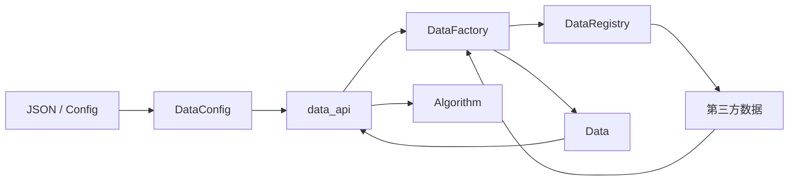
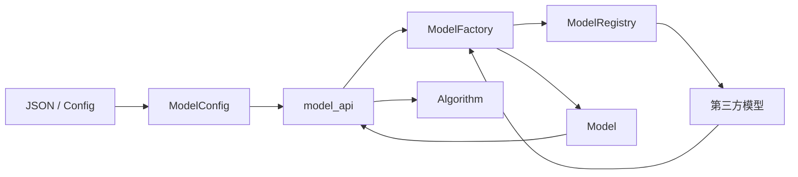
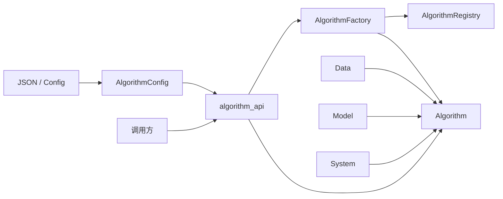
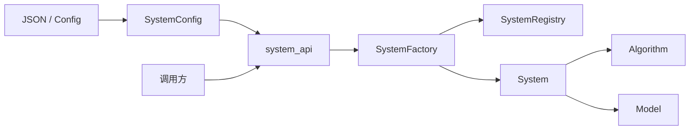
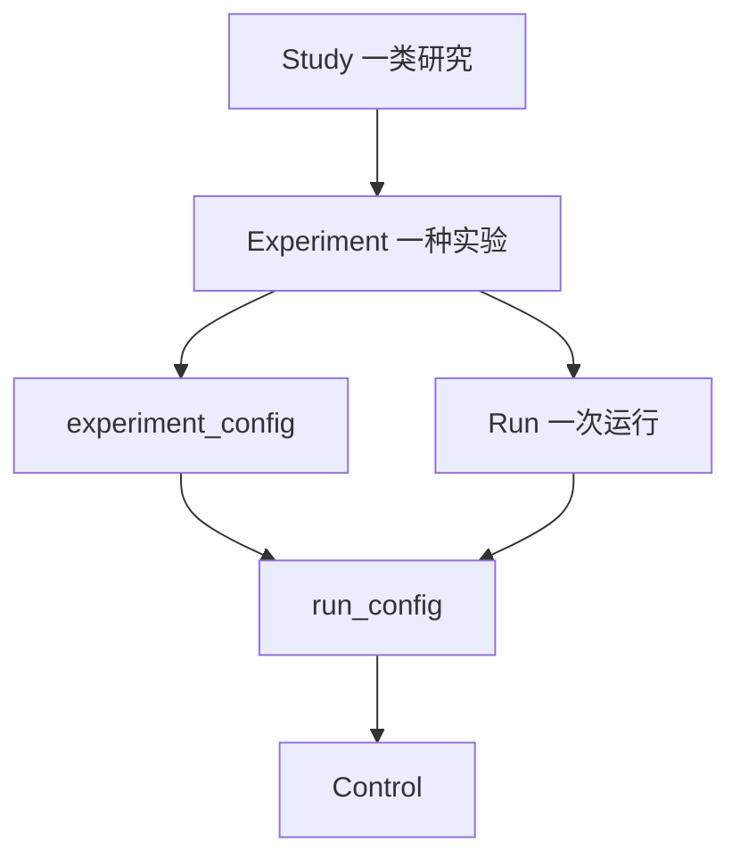
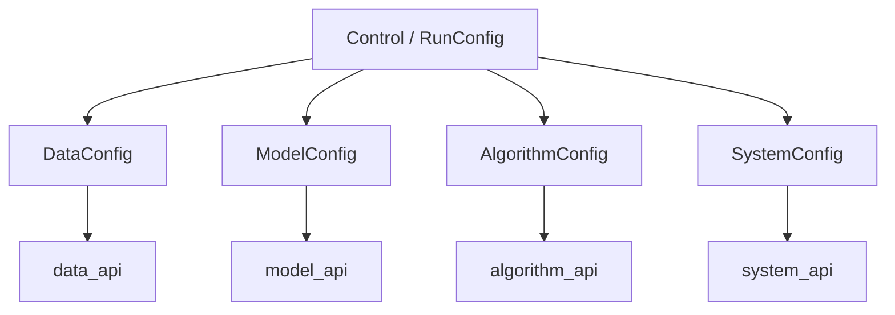

# Code structure · Structure

前置：[CONCEPT.md](../CONCEPT.md) §4、[LAYOUT.md](../LAYOUT.md) §5、[CODE_STRUCTURE.md](../CODE_STRUCTURE.md)。  
并列分册：[flow.md](flow.md)、[artifact.md](artifact.md)。

本文按层推进：**模块 → 类 → 叶文件**。当前 **data**、**model**、**algorithm**、**system**、**control** 已定到类（control 见 §8）。

**层间只经** `structure/api/` **交流。** 各层实现不互相直接 import；跨层与外部调用方只依赖对应 `*_api`。**不设** `control_api`：Control 留在 `control/`。

运行时类（`Data`、`Model`、`Algorithm`、`System`）与配置 dataclass 分开：前者供 prepare/execute 消费；后者为 **`DataConfig` / `ModelConfig` / `AlgorithmConfig` / `SystemConfig`**，专责从 JSON / Artifact Config 加载声明字段。

**Config 字段约定：** 各 `*Config` **只规定必须字段**。其余键为可选扩展，由对应 `source` / 注册项解释。

各层统一还有两类约定（字段名可微调，语义固定）：

| 约定 | 落在哪 | 说明 |
|------|--------|------|
| **内容配置** `config` | 每一层 `*Config` | 可装入从 `path` 读出的超参/子配置，也可由 Control / 实验侧**覆写**；合并与优先级做到更下游细节时再定 |
| **向上兼容** | Model → Data；Algorithm → Model；System → Algorithm | **下一层声明对上一层的兼容**；Data 无更上一层，不设此项 |

`path` 仍是资源/超参文件根；读出来的内容应能进入本层 `config`，并允许被覆写。

---

## 1. 柱职责与原则

### 1.1 本柱做什么

- 承载 **Control** 与 data / model / algorithm / system
- 在 `api/` 暴露各层对外接口（`data_api`、`model_api`、…）
- 由 Config mapping 构造 Control，并由 Control 导出 Config mapping
- 在 prepare 经各层 api 落地可消费实例；在 execute 期经 api 使用它们
- 在 Control 侧声明并执行 Config / Result **契约校验**
- 经 Asset 路径读写缓存、权重、checkpoint、样本、日志
- 经 api 产出可 JSON 化的观测（loss、metric、路径等），供后续写入 Result

### 1.2 能力 vs 取值（对齐 CONCEPT §4）

| 概念 | 谁声明 | 落在哪 |
|------|--------|--------|
| **能力** | Experiment + 各层 Registry（经 api 可查询） | 注册名解析到第三方实现 |
| **取值** | Study / grid 展开写入 | Artifact Config → prepare → `Control` |
| **层间调用** | Structure 柱内 / 外部调用方 | 四层经 `structure.api.*`；Control 经 `control/` |

### 1.3 柱内依赖方向

```
api/                 → data_api / model_api / system_api / algorithm_api
control/             → Control 与编解码/契约；无 control_api
data/                → Data / DataRegistry / DataFactory / DataConfig
model/               → Model / ModelRegistry / ModelFactory / ModelConfig
system/              → System / SystemRegistry / SystemFactory / SystemConfig
algorithm/           → Algorithm / AlgorithmRegistry / AlgorithmFactory / AlgorithmConfig
```

- 四层跨层只走对应 `*_api`
- 层实现目录之间不直连
- 第三方建构在各层实现内完成；经 Factory 得到运行时对象再经 api 交出
- algorithm 经 `data_api` / `model_api` / `system_api` 使用 `Data` / `Model` / `System`；产出观测供后续写入 Result

### 1.4 分册推进状态

| 区域 | 状态 |
|------|------|
| **api** | 门面已定 |
| **data** | `Data` + `DataRegistry` + `DataFactory` + `DataConfig` |
| **model** | `Model` + `ModelRegistry` + `ModelFactory` + `ModelConfig` |
| **algorithm** | `Algorithm` + `AlgorithmRegistry` + `AlgorithmFactory` + `AlgorithmConfig` |
| **system** | `System` + `SystemRegistry` + `SystemFactory` + `SystemConfig` |
| control | `ExperimentConfig` + `RunConfig` + `Control` + 四层 `*Config` + 合并/编解码/契约（§8） |

---

## 2. 目录骨架（仅到层 / api）

```
structure/
  api/
  control/
  data/
  model/
  algorithm/
  system/
```

---

## 3. `structure/api/`（门面）

| 单元 | 职责 |
|------|------|
| `data_api` | 暴露 `Data`、`DataFactory.build`、`DataConfig` |
| `model_api` | 暴露 `Model`、`ModelFactory.build`、`ModelConfig` |
| `system_api` | 暴露 `System`、`SystemFactory.build`、`SystemConfig` |
| `algorithm_api` | 暴露 `Algorithm`、`AlgorithmFactory.build`、`AlgorithmConfig` |

---

## 4. `structure/data/`（实现 + 类）

把研究所需输入组织为可消费数据流（CONCEPT §4.1）。数据集本体由第三方提供；本层负责注册、建构与对外可消费的 **`Data`**。声明字段由 **`DataConfig`** 从 JSON / Config 加载。

### 4.1 本层自有类型

| 类型 | 职责 |
|------|------|
| **`Data`** | 对上提供统一的数据消费能力（划分、batch 迭代、元信息等）；持有并使用第三方已建构的数据对象 / loader |
| **`DataRegistry`** | name + source → 如何向第三方建构数据；`register` / `get` / `list` |
| **`DataFactory`** | 读 `DataConfig` + `assets_dir` → 经 registry 建构 → 得到 **`Data`** |
| **`DataConfig`** | dataclass；从 JSON / Artifact Config / Control.data 加载声明字段 |

对外：`DataFactory.build(data_config, assets_dir) → Data`。

### 4.2 `Data` 职责要点

- 按 split 提供可迭代 batch（供 algorithm）
- 暴露来源、划分规模等只读元信息
- 需要时取出底层第三方对象（调试 / 进阶）
- 不承载「配置字段表」本身（那是 `DataConfig`）

### 4.3 下游来源（至少）

| 来源 | 复用什么 |
|------|----------|
| PyTorch Dataset | `torch.utils.data.Dataset`、`DataLoader`；transform 可用 torchvision 等 |
| Hugging Face | `datasets.Dataset` / `DatasetDict` 及加载、格式化 API |
| ModelScope | ModelScope 数据集加载 API |

其它来源经 Registry 注册即可。

### 4.4 `DataConfig`

dataclass，从 JSON / Artifact Config 加载（经 Control 可覆写）。**必须字段：**

| 字段 | 说明 |
|------|------|
| `name` | Registry 查找用的数据集标识 |
| `source` | 下游来源（如 `torch` / `hf` / `modelscope`） |
| `path` | 数据相关路径（资源或该侧超参/清单所在位置） |
| `config` | **内容配置**：可装入 `path` 内读出的配置，或由上层覆写；合并规则下游再定 |

Data 是兼容链最上游，**不设**对更上层的兼容字段。`batch_size`、`split`、`transforms` 等不进必须表；优先进 `path` / `config`。

### 4.5 Registry / Factory

| 类 | 能力 |
|----|------|
| `DataRegistry` | `register` / `get` / `list` |
| `DataFactory` | `build(data_config: DataConfig, assets_dir) → Data` |

### 4.6 协作



### 4.7 Asset / 测试

| 操作 | 谁 | 路径意图 |
|------|-----|----------|
| 数据缓存 | `DataFactory` | `assets/cache/…` |

测试：`tests/rpipe/structure/data/`（`DataConfig` 往返、Registry、Factory→`Data`）；`tests/rpipe/structure/api/`（`data_api`）。

---

## 5. `structure/model/`（实现 + 类）

构建可调用模型能力（CONCEPT §4.2）。网络本体由第三方提供；本层负责注册、建构与对外可消费的 **`Model`**。声明字段由 **`ModelConfig`** 从 JSON / Config 加载。

### 5.1 本层自有类型

| 类型 | 职责 |
|------|------|
| **`Model`** | 对上提供 forward、模式切换、参数与权重协作等；持有并使用第三方已建构的模型 / 推理句柄 |
| **`ModelRegistry`** | name + source → 如何向第三方建构模型 |
| **`ModelFactory`** | 读 `ModelConfig` + `assets_dir` → 建构/加载 → 得到 **`Model`** |
| **`ModelConfig`** | dataclass；从 JSON / Config / Control.model 加载声明字段 |

对外：`ModelFactory.build(model_config, assets_dir) → Model`。

### 5.2 `Model` 职责要点

- 前向调用；train / eval 模式
- 可训练参数（供优化器）
- 权重加载 / 导出（与 Asset、checkpoint 协作）
- 需要时取出底层第三方对象
- 设备等精细放置经 `system_api` 的 `System` 协作
- 不承载配置字段表本身（那是 `ModelConfig`）

### 5.3 下游来源（至少）

| 来源 | 复用什么 |
|------|----------|
| Custom PyTorch | 用户/实验侧 `torch.nn.Module`，经 Registry 注册 |
| `torchvision.models` | torchvision 预置结构与权重接口 |
| `timm` | timm 模型创建与权重接口 |
| **Diffusers** | Hugging Face `diffusers` 管线 / 模型 |
| **DiffSynth** | DiffSynth 等扩散合成相关加载与推理 API |
| llama.cpp | llama.cpp / Python 绑定 |
| Hugging Face Transformers | `transformers`；PEFT 用官方包装 |
| ModelScope | ModelScope 模型加载 API |

均可经同一 Registry 注册；Factory 产出统一的 `Model`。来源列表可随接入继续加，不改本层类型结构。

### 5.4 `ModelConfig`

dataclass，从 JSON / Artifact Config 加载（经 Control 可覆写）。**必须字段：**

| 字段 | 说明 |
|------|------|
| `name` | Registry 查找用的模型标识 |
| `source` | 下游来源（如 `custom_torch` / `torchvision` / `timm` / `hf` / …） |
| `path` | 模型资源根路径：其下可含权重、模型超参配置及其它 source 约定文件；**不**假定只有 weights |
| `config` | **内容配置**：可装入 `path` 内读出的配置，或由上层覆写；合并规则下游再定 |
| `compat_data` | **兼容的 Data**（如允许的 `name` / `source` 集合；空表示不限制——形状下游再定） |

结构变体、freeze、adapter 等不进必须表；优先进 `path` / `config`。

### 5.5 Registry / Factory

| 类 | 能力 |
|----|------|
| `ModelRegistry` | `register` / `get` / `list` |
| `ModelFactory` | `build(model_config: ModelConfig, assets_dir) → Model` |

### 5.6 协作



### 5.7 Asset / 测试

| 操作 | 谁 | 路径意图 |
|------|-----|----------|
| 读 `path` 资源（权重 / 超参配置等） | `ModelFactory` | `ModelConfig.path` 及 Asset 约定 |
| checkpoint | `Model` / `System` | `assets/checkpoints/…` |

测试：`tests/rpipe/structure/model/`（`ModelConfig` 往返、Registry、Factory→`Model`）；`tests/rpipe/structure/api/`（`model_api`）。

---

## 6. `structure/algorithm/`（实现 + 类）

在任务范式下定义怎么算（CONCEPT §4.3）。本层用 **`mode`** 区分 **train / eval / inference**（一次配置一个 mode；要组合多种 mode 由 Study / 多次运行或 Control 切换）。经 `data_api` / `model_api` / `system_api` 使用已落地的 `Data` / `Model` / `System`。声明字段由 **`AlgorithmConfig`** 加载。

更下层目录（若实现时按 mode 拆分）由本分册后续补，**不在 LAYOUT 展开**。

### 6.1 本层自有类型

| 类型 | 职责 |
|------|------|
| **`Algorithm`** | 按当前 `mode` 执行计算；使用 `Data` / `Model` / `System`；产出观测 / metrics |
| **`AlgorithmRegistry`** | `mode` + `source` → 具体执行能力；`register` / `get` / `list` |
| **`AlgorithmFactory`** | 读 `AlgorithmConfig` → 经 registry 装配 → 得到 **`Algorithm`** |
| **`AlgorithmConfig`** | dataclass；从 JSON / Config / Control 加载 |

对外：`AlgorithmFactory.build(algorithm_config, …) → Algorithm`。  
execute 典型调用：`algorithm.run(data, model, system) → observations`（经 `algorithm_api` 导出）。

### 6.2 `Algorithm` 职责要点

- 按 `mode` 执行 train **或** eval **或** inference（三者行为不同）
- 从 `Data` 取 batch；调用 `Model`；经 `System` 做设备 / IO 协作
- 汇总观测（供后续写入 Result）
- train：更新参数；可触发 checkpoint / 日志
- eval：聚合质量指标
- inference：生成；可写样本 Asset
- 不承载配置字段表本身（那是 `AlgorithmConfig`）；超参主要进 `path` / `config`

### 6.3 `mode`（取代原先的 semantics 列表 / paradigm）

| 取值 | 含义 |
|------|------|
| `train` | 训练 |
| `eval` | 评测 |
| `inference` | 推理 / 生成 |

不设 `paradigm` 必须字段。

### 6.4 下游来源（至少）

循环、优化器、metric、生成管线等**复用生态能力**，经 Registry 按 **mode + source** 挂接：

| 来源 | 典型用于 | 复用什么 |
|------|----------|----------|
| Custom PyTorch | train / eval / inference | 手写 loop、`torch.optim`、手写 metric |
| Accelerate | train（及需其封装的执行） | 在 PyTorch 之上的分布式 / 混合精度等编排；底层仍是 PyTorch |
| Diffusers | train / inference（扩散） | diffusers 训练与 pipeline 推理 |
| DiffSynth | train / inference（扩散合成） | DiffSynth 相关 API |
| TorchMetrics / HF Evaluate | eval | 现成 metric 与聚合 |
| lm-eval 等 harness | eval | 标准评测任务集 |
| Transformers generate | inference | `generate` 等解码 API |
| **vLLM** | inference | 高吞吐 LLM 推理 |
| **SGLang** | inference | 结构化生成 / LLM 推理运行时 |
| llama.cpp | inference | 本地 LLM 推理（亦可与 system 侧句柄协作） |

其它来源按同样方式注册；不在本层另造完整训练框架。Accelerate 属**算法层**编排，不放入 system 下游。

### 6.5 `AlgorithmConfig`

dataclass，从 JSON / Artifact Config 加载（经 Control 可覆写）。**必须字段：**

| 字段 | 说明 |
|------|------|
| `mode` | `train` / `eval` / `inference`（一次一个；默认必须有） |
| `source` | 执行实现来源（如 `custom_torch` / `accelerate` / `diffusers` / `vllm` / `sglang` / …） |
| `path` | 算法超参等资源路径 |
| `config` | **内容配置**：可装入 `path` 内读出的配置，或由上层覆写；合并规则下游再定 |
| `compat_model` | **兼容的 Model**（如允许的 `name` / `source` 集合；空表示不限制——形状下游再定） |

不设对 Data 的兼容字段（兼容链是 Algorithm → Model，再由 Model → Data）。lr、步数、解码参数等不进必须表；优先进 `path` / `config`。

### 6.6 Registry / Factory

| 类 | 能力 |
|----|------|
| `AlgorithmRegistry` | 按 `mode` + `source` `register` / `get` / `list` |
| `AlgorithmFactory` | `build(algorithm_config: AlgorithmConfig, …) → Algorithm` |

### 6.7 协作



### 6.8 Asset / 测试

| 操作 | 谁 | 路径意图 |
|------|-----|----------|
| checkpoint / 日志 | `Algorithm` + `System`（train） | `assets/checkpoints/`、`assets/logs/` |
| 生成样本 | `Algorithm`（inference） | `assets/samples/` |

测试：`tests/rpipe/structure/algorithm/`（`AlgorithmConfig`、Registry、Factory→`Algorithm`、单 mode run）；`tests/rpipe/structure/api/`（`algorithm_api`）。跨 `Data`+`Model`+`System`+`Algorithm` 的路径标 integration，落在调用起点。

---

## 7. `structure/system/`（实现 + 类）

管理计算在硬件上的执行（CONCEPT §4.4）：设备、精度、并行、内存与 IO、恢复等。prepare 确认设备与输出位置、可读 resume Asset；execute 落实执行策略并与 checkpoint / 日志等 Asset 协作。声明字段由 **`SystemConfig`** 从 JSON / Config 加载。

### 7.1 本层自有类型

| 类型 | 职责 |
|------|------|
| **`System`** | 对上提供设备放置、精度上下文、并行策略、输出路径、checkpoint / resume 等执行环境能力 |
| **`SystemRegistry`** | source（及能力名）→ 如何建构执行环境；`register` / `get` / `list` |
| **`SystemFactory`** | 读 `SystemConfig` + `assets_dir` → 经 registry 建构 → 得到 **`System`** |
| **`SystemConfig`** | dataclass；从 JSON / Config / Control.system 加载声明字段 |

对外：`SystemFactory.build(system_config, assets_dir) → System`（经 `system_api`）。

### 7.2 `System` 职责要点

- 解析并暴露当前 device；放置 module / batch
- 精度策略（fp32 / fp16 / bf16 / mixed）与 autocast 类上下文
- 并行策略（单卡 / DDP 等）钩子
- 输出路径约定（checkpoints、logs）与写节奏相关能力
- resume：从 Asset 恢复运行态
- 可选 profile / 调试钩子
- 不承载配置字段表本身（那是 `SystemConfig`）

### 7.3 下游来源（至少）

执行环境与推理运行时；与 PyTorch 生态共轭、按需接入。**Accelerate 不在本层**（见 algorithm §6.4）。

| 来源 | 复用什么 |
|------|----------|
| Native PyTorch | `torch.device`、`.to(device)`、autocast / GradScaler、单进程 IO；分布式原语若直用也归在此，不单列 `torch.distributed` |
| CUDA / MPS / CPU | 设备枚举与可用性探测 |
| **llama.cpp** | 本地推理引擎句柄与设备/内存相关设定 |
| **vLLM** | 推理服务 / 引擎侧的设备与批处理运行时 |
| **SGLang** | 推理运行时与设备相关能力 |

其它集群启动器等经 Registry 注册即可。

### 7.4 `SystemConfig`

dataclass，从 JSON / Artifact Config 加载（经 Control 可覆写）。**必须字段：**

| 字段 | 说明 |
|------|------|
| `source` | 执行环境来源（如 `native` / `llama_cpp` / `vllm` / `sglang`） |
| `path` | system 超参等资源路径 |
| `config` | **内容配置**：可装入 `path` 内读出的配置，或由上层覆写；合并规则下游再定 |
| `compat_algorithm` | **兼容的 Algorithm**（如允许的 `mode` / `source` 集合；空表示不限制——形状下游再定） |

`device` **不是**必须字段；需要时进 `path` / `config` 或作扩展键。

### 7.5 Registry / Factory

| 类 | 能力 |
|----|------|
| `SystemRegistry` | `register` / `get` / `list` |
| `SystemFactory` | `build(system_config: SystemConfig, assets_dir) → System` |

### 7.6 协作



prepare 顺序建议：先 `SystemFactory.build`，再 data / model（设备与输出根就绪后再放置模型）。

### 7.7 Asset / 测试

| 操作 | 谁 | 路径意图 |
|------|-----|----------|
| resume 读 | `SystemFactory` / `System` | `assets/checkpoints/…` 等 |
| checkpoint / 日志写 | `System`（受 algorithm 触发） | `assets/checkpoints/`、`assets/logs/` |

测试：`tests/rpipe/structure/system/`（`SystemConfig`、Registry、Factory→`System`、device 解析）；`tests/rpipe/structure/api/`（`system_api`）。多设备 / 外网推理运行时标 `external` 或 `slow`。

---

## 8. `structure/control/`（实验侧控制器）

编排层级（与 CONCEPT 对齐，并补上 **Run**）：

| 层级 | 含义 |
|------|------|
| **Study** | 一类 / 一轮研究（编排多种 Experiment、多次 Run） |
| **Experiment** | 一种实验类型（一套 Structure + Flow 实现） |
| **Run** | 该 Experiment 下的一次具体运行；**`slug` = 这次 Run 的名字**（亦作 `artifact/<slug>/` 目录名） |

配置也分两级：**`experiment_config` 更底层（基底）**；**`run_config` 套在其上**（本 Run 的已决 / 补丁合并结果）。

**Control** 是 Structure 内对象：内容即本 Run 已决的 **`RunConfig`**（四层 + `seed` + `slug` 等）。**不设 `control_api`**。  
库内不设顶层 `defaults/`；`experiment_config` 文件放在各 Experiment 侧。

### 8.1 本层类型

| 类型 / 单元 | 职责 |
|-------------|------|
| **`DataConfig` / `ModelConfig` / `AlgorithmConfig` / `SystemConfig`** | 各层 dataclass（§4–§7） |
| **`ExperimentConfig`** | dataclass；Experiment 级基底（`experiment_config` 的类型化） |
| **`RunConfig`** | dataclass；Run 级配置：四层 + `seed` + **`slug`（run 名）** 等；由 `experiment_config` 与 Run 侧补丁合并得到 |
| **`Control`** | 持有已决 `RunConfig`（或与之同构）；prepare / 契约 / 导出四层的入口 |
| **编解码 / 合并** | JSON/YAML ↔ `ExperimentConfig` / `RunConfig`；deep-merge |
| **契约** | 必须字段、`mode`、兼容链 |

### 8.2 Study / Experiment / Run 与两级 Config



| 形态 | 落盘 / 位置 | 说明 |
|------|-------------|------|
| **`experiment_config`** | Experiment 目录内（如 `experiment_config.json`；文件名可约定） | 该实验类型的**基底**默认；类型 → `ExperimentConfig` |
| **`run_config`** | `artifact/<slug>/`（如 `config.yaml`） | **套在** `experiment_config` 之上的本 Run 完整配置；类型 → `RunConfig`；含四层 + `seed` + `slug` |
| **`Control`** | 内存对象 | 由已决 `run_config` 构造；供 prepare 落地四层 |

**合并原则：**

1. 读 `experiment_config` → `ExperimentConfig`。
2. grid / Study 为每次 Run 提供补丁（至少常改 `slug`、`seed`、部分层字段）。
3. `merge(experiment_config, patch) → RunConfig`（补丁覆盖同名键；`run_config` **套在**基底上）。
4. 落盘的是**完整** `run_config`（不写 diff）；目录用 **`slug`（run 名）**。
5. prepare：只读该 Run 的 `run_config` → `Control`（一般不再回读 `experiment_config`）。

### 8.3 `RunConfig` 字段（亦为 Control 所持）

| 字段 | 说明 |
|------|------|
| `slug` | **Run 的名字**；同时对应 `artifact/<slug>/` |
| `seed` | 本 Run 的 seed（与其它变量同质，放在 run 级） |
| `experiment` | 所属 Experiment 标识（如 `mnist_linear`），可选但建议有 |
| `data` / `model` / `algorithm` / `system` | 四层 `*Config` |

**`ExperimentConfig`** 与 `RunConfig` 在四层上同构，便于合并；基底里通常**没有**（或不强调）本次 `slug` / `seed`，由各 Run 补上。

示例（已决 `run_config` / Artifact Config）：

```yaml
slug: seed_0
seed: 0
experiment: mnist_linear
data:
  name: ...
  source: ...
  path: ...
  config: { ... }
model:
  name: ...
  source: ...
  path: ...
  config: { ... }
  compat_data: ...
algorithm:
  mode: train
  source: ...
  path: ...
  config: { ... }
  compat_model: ...
system:
  source: ...
  path: ...
  config: { ... }
  compat_algorithm: ...
```

| API（名可微调） | 行为 |
|----------------|------|
| `experiment_config_from_json(path) → ExperimentConfig` | 读 Experiment 基底 |
| `run_config_from_merge(exp, patch) → RunConfig` | 基底 ⊕ 补丁 |
| `control_from_run_config(run) → Control` | 供 prepare |
| `run_config_to_mapping` / `control_to_config` | 落盘完整 run_config |
| `control_from_config(mapping) → Control` | prepare 读回 |

- Flow 不修改已落盘的 `run_config`。
- 各层 `path` 不在编解码时自动展开；装入层内 `config` 由 Factory / prepare 下游再定。

### 8.4 契约校验

对已决 `RunConfig` / `Control`：必须字段、`algorithm.mode`、兼容链（`compat_*` 空则跳过）。不校验第三方能否加载。

### 8.5 与四层关系



prepare：`control_from_config` →（可选契约）→ 各 `*_api` Factory.build（建议先 system，再 data / model，再 algorithm）。

### 8.6 测试意图

`tests/rpipe/structure/control/`：`ExperimentConfig` / `RunConfig` / `Control` 往返；`experiment_config` ⊕ 补丁 → `run_config`；`slug` 为 run 名；契约校验。Experiment 文件与 grid 集成见 `tests/examples/`。

---

## 9. 与 Artifact 的触点（摘要）

| 触点 | Structure 侧 | 对端 |
|------|-------------|------|
| Config | 已决 `run_config`（四层 + `seed` + `slug`）；由 `experiment_config` 套出来 | `artifact.config` |
| Asset | data 缓存；model `path` 资源；system/algorithm checkpoint、logs、samples | `artifact.asset` |
| 观测 | algorithm 等产出的 metrics / observations | 后续写入 `artifact` Result |

---

## 10. 演进

1. 编排：Study → Experiment → Run；**`slug` = run 名**。
2. 配置：`experiment_config`（基底）←套上— `run_config`（四层 + `seed` + `slug`）→ `Control`；Artifact 落盘完整 `run_config`。
3. `path` ↔ 层内 `config` 合并优先级下游再定。
4. 代码与 examples 从旧 `BaseConfig`/`slug` 混用对齐到 `ExperimentConfig` / `RunConfig`。
5. 随后可对齐 flow 分册 prepare 调用面；CONCEPT 词表可补 **Run**。
