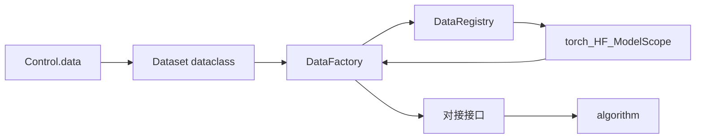

# Code structure · Structure

前置：[CONCEPT.md](../CONCEPT.md) §4、[LAYOUT.md](../LAYOUT.md) §5、[CODE_STRUCTURE.md](../CODE_STRUCTURE.md)。  
并列分册：[flow.md](flow.md)、[artifact.md](artifact.md)。

本文按层推进：**模块 → 类 → 叶文件**。当前 **data** 已定到**类**；control / model / algorithm / system 待定。第三方适配落在各层 backends（或等价子模块）内。

---

## 1. 柱职责与原则

### 1.1 本柱做什么

- 承载 **Control** 与 data / model / algorithm / system
- 由 Config mapping 构造 Control，并由 Control 导出 Config mapping
- 在 prepare 落地各层句柄；在 execute 期由 algorithm 使用句柄
- 在 Control 侧声明并执行 Config / Result **契约校验**
- 经 Asset 路径读写缓存、权重、checkpoint、样本、日志
- 将可 JSON 化的观测写入 `state`，供 Flow 后续阶段写入 Result

### 1.2 能力 vs 取值（对齐 CONCEPT §4）

| 概念 | 谁声明 | 落在哪 |
|------|--------|--------|
| **能力**（能接什么数据、模型、哪些语义） | Experiment 代码 + 本层 registry / backends | `structure/*` 已注册的 name |
| **取值**（这次跑什么） | Study / grid 展开写入 | Artifact `config.yaml` → prepare → `Control` |

同一套 Experiment 代码服务多次运行；各次差异体现在 Config / Control 取值上。

### 1.3 柱内依赖方向

```
control          → 可被 data / model / system / algorithm 与 flow 使用
data             → 使用 control.fields；可使用 artifact.asset 路径约定
model            → 使用 control.fields；可使用 artifact.asset 路径约定；经 SystemHandle 放置
system           → 使用 control.fields；可使用 artifact.asset 路径约定
algorithm        → 使用 data/model/system 的 *Handle 与 state 键；由 flow.execute 经 dispatch 调用
backends（各层） → 由所在层 registry / prepare / run 引用
```

正向约定：

- Structure 模块只依赖 `structure` 与（路径约定时）`artifact`
- algorithm 把观测写入 `state`；Result 落盘由 Flow 完成
- data / model / system 之间经 Handle 与 `state` 协作
- examples / Experiment 通过 registry 的 **name** 选用能力；backend 由 registry 解析

### 1.4 分册推进状态

| 层 | 状态 |
|----|------|
| **data** | 自有三类 + 一个对接接口已定（本文 §3） |
| control | 待定 |
| model | 待定 |
| algorithm | 待定 |
| system | 待定 |

叶文件在该类清单稳定后再对齐落地，不在未定层预先铺开。

---

## 2. 目录骨架（仅到层）

与 LAYOUT 对齐；子模块名以各层定稿为准。

```
structure/
  control/      # 待定
  data/         # 模块见 §3
  model/        # 待定
  algorithm/    # 待定（语义目录 train / eval / inference 见 CONCEPT）
  system/       # 待定
```

---

## 3. `structure/data/`（类已收束）

把研究所需输入组织为可消费数据流（CONCEPT §4.1）。**数据集本体由第三方提供**；本层只声明取值、注册来源、工厂装配，并用**一个对接接口**兼容至少：

- `torch.utils.data.Dataset`（及 DataLoader）
- Hugging Face `datasets`
- ModelScope dataset

预处理、增强、batch、workers 等**复用**各生态已有能力（如 `torchvision.transforms`、`DataLoader`、HF `map` / `with_format`），本层不另建 Transform / BatchLoader / 自有 Dataset 实现类树。

推进顺序：模块意图 → **自有类（少）** → 叶文件。本节定类；不定 `.py` 路径。

### 3.1 本层自有类（仅此三个）

| 类 | 形态 | 职责 |
|----|------|------|
| **`Dataset`** | dataclass | 一次运行的 data **取值声明**（对应 Control.data / Config）；不是第三方 Dataset 本体 |
| **`DataRegistry`** | 类 | name（及可选 backend）→ 如何向第三方要数据；`register` / `get` / `list` |
| **`DataFactory`** | 类 | 读 `Dataset` + `assets_dir`，经 registry 拉取第三方数据、按需缓存，装配为对接接口实例，供 Flow / algorithm 使用 |

层对外入口：`DataFactory.build(dataset: Dataset, assets_dir) → <对接接口实例>`（Flow prepare 调用；可用薄函数封装，规范主体仍是这三类）。

### 3.2 对接接口（唯一接口，兼容第三方）

本层再定**一个**消费侧接口（Protocol / ABC 即可，名称实现时可定为 `DataHandle` 或 `PreparedData`），algorithm 只依赖它，不依赖具体 torch / HF / ModelScope 类型。

| 能力（例） | 含义 |
|------------|------|
| 按 split 取可迭代 batch | execute 供给 algorithm |
| 暴露底层第三方对象（可选） | 进阶或调试时取出原生 Dataset / DatasetDict |
| 只读元信息 | name、backend、split 规模等 |

各来源用**薄适配**把第三方对象接上该接口（适配逻辑挂在 registry 注册项或 Factory 内），**不**在本层再定义 MNIST/CIFAR 等数据集类。

至少要接上的来源：

| 来源 | 复用什么 |
|------|----------|
| PyTorch | `torch.utils.data.Dataset`、`DataLoader`；transform 用 torchvision 等 |
| Hugging Face | `datasets.Dataset` / `DatasetDict` 及其加载与格式化 API |
| ModelScope | ModelScope 数据集加载 API |

其它来源按同样方式注册进 `DataRegistry` 即可。

### 3.3 各类要点

#### `Dataset`（dataclass）

与 CONCEPT 字段对齐的声明，例如：

| 字段（例） | 含义 |
|------------|------|
| `name` | 注册名 / 第三方数据集标识 |
| `backend` | `torch` / `hf` / `modelscope` 等 |
| `split` / `splits` | 划分与用途 |
| `batch_size`、`num_workers`、`pin_memory` | 交给第三方 Loader 的参数 |
| `transforms` | 声明或配置片段，**交给第三方 transform 管线解释** |
| `cache` | 是否写入 Asset 缓存（由 Factory 解释） |
| 其它 | 版本、子集、HF config 名等按 backend 扩展 |

`Control.data` 即该 dataclass 的 mapping 形态（或与之往返）。

#### `DataRegistry`

| 能力 | 含义 |
|------|------|
| `register(name, …)` | 登记如何构造某第三方数据集（及默认 backend） |
| `get(name)` / `list()` | 查询 |
| 解析 `Dataset.backend` + `name` | 选出对应加载路径 |

注册的是**加载第三方的可调用项**，不是本库 Dataset 子类。

#### `DataFactory`

| 能力 | 含义 |
|------|------|
| `build(dataset: Dataset, assets_dir) → 对接接口实例` | prepare 主路径 |
| 内部分步 | 查 registry → 调第三方 load → 按需 Asset 缓存 → 用第三方 API 挂上 transform / batch → 包装为对接接口 |

Factory **装配与对接**；不实现具体样本存储与通用 transform 框架。

### 3.4 协作



### 3.5 Asset 触点

| 操作 | 阶段 | 谁发起 | 路径意图 |
|------|------|--------|----------|
| 写/读数据缓存 | prepare（及按需 execute） | `DataFactory` | `assets/cache/…`（经 artifact.asset.kinds） |

### 3.6 测试镜像（类级）

镜像根：`tests/rpipe/structure/data/`。覆盖：`Dataset` 字段往返、`DataRegistry` 注册/解析、`DataFactory.build` 对至少一种第三方来源接到对接接口；多后端与外网标 `external`。强制标签见 [TESTING.md](../TESTING.md)。

---

## 4. 其余层（待定）

以下仅占位，**模块表未定**，不定叶文件。

| 层 | CONCEPT | 下一步 |
|----|---------|--------|
| `control/` | 变量指派；Config 编解码与契约 | 模块 → 类 |
| `model/` | 模型句柄、权重、结构 | 模块 → 类 |
| `algorithm/` | train / eval / inference | 模块 → 类 |
| `system/` | 设备、精度、并行、IO、resume | 模块 → 类 |

跨层时序（prepare 先 system 再 data/model；execute 经 algorithm.dispatch）在各层模块定稿后写回本文。

---

## 5. 与 Artifact / Flow 的触点（摘要）

| 触点 | Structure 侧（已定部分） | 对端 |
|------|-------------------------|------|
| Config | Control 取值中的 `data` 字段 | `artifact.config`；grid 写、prepare 读 |
| Asset | `DataFactory` 缓存 | `artifact.asset`（cache 等） |
| Result | （待 control / algorithm 定稿） | flow summarize / index |
| Context.state | `DataFactory.build` → `state["data"]` = 对接接口实例 | `flow.context` |

---

## 6. 演进

1. 下一层：同样少类、能复用第三方则复用；先类后文件。
2. data 叶文件：对齐 `Dataset` / `DataRegistry` / `DataFactory` 与对接接口即可。
3. 字段键更名时同步 `Dataset` dataclass、Control、Experiment grid 与测试。
