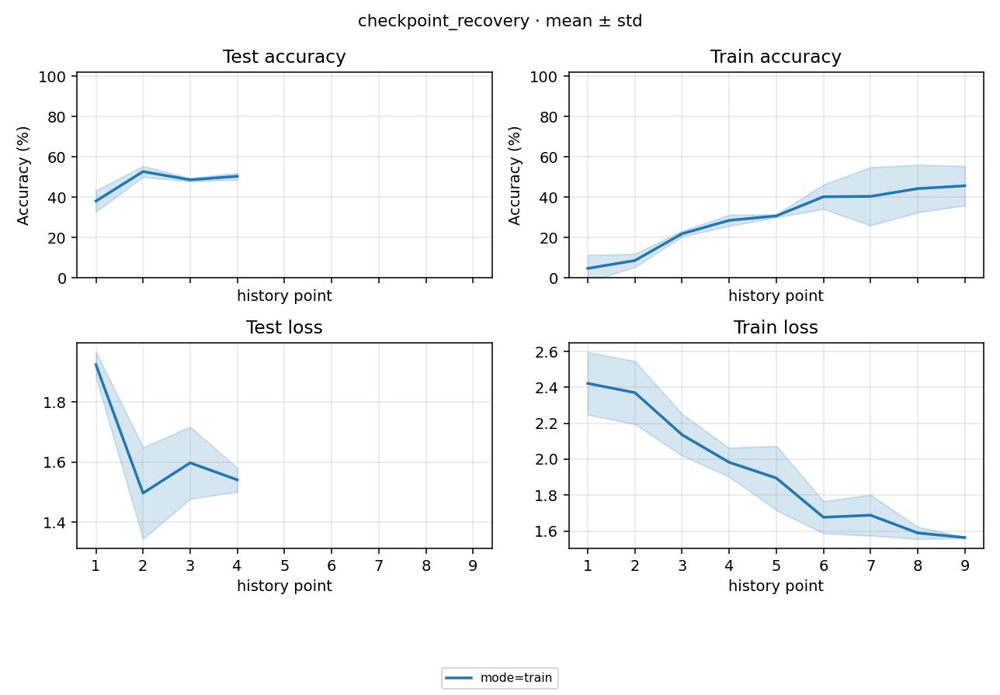

# Checkpoint / 重试恢复验收报告

日期：2026-10-02。对应 [PLAN.md](PLAN.md)，version 为 `recovery-20261002`。

## 1. 结论

本轮通过了小规模真实 CPU 故障恢复验收：3 次模拟 checkpoint 提交失败均保留旧 latest；恢复后的第 3 步学习率正确；失败 train 的 sibling eval 没有提前执行；第二次 launch 只恢复未完成部分，最终 4/4 Run 成功，两个 eval 与各自最终 best 完全对齐。

首轮的退出码 1 和 `complete: false` 是验收要求，不是需要掩盖的失败。最终成功也不是唯一依据：本报告同时核对 bundle 哈希、scheduler 进度、恢复日志、实际子进程事件和评估来源。它验证 B-009–B-012 的恢复契约，不是 MNIST 准确率基准，也不证明中断续训与不中断训练数值等价。

## 2. 实验设置与代码状态

| 项目 | 本轮设置 |
|---|---|
| Experiment / Run | `algorithm.mode=train/eval` 两组 × seed 0/1，共 4 个 Run |
| 数据 | 本地 MNIST 副本，训练前 256 个样本；测试仅前 2 个 batch，共 256 个样本 |
| 模型与训练 | linear；batch 32；6 optimizer steps；SGD、momentum 0.9、lr 0.03、cosine |
| 评测与 checkpoint | 每 2 step 评测并保存 latest；按最低 test Loss 保存 best |
| 环境 | Windows 11，Python 3.13.9，CPU；每个 worker 1 个计算线程；deterministic=true |
| 代码状态 | 基线提交 `359713704ea06f26409fa059705142d5b1389688` 加本轮未提交修复；不是该提交原样运行 |
| 资源范围 | 不使用 GPU，不联网，不扩展模型或实验网格 |

声明见 [study.yaml](../study.yaml) 与 [experiment_config.yaml](../experiment_config.yaml)。数据由已有 Study 的缓存复制，逐文件哈希相同，见 [缓存校验](../../../.tmp/checkpoint-recovery-20261002/cache-copy.json)。

生产代码没有新增故障开关。临时 [验收 harness](../../../.tmp/checkpoint-recovery-20261002/acceptance.py) 仍调用真实 CLI 的 `launch → run-one → train/eval → process`，只在 worker 内拦截 latest step 4 的最终 bundle 替换。seed 0 注入一次；seed 1 首轮每次到该保存点均注入，耗尽一次自动重试；第二轮关闭注入。

## 3. 怎么跑的与时间

排班沿用计划：两个 train 并行，同波失败任务串行重试；该波结束后，只有父 train 成功的 eval 才能执行。第二次 launch 复用原 version、Run ID 与 jobs，只继续 seed 1 的 train/eval，不清理旧权重或重跑 seed 0。

| 阶段 | 预估墙钟 | 实际墙钟 | 退出码 | 结束状态 |
|---|---:|---:|---:|---|
| 首轮：含故障与一次自动重试 | 35 s | 13.992 s | 1 | 2 succeeded / 2 failed；`complete=false` |
| 第二轮：关闭故障，恢复未完成部分 | 15 s | 7.083 s | 0 | 新执行 2 个任务；最终 4 succeeded / 0 failed，`complete=true` |
| 两轮合计 | 50 s | 21.075 s | — | 验收完成 |

墙钟由 harness 在 CLI `launch` 调用前后测量，包含调度、子进程与最终聚合，不含数据复制、make、阅读证据和测试套件。首次预算较保守；这里只记录成本，不作性能判定。原始状态见 [首轮快照](../../../.tmp/checkpoint-recovery-20261002/first.json)、[第二轮快照](../../../.tmp/checkpoint-recovery-20261002/second.json)。

### Run 明细

下表 `est` 是 PLAN 的单次预估，包含进程启动；`actual` 是事件流中 worker `start → exit`，包含实际 prepare/run-one，但不含事件 start 之前的解释器/CLI 导入。因此不能拿单条 actual 相加代替整轮墙钟，也不能将其与纯算法 `elapsed_seconds` 混用。F/S 分别表示该次执行失败/成功；重试不产生新的 Run。

| mode | seed | Run / 日志 | est / 次 | actual / 次 | 两轮执行情况 |
|---|---:|---|---:|---|---|
| train | 0 | [`41e0510c18eecdb7`](../runs/41e0510c18eecdb7/assets/logs/run.log) | 10 s | 1.532 s F → 1.409 s S | 首轮自动恢复成功，第二轮跳过 |
| train | 1 | [`71adf4bdc64aba7a`](../runs/71adf4bdc64aba7a/assets/logs/run.log) | 10 s | 1.531 s F → 1.363 s F → 1.381 s S | 首轮耗尽重试，第二轮恢复成功 |
| eval | 0 | [`d3efc98cdf282c41`](../runs/d3efc98cdf282c41/assets/logs/run.log) | 5 s | 1.419 s S | 首轮 train 成功后执行，第二轮跳过 |
| eval | 1 | [`2a951eb86bb6f824`](../runs/2a951eb86bb6f824/assets/logs/run.log) | 5 s | 1.318 s S | 首轮被阻断且未启动，第二轮才执行 |

首轮 seed 1 eval 的 `result.status=failed`，错误为 `blocked: sibling train 71adf4bdc64aba7a did not succeed`。它是调度器记录的阻断，不是一个已经启动并失败的 eval 进程。两轮正式验收共实际启动 7 次 worker：5 次 train、2 次 eval；其中 3 次 train 被故意注入失败。

正式验收之前，最初 harness 在导入 CLI 前调用 `torch.set_num_threads(1)`，触发 `OMP: Error #15`，子进程 exit 3，未进入训练。调整为正常 CLI 导入顺序后本轮执行完成；没有设置 `KMP_DUPLICATE_LIB_OK`。该启动问题单独保留 [process 快照](../../../.tmp/checkpoint-recovery-20261002/environment-failure-process.json)，不计入上述 3 次 checkpoint 注入、7 次 worker 或两轮墙钟，也不据此宣称 OpenMP 环境问题已根治。

## 4. 故障恢复与结果一致性

### 4.1 保存失败仍有旧快照

每次 latest step 4 提交失败时，harness 都验证：失败前后 `latest.pt` 字节哈希相同；按 stem 和目录加载都得到旧 step 2；scheduler `last_epoch=2`；optimizer 中下一次更新的 lr 为 `0.022500000000000003`；`.latest.incomplete` 标记存在。

| seed | 注入次数 | 旧 latest SHA-256 | 恢复进度 |
|---|---:|---|---|
| 0 | 1 | `9a1368cdb91b804d853ed1c4f2d909f50795c813fec55c3da8564b538e8ca3db` | step 2，scheduler 2 |
| 1 | 2 | `6b92fe9b7a81aba9f10675696aece6a80883ca830ed1ebdf15cf843cb7e2a119` | 两次均为 step 2，scheduler 2 |

证据见 [seed 0 事件](../../../.tmp/checkpoint-recovery-20261002/41e0510c18eecdb7.events.jsonl)、[seed 1 事件](../../../.tmp/checkpoint-recovery-20261002/71adf4bdc64aba7a.events.jsonl)。恢复日志全部从 step 2 开始；seed 0 两条、seed 1 三条 step 3 训练记录均使用 lr 0.0225，没有重复使用 step 2 的学习率。

### 4.2 eval 确实来自最终 best

| seed | 最终 best / latest step | best 与 eval Accuracy (%) | best Loss 与 eval Loss | train 成功 → eval 启动（+08:00） |
|---|---:|---:|---:|---|
| 0 | 6 / 6 | 51.562500 | 1.5688656568527222 | 22:45:13.959514 → 22:45:18.284618 |
| 1 | 6 / 6 | 55.078125 | 1.308122158050537 | 22:45:47.157602 → 22:45:48.705546 |

两个 eval 各启动一次，均晚于各自 train 最终成功；日志中的 resume path 指向相应 train 的 `best.pt`，step 为 6。best / latest 的 scheduler 进度也均为 6。原始数值逐对相同，校验允许的浮点容差为 `1e-5`，见 [配对核验](../../../.tmp/checkpoint-recovery-20261002/verified.json) 与 [NUMBERS.md](NUMBERS.md)。

训练 checkpoint 的 best 口径均为 `best_metric=Loss`、`best_value=<Loss>`，没有 `best_accuracy` 字段。NUMBERS 中独立 eval 的 `best_accuracy` 是实际准确率，并未填入 Loss；不能把两者误认为同一种元数据错误。

按 Experiment 汇总，train 与 eval 的 test Accuracy 均为 **53.3203 ± 2.4859%**，Loss 均为 **1.4385 ± 0.1844**（n=2，样本标准差，不是置信区间）。这里用来证明两组输出对齐，不据此比较模型质量或泛化能力。

### 4.3 诊断图

图由当前 [process.json](../process.json) 生成，并已目检。横轴是 **observation 观测序号，不是 optimizer step**。失败前记录与恢复后记录均保留，存在重放和重复点；两个 seed 的重试次数不同，同一横坐标不能解释为同一训练步。该图只用于诊断记录是否连续保留，不用于得出学习曲线、收敛速度或恢复数值等价的结论。

## 5. 修复范围与测试证据

| 缺陷 | 已验证修复 |
|---|---|
| B-009 | native 在对应 scheduler 更新后保存，checkpoint 的模型/优化器/调度器表示同一已完成进度；日志仍记录刚完成更新实际使用的 lr。定向测试覆盖 step/epoch、中途恢复与 early stop；本轮真实链路验证 step 2 恢复到 step 3 |
| B-010 | 共享 checkpoint 写入语义按 `best_metric` 规范化：非 Accuracy 不保留 `best_accuracy`，通用值使用 `best_value`；恢复及终态也不把 Loss 伪装成准确率 |
| B-011 | 新整包先写临时文件，分件镜像逐件更新，最后原子提交整包；失败保留旧权威 bundle，镜像以 incomplete 标记区分。目录加载优先同名 bundle；历史纯分件/`payload.pt` 目录覆盖前先保全旧 bundle，成功后清理陈旧 `payload.pt` / meta 格式，导出的纯目录不读到旧快照 |
| B-012 | 同波重试在 eval 之前完成；未成功父 train 阻断 sibling eval。重跑 train 时使旧成功 sibling eval 失效；后续 launch 检查父结果状态/修改时间，防止旧成功评估继续冒充当前结果。本轮验证耗尽重试后的阻断及下一次 launch 的恢复 |

回归先验证旧行为会失败，再验证新实现通过；各批次有重叠，不相加作为唯一用例总数：

- 算法进度/指标回归：[旧行为 6 failed](../../../.tmp/test-results/20261002T143454Z_846fa0/report.md) → [定向 12 passed](../../../.tmp/test-results/20261002T143537Z_e56cea/report.md)；[算法范围 68 passed](../../../.tmp/test-results/20261002T143620Z_fa9ee1/report.md)。
- checkpoint IO：在 `.tmp/` 隔离加载旧 factory，[10 failed](../../../.tmp/test-results/20261002T144006Z_be30e5/report.md)；legacy `payload.pt` 补充回归先 [3 failed](../../../.tmp/test-results/20261002T144529Z_f04097/report.md)，最终 checkpoint / train checkpoint / sibling 共 [32 passed](../../../.tmp/test-results/20261002T144531Z_75ee16/report.md)。
- 调度器：[旧实现 7 failed / 3 passed](../../../.tmp/test-results/20261002T144752Z_0be483/report.md) → [修复后同组 10 passed](../../../.tmp/test-results/20261002T144843Z_21aa5f/report.md)。追加空目录回归，防止把空自有/外部目录误认成独立权重而绕过 sibling 阻断：[补修前 6 failed / 6 passed](../../../.tmp/test-results/20261002T145205Z_128e7f/report.md)，最终相关范围 [56 passed](../../../.tmp/test-results/20261002T145242Z_70f512/report.md)，包含生成 Bash 脚本的可执行内容检查。
- 最终 core：**215 passed、17 deselected，12.20 s**，[报告](../../../.tmp/test-results/20261002T145314Z_2e003e/report.md)；最终本地 integration：**14 passed、218 deselected，5.27 s**，[报告](../../../.tmp/test-results/20261002T145432Z_315184/report.md)。未选择的用例不计入通过数。

测试输出与注入脚本都在被忽略的 `.tmp/`；Study 的 runs/shared/scripts 及 index/process 同样是本地产物。上述本地证据链接在未复制运行产物的新 checkout 中可能不存在，报告中的设置、时间、判定和数值仍可独立阅读。

## 6. 未覆盖边界与下一步

1. Windows 原始 `WinError 5` 的环境原因仍未确定。本轮移除了整目录删除后 rename 的发布方式，并验证其他保存失败仍能恢复；不承诺所有文件占用、权限错误或突然断电都不会发生。同一 Run/stem 只支持单 writer，不提供多个 checkpoint stem 的整体事务。
2. sampler 仍会重播 seed 的采样前缀；完整 RNG、迭代位置及 early-stop stall 状态不保证精确恢复。恢复后正确继续进度/LR，不等于与不中断对照得到完全相同的参数或指标。
3. 自动依赖保护针对正常 `launch` 与当前 index 的 sibling train/eval。直接 `run-one`、手动复制/改写权重、回拨文件时间或旧生成的裸执行脚本，不能据此保证 eval 自动失效；仍需检查来源，旧脚本应重新 make。
4. 本轮没有 GPU、长训练、分布式或所有可选外部依赖验收；测试集只取 256 个样本，不能用于发布 MNIST 模型质量结论。也没有修改历史 Study 的旧权重或将旧结果自动标为已修复。

在上述边界内，可靠性门已通过。下一步可用新的 version，沿用现有 MNIST CNN 与 3 个 seed，把训练预算从 60 steps 扩至约 600 steps，观察持续学习与收敛趋势；这是下一轮建议，本轮未执行。
