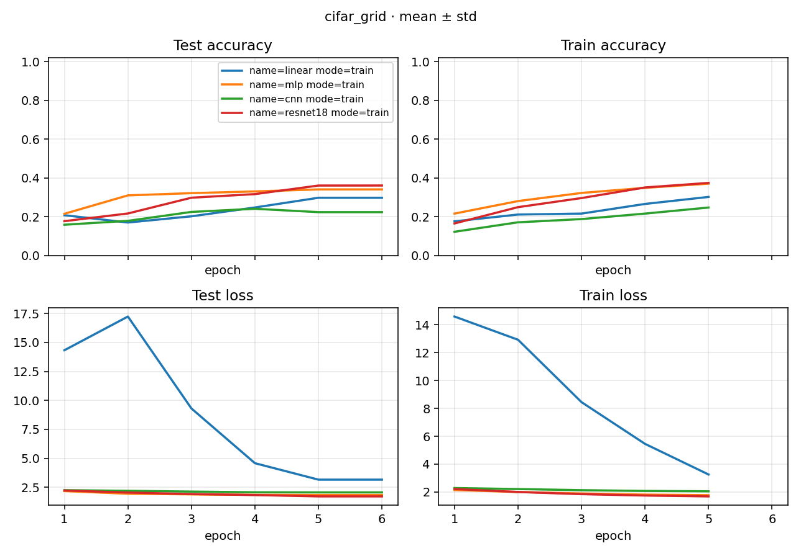

# Study Report: cifar_grid

> Plan: [PLAN.md](PLAN.md)
> Date: 2026-09-26
> Recipe: CIFAR10 + custom_torch；`origin: domestic`；`train_size=1024`；5 epoch；SGD + cosine。axes = `model.name` × `{train, eval}`。seed = 0。
> Location: Study `docs/`。数字读 `../process.json`。日志按 index 的 `log` 链到各 Run 的 `run.log`。

## 1. 怎么跑的（§3）

共享数据用国内源下完后 launch。基底不写 `resume`。

```bash
python -m rpipe make studies/cifar_grid --num-gpus 1 --init-gpu 0
python -m rpipe launch studies/cifar_grid --num-gpus 1 --init-gpu 0 --console shared
python -m rpipe status studies/cifar_grid
```

机器：1× RTX 5090 D v2。make：`pack 8 waits: 1[linear], 1[mlp], 1[cnn], 1[resnet18], 1[linear], 1[mlp], 1[cnn], 1[resnet18] est wall 43s`。launch 实测约 87s。8/8 `succeeded`。train 从 epoch 1 跑到 epoch 5，随后 eval 加载 sibling train 的 `best.pt`。error / resume：mlp eval `f487ffe68a52f01c` 第一次 prepare 报 `operator torchvision::nms does not exist`，launch 自动 retry 后成功。见 [BUGS.md](../../../docs/BUGS.md) B-007。

## 2. Conclusion

最终口径用 **eval**（seed 0，n=1，所以 std 为 0）：

| model | eval accuracy |
|-------|---------------|
| resnet18 | 0.3615 |
| mlp | 0.3415 |
| linear | 0.2984 |
| cnn | 0.2416 |

这 1024 张、5 个 epoch 的小子集上，resnet18 最高，mlp 次之，linear 再次，cnn 最低。cnn 的 eval 对齐的是 train 的 best（0.2416），不是最后一个 epoch 的 test accuracy（0.2243）。linear 和 mlp 的最后一个 epoch 就是 best，eval 与之相同。

## 3. Learning curves

[打开 learning_curves.png](./figures/learning_curves.png)

[](./figures/learning_curves.png)

## 4. Runs

点表格里的 **run.log** 打开该次日志（源码视图用 Ctrl+点击；预览里直接点）。结论仍按 Experiment。

| model | mode | seed | id | accuracy | log |
|-------|------|------|----|----------|-----|
| linear | train | 0 | `28a64726010738fb` | 0.2984 | [run.log](../runs/28a64726010738fb/assets/logs/run.log) |
| linear | eval | 0 | `3ddb5e6cf166f93f` | 0.2984 | [run.log](../runs/3ddb5e6cf166f93f/assets/logs/run.log) |
| mlp | train | 0 | `b86a478be0bec010` | 0.3415 | [run.log](../runs/b86a478be0bec010/assets/logs/run.log) |
| mlp | eval | 0 | `f487ffe68a52f01c` | 0.3415 | [run.log](../runs/f487ffe68a52f01c/assets/logs/run.log) |
| cnn | train | 0 | `d657518c04ceffe1` | 0.2243 | [run.log](../runs/d657518c04ceffe1/assets/logs/run.log) |
| cnn | eval | 0 | `e55d19bc4b3d29c2` | 0.2416 | [run.log](../runs/e55d19bc4b3d29c2/assets/logs/run.log) |
| resnet18 | train | 0 | `7c3f855ce3396781` | 0.3614 | [run.log](../runs/7c3f855ce3396781/assets/logs/run.log) |
| resnet18 | eval | 0 | `0f238fbd83ed13f8` | 0.3615 | [run.log](../runs/0f238fbd83ed13f8/assets/logs/run.log) |

## 5. Reproduce

同上 make / launch。已 succeeded 的默认跳过。
