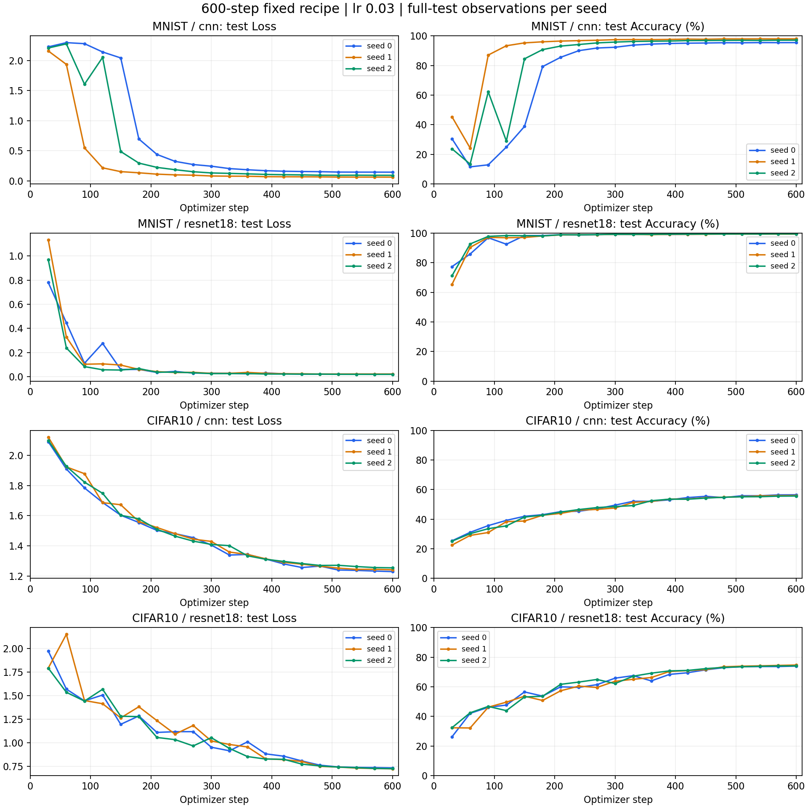
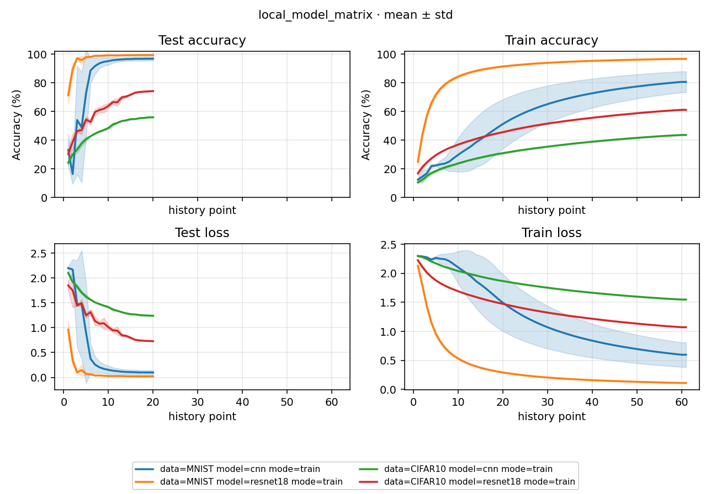

# Study Report: 本地 600-step 多模型矩阵

2026-10-03，配置与排班见 [PLAN](PLAN.md)，自动统计见 [NUMBERS](NUMBERS.md)。所有精度单位为百分制，std 为样本标准差（n−1）。

## 1. 结论

**24/24 succeeded，12 条 train 均到 step 600，12 组独立 eval 与对应 Loss-best 对齐。** 没有 checkpoint 保存错误、训练重试或 checkpoint resume。两条 MNIST ResNet18 首次启动会话在 prepare 后结束，未记录 optimizer 更新或 checkpoint；继续启动后从头训练到 600，详见 §5。该中断仍保留在原日志，不能将整轮称为一次连续 launch。

固定 lr 0.03 / cosine 600 的配方下，MNIST CNN 最终约 96.87%，ResNet18 约 99.38%；CIFAR10 CNN 约 56.01%，ResNet18 约 74.27%。四个条件都学起来，没有最终单类别塌缩。观察到的模型差距适用于本配方、预算和三个 seed，不代表各模型经过同等调优，也不是等算力比较。

## 2. 配方与研究边界

MNIST train 60000 / test 10000，CIFAR10 train 50000 / test 10000。batch 250、test batch 1000；每条 150000 次训练采样，MNIST 约 2.5、CIFAR10 约 3 个数据集规模。沿用各 train stats；MNIST 仅 Normalize，CIFAR10 训练态 flip / crop + Normalize，test 仅 Normalize。CNN 与项目原生 ResNet18 均为现有 custom_torch 实现，ResNet18 是项目的输入通道自适应版本，不是 torchvision 预训练模型。

统一 SGD lr 0.03、momentum 0.9、Nesterov、weight decay 0.0005，无梯度裁剪；cosine T_max=600、eta_min=0。train log=10，完整 test / latest=30，按 test Loss 选 best；deterministic=false、cudnn_benchmark=true，不承诺逐位重现。独立 eval 在同一个 test split 复算 sibling best，验证来源与执行一致性，不是额外未见数据的泛化估计。

version `local-matrix-600step-20261003`，Python 3.13.9、torch 2.11.0+cu128、torchvision 0.26.0+cu128、Kornia 0.8.3、RTX 5090 D v2。HEAD `359713704ea06f26409fa059705142d5b1389688` 加既有未提交修改及 B-013 IO 修复；不能只凭 commit 重建这份工作区。B-013 修复与真实句柄验证见 [补测报告](../../mnist_cnn_budget_repeat/docs/STUDY_REPORT.md)。

本轮不扫 lr，不根据中途精度改变配方；600-step MNIST 候选 lr 不声称对 CIFAR10 / ResNet 最优。较高 test 分数不自动证明收敛，较低分数也不自动构成框架缺陷。旧 60-step 轮的 T_max / 评测频率不同，不作纯预算因果比较。

## 3. Experiment 聚合与 seed 证据

| 数据 | 模型 | n | last Accuracy mean±std (%) | best Accuracy mean±std (%) | last Loss mean±std | best Loss mean±std |
|---|---|---:|---:|---:|---:|---:|
| MNIST | cnn | 3 | 96.8700±1.2933 | 96.8700±1.2933 | 0.099029±0.041736 | 0.099029±0.041736 |
| MNIST | resnet18 | 3 | 99.3833±0.0929 | 99.4033±0.0839 | 0.020789±0.001317 | 0.020611±0.001308 |
| CIFAR10 | cnn | 3 | 56.0100±0.4232 | 56.0100±0.4232 | 1.241719±0.012429 | 1.241719±0.012429 |
| CIFAR10 | resnet18 | 3 | 74.2733±0.3855 | 74.2733±0.3855 | 0.729190±0.005368 | 0.729190±0.005368 |

MNIST ResNet18 的 Loss-best 比 last 略早，seed 0 / 1 / 2 分别在 step 570 / 510 / 570；best Accuracy 均值 99.4033%，last 99.3833%，差距很小。其余三个条件的所有 seed Loss-best 均为 step 600。best 按 Loss 选，不保证 Accuracy 最大。

| 数据 / 模型 | seed | last Accuracy / Loss | best step | best Accuracy / Loss | eval Run / 日志 |
|---|---:|---|---:|---|---|
| MNIST / cnn | 0 | 95.47% / 0.143850 | 600 | 95.47% / 0.143850 | [69290f0c093f4590](../runs/69290f0c093f4590/assets/logs/run.log) |
| MNIST / cnn | 1 | 98.02% / 0.061281 | 600 | 98.02% / 0.061281 | [479dc0ca7a2ef6c9](../runs/479dc0ca7a2ef6c9/assets/logs/run.log) |
| MNIST / cnn | 2 | 97.12% / 0.091957 | 600 | 97.12% / 0.091957 | [592f9c51da9b38d2](../runs/592f9c51da9b38d2/assets/logs/run.log) |
| MNIST / resnet18 | 0 | 99.32% / 0.021128 | 570 | 99.36% / 0.020939 | [215ba19b83e3d9aa](../runs/215ba19b83e3d9aa/assets/logs/run.log) |
| MNIST / resnet18 | 1 | 99.34% / 0.021903 | 510 | 99.35% / 0.021725 | [94c25ad41eff1a76](../runs/94c25ad41eff1a76/assets/logs/run.log) |
| MNIST / resnet18 | 2 | 99.49% / 0.019336 | 570 | 99.50% / 0.019170 | [a5c17619978e1d20](../runs/a5c17619978e1d20/assets/logs/run.log) |
| CIFAR10 / cnn | 0 | 56.46% / 1.229434 | 600 | 56.46% / 1.229434 | [453459a9d02e1761](../runs/453459a9d02e1761/assets/logs/run.log) |
| CIFAR10 / cnn | 1 | 55.95% / 1.241434 | 600 | 55.95% / 1.241434 | [1ad960571d1d8d54](../runs/1ad960571d1d8d54/assets/logs/run.log) |
| CIFAR10 / cnn | 2 | 55.62% / 1.254288 | 600 | 55.62% / 1.254288 | [d60cbcdc28e263fc](../runs/d60cbcdc28e263fc/assets/logs/run.log) |
| CIFAR10 / resnet18 | 0 | 73.98% / 0.735283 | 600 | 73.98% / 0.735283 | [051d90effb2ecdab](../runs/051d90effb2ecdab/assets/logs/run.log) |
| CIFAR10 / resnet18 | 1 | 74.71% / 0.725157 | 600 | 74.71% / 0.725157 | [1c89f5a8572b9ffd](../runs/1c89f5a8572b9ffd/assets/logs/run.log) |
| CIFAR10 / resnet18 | 2 | 74.13% / 0.727131 | 600 | 74.13% / 0.727131 | [727df651da5b491b](../runs/727df651da5b491b/assets/logs/run.log) |

每行 eval 实际加载同一条件与 seed 的 train best；精度差容差 1e-4 百分点、Loss 差容差 1e-5 内均一致。12 组皆通过；不能只凭总成功计数认定权重来源正确。

## 4. 走势与图

主图读取 scalars.jsonl、使用实际 optimizer step（30–600）；每个条件三个 seed 单独画线。12 条 train 各有 20 个 test 观测，61 个 train 观测（60 个周期记录加末尾重复），无训练恢复导致的重复 test step。

MNIST CNN 早期依然明显回落，seed 0 / 2 比 seed 1 起步慢，随后达到高精度；最终 seed 范围 95.47–98.02%，std 1.2933 百分点。MNIST ResNet18 更早达到高精度，最终范围 99.32–99.49%；末段较平稳、best / last 略有分离。这是配方下的观测，未单独隔离架构、BN 或参数量的因果作用。

CIFAR10 CNN 与 ResNet18 最终 seed 范围分别为 55.62–56.46%、73.98–74.71%，末段都仍在改善。step 480→600，CNN 各 seed Accuracy 增加 1.88 / 1.13 / 0.81 百分点；ResNet18 增加 1.03 / 1.19 / 1.04。cosine 已接近零，末段变缓不能证明额外预算无价值。中途波动见逐 seed 曲线，不能从末尾均值抹去。

原生图横轴为 history point，均值带为样本 std，不是置信区间。所有 test 记录数一致且无重复 step，本轮 test 序号可以映射为 step=30×序号。train 记录为累积段均值，不是最后一个 batch；不能把 train / test 的不同采集口径作为过拟合判断。Accuracy 高于 50% 已足以排除本轮最终“全部预测单一类别”，未额外运行预测分布探针。

## 5. 排班、启动中断与成本

初始计划 17 wait：9 train + 8 eval，同数据 / 模型分组，最多双并发；CIFAR10 ResNet18 train 单条估计显存 6.1 GiB，双并发超出当前空闲的一半，因此三 seed 单并发。内置预估 **786s**；人工资源参考由 1540s 调整至 1780s，不含验证 / 报告。

第一次 launch 完成三条 MNIST CNN 后，在两条 MNIST ResNet18 prepare 之后结束；随后原工具会话 handle 已不存在，只读系统进程检查确认无 Python 存活，再继续既有清单，成功项跳过。原 launch 日志存档为 `.tmp/b013-followup-20261003/local_model_matrix/launch-interrupted-*.log`；对应 Run 日志保留两次 start，第一段没有 metric / checkpoint。没有证据确定原会话结束原因，不把它归因于模型或 B-013。第二次启动完成剩余 21 Run、15 wait，未加载已有训练 checkpoint。

第二次完整 launcher（含 process）实测 **503.028s**；首个 flow start **2026-10-03T00:27:52.842000+08:00** 至最后 succeeded **2026-10-03T00:42:13.088000+08:00** 的包络为 **860.246s**，包含会话间隔和停顿，不是纯计算时间。第一次 launcher 没有返回完整计时，不能将 503.028s 冒充全部 24 Run 的总墙钟。以下 actual 为成功执行段从 flow start 到 succeeded；两条重复 start 的第一段准备成本未包括，且并发条目不能简单求和作墙钟。

| wait | data / model | mode | seed | Run / 日志 | est 内置（s） | actual 成功 flow（s） |
|---:|---|---|---:|---|---:|---:|
| 1 | MNIST / cnn | train | 0 | [150d215770eb2efe](../runs/150d215770eb2efe/assets/logs/run.log) | 58 | 26.259 |
| 1 | MNIST / cnn | train | 1 | [9a20a9f71cae60b6](../runs/9a20a9f71cae60b6/assets/logs/run.log) | 58 | 26.248 |
| 2 | MNIST / cnn | train | 2 | [38d35e935ec4490a](../runs/38d35e935ec4490a/assets/logs/run.log) | 58 | 19.880 |
| 3 | MNIST / resnet18 | train | 0 | [1650bcd5c847c5ea](../runs/1650bcd5c847c5ea/assets/logs/run.log) | 102 | 51.974（曾在 prepare 后中断） |
| 3 | MNIST / resnet18 | train | 1 | [6b2e49d29850f9dd](../runs/6b2e49d29850f9dd/assets/logs/run.log) | 102 | 51.749（曾在 prepare 后中断） |
| 4 | MNIST / resnet18 | train | 2 | [4b00a4e8da8230c2](../runs/4b00a4e8da8230c2/assets/logs/run.log) | 102 | 41.133 |
| 5 | CIFAR10 / cnn | train | 0 | [1bff05cdc5dee8f5](../runs/1bff05cdc5dee8f5/assets/logs/run.log) | 58 | 69.327 |
| 5 | CIFAR10 / cnn | train | 1 | [359e6573a29ed364](../runs/359e6573a29ed364/assets/logs/run.log) | 58 | 67.878 |
| 6 | CIFAR10 / cnn | train | 2 | [efebcf9e6ea88420](../runs/efebcf9e6ea88420/assets/logs/run.log) | 58 | 44.285 |
| 7 | CIFAR10 / resnet18 | train | 0 | [ef103fc5d04a21a1](../runs/ef103fc5d04a21a1/assets/logs/run.log) | 102 | 69.441 |
| 8 | CIFAR10 / resnet18 | train | 1 | [43fadbe44304b2c5](../runs/43fadbe44304b2c5/assets/logs/run.log) | 102 | 74.585 |
| 9 | CIFAR10 / resnet18 | train | 2 | [86a73491c9c1d7fa](../runs/86a73491c9c1d7fa/assets/logs/run.log) | 102 | 74.193 |
| 10 | MNIST / cnn | eval | 0 | [69290f0c093f4590](../runs/69290f0c093f4590/assets/logs/run.log) | 5 | 7.189 |
| 10 | MNIST / cnn | eval | 1 | [479dc0ca7a2ef6c9](../runs/479dc0ca7a2ef6c9/assets/logs/run.log) | 5 | 7.062 |
| 11 | MNIST / cnn | eval | 2 | [592f9c51da9b38d2](../runs/592f9c51da9b38d2/assets/logs/run.log) | 5 | 5.247 |
| 12 | MNIST / resnet18 | eval | 0 | [215ba19b83e3d9aa](../runs/215ba19b83e3d9aa/assets/logs/run.log) | 6 | 9.455 |
| 12 | MNIST / resnet18 | eval | 1 | [94c25ad41eff1a76](../runs/94c25ad41eff1a76/assets/logs/run.log) | 6 | 9.423 |
| 13 | MNIST / resnet18 | eval | 2 | [a5c17619978e1d20](../runs/a5c17619978e1d20/assets/logs/run.log) | 6 | 7.973 |
| 14 | CIFAR10 / cnn | eval | 0 | [453459a9d02e1761](../runs/453459a9d02e1761/assets/logs/run.log) | 5 | 6.979 |
| 14 | CIFAR10 / cnn | eval | 1 | [1ad960571d1d8d54](../runs/1ad960571d1d8d54/assets/logs/run.log) | 5 | 6.819 |
| 15 | CIFAR10 / cnn | eval | 2 | [d60cbcdc28e263fc](../runs/d60cbcdc28e263fc/assets/logs/run.log) | 5 | 6.089 |
| 16 | CIFAR10 / resnet18 | eval | 0 | [051d90effb2ecdab](../runs/051d90effb2ecdab/assets/logs/run.log) | 6 | 10.779 |
| 16 | CIFAR10 / resnet18 | eval | 1 | [1c89f5a8572b9ffd](../runs/1c89f5a8572b9ffd/assets/logs/run.log) | 6 | 10.639 |
| 17 | CIFAR10 / resnet18 | eval | 2 | [727df651da5b491b](../runs/727df651da5b491b/assets/logs/run.log) | 6 | 9.470 |

## 6. 验证、文件保护与后续

检查了 24 条当前 config 的身份 / seed / 预算、mode 波次与同类并发；12 条训练的完整 test 和 log 记录、实际使用 lr 的 cosine 轨迹、latest / best 的 step、optimizer 与 scheduler（T_max=600、last_epoch=step、下一步 lr）、Loss-best 最低值；12 条 eval 的 sibling train ID / best 来源及指标对齐。process complete=true、8 Experiment / 4 paired 条件，逐 seed result 的描述性统计与 NUMBERS 同源，图已目检。

旧 main_base / mnist_cnn_lr / checkpoint_recovery / mnist_cnn_budget 的配置、index / process / result / 日志内容哈希和 checkpoint 大小 / mtime 未变；MNIST 与 CIFAR10 缓存复制后 SHA-256 一致。读取旧 CIFAR10 缓存时当前沙箱拒绝列目录，获准在沙箱外只读旧缓存并复制后完成哈希核对，没有改旧目录 ACL；新 Study 正常执行。临时证据在 `.tmp/b013-followup-20261003/local_model_matrix/`，正式 YAML / PLAN / 报告 / 图可入库，其余产物忽略。没有提交或推送。

B-013 修复通过实际 GPU 多次保存，本轮没有该异常；这加强本机验证，不证明原占用者身份或所有 IO 失败已消除。core 225 / integration 14 的相关代码回归与原生句柄验证见补测报告，无实验配方驱动的代码改动。

下一步建议聚焦 CIFAR10 的预算敏感性：同数据 / 两模型 / 三 seed，另设 1800-step 配方与配对 eval（12 Run）并先估时；T_max 随预算变化时仍标注比较边界。若目标是纯粹隔离步数，先统一学习率轨迹及 checkpoint 评测候选口径。当前只提出方案，不自动追加训练或把低分登记为 bug。
