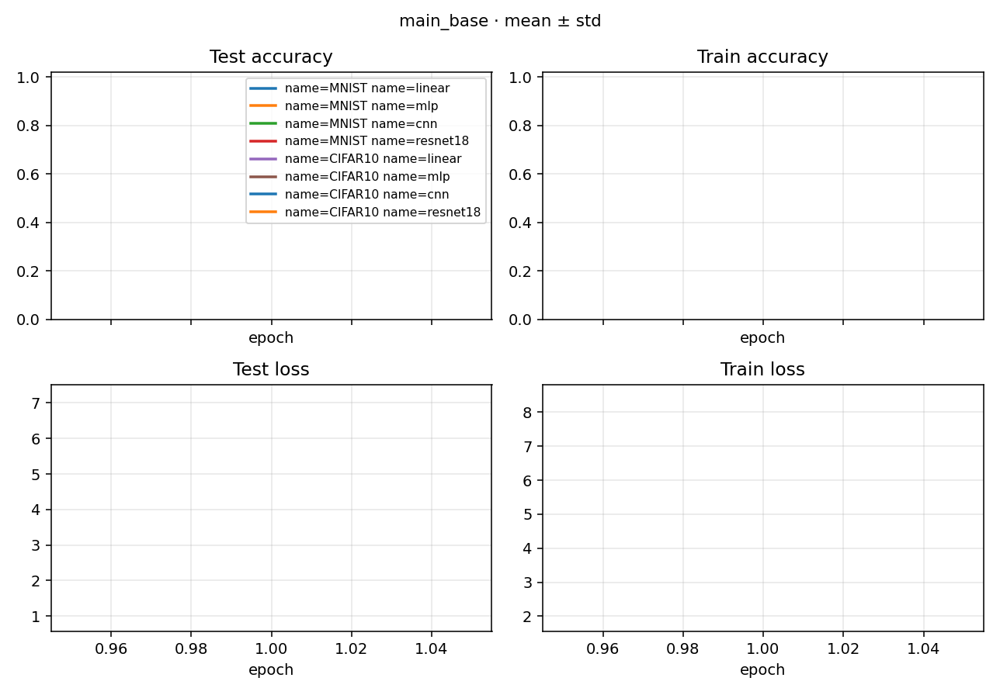

# Study Report: main_base

> Plan: [PLAN.md](PLAN.md)
> Date: 2026-10-01
> Recipe: 探针。MNIST + CIFAR10 × linear / mlp / cnn / resnet18，全图，batch 250，4 个 train step，`eval_period: 0`，`eval_num_steps: 4`，`augment: false`，seed 0。Accuracy 是 0–100。
> Location: Study `docs/`。数字读 `../process.json`。日志按 index 的 `log` 链到各 Run 的 `run.log`。

## 1. 怎么跑的（§3）

先 `python -m rpipe data studies/main_base`，再：

```bash
python -m rpipe make studies/main_base --num-gpus 1 --init-gpu 0
python -m rpipe launch studies/main_base --num-gpus 1 --init-gpu 0
```

机器：1× RTX 5090 D v2。make：`pack 4 waits: 2[linear×2], 2[mlp×2], 2[cnn×2], 2[resnet18×2]`。整轮预估 17s，实际 38s（最早 `[flow] start` 22:31:45 到最晚 `[flow] succeeded` 22:32:23）。8/8 `succeeded`。没有 retry。

这次显卡还在跑别的任务，所以 actual 比 est 长，尤其是 cnn 和 resnet18。不能把这 8 条的 step 时间放大成 60 step 的正式网格。

## 2. Conclusion

4 个 step、每次 test 只看 4 个 batch。下面的 test Accuracy 只说明流程跑通，不能和 `main` 的 60 step 全量 test 比。

| data | model | test Accuracy | test Loss |
|------|-------|---------------|-----------|
| MNIST | linear | 70.58 | 0.877 |
| MNIST | mlp | 53.10 | 2.143 |
| MNIST | cnn | 16.75 | 2.300 |
| MNIST | resnet18 | 15.28 | 2.269 |
| CIFAR10 | linear | 24.20 | 7.202 |
| CIFAR10 | mlp | 25.08 | 2.173 |
| CIFAR10 | cnn | 10.38 | 2.294 |
| CIFAR10 | resnet18 | 13.78 | 2.273 |

## 3. Learning curves

[打开 learning_curves.png](./figures/learning_curves.png)

[](./figures/learning_curves.png)

每个 step 预算只在结束时写一个点。

## 4. Runs

| factors | seed | id | test Accuracy | est | actual | log |
|---------|------|----|---------------|-----|--------|-----|
| data=MNIST model=linear | 0 | `71b3d24433e5023e` | 70.58 | 4s | 3s | [run.log](../runs/71b3d24433e5023e/assets/logs/run.log) |
| data=CIFAR10 model=linear | 0 | `3276244bd3d96af8` | 24.20 | 4s | 4s | [run.log](../runs/3276244bd3d96af8/assets/logs/run.log) |
| data=MNIST model=mlp | 0 | `547140b42c28c062` | 53.10 | 4s | 3s | [run.log](../runs/547140b42c28c062/assets/logs/run.log) |
| data=CIFAR10 model=mlp | 0 | `ebd3b36e28633347` | 25.08 | 4s | 4s | [run.log](../runs/ebd3b36e28633347/assets/logs/run.log) |
| data=MNIST model=cnn | 0 | `57a8d9eabbb2680f` | 16.75 | 4s | 8s | [run.log](../runs/57a8d9eabbb2680f/assets/logs/run.log) |
| data=CIFAR10 model=cnn | 0 | `d8072c0ee4b2e48c` | 10.38 | 4s | 9s | [run.log](../runs/d8072c0ee4b2e48c/assets/logs/run.log) |
| data=MNIST model=resnet18 | 0 | `0aee6c175b9371ac` | 15.28 | 5s | 15s | [run.log](../runs/0aee6c175b9371ac/assets/logs/run.log) |
| data=CIFAR10 model=resnet18 | 0 | `fb2a5aecbbfd7a6e` | 13.78 | 5s | 16s | [run.log](../runs/fb2a5aecbbfd7a6e/assets/logs/run.log) |

## 5. Reproduce

同上 make / launch。已 succeeded 的默认跳过。
