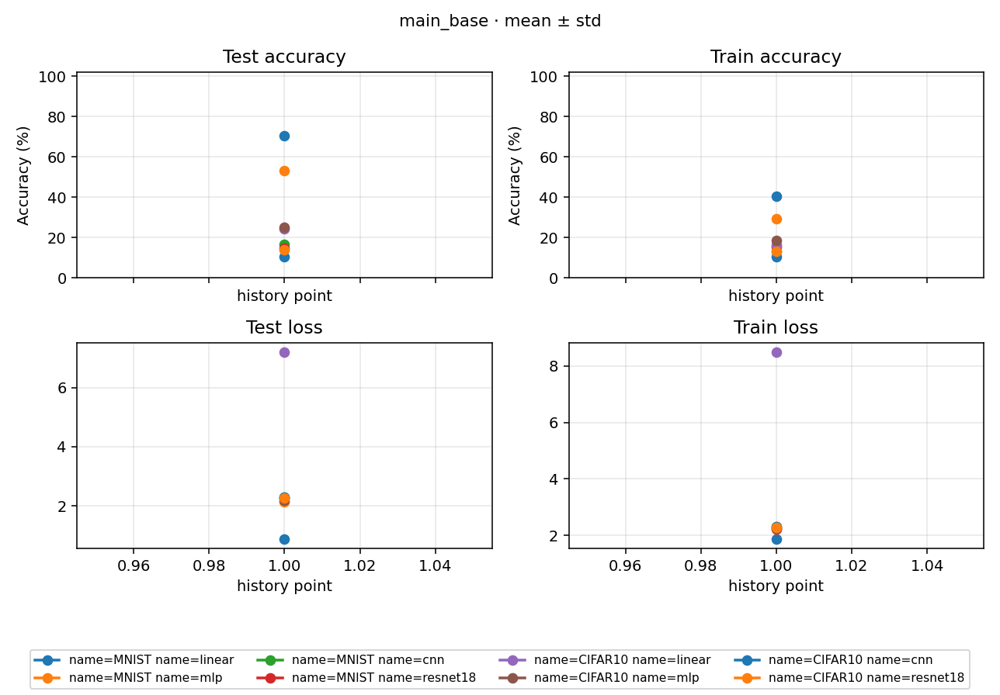

# Study Report: main_base

> Plan: [PLAN.md](PLAN.md)
> Date: 2026-10-02
> Current version: `local-curves-20261002`。本机 60-step 可视化验证，16/16 Run succeeded，无失败、无 retry。
> Accuracy 为百分制（0–100），Loss 为原量纲。当前数字见 [NUMBERS.md](NUMBERS.md)，历史 4-step 探针见附录 A。

## 1. 本轮完成了什么

MNIST / CIFAR10 × linear / mlp / cnn / resnet18，seed 0，共 8 train + 8 独立 eval。每条训练完成 60 个 optimizer step，batch 250，即 15000 次训练采样，**不是 60 epoch**。每 5 step 记录训练指标并评完整 10000 张 test 图片（test batch 1000，共 10 batch），因此每条曲线已有 13 个 train 观测和 12 个 test 观测。

整轮从最早 `[flow] start` 到最晚 `[flow] succeeded` 为 **99.827s**，初始 make 预估为 117s。8 条独立 eval 均加载同因素、seed、version 的 train best；其 Loss 和 Accuracy 与对应 best 的原始数值完全一致。本轮创建 16 个新 Run，原 8 个探针 Run 的 160 个文件经前后哈希核对未改动。

固定配方为 SGD（lr 0.1、momentum 0.9、weight decay 5e-4、Nesterov）、cosine（T_max 60、eta_min 0）、checkpoint period 30、按最低 test Loss 保存 best。CIFAR10 开启训练翻转 / crop → Normalize；MNIST 与全部 test 仅 Normalize。`num_workers=0`、`pin_memory=true`。

## 2. Learning curves

[](./figures/learning_curves.png)

曲线读取每条 Run 的 `assets/tracker/scalars.jsonl` 密记录；缺失时才回退 tracker history。本轮未为绘图改变训练或 tracker 的 epoch 收口语义，稀疏 train history 仍只有一个收尾点。

横轴是**观测序号**，不是 optimizer step：test 的 12 点对应 step 5、10、…、60；train 前 12 点对应同样的周期记录，第 13 点是收尾真实快照，不能统一将序号乘以 5。train Loss / Accuracy 是当前 epoch 开始至报告点的累积均值，不是最近 5 step 的窗口均值。独立 eval 仅一次完整评测，不混入学习曲线。

## 3. Last、best 与独立 eval

`last` 指训练 step 60 的 test 结果；`best` 按 test Loss 最低选择，不按最高 Accuracy 选择。Loss 保留六位小数，Accuracy 保留两位；原始精度留在 Run 产物。

| data | model | last Loss | last Acc (%) | best step | best Loss / Acc (%) | eval Loss / Acc (%) |
|---|---|---:|---:|---:|---:|---:|
| MNIST | linear | 0.402581 | 90.73 | 60 | 0.402581 / 90.73 | 0.402581 / 90.73 |
| MNIST | mlp | 0.270919 | 91.77 | 60 | 0.270919 / 91.77 | 0.270919 / 91.77 |
| MNIST | cnn | 2.282144 | 11.35 | 20 | 2.043568 / 23.07 | 2.043568 / 23.07 |
| MNIST | resnet18 | 0.075241 | 97.70 | 60 | 0.075241 / 97.70 | 0.075241 / 97.70 |
| CIFAR10 | linear | 2.910841 | 28.88 | 60 | 2.910841 / 28.88 | 2.910841 / 28.88 |
| CIFAR10 | mlp | 1.680359 | 40.15 | 60 | 1.680359 / 40.15 | 1.680359 / 40.15 |
| CIFAR10 | cnn | 1.832578 | 32.90 | 60 | 1.832578 / 32.90 | 1.832578 / 32.90 |
| CIFAR10 | resnet18 | 1.468435 | 45.47 | 60 | 1.468435 / 45.47 | 1.468435 / 45.47 |

MNIST CNN 的 best 来自 step 20，Accuracy 23.07%，最后降至 11.35%；step 15 曾有 31.00%，但其 Loss 高于 step 20，所以未成为最终 best。它是本轮应优先检查的训练现象，尚不能据此确认代码缺陷。独立 eval 正确复现 best，不能把它与 last 的差异误报为评测错误。下一步建议先针对这一格核对模型、初始化、优化过程与旧配方，再决定是否扩成多 seed。

## 4. 环境、数据与执行

| 项 | 实际值 |
|---|---|
| 本轮代码 | HEAD `359713704ea06f26409fa059705142d5b1389688` + 未提交工作区改动；不是只 checkout 此 SHA 即可复现的干净提交 |
| 固定旧 main 对照 | `98648f3a5c7db7dccf3ca806410d5b6fdee9484c`，本轮未运行该对照 |
| 系统 / Python | Windows 11（10.0.26200）/ 3.13.9，`D:\anaconda3\python.exe` |
| 库 | torch 2.11.0+cu128、torchvision 0.26.0+cu128、Kornia 0.8.3 |
| GPU | 1× RTX 5090 D v2，CUDA 可用；显存总量 24455 MiB，启动前占用 3827 MiB、利用率 3% |
| 运行选项 | 单 GPU 0；`deterministic=false`、`cudnn_benchmark=true`；每组同模型的两数据集并发 |

本轮 `rpipe data` 从本机已有原始数据重算统计，没有下载。下面是实际 `shared/data/<dataset>/stats.yaml` 的 train 统计，已逐 Run 与 `result.structure.data` 核对一致，未使用缺统计时的回退常数。

| 数据 | train / test 张数 | train mean | train std |
|---|---|---|---|
| MNIST | 60000 / 10000 | 0.130660 | 0.308108 |
| CIFAR10 | 50000 / 10000 | 0.491400, 0.482158, 0.446531 | 0.247032, 0.243485, 0.261588 |

MNIST mean 比计划中的历史参考 0.130661 低 0.000001，以上以本轮重算并实际使用的统计为准，不能把参考值直接当作本轮输入。数据与 Run 产物被 Git 忽略，clone 不包含它们；本报告和图片保留可读证据。

实际命令顺序如下，配置已先按计划更新，make 后已核对 16 条新 config / index / jobs，再 launch：

```powershell
python -B -m rpipe data studies/main_base
python -B -m rpipe make studies/main_base --num-gpus 1 --init-gpu 0 --console shared
python -B -m rpipe launch studies/main_base --num-gpus 1 --init-gpu 0 --console shared
python -B -m rpipe report studies/main_base
```

`make` 共排 8 个 wait：前 4 组依次 linear / mlp / cnn / resnet18 train，后 4 组为相同顺序的 eval，每组 MNIST / CIFAR10 两条并发。先全部 train 完成，再开始 eval。后续仅运行 `rpipe process studies/main_base` 重绘图例与聚合，未再训练。

### Run 耗时与原始日志

全部 seed 为 0、状态为 succeeded。`est` 是 launch 前 make 的初始估计；`flow` 是该 Run 日志 start → succeeded；`algorithm` 是算法返回的 `elapsed_seconds`，训练 Run 中包含周期评测等算法内部开销，不等于纯训练 kernel 时间。后两列单位为秒。

| data | model | mode | Run / log | est | flow | algorithm |
|---|---|---|---|---:|---:|---:|
| MNIST | linear | train | [1ebddcdd27b5c066](../runs/1ebddcdd27b5c066/assets/logs/run.log) | 16 | 8.318 | 6.216 |
| MNIST | linear | eval | [8634724b9a1f2cb2](../runs/8634724b9a1f2cb2/assets/logs/run.log) | 4 | 2.680 | 0.447 |
| MNIST | mlp | train | [7184e37be6cc064e](../runs/7184e37be6cc064e/assets/logs/run.log) | 16 | 8.512 | 6.366 |
| MNIST | mlp | eval | [5e3f82273bf0df18](../runs/5e3f82273bf0df18/assets/logs/run.log) | 4 | 2.575 | 0.488 |
| MNIST | cnn | train | [a014792413e434fa](../runs/a014792413e434fa/assets/logs/run.log) | 25 | 11.959 | 9.755 |
| MNIST | cnn | eval | [6b7c8edaef15ff68](../runs/6b7c8edaef15ff68/assets/logs/run.log) | 5 | 4.185 | 2.220 |
| MNIST | resnet18 | train | [f7150fa1bd628fe6](../runs/f7150fa1bd628fe6/assets/logs/run.log) | 41 | 24.386 | 22.061 |
| MNIST | resnet18 | eval | [1058665be2866fc6](../runs/1058665be2866fc6/assets/logs/run.log) | 6 | 7.213 | 5.001 |
| CIFAR10 | linear | train | [c495bfa80b626497](../runs/c495bfa80b626497/assets/logs/run.log) | 16 | 12.989 | 9.785 |
| CIFAR10 | linear | eval | [3dff1c5c0dcb984b](../runs/3dff1c5c0dcb984b/assets/logs/run.log) | 4 | 3.697 | 0.597 |
| CIFAR10 | mlp | train | [cb7ce5557fd50aa1](../runs/cb7ce5557fd50aa1/assets/logs/run.log) | 16 | 13.430 | 10.319 |
| CIFAR10 | mlp | eval | [a0435992ae9e8a34](../runs/a0435992ae9e8a34/assets/logs/run.log) | 4 | 3.658 | 0.508 |
| CIFAR10 | cnn | train | [3a505aff4a5a9bf0](../runs/3a505aff4a5a9bf0/assets/logs/run.log) | 25 | 17.008 | 13.891 |
| CIFAR10 | cnn | eval | [20ab1a1a1e451e27](../runs/20ab1a1a1e451e27/assets/logs/run.log) | 5 | 5.412 | 2.438 |
| CIFAR10 | resnet18 | train | [2752efcebd716081](../runs/2752efcebd716081/assets/logs/run.log) | 41 | 30.402 | 27.079 |
| CIFAR10 | resnet18 | eval | [81a4abfc9f07a1cf](../runs/81a4abfc9f07a1cf/assets/logs/run.log) | 6 | 8.391 | 5.336 |

整轮最早 start 为 **2026-10-02 21:44:00.305 +08:00**，最晚 succeeded 为 **21:45:40.132 +08:00**，相差 **99.827s**。初始估计按 8 个 wait 求和为 117s；实际比估计短 17.173s。由于组内并发，不能把各 Run 耗时相加当墙钟。该整轮口径也不含更早的数据准备 / make，以及最后的父进程聚合 / 报告开销；不能称为 launch 命令的外部总耗时。每条日志只有一次 start / succeeded，无 `[error]`，launch 汇总为 `planned=16 succeeded=16 failed=0 pending=0`。

## 5. 验收与结论边界

- 当前 index 与 process 含 16 个 Experiment / Run，process 完成、8 组 train / eval 配对；所有 config 的 version、60-step 预算与 full-test 条件已核对。
- 每条 train 的 test 日志均对应 step 5、10、…、60；latest 在 step 60；best 的 step / Loss 与密曲线最小 Loss 一致。每条训练均有 13 train / 12 test 点；8 条 eval 均指向自己的 sibling train best，Loss / Accuracy 差值均为 0。
- 本轮 core 验证 **166 passed**（17 deselected）；绘图 / Study process 定向验证 **17 passed**（1 deselected），包括 JSONL 优先读取、异常记录过滤与 history 回退。后者在图例调整后重跑；两组有重叠，不将通过数相加。GPU 实验完成是另一层验证，不由这些排除 gpu / external 的单测替代。
- 单 seed、60 step 只支持有限预算下的曲线与执行行为结论，不支持最终精度、收敛或跨 seed 稳定性；NUMBERS 中 `n=1` 的 `std=0` 也不是稳定性证据。
- 旧 main 每 30 step 全量 test，本轮每 5 step 全量 test；评测开销及 best 候选次数不同，加上库 / 数据接口 / 统计、随机性和并发差异，**本轮不是旧 main 的严格复现**，也未运行同环境串行对照，不能作跨实现精度或速度优劣结论。test Loss 还参与 best 选择，best 分数不是独立留出集上的无偏评估。

同配置重新 make / launch 默认跳过已 succeeded 的 Run。若要新一轮从零训练，先明确新的 `version` 并重新展开；`--include-done` 不是 fresh，会读取已有 latest。不要照搬历史探针删 checkpoint 的做法。本轮没有增加 seed、继续加步数或覆盖旧 Run。

## 附录 A：历史 4-step 探针（2026-10-01 / 02）

以下保留原探针执行与数字，不作为当前 60-step 结果。配方：MNIST + CIFAR10 × linear / mlp / cnn / resnet18，全量数据，batch 250，4 个 train step，`eval_period: 0`，`eval_num_steps: 4`，`augment: false`，seed 0。旧 Run 日志保留，当前 index / process 已切至新一轮。

### A.1 怎么跑的（§3）

先 `python -m rpipe data studies/main_base`，再：

```bash
python -m rpipe make studies/main_base --num-gpus 1 --init-gpu 0
python -m rpipe launch studies/main_base --num-gpus 1 --init-gpu 0
```

机器：1× RTX 5090 D v2。make：`pack 4 waits: 2[linear×2], 2[mlp×2], 2[cnn×2], 2[resnet18×2]`。整轮预估 17s。

2026-10-01 第一次 launch 时显卡还在跑别的任务，整轮实际 38s。2026-10-02 显卡空闲（启动前占用约 2%、显存约 2.5GiB）后再跑。直接 `--include-done` 会读已有的 `latest`，4 个 step 已经走完，于是只做了 test。删掉 checkpoint 和当次 `run.log` 之后再 `--include-done`，8 条才重新训练。这次整轮实际 33s（19:54:27 到 19:55:00），8/8 `succeeded`，没有 retry。下面 Runs 表是这一次。

cnn / resnet18 的 4 个 step 里，训练循环本身就占了大约 2–6 秒，后面那一次 4 个 test batch 也要数秒。这主要是启动和第一次上卡，不是稳态的每步时间，所以仍不能按这个比例放大到 60 step。

### A.2 Conclusion

4 个 step、每次 test 只看 4 个 batch。下面的 test Accuracy 只说明流程跑通，不能和 `main` 的 60 step 全量 test 比。

| data | model | test Accuracy | test Loss |
|------|-------|---------------|-----------|
| MNIST | linear | 70.58 | 0.877 |
| MNIST | mlp | 53.10 | 2.143 |
| MNIST | cnn | 16.80 | 2.300 |
| MNIST | resnet18 | 14.83 | 2.270 |
| CIFAR10 | linear | 24.20 | 7.202 |
| CIFAR10 | mlp | 25.08 | 2.173 |
| CIFAR10 | cnn | 10.38 | 2.294 |
| CIFAR10 | resnet18 | 13.90 | 2.274 |

### A.3 Learning curves

[打开历史 learning_curves_probe_4step.png](./figures/learning_curves_probe_4step.png)

[](./figures/learning_curves_probe_4step.png)

每条 Run 的 4-step 预算只在结束时写一个 history 点，横轴 1 是记录序号，不是训练 epoch 或 optimizer step。2026-10-02 使用已有 tracker 重绘，修正 Accuracy 百分制纵轴与单点显示；未重训，原始指标与 33s 执行记录不变。

### A.4 Runs

| factors | seed | id | test Accuracy | est | actual | log |
|---------|------|----|---------------|-----|--------|-----|
| data=MNIST model=linear | 0 | `71b3d24433e5023e` | 70.58 | 4s | 3s | [run.log](../runs/71b3d24433e5023e/assets/logs/run.log) |
| data=CIFAR10 model=linear | 0 | `3276244bd3d96af8` | 24.20 | 4s | 4s | [run.log](../runs/3276244bd3d96af8/assets/logs/run.log) |
| data=MNIST model=mlp | 0 | `547140b42c28c062` | 53.10 | 4s | 2s | [run.log](../runs/547140b42c28c062/assets/logs/run.log) |
| data=CIFAR10 model=mlp | 0 | `ebd3b36e28633347` | 25.08 | 4s | 4s | [run.log](../runs/ebd3b36e28633347/assets/logs/run.log) |
| data=MNIST model=cnn | 0 | `57a8d9eabbb2680f` | 16.80 | 4s | 7s | [run.log](../runs/57a8d9eabbb2680f/assets/logs/run.log) |
| data=CIFAR10 model=cnn | 0 | `d8072c0ee4b2e48c` | 10.38 | 4s | 8s | [run.log](../runs/d8072c0ee4b2e48c/assets/logs/run.log) |
| data=MNIST model=resnet18 | 0 | `0aee6c175b9371ac` | 14.83 | 5s | 14s | [run.log](../runs/0aee6c175b9371ac/assets/logs/run.log) |
| data=CIFAR10 model=resnet18 | 0 | `fb2a5aecbbfd7a6e` | 13.90 | 5s | 15s | [run.log](../runs/fb2a5aecbbfd7a6e/assets/logs/run.log) |

### A.5 Reproduce

以上命令描述当时的探针执行。当前 YAML 已是 60-step 配方，直接运行不能重现 4-step 探针；若另做探针，需显式恢复上述预算并分配新 version。原 8 个 Run 与本附录图片作为历史证据保留。
