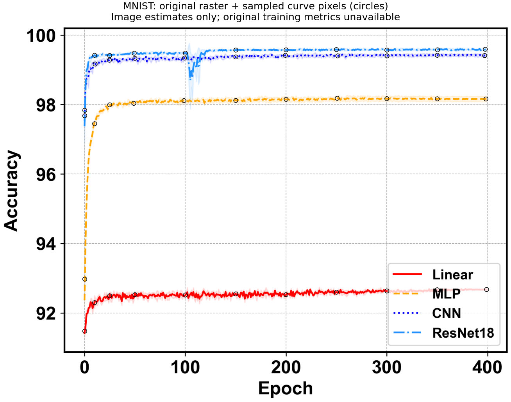
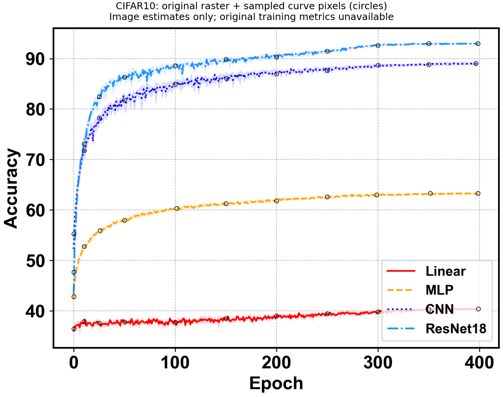

# main README 历史曲线目标与验收口径

## 一、摘要

2026-10-04。本 Study 的目标是接近 `main` README 中的两张完整学习曲线。图像最后更新提交固定为 `4ccb28d0496110253e9f8e3f3df658853f07996b`；最新 `main` `98648f3a5c7db7dccf3ca806410d5b6fdee9484c` 仍使用同一对 PNG。历史原始指标与实际训练环境尚未找回，以下数值均是 **PNG 均值线的像素估读**，不是历史实测日志。

- 历史代码的候选配方为 80000 次 optimizer 更新，每 200 步完整评测一次，目标 seed 为 0、1、2、3。
- 图末 Accuracy 估计：MNIST 的 linear / mlp / cnn / resnet18 为 92.67 / 98.16 / 99.41 / 99.59%；CIFAR10 为 40.35 / 63.26 / 89.01 / 92.97%。
- 建议在判断新长实验结果前固定下述终点、末段与曲线门；单 seed 结果先用于诊断，完整四 seed 聚合才进入最终验收。
- 当前文档只完成参考图核对、估读与验收建议，没有执行训练，也没有声明历史图已复现。实际执行范围、配方和结果由本 Study 的 PLAN 与报告记录。

## 二、固定来源与原聚合方法

### （一）来源

| **来源** | **固定值** | **用途** |
|---|---|---|
| 图最后更新提交 | `4ccb28d0496110253e9f8e3f3df658853f07996b` | 候选配方和原聚合源码 |
| 最新历史 main | `98648f3a5c7db7dccf3ca806410d5b6fdee9484c` | README 使用的 PNG 与上行一致；其较短默认配方不据此视为 PNG 配方 |
| MNIST PNG Git blob | `39fc4cd04e63a72c2a458aba436b5e1f8200a613` | [仓库原图](../../../asset/MNIST_Accuracy_mean.png) |
| CIFAR10 PNG Git blob | `61a8e92ff461176c2fe2150e08d45802ba2b57d9` | [仓库原图](../../../asset/CIFAR10_Accuracy_mean.png) |

已核对本工作区原图的 `git hash-object` 与上述提交中的 blob 相同。图像 SHA-256、尺寸、稀疏点的坐标和提取参数保存在 [REFERENCE_CURVES.json](REFERENCE_CURVES.json)。候选配方来源审计、旧 best 选择缺陷与 200-step 两套实现的前缀对照见 [历史审计](https://github.com/diaoenmao/RPipe/blob/18cd76c/studies/main_reproduction/docs/HISTORICAL_AUDIT.md) 和 [前缀探针报告](https://github.com/diaoenmao/RPipe/blob/18cd76c/studies/main_reproduction/docs/HISTORICAL_PREFIX_PROBE.md)。这些前缀对照不代替本轮长实验。

### （二）原曲线的统计口径

固定提交的 `src/test_model.py` 将最终 checkpoint 的训练 logger 放在结果的 `logger_state_dict['train']`，将独立 best checkpoint 的评测 logger 放在 `logger_state_dict['test']`。`src/process.py` 的两个出口不同：

1. `train` logger 中 `test/Loss`、`test/Accuracy` 的 `history` 进入学习曲线。这是每个训练段结束后的完整 test 结果，不是训练 Accuracy，也不是独立 best eval。
2. 独立 `test` logger 中 `test/Loss`、`test/Accuracy` 的 `mean` 进入另一个汇总表，不是这两张图的终点口径。
3. 脚本设置 `num_experiments=4`，候选 seed 为 0–3。各 seed 的同位置 history 被 `np.stack(..., axis=0)`，随后沿 seed 轴计算 `np.mean` 和 `np.std`；标准差是 population std，`ddof=0`。图中的阴影是均值 ± 一倍标准差，不是置信区间。
4. 原 `gather_result` 遇到文件缺失只打印 `Missing`，聚合仍使用实际找到的值，不强制四 seed 齐全。因此源码证明的是计划四 seed，PNG 本身不能证明实际每条曲线的 seed 数或运行配方。新实验应明确检查四 seed 完整性，不能沿用这种静默减少样本的行为。

旧 best 比较缺陷需要另行说明，但它与最终 checkpoint 中完整 `history` 的曲线定义不同。新链的正确 best 选择无需为了图像对照复制该缺陷；独立 best eval 与最终曲线 Accuracy 要分别报告。

### （三）横轴与训练预算

原图使用 `x = np.arange(len(y))`，横轴标签虽然是 `Epoch`，实际是从 0 开始的评测槽。按固定候选配方，槽 `j` 对应 optimizer step `(j + 1) × 200`；400 个点的范围为 step 200–80000，最后一个点是槽 399。不能把槽 0 当作初始化评测，也不能把图末 400 刻度当成存在第 401 个评测点。

每个评测段训练 200 × 250 = 50000 张样本。对 CIFAR10 的 50000 张 train，这是一个完整训练集规模；对 MNIST 的 60000 张 train，只是 5/6 个训练集规模。80000 步共处理 2000 万训练样本，分别相当于 MNIST 约 333.33、CIFAR10 400 个训练集规模。保持真实 optimizer step 坐标进行比较。

## 三、PNG 估读结果与趋势

### （一）估读方法及误差

以灰色网格校准像素坐标，再按原 `process.py` 指定颜色识别均值线的饱和颜色核心；在目标 x 的左右 10 px 内选择最近的可见核心列，并对该列附近的线宽取中心。虚线空隙可能使读点偏离目标约 3 个槽，JSON 保留每个点的实际 x 偏移。后段 linear 曲线穿过图例白色背景时，额外识别其被 0.8 白色 alpha 混合后的颜色 `(255, 204, 204)`；按 Accuracy 范围排除图例线段。

竖直坐标的保守估读误差取 MNIST ±0.05、CIFAR10 ±0.20 个百分点；这是图像读取容差，不是统计置信区间。前段陡升时，横向偏移可能导致更大 Accuracy 偏差，初始槽 0 / 10 / 25 仅作描述，不进入最终曲线数值门。没有提取阴影的跨 seed std，也没有通过插值伪造原始 400 点指标。

末段均值是对槽 350–399 的 50 个图像估计取平均，相邻虚线空隙可能重复取到同一可见段；这仍是参考图估读，不是恢复的原始历史。新实验的末段均值必须直接用真实 50 个评测点。

| **数据** | **模型** | **末点估读 Accuracy (%)** | **末 50 槽估读均值 (%)** |
|---|---|---:|---:|
| MNIST | linear | 92.67 | 92.67 |
| MNIST | mlp | 98.16 | 98.16 |
| MNIST | cnn | 99.41 | 99.42 |
| MNIST | resnet18 | 99.59 | 99.59 |
| CIFAR10 | linear | 40.35 | 40.36 |
| CIFAR10 | mlp | 63.26 | 63.24 |
| CIFAR10 | cnn | 89.01 | 88.99 |
| CIFAR10 | resnet18 | 92.97 | 92.96 |

### （二）曲线趋势

- MNIST 在早段快速上升，约槽 50 后总体趋于平台；MLP 接近 98.1%，CNN 接近 99.4%，ResNet18 接近 99.6%。linear 约 92.5% 后仍有很缓慢的后段上升。ResNet18 在约槽 100–115 有一次明显下探，随后恢复；原始 seed 日志缺失，不能将其归因于具体事件，也不要求新运行在同一槽复刻这个孤立波动。
- CIFAR10 的 CNN / ResNet18 早段迅速上升，之后较缓地继续改进，在末段分别稳定于约 89% / 93%；MLP 从约 60% 继续缓升至约 63.3%；linear 从约 37–38% 缓升至约 40.4%。四模型的末段均值顺序均为 ResNet18 > CNN > MLP > linear。

下图的空心圆标记实际提取像素位置，可人工复核颜色识别是否落在对应曲线上。标题明确这些是图片估读，没有原始指标。

## 四、预先声明的曲线相近验收建议

### （一）执行完整性

1. MNIST / CIFAR10 × linear / mlp / cnn / resnet18，每组合 seed 0、1、2、3，各自完成 80000 次 optimizer 更新。保持完整 train/test、历史候选变换、模型、batch250、优化器、梯度裁剪和 `T_max=80000` 的既定配方；具体实现和确定性控制写在 PLAN 中。
2. 每条曲线有完整 400 个 test 点，optimizer step 从 200 到 80000，间隔 200，每点 test 样本数 10000。需要重试或恢复时保留真实记录；完整执行与数值门分别判定。
3. 同一组合的四 seed 按真实相同步数聚合，不用 best Accuracy 或选中 seed 替换最终点；跨 seed std 使用 `ddof=0`。单 seed 或缺点不进入完整四 seed 终验。

### （二）固定数值门

门限在本轮长实验结果判断前提出，不根据新结果调宽。以下均比较四 seed mean 与 JSON 图像估计；单位为 **Accuracy 百分点**。

| **检查** | **MNIST 门限** | **CIFAR10 门限** |
|---|---:|---:|
| 槽 399 / step80000 的末点绝对差 | ≤0.25 | ≤1.00 |
| 槽 350–399 的末段均值绝对差 | ≤0.25 | ≤1.00 |
| 固定曲线锚点的平均绝对差 MAE | ≤0.25 | ≤1.00 |
| 固定曲线锚点的最大绝对差 | ≤0.60 | ≤2.00 |
| 新四 seed mean 曲线末 50 点的时间 std | ≤0.15 | ≤0.50 |

固定锚点为槽 50、150、200、250、300、350、399，对应 step 10200、30200、40200、50200、60200、70200、80000。上述时间 std 衡量均值曲线的末段稳定性，用 `ddof=0`；它不同于各点的跨 seed std，也不是与未提取的历史阴影比较。

两数据集的四模型末段均值均须满足 ResNet18 > CNN > MLP > linear。每组合都通过执行完整性、末点、末段、锚点与稳定性门，才称为“在预先口径下较好复现 README 图像曲线”。部分通过须逐格报告，不把通过几格扩展为全矩阵复现；此结论仍不证明恢复了历史实际环境或原始 seed 记录。

## 五、长期运行与 seed 预算

### （一）阶段与规模

建议先把 seed0 的八组合跑到 80000 步，检查收敛与保存，再补 seed1、2、3，形成正式四 seed 终验。seed0 的短期表现或单次末点偏差只能触发诊断，不能代替四 seed 结果判定；也不能通过挑选 seed、提前截断或只报告最好 checkpoint 获得通过。

| **预算** | **seed0 八组合** | **四 seed 完整矩阵** |
|---|---:|---:|
| train Run | 8 | 32 |
| optimizer 更新 | 640000 | 2560000 |
| train 样本处理 | 160000000 | 640000000 |
| 曲线 test 完整评测 | 3200 | 12800 |
| 曲线 test 样本处理 | 32000000 | 128000000 |
| 如另做每条 best 独立 eval 的样本处理 | 80000 | 320000 |

这是一套实现的总量；再运行完整旧实现将另加相同规模。已存在 200-step 两套实现对照，但其前缀时间不作为 80000-step 墙钟承诺。通过长运行中的实际吞吐和完整评测/保存开销更新 ETA，保证估计依据可核对。

### （二）结果不足时的继续方式

保持原候选四 seed 配方作为固定对照，先排查数据顺序/增强、旧 BN 模型、采样器、scheduler、评测口径、checkpoint 恢复和环境差异。修复适配错误后以明确新版本复测；若探索新的学习率、预算或结构，另列为候选改动及新的对照，不覆盖失败证据，不将调参后的结果写成未经修改的历史配方复现。正式验收门保持本节预先声明的值。

## 六、验证范围

2026-10-04 已完成两张原图与两张标记图的实际查看、PNG blob 一致性核对、完整来源源码的聚合口径分析及 JSON 提取。未运行 GPU 训练，未修改生产源码；提取脚本在 `.tmp/historical_target/extract_reference.py`，该临时脚本不会随 Git clone 提供。正式 JSON 已保留提取参数、像素坐标、源文件哈希和脚本 SHA-256，正式图片与原图引用可随仓库提供。
