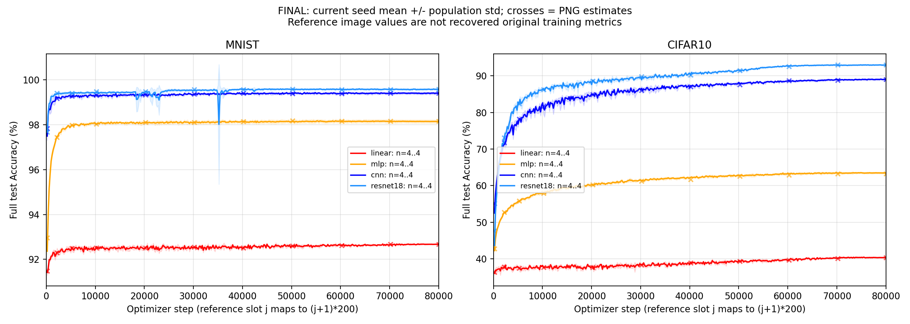

# 历史 main 曲线复现报告

## 一、摘要

2026-10-04，执行基线为远端最新 `dev` 合并提交 `8bccbac`。本轮继续 README 历史长曲线复现，建立新的 `main_historical` Study，不覆盖已有 main_base / main_reproduction。

已恢复两个数据集：16 个原始文件的 SHA-256 与历史 manifest 全部一致；核心 unit c1/c2 测试 **266 passed / 23 deselected**。本机 600-step 三段原代码/当前链探针及独立存档核验均 **8/8 通过**，24 个评测段的参数与整数 buffer 差为零。本机最新 dev / cu130 的现代 main 60-step CUDA 受控对照也已 **8/8 通过**，step30/60 共16段参数最大差0，独立 CPU 重载审计通过。该现代对照使用原 Stats 全精度 profile 和统一 deterministic=true；它与历史 80000-step 曲线验收分别记录。

正式四 seed 历史矩阵为 **32 train + 32 eval**，主调度于 **2026-10-04 01:00:30 +08:00** 启动。截至 **02:43:12 +08:00** 的完整 CPU 审查，MNIST / linear 与 CIFAR10 / linear 各四条 train 均完成 80000 步，且各四条 sibling-best eval 均 succeeded，合计 **2/8 个数据/模型组合完成训练和独立评估审查**。最新 **02:46:33 +08:00** 只读状态为 train8 succeeded / 6 started / 18 pending、eval8 succeeded / 24 pending；MNIST / mlp 四 seed 与提前并行的 CIFAR10 / resnet18 / seeds0、1 正在执行。

MNIST / linear 四 seed 终点 mean 为 **92.67500124%**，末 50 点 mean 为 **92.66865129%**，与 PNG 估读 92.67% 分别相差 **0.00500124 / 0.00134871 个百分点**。独立 CPU 审查的每 seed24 项训练完整性与19项正式 eval 检查均通过，额外 CPU best 权重重建的正确样本数也与正式 eval 相同；预定七锚点及末段稳定性的单组合诊断均在原门限内。

CIFAR10 / linear 四 seed 终点 mean 为 **40.3700008273%**，与 PNG 估读40.35%相差 **0.0200008273 个百分点**；末50点 mean40.3694007571%。每 seed41项训练审查、20项正式 eval 核对及 CPU own-best 完整 test 回放均通过，五项固定单组合诊断均在门内。该组 eval 的四条 worker 均 exit0 / succeeded；记录控制器因 WinError5 保存JSON失败而退出1，原失败与记录恢复证据保留，未重跑 worker。**最终整体曲线门尚未应用，历史图复现尚未完成**；其余六个训练组合和24条独立 eval 齐全后才进入 [预先曲线门](TARGET.md) 完整验收。

## 二、与上一设备结果的关系

已有报告证明旧设备上当前 main 的 60-step 确定性 8/8 对齐，以及历史候选的 200-step 首段 8/8 对齐，见 [main_reproduction](../../main_reproduction/docs/STUDY_REPORT.md)。这些是此前结果；本设备已启动正式 80000-step 预算，但尚未完成本轮长曲线验收。

本设备 Python3.13.9、Torch2.11.0+cu130、RTX5090 D v2；旧证据为 cu128。临时数据和适配脚本未随 Git clone 提供，因此本轮把数据准备、归档适配、调度和验证代码保存在本 Study 中。本机重新执行原代码作为计算对照，不用旧 JSON 冒充本机逐位结果。

本机已补齐最新 dev / cu130 对当前 main 60-step / eval30 配方的新独立 CUDA 对照。固定 main 为 `98648f3`，dev 为 `8bccbac`，八个数据/模型组合完整通过，见 [当前设备计划](../../main_reproduction/docs/CURRENT_DEVICE_PLAN.md) 与 [独立 CPU 重载审计](../../main_reproduction/docs/CURRENT_DEVICE_CPU_RELOAD_AUDIT.json)。该路径按归档原 Stats(dim1) 对全 train 重新计算并保留全精度 profile，采用 deterministic=true、benchmark=false、`CUBLAS_WORKSPACE_CONFIG=:4096:8`；并未验证 constant profile 或原 benchmark=true 默认设置的完整门。旧 cu128 证据和本轮历史 600-step 探针仍保留各自配方与环境边界。

## 三、配置与证据

- [PLAN.md](PLAN.md)：连续预算、模型/数据/优化器、确定性控制、并发和中断处理。
- [TARGET.md](TARGET.md)、[REFERENCE_CURVES.json](REFERENCE_CURVES.json)：原 PNG 的像素估读、来源限制与事先门限。
- [DATA_MANIFEST.json](DATA_MANIFEST.json)：16/16 原文件哈希与完整 split 数量。
- [PREFLIGHT.json](PREFLIGHT.json)：本机 600-step 对照的初始化、24 个段、采样/增强输入、RNG/scheduler、源码 hash 与真实数值。
- [PREFLIGHT_VERIFICATION.json](PREFLIGHT_VERIFICATION.json)：独立 CPU 重载两边存档，核对参数/optimizer/scheduler、真实历史指标和 JSONL 坐标，8/8 通过。
- [ENVIRONMENT.json](ENVIRONMENT.json)、[SOURCE_MANIFEST.json](SOURCE_MANIFEST.json)：正式 64 Run 的执行环境和源码/展开配置 hash。
- [EXECUTION.json](EXECUTION.json)：正在执行的 wait 组、PIDs、开始/退出事件与真实状态。
- [EAGER_EXECUTION.json](EAGER_EXECUTION.json)：原计划 CIFAR10 / resnet18 / seeds0、1 Run 的提前并行安排及与主调度的协调约束。
- [EARLY_EVAL_EXECUTION.json](EARLY_EVAL_EXECUTION.json)：原计划 MNIST / linear 四条 sibling-best eval 的提前串行执行，四条 exit0 / succeeded。
- [EARLY_COMPARISON.json](EARLY_COMPARISON.json)：2026-10-04 01:13:22 +08:00 的 MNIST / linear 四 seed 独立只读审查，包含正式 seed0 与探针的指标核对、静态输入重建及早期 PNG 偏差；最终门未应用。
- [MNIST_LINEAR_RESULT.md](MNIST_LINEAR_RESULT.md)、[机器 JSON](MNIST_LINEAR_RESULT.json)：MNIST / linear 四 seed 完整 80000-step 训练及正式独立 eval 的 CPU 审查、额外 best 权重 CPU 重建、400 点聚合与固定门的单组合诊断；明确不是整体终验。
- [CIFAR_LINEAR_RESULT.md](CIFAR_LINEAR_RESULT.md)、[机器 JSON](CIFAR_LINEAR_RESULT.json)：CIFAR10 / linear 四 seed 完整训练、SGD/scheduler/history/来源、正式 eval 与 CPU own-best 回放的独立审查，包含七锚点及原门限诊断。
- [CIFAR10 / linear eval 恢复记录](EARLY_EVAL_CIFAR10_LINEAR_EXECUTION.json)：四条 worker exit0 / succeeded；记录控制器 failed / exit1 与仅恢复记录的边界保留，原始记录及实际 helper 由其中哈希绑定。
- [CPU 审计入口](../verify_group.py)、[方法与回归记录](GROUP_AUDIT_METHOD.md)：旧本机程序原样保留，新入口适配仓库定位并在报告中引用当次真实路径/SHA；MNIST / CIFAR10 linear的全部科学字段回归一致，不覆盖正式JSON快照。
- [当前设备 main 计划](../../main_reproduction/docs/CURRENT_DEVICE_PLAN.md)、[独立 CPU 重载审计](../../main_reproduction/docs/CURRENT_DEVICE_CPU_RELOAD_AUDIT.json)：现代 main 60-step 原 Stats 全精度、确定性八格 CUDA 对照及完成后的存档核验。
- [COMPARISON.json](COMPARISON.json)：真实曲线点数、每点 seed 数和部分/完整验收状态；[叠图](figures/historical_comparison.png)中十字为 PNG 估读。
- [适配代码](../recipe.py)、[数据准备](../prepare_data.py)、[运行入口](../run.py)：归档源文件保持 Git blob 字节一致，当前生产模型不增加历史兼容开关。

参考图估读终点为 MNIST 92.67 / 98.16 / 99.41 / 99.59%，CIFAR10 40.35 / 63.26 / 89.01 / 92.97%，顺序 linear / mlp / cnn / resnet18。这些是 PNG 估读，不是已找回的历史原始指标。原聚合容忍缺 seed，图片不能证明实际历史 seed 数；新实验要求四 seed 齐全。


## 四、本机计算对照

### （一）2026-10-04 01:56–02:05 +08:00：现代 main 60-step 八格对照

主线程实际 CUDA 执行于01:56:36开始、01:59:11完成，进程 exit0；原始 COMPARISON 的 `scope=full_matrix`、`full_matrix_complete=true`、`full_matrix_passed=true`。MNIST / CIFAR10 × linear / mlp / cnn / resnet18、seed0 的八格均通过。step30/60 共16段浮点参数与整数 buffer 逐位一致、最大绝对差0；SGD 状态、scheduler、CPU/CUDA RNG 一致，训练样本索引及训练/评测实际像素、标签和 Kornia 后核心输入一致。当前 test 不提供原 id 字段，因此未把缺失 test id 当作已观测的一致指标。

每格每边实际 train15000样本 / 60batch，两个 test 合计20000样本 / 20batch；段内正确样本数严格相同，train/test Loss 最大差 `6.661338147750939e-16`。两边均按 test Loss 选自身 best，best step 和权重一致，重新构造模型与 DataLoader 的独立完整 eval 为8/8通过：每边10000样本 / 10batch，正确样本数相同，Loss差0，eval与自身best结果一致。

[独立 CPU 重载审计](../../main_reproduction/docs/CURRENT_DEVICE_CPU_RELOAD_AUDIT.json) 于02:05:10–02:05:17完成，`complete=true`、`passed=true`、`errors=[]`。它重新核对92个来源文件、40个原 main Git blob、17对原始文件，重载16段 checkpoint、latest/tracker、Loss-best 与独立 eval 的 TensorBoard / tracker / resume 日志，没有另行执行 GPU 或推理。当前 eval 未单独保存终态模型 `.pt`，因此在线 eval 权重比较的离线证据绑定到未变化的自身 best checkpoint 与明确 resume 日志，不能称为额外终态权重快照。

本轮实际工作区为 `.tmp/main-current-device-gpu-20261004-ready/`，原始存档不随 Git clone 提供；冻结 helper SHA-256 为 `b2059c369e2067d9f9f5369f4e1162fc5b8f546f4e7b930424c55e8ebca1f461`。这是当前 main 配方在原 Stats 全精度 profile、统一确定性条件下的本机验证，不代替原默认 benchmark=true 门，也不代替历史80000-step图片曲线验收。

### （二）历史候选 600-step 三段对照

按历史候选配方连续 600 次更新，step200/400/600 每次完整 test10000，T_max 和采样总预算保持 80000。两边采用同一确定性控制，seed0、两个数据集 × 四模型。完整 8 格及 24 段参数/整数 buffer 逐位一致，CPU/CUDA RNG、scheduler、全部实际样本索引与增强后输入哈希一致；每格 train150000 / test30000，逐段正确样本数相同。

train/test Loss 最大累加差为 `6.661338147750939e-16`，远小于预先≤1e-6门。内部计时356.453s，包含原/current两边执行、哈希、checkpoint与TensorBoard IO，不作为长训练加速基准。原输出在 `.tmp/historical-preflight-20261004-84ea17bc/`，机器数字随 Git 保留在 PREFLIGHT.json。

本机 NumPy 实际为2.4.4；原 CIFAR pickle 加载产生 dtype align 弃用提示，数据哈希与 split校验通过。这是现代同设备确定性计算对照，并未重建旧Torch2.0.1历史环境，也不等于80000-step曲线复现。

## 五、正式长训练进展

### （一）2026-10-04 02:46:33 +08:00：当前执行快照

只读 index / 正式 result / 完整 JSONL 行，MNIST / linear 与 CIFAR10 / linear 的合计8条 train 和8条 eval 均 succeeded，两个组合的独立审查已完成。主调度已进入 MNIST / mlp 四 seed；提前的 CIFAR10 / resnet18 / seeds0、1 继续执行。当前6条 train started、18条 train pending，24条 eval pending。未打开任何活动 checkpoint；下表只取各条最后完整 test 的显式 optimizer_step。

| **活动组合** | **seed** | **最后完整 test step** | **test 点数 / 400** | **该点 Accuracy (%)** | **Run / 本地日志** |
|---|---:|---:|---:|---:|---|
| MNIST / mlp | 0 | 25600 | 128 | 98.05 | [d3d9d1c94f0981f3](../runs/d3d9d1c94f0981f3/assets/logs/run.log) |
| MNIST / mlp | 1 | 25600 | 128 | 98.20 | [b44b3eb465b12318](../runs/b44b3eb465b12318/assets/logs/run.log) |
| MNIST / mlp | 2 | 25800 | 129 | 98.08 | [568bad58b59b7728](../runs/568bad58b59b7728/assets/logs/run.log) |
| MNIST / mlp | 3 | 25600 | 128 | 98.14 | [6e63d83b28da4f6e](../runs/6e63d83b28da4f6e/assets/logs/run.log) |
| CIFAR10 / resnet18 | 0 | 74400 | 372 | 92.99 | [4b6781cffa2c2b8c](../runs/4b6781cffa2c2b8c/assets/logs/run.log) |
| CIFAR10 / resnet18 | 1 | 52800 | 264 | 91.72 | [9003fd56d3612f4d](../runs/9003fd56d3612f4d/assets/logs/run.log) |

原始运行产物不随 Git clone 提供。表内末点分属不同 optimizer step，不能直接拼为完整四 seed 均值；两条 ResNet18 的去重协调仍待主调度到达对应组合时按正式状态核验。尚未应用整体曲线门。

### （二）2026-10-04 02:43:12 +08:00：CIFAR10 / linear 完整训练与独立 eval 审查

[独立审查报告](CIFAR_LINEAR_RESULT.md) 与 [机器 JSON](CIFAR_LINEAR_RESULT.json) 按正式 succeeded 结果审查，每 seed41项训练检查均通过：唯一 Flow/fresh tracker start，无 resume/error/retry；四类 train/test Loss/Accuracy 各400个显式 optimizer step覆盖200–80000，原始scalar、tracker与canonical latest的历史相同，best为自身global Accuracy最大值及对应历史前缀。latest step80000、counter96000、cosine T_max80000 / last_epoch80000 / lr0；自身best的scheduler step、SGD配置、momentum shape与有限数检查通过。审查前后99个源码文件、65个index/config文件和16个原始数据文件hash均无差异。

终点四 seed 为40.39 / 40.53 / 40.32 / 40.24%，mean **40.3700008273%**、population std0.1065364193个百分点；末50点mean **40.3694007571%**。全部400点的同一步mean/population std与独立时点COMPARISON一致。以下固定门仅作本组合诊断，保留前段锚点偏差；最大差在step40200，为+0.1600006247个百分点。

| **单组合诊断** | **实测偏差 / 时间 std (百分点)** | **预定门限 (百分点)** | **诊断结果** |
|---|---:|---:|---|
| step80000 终点与 PNG 估读40.35%的绝对差 | 0.0200008273 | ≤1.0 | 门内 |
| 末50点均值与 PNG 估读40.36%的绝对差 | 0.0094007571 | ≤1.0 | 门内 |
| 七个固定锚点 MAE | 0.0371431562 | ≤1.0 | 门内 |
| 七个固定锚点最大绝对差 | 0.1600006247 | ≤2.0 | 门内 |
| mean 曲线末50点时间 std | 0.0527056962 | ≤0.5 | 门内 |

四条原计划独立 eval 于02:36:02–02:36:55执行，worker各自 exit0 / succeeded，每 seed20项独立核对通过；实际resume_path为自身 sibling-best，step73000 / 74600 / 72200 / 73400，对应Accuracy40.67 / 40.66 / 40.62 / 40.44%、正确样本4067 / 4066 / 4062 / 4044，各完整test10000 / 40batch。额外 CPU 用官方test_batch、归档Linear类与归档test归一化严格重建own-best，逐tensor一致，正确样本数和Accuracy与正式eval相同，Loss最大差 `2.682209010451686e-08` ≤1e-6。正式worker未导出在线权重哈希，来源证据为actual resume日志、未变的canonical best、冻结加载器与CPU回放，不能称为在线终态字节快照。

[恢复执行记录](EARLY_EVAL_CIFAR10_LINEAR_EXECUTION.json) 的控制器状态保持 `failed`、实际退出1：第四条child.wait已经返回0，随后 `os.replace` 写执行JSON遭遇WinError5。主线程仅恢复报告记录，未重跑任何worker；原[控制器记录](EARLY_EVAL_CIFAR10_LINEAR_FAILED_CONTROLLER.json)、[未提交记录](EARLY_EVAL_CIFAR10_LINEAR_UNCOMMITTED_RECORD.json)及[实际执行helper](CIFAR_LINEAR_EVAL_EXECUTION_HELPER.py)均由SHA绑定，独立核对恢复记录8项检查通过。不能把恢复程序exit0写成原控制器exit0，也不能把该写记录失败改称GPU worker失败。

当前只有2/8组训练及独立eval完成，四模型排序与其余六组完整性待补；`whole_study_final_gates_applied=false`、`historical_reproduction_passed=null`保持。单组合数值门内不代表整个goal达成。

### （三）2026-10-04 02:18:27 +08:00：历史执行快照

只读 index / 正式 result / 完整 JSONL 行，MNIST / linear 四条 train 与四条 eval 均 succeeded，完整训练及独立评估完成1/8组合；其余七组未完成。当前6条 train started、22条 train pending，28条 eval pending。下表取每条活动 Run 最后完整 test 的显式 optimizer_step，原始日志和 tracker 为本地运行产物，不随 Git clone 提供。

| **活动组合** | **seed** | **最后完整 test step** | **test 点数 / 400** | **该点 Accuracy (%)** | **Run / 本地日志** |
|---|---:|---:|---:|---:|---|
| CIFAR10 / linear | 0 | 61200 | 306 | 39.74 | [24db7966c8b8469a](../runs/24db7966c8b8469a/assets/logs/run.log) |
| CIFAR10 / linear | 1 | 61400 | 307 | 39.90 | [f91f89c4afdcb655](../runs/f91f89c4afdcb655/assets/logs/run.log) |
| CIFAR10 / linear | 2 | 61400 | 307 | 39.78 | [d8583c714101e7fb](../runs/d8583c714101e7fb/assets/logs/run.log) |
| CIFAR10 / linear | 3 | 61400 | 307 | 39.85 | [4b42a10dd5424d93](../runs/4b42a10dd5424d93/assets/logs/run.log) |
| CIFAR10 / resnet18 | 0 | 52600 | 263 | 92.14 | [4b6781cffa2c2b8c](../runs/4b6781cffa2c2b8c/assets/logs/run.log) |
| CIFAR10 / resnet18 | 1 | 31000 | 155 | 89.32 | [9003fd56d3612f4d](../runs/9003fd56d3612f4d/assets/logs/run.log) |

两条 ResNet18 均来自原计划，只提前开始；主调度到达对应组合前的去重协调仍须依据正式状态核验。原计划内的 MNIST / linear 四条 eval 也提前串行执行，预算与 sibling-best 口径不变，执行记录见下节。不同 optimizer step 的末点不能直接合成四 seed 均值；当前未应用整体曲线门。

### （四）2026-10-04 01:58:40 +08:00：MNIST / linear 独立 eval 审查

[EARLY_EVAL_EXECUTION.json](EARLY_EVAL_EXECUTION.json) 记录四条原计划 eval 于01:53:34–01:54:29提前串行执行，各自 exit0 / succeeded。独立 CPU 审查核对每 seed19项检查，全部通过：各只有一次 Flow start、一次 tracker start 和一次 resume；实际 `resume_path` 指向自身 sibling-best，step分别46800 / 26800 / 33000 / 59000，Accuracy分别92.80 / 92.77 / 92.77 / 92.80%，精确值与训练全局 Accuracy-best一致；各完整test10000样本 / 40batch，canonical best校验和、冻结源码和展开计划均无变化。

额外 CPU 重建以归档原 Linear 严格加载各自 best，逐 tensor与checkpoint一致；完整官方MNIST test10000、batch250得到正确样本9280 / 9277 / 9277 / 9280，与正式eval逐seed一致，Loss最大差 `1.0244548320770264e-08`，小于1e-6。这是独立 CPU 校验，不新增正式 GPU Run。正式eval worker未导出在线模型状态哈希；权重证据来自实际resume日志、未变的canonical best、冻结加载器与CPU重建回放，详细边界保存在 [MNIST_LINEAR_RESULT.md](MNIST_LINEAR_RESULT.md) 和 [机器 JSON](MNIST_LINEAR_RESULT.json)。

本组训练及独立eval均已完整，终点/末50点/七锚点/稳定性诊断沿用下一节原门限与实测值。其余七组训练和28条独立eval尚未完成，四模型排序不能核验；`whole_study_final_gates_applied=false`、`historical_reproduction_passed=null` 保持。

### （五）2026-10-04 01:37:13 +08:00：历史执行快照

只读 index / result / 完整 JSONL 行，当前 MNIST / linear 四 seed 的正式 result 均 succeeded，已进入下一组 CIFAR10 / linear 四 seed；提前启动的 CIFAR10 / resnet18 / seed0 继续执行。以下只列活动 Run 最后完成的整次 test，原始日志和 tracker 为本地运行产物，不随 Git clone 提供。

| **活动组合** | **seed** | **最后完整 test step** | **test 点数 / 400** | **该点 Accuracy (%)** | **Run / 本地日志** |
|---|---:|---:|---:|---:|---|
| CIFAR10 / linear | 0 | 15000 | 75 | 38.93 | [24db7966c8b8469a](../runs/24db7966c8b8469a/assets/logs/run.log) |
| CIFAR10 / linear | 1 | 15000 | 75 | 38.47 | [f91f89c4afdcb655](../runs/f91f89c4afdcb655/assets/logs/run.log) |
| CIFAR10 / linear | 2 | 15000 | 75 | 37.74 | [d8583c714101e7fb](../runs/d8583c714101e7fb/assets/logs/run.log) |
| CIFAR10 / linear | 3 | 15000 | 75 | 38.23 | [4b42a10dd5424d93](../runs/4b42a10dd5424d93/assets/logs/run.log) |
| CIFAR10 / resnet18 | 0 | 20200 | 101 | 88.68 | [4b6781cffa2c2b8c](../runs/4b6781cffa2c2b8c/assets/logs/run.log) |

已完成 4/32 train，即 1/8 个数据/模型训练组合；5 条 train started、23 条 train pending，32 条独立 eval 全部 pending。不同组合与不同 seed 的短期数值不代替最终四 seed 验收。提前 Run 与主调度的去重协调尚待到达对应组时核对，下方历史记录保留具体约束。

### （六）2026-10-04 01:31:28 +08:00：MNIST / linear 完整 80000-step 审查

[独立审查报告](MNIST_LINEAR_RESULT.md) 从原始 scalar 行、tracker state 和 CPU 重载的 canonical latest.pt / best.pt 核对，四 seed 每条24 项检查全部通过：各有一次 Flow start 和一次 fresh tracker start，无 resume/error/retry；400 个显式 test step 精确覆盖 200–80000；每段 test counter 差40 batch，结合固定 batch250 与 full-test 元数据复算每次10000样本。latest global step80000、scheduler T_max80000 / last_epoch80000、最终 lr0，checkpoint history 与原始400点一致。source/展开计划 hash 均无差异。

四 seed 的终点 Accuracy 为 92.65 / 92.69 / 92.68 / 92.68%，对应正确样本 9265 / 9269 / 9268 / 9268；各自全局 Accuracy-best step 为 46800 / 26800 / 33000 / 59000，best 为 92.80 / 92.77 / 92.77 / 92.80%。这些 best 均来自自身完整曲线的最大点；没有用较高 best 值替代最终训练点。本次01:31:28审查时独立 best eval 尚未执行，后续完成证据见上文01:58:40记录。

四 seed 按真实相同步数重新计算 mean / population std（ddof=0），与 COMPARISON 的全部400点一致。终点 mean92.67500124%，跨 seed std0.01500006个百分点；末50点 mean92.66865129%。以下沿用预定 MNIST 门，只作该完整训练组合的数值诊断，不标记整个 Study 通过。

| **单组合诊断** | **实测偏差 / 时间 std (百分点)** | **预定门限 (百分点)** | **诊断结果** |
|---|---:|---:|---|
| step80000 终点与 PNG 估读的绝对差 | 0.00500124 | ≤0.25 | 门内 |
| 末50点均值与 PNG 估读的绝对差 | 0.00134871 | ≤0.25 | 门内 |
| 七个固定锚点 MAE | 0.00964393 | ≤0.25 | 门内 |
| 七个固定锚点最大绝对差 | 0.04750174 | ≤0.60 | 门内 |
| mean 曲线末50点时间 std | 0.01238150 | ≤0.15 | 门内 |

四模型排序尚不可验证；本次审查时本组独立 eval 与其余七组长曲线未完成，因此 `whole_study_final_gates_applied=false`、`historical_reproduction_passed=null` 保持。原始输入未在正式 worker 中重新做逐样本字节哈希，完整test样本数结论是计数器/固定配置复算；具体边界与七个锚点原值保存在审查报告及机器 JSON。

该报告还保留 CIFAR10 / resnet18 / seed0 的早期差异：step5200 相对匹配 PNG 均值估读为 −1.6400 个百分点，step10200 为 −0.4800 个百分点。图中 slot50 的 ResNet18 浅蓝估读是86.28%，81.76%属于CNN蓝线；原 process.py 的颜色与 history 指标口径支持这一匹配。当前只有单 seed 的早期证据，不据此判定未完成的四 seed 组合通过或失败，也不因 MNIST 尾段相近而忽略其他前段偏差。

### （七）2026-10-04 01:20:27 +08:00：历史执行快照与提前并行

主调度的第一组为 MNIST / linear 四 seed，各组 wait 完后推进下一组；完整计划仍是全部 train 完成后再做独立 eval。另于 **01:12:21 +08:00** 提前启动原计划中的 CIFAR10 / resnet18 / seed0，Run 为 `4b6781cffa2c2b8c`，PID64656，与第一组并行。启动时间来自该 Run 首条 `[flow] start` 日志，安排与协调要求见 [EAGER_EXECUTION.json](EAGER_EXECUTION.json)。此 Run 沿用原展开的配置和 ID，只调整开始顺序，没有新增训练配方、预算或 seed。

01:20:27 的只读 index / result / 完整 JSONL 行快照中，5 条 train 均处于 started，尚未产生 succeeded result；其余 27 条 train 和 32 条 eval 尚未开始。下表只列已完成的整次 test 观测，正在进行的训练段不计入点数。原始 Run 日志和 tracker 是本地运行产物，不随 Git clone 提供；此处固定快照时间和已取得数字，后续进展不能倒写为本次快照结果。

| **组合** | **seed** | **最后完整 test step** | **test 点数 / 400** | **该点 Accuracy (%)** | **Run / 本地日志** |
|---|---:|---:|---:|---:|---|
| MNIST / linear | 0 | 67400 | 337 | 92.65 | [f7b6c59223a46803](../runs/f7b6c59223a46803/assets/logs/run.log) |
| MNIST / linear | 1 | 67800 | 339 | 92.64 | [93a684aa9d0631f5](../runs/93a684aa9d0631f5/assets/logs/run.log) |
| MNIST / linear | 2 | 67600 | 338 | 92.64 | [51fd2cbf55af3719](../runs/51fd2cbf55af3719/assets/logs/run.log) |
| MNIST / linear | 3 | 67200 | 336 | 92.62 | [b667e3702ad664b4](../runs/b667e3702ad664b4/assets/logs/run.log) |
| CIFAR10 / resnet18 | 0 | 6400 | 32 | 83.36 | [4b6781cffa2c2b8c](../runs/4b6781cffa2c2b8c/assets/logs/run.log) |

这些最后观测分属不同 optimizer step，不能直接平均为四 seed 的同一步结果。提前 Run 需在主调度构造 CIFAR10 / resnet18 待跑组前完成；主调度应依据正式 succeeded 状态跳过该已完成 Run，避免同 ID 重复启动。当前这个协调约束尚待后续执行核对，不能写成已经完成。观察超时不作为进程结束、终止或重启的依据。

### （八）2026-10-04 01:13:22 +08:00：MNIST / linear 早期独立对照

[EARLY_COMPARISON.json](EARLY_COMPARISON.json) 固定快照仅涵盖 MNIST / linear 四 seed，当时每 seed 有 228–230 个完整 test 点，共同的四 seed 轨迹覆盖 step200–45600，合计 228 点。四条均记录一次 Flow start 和一次 tracker start，没有 resume、error 或 retry 记录；冻结源码 manifest 没有差异。这是运行中的前缀审查，没有打开活动 checkpoint 或分件镜像。

正式 seed0 在 step200/400/600 的 train/test 指标与本机 native 探针全部完全相同；与归档原代码探针相比，Loss 最大累加差为 `1.6653345369377348e-16`，Accuracy 最大差为 `4.263256414560601e-14` 个百分点。独立 CPU 静态重建的 150000 样本采样索引、归一化输入和标签哈希与此前探针直接观测一致。但正式 worker 没有记录输入字节哈希，这个重建不是对活动训练输入的直接字节观测，不能把两类证据合并成未经实施的实测。

| **槽 / optimizer step** | **同一步 seed 数** | **当前 mean Accuracy (%)** | **population std (百分点)** | **PNG 估读 (%)** | **绝对差 (百分点)** |
|---|---:|---:|---:|---:|---:|
| 0 / 200 | 4 | 91.4175 | 0.1230 | 91.48 | 0.0625 |
| 10 / 2200 | 4 | 92.3200 | 0.1823 | 92.30 | 0.0200 |
| 25 / 5200 | 4 | 92.5425 | 0.0626 | 92.49 | 0.0525 |
| 50 / 10200 | 4 | 92.5675 | 0.0517 | 92.52 | 0.0475 |

槽 0 / 10 / 25 按原计划仅作描述，不进入最终门；槽 50 是七个正式曲线锚点中的第一个。一个锚点相近不能判定七点 MAE / 最大偏差、step80000 终点、末 50 点均值 / 稳定性或四模型次序。该独立审查不涵盖其他七个数据/模型组合，也未核验完整 best / 独立 eval；其 `complete=false`、`final_gates_applied=false`、`historical_reproduction_passed=null` 保留。

### （九）部分结果读取与待完成验收

实时数值由 status 和 compare --partial 从原始 Run 读取；`--partial` 报告每点实际 seed 数并绘制已有观测，不声明完整终验通过。最终仍需 32 条 train 各 400 点及 32 条独立 eval 成功、连续训练与 best 来源核对完成，再按固定门限判断全部八组合。当前没有完整曲线终验结果。

```powershell
python studies/main_historical/run.py status
python studies/main_historical/compare.py --partial
```



叠图对应 [COMPARISON.json](COMPARISON.json) 的独立生成快照，采样时间以其中 `recorded_at_utc` 为准；它与上文各次审查不是同一时点，不能将不同快照的点数或末点混用。

## 六、失败与验证边界

首次探针在第一条原训练的日志输出失败：旧 Logger(None) 不构造 writer 字段，原 train 调用 logger.write 后报 AttributeError。适配脚本改为真实 TensorBoard 路径并关闭 writer，归档源码没有改动；失败输出保留在 `.tmp/historical-preflight-20261004/`，不入 Git。新的探针使用独立目录，不覆盖该失败。

设备缺少的小依赖安装在 `.tmp/runtime`，包括 TensorBoard 所需的 protobuf6.33.6；系统 Torch 不改动。最初 tests/run.py 的子进程测试退出1且没有诊断输出，随后显式插入隔离依赖、先导入 NumPy并直接调用 pytest.main，核心 unit c1/c2 门266/266通过，报告在 `.tmp/test-results/20261003T164247Z_38a72e/report.md`。这不把无输出失败归因为生产缺陷，也不把核心 unit 验证扩称所有 integration/e2e已通过。

当前 native resume 未保存完整 RNG/迭代位置；正式历史长训要求连续执行，中断的旧 Run 保留证据并用新 version 从零复测。当前正确全程 Accuracy-best 与归档旧 best 比较缺陷区分，独立 best eval 不替代最终训练 history 的曲线。
