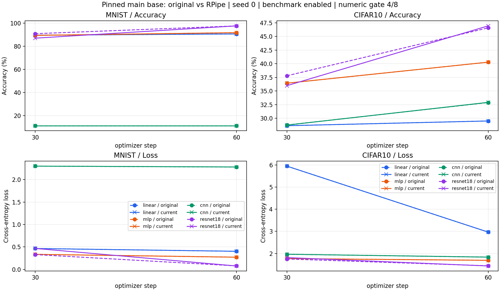
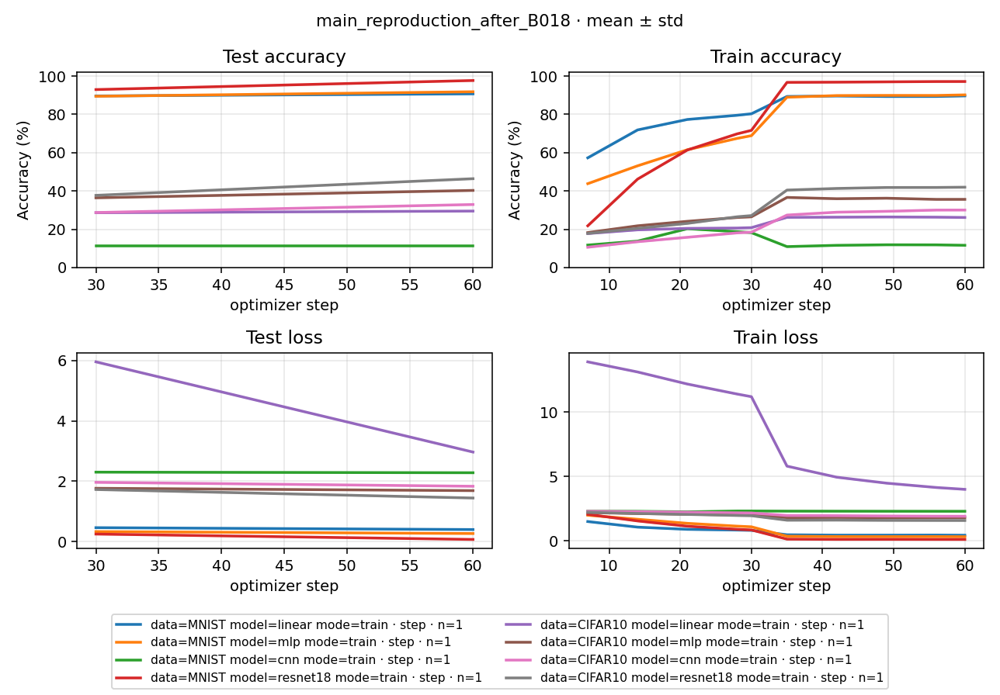

# Study Report: main_reproduction

## 2026-10-04：本机新结果与历史完整曲线导航

最新 dev `8bccbac` 在本机 Torch2.11.0+cu130 环境完成固定现代 main `98648f3` 的 60-step / eval30 八格对照，受控数值门 **8/8 通过**；16段参数、整数buffer、SGD、scheduler与Torch RNG一致，独立eval与自身Loss-best一致。采用原Stats全精度profile和deterministic=true / benchmark=false，详细原值、条件与CPU存档复核见 [CURRENT_DEVICE_RESULT](CURRENT_DEVICE_RESULT.md)、[当前设备计划](CURRENT_DEVICE_PLAN.md) 和 [独立CPU重载审计](CURRENT_DEVICE_CPU_RELOAD_AUDIT.json)。原默认非确定性与无profile常量条件未在这次新对照覆盖。

历史 README PNG 候选配方另在 [main_historical](../../main_historical/README.md) 完成四seed、32条连续80000-step训练及32条自身best独立eval，预先固定的终点/末段/七锚点/排序门通过，见 [完整报告](../../main_historical/docs/STUDY_REPORT.md)。参考值仍是PNG估读，未找回历史原始指标或实际seed集合；现代短预算对齐与历史曲线相近复现分别报告。

以下正文保留2026-10-03及此前的旧设备cu128、原默认严格门4/8、确定性8/8和200-step前缀探针记录。正文中的“尚未启动长实验”“历史图未通过”是这些记录当时的状态；旧JSON、失败、门限及源码快照未被后来的本机结果覆盖。全Study入口见 [Study 使用指南](../../README.md)。

## 2026-10-03：原设备结果与接续复核

2026-10-03。原 main 与 RPipe 各 **16/16 执行成功**；原默认 CUDA 配方的完整数值门 **4/8 通过**。完整确定性控制则 **8/8 通过**，step30/60 的参数、test Loss、test Accuracy 差值均为0，独立 eval 与 best 一致；训练均值存在浮点累加顺序造成的极小差异，详见下文。当前60-step计算在确定性条件下已对齐；原默认严格门与历史README图复现仍未通过，失败指标和执行前门限保留。

## 配方与证据

固定 main `98648f3a5c7db7dccf3ca806410d5b6fdee9484c`，本工作区 HEAD `d938874` 加未提交修复；精确源码 SHA-256 见 [SOURCE_MANIFEST](SOURCE_MANIFEST.json)。60 optimizer steps / step30、60 完整 test，batch250 / test1000，seed0，SGD lr0.1 / momentum0.9 / Nesterov / wd0.0005，cosine T_max60；Loss-best、独立 eval 加载 best。完整声明与执行前门限见 [PLAN](PLAN.md)。

32 个原始数据文件副本 SHA-256 一致；MNIST 60000/10000、CIFAR10 50000/10000 的全部像素和标签顺序一致。完整 train 按原 Stats(dim1)、顺序 batch250 重算，未使用六位小数替代原精度。8 个模型的初始化参数和初始化后 CPU RNG 一致，两个数据集的全部15000个采样索引一致；预检重建使用与 Flow 相同的 Factory / seed 设置。见 [DATA_PARITY](DATA_PARITY.json)、[PREFLIGHT_PARITY](PREFLIGHT_PARITY.json)。

原源码 40 个文件与 git archive 字节一致；包装仅记录初始化、复制 step30/60 存档。当前 checkpoint percent 仅增加同一时刻的证据快照。main 的段内记录时刻与 RPipe log_period7 不同，不改变评测、best 判断或预算。两套均单进程串行，每条首次执行；训练无恢复、无错误、无 launcher retry。独立 eval 的 resume 指向各自 best。

本机 Python3.13.9、torch2.11.0+cu128、torchvision0.26.0+cu128、Kornia0.8.3、NumPy2.3.5、RTX5090 D v2。原源码缺少的 evaluate / datasets / multiprocess / xxhash 仅安装在 .tmp；启动先导入 numpy，CPU threads2；原默认配方 benchmark=true / deterministic=false。其他约11.1GiB GPU负载保留。详细版本见 [ENVIRONMENT](ENVIRONMENT.json)。这不是历史依赖环境重建。

## 完整数值对照

两套 best 均选 step60。以下 Accuracy 为百分制；逐步 train/test Loss、参数差值、scheduler 状态与独立 eval 原值见 [FULL_COMPARISON](FULL_COMPARISON.json)，不从日志的四位显示值复算。

| 数据 | 模型 | main step30 Acc | RPipe step30 Acc | main step60 Acc | RPipe step60 Acc | 最大 test Loss 绝对差 | 最大参数/Buffer差 | 数值门 |
|---|---|---:|---:|---:|---:|---:|---:|---|
| MNIST | linear | 89.63 | 89.63 | 90.73 | 90.73 | 0 | 0 | 通过 |
| MNIST | mlp | 89.47 | 89.47 | 91.82 | 91.82 | 0 | 0 | 通过 |
| MNIST | cnn | 11.35 | 11.35 | 11.35 | 11.35 | 0.00126540661 | 0.00677612424 | 未通过 |
| MNIST | resnet18 | 90.93 | 87.06 | 97.68 | 97.70 | 0.136951916 | 8.97251892 | 未通过 |
| CIFAR10 | linear | 28.65 | 28.65 | 29.52 | 29.52 | 0 | 0 | 通过 |
| CIFAR10 | mlp | 36.44 | 36.44 | 40.30 | 40.30 | 0 | 0 | 通过 |
| CIFAR10 | cnn | 28.78 | 28.76 | 32.90 | 32.93 | 0.000105345249 | 0.000780571252 | 未通过 |
| CIFAR10 | resnet18 | 37.80 | 35.99 | 46.59 | 46.95 | 0.0640888453 | 12.54461 | 未通过 |

所有16个 step30/60 scheduler 状态一致；linear / mlp 的参数和test指标差值为0。CNN / ResNet18 超过门限。CIFAR10 ResNet18 的 RPipe best 周期评测为46.95%，独立 eval 为46.97%，相差2个正确样本；原代码自己的独立 eval Loss 也未通过 ≤1e-6 的同权重门。原值和失败判定保留，这里不额外开展已取消的独立 eval 诊断项目。



Rpipe 自动过程曲线按真实 optimizer step 绘制，test 坐标为30/60；每点 n=1、std=0仅描述单seed，不表示跨seed统计。见 [学习曲线](figures/learning_curves.png)、[NUMBERS](NUMBERS.md)。

## CUDA 差异控制实验

在隔离目录重复原 main 的3条训练，保持原默认 benchmark 配方。相同源码、数据和seed也产生超过门限的参数与指标差异；这证明原配方自身不保证逐位重现，不能仅据跨实现差异就认定为实现 bug。见 [REPEAT_COMPARISON](REPEAT_COMPARISON.json)。

| 原代码重复 | step | 第一次 Accuracy | 重复 Accuracy | 最大参数/Buffer差 |
|---|---:|---:|---:|---:|
| MNIST / resnet18 | 30 | 90.93 | 92.87 | 3.70469475 |
| MNIST / resnet18 | 60 | 97.68 | 97.63 | 4.9971447 |
| MNIST / cnn | 30 | 11.35 | 11.35 | 0.00333277881 |
| MNIST / cnn | 60 | 11.35 | 11.35 | 0.00433500111 |
| CIFAR10 / resnet18 | 30 | 37.80 | 29.88 | 5.06842899 |
| CIFAR10 / resnet18 | 60 | 46.59 | 46.72 | 7.26098537 |

4-step合成数据GPU对照开启确定性后8/8通过。随后完整真实数据60-step控制也完成：两套各16/16执行成功，数值门 **8/8通过**；全部step30/60参数、test Loss、test Accuracy差值为0，scheduler状态一致，best均为step60，所有独立eval与本实现best匹配。训练摘要的最大Loss绝对差为6.66e-16、Accuracy绝对差为1.42e-14个百分点，源于两套Python浮点均值累加顺序不同，远小于预定门限；完整原值保留在JSON中。

两套仅同改 deterministic=true / cudnn.deterministic=true / benchmark=false / CUBLAS_WORKSPACE_CONFIG=:4096:8，数据、统计、预算、评测和数值门保持。见 [DETERMINISTIC_COMPARISON](DETERMINISTIC_COMPARISON.json)、[DIAGNOSTIC_EXECUTION](DIAGNOSTIC_EXECUTION.json)。控制各条无错误或训练恢复，launcher无retry。结合原代码自身重复分歧，这支持CUDA非确定性参与原默认配方的差异；控制不替换原默认配方4/8结论。

## README 历史图的来源

逐字节核对发现，main README 的两张 Accuracy 图自 `4ccb28d0496110253e9f8e3f3df658853f07996b`（2024-01-08）以来未变，MNIST图展示约400个Epoch。该提交源码为 **80000 steps / eval200 / lr0.01 / batch250 / test250 / 4 seeds**，每步梯度裁剪max_norm=1，CNN含BatchNorm，CIFAR在CPU使用torchvision随机增强与std(0.2023,0.1994,0.2010)。这些条件与当前main60-step配方、无梯度裁剪、无BN的CNN、Kornia增强和原Stats明显不同。旧图Epoch坐标对应评测段序号；80000/200=400，对MNIST不等于完整数据遍历400轮。

这能定位候选历史配方，不能证明这些PNG当时一定来自该配置：Git中没有原运行配置、原始指标和checkpoint。已存档旧源码与 [HISTORICAL_PROVENANCE](HISTORICAL_PROVENANCE.json)。最终对照选择已向用户说明；尚未启动80000-step长实验，也未更改当前模型以猜测历史实现。

## 时间与可重跑入口

原main 16个子进程墙钟合计 **205.609s**；Rpipe launch外部计时 **125.277s**（包含父进程和聚合）。两者统计边界不同，且有共享GPU负载，不据此宣称算法加速。逐命令记录见 [ORIGINAL_EXECUTION](ORIGINAL_EXECUTION.json)、[CURRENT_EXECUTION](CURRENT_EXECUTION.json)。

```powershell
python -m rpipe make studies/main_reproduction --round 1 --num-gpus 1 --init-gpu 0 --console shared
python -m rpipe launch studies/main_reproduction --round 1 --num-gpus 1 --init-gpu 0 --console shared
python -m rpipe report studies/main_reproduction
```

这些命令默认复用已成功清单。独立从头复测需新version及重新make；shared原始数据和本轮精确Stats须按来源恢复，不能用profile命令覆盖成另一种统计。原源码、包装、诊断脚本及原始日志在 `.tmp/main-reproduction-20261003/`，正式数字证据在本目录；所有已有Study保留。原矩阵执行阶段未改生产源码，本地unit + integration c1/c2回归为282 passed / 3 deselected；后续B-017修改与复核见下节。

该矩阵阶段已核对2402个可读历史Study文件的size/mtime，均未改变；main_base的CIFAR10解压目录不可枚举，本轮未访问或修改。执行时源码和声明94文件与快照哈希一致，见 [PROTECTION](PROTECTION.json)。SOURCE_MANIFEST属于B-017之前的执行快照，后续源代码改动不覆盖它。

## 后续B-017修复与当前源码复核

发现Accuracy的既有topk参数展开了候选轴：3个样本、topk2时，6个预测索引无法与3个标签比较。修复共享函数，使任一候选命中即计为该样本正确。MetricBundle仍使用top1，没有新增配置键。最小回归`test_topk_accuracy_keeps_sample_axis`在修复前失败（`.tmp/metric-red-ab3d83106e99449eacd5d33ced97a9e1/`）；修复后本地unit + integration c1/c2 **283 passed / 3 deselected**，见 [测试报告](../../../.tmp/test-results/20261002T220008Z_f2b7db/report.md)。

修复后CPU原代码探针8/8通过；另用新临时Study重跑当前Rpipe全部8 train + 8 eval，以此前未修改的原main确定性存档对照。16/16执行成功、数值门8/8通过，全部step30/60参数与test Loss/Accuracy差值为0，scheduler一致，独立eval与best一致。见 [DETERMINISTIC_COMPARISON_AFTER_B017](DETERMINISTIC_COMPARISON_AFTER_B017.json)、[SOURCE_AFTER_B017_MANIFEST](SOURCE_AFTER_B017_MANIFEST.json)。本次launch外部墙钟86.401s，无训练恢复或retry；原默认4/8与旧快照都保留，未用新结果改写原始证据。

历史模型、增强、裁剪与旧best比较缺陷的进一步核对见 [HISTORICAL_AUDIT](HISTORICAL_AUDIT.md)。归档旧best逻辑不修改，也不让当前正确的全程best逻辑退回旧行为。最终对照选择仍待明确，80000-step长实验尚未执行。

## 历史候选的短接入对照

通过现有DataRegistry / ModelRegistry注册临时适配器，旧模型和旧dataset原样接入当前TrainAlgorithm，真实MNIST / CIFAR10 × 4模型的4-step/eval2对照 **8/8通过**。保留旧CNN的4层BN、CPU逐样本增强/常量归一化、SGD lr0.01、clip1、cosine T_max80000；采用相同CUDA确定性控制，每次test完整10000张。step2/4全部参数与buffer差值0、scheduler一致，采样和实际增强后输入哈希相同；test Loss/Accuracy只有约1e-15的累加差异。

证据及限制见 [历史审计短对照](HISTORICAL_AUDIT.md)、[HISTORICAL_BRIDGE](HISTORICAL_BRIDGE.json)。这证明已有接入方式可用，不证明80000-step/eval200/4-seed历史图已复现；未修改生产代码，未新增兼容配置，未运行长实验。91个生产源文件与最近已验快照相同，沿用283项本地回归；本次新增验证为实际短对照及原始文件保护核对。

## 后续B-018零评测预算修复

共享eval入口拒绝零batch预算，避免先评一批再判断上限而生成不符合预算的指标。配置缺省/负数的完整test及正数限批回归通过；修复后本地unit + integration c1/c2门286 passed / 3 deselected，[测试报告](../../../.tmp/test-results/20261002T221619Z_6a712b/report.md)。main原代码固定输入CPU探针重新8/8通过，step2/4参数及指标差值0，见 [CPU_PARITY_AFTER_B018](CPU_PARITY_AFTER_B018.json)。

新的91文件源码快照见 [SOURCE_AFTER_B018_MANIFEST](SOURCE_AFTER_B018_MANIFEST.json)，与B-017仅eval_hook.py不同。此前完整GPU与历史短对照证据均属于各自执行时快照，不覆盖原值；该修复阶段先完成CPU验证，不能把旧GPU执行记为B-018之后的运行。后续完整当前源码GPU复核见下节。

## B-018之后当前源码的完整GPU复核

以新的临时Study/version运行8 train + 8 eval，当前16/16成功，数值门8/8通过。真实数据、完整test、固定Stats、60-step/eval30和CUDA确定性控制保持；对照此前未修改的原main确定性存档，原代码不再次执行。全部step30/60参数与test Loss/Accuracy差值0、scheduler一致、best均step60，独立eval与各自best一致。train Loss/Accuracy最大差6.66e-16/1.42e-14，为浮点均值累加差异。

见 [DETERMINISTIC_COMPARISON_AFTER_B018](DETERMINISTIC_COMPARISON_AFTER_B018.json)、[SOURCE_AFTER_B018_MANIFEST](SOURCE_AFTER_B018_MANIFEST.json)。make外部墙钟0.410s、launch86.176s；所有当前Run均一次start、无error，train无resume、launcher无retry。91个源文件与快照哈希相同、2402个可读旧Study文件size/mtime未变，两份源码归档分别40/36文件逐字节未变。生产代码未再变更，沿用286项本地回归。



图按实际optimizer step，test坐标30/60，每点n=1，已目检。旧图、旧Run及原默认严格门4/8都保留。该证据补齐当前源码计算验证；历史图仍未复现，最终按当前main源码控制对照还是README历史图验收，仍待用户选择。

## 历史原始证据搜索

本地150个可达提交及旧祖先39个提交的文件路径搜索未找回历史指标/权重；范围不含未提交文件、未fetch远端或外部存储。两张PNG自身记录Matplotlib3.7.1，而旧requirements为3.7.0，只能确定绘图软件，无法证明原训练环境。详见 [历史审计](HISTORICAL_AUDIT.md)、[HISTORICAL_EVIDENCE_SEARCH](HISTORICAL_EVIDENCE_SEARCH.json)。

仅执行原make.py的生成阶段，核对32 train + 32独立test命令，没有运行这些命令。单套历史候选需256万次optimizer更新、6.4亿train样本处理和1.28亿曲线test样本处理；两套对照翻倍，未据短探针猜运行时长。最终对照对象已再次向用户询问，候选长实验保持未执行。

## 用户限定的历史超参前缀探针（2026-10-03）

用户随后选择历史README图对应超参，明确本轮只做到探针，不执行长实验。新200-step/eval200、seed0的8格真实数据前缀对照8/8通过；保留历史BN、CPU增强/常量统计、clip1和scheduler T_max80000，统一CUDA确定性控制。参数/整数buffer差值0，初始化/最终RNG、采样及实际增强输入哈希相同；Loss只有约1e-16的累计顺序差异，正确样本数严格一致。

独立读取两边存档checkpoint、当前实际SGD组/scheduler、tracker指标和JSONL坐标复核8/8。内部总墙钟148.740s，分项时间、原值、脚本哈希及证据边界见[前缀探针报告](HISTORICAL_PREFIX_PROBE.md)与[逐格JSON](HISTORICAL_PREFIX_PROBE.json)。没有新生产bug或生产源码改动；BUGS不再在“开放”下列已关闭说明。用户限定的本轮范围已完成，不将该结论替代80k/4-seed曲线、独立eval或历史实际环境复现。
