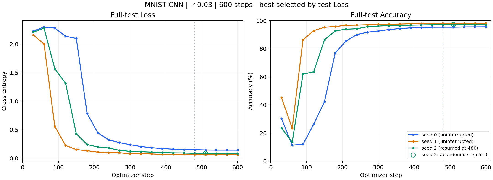
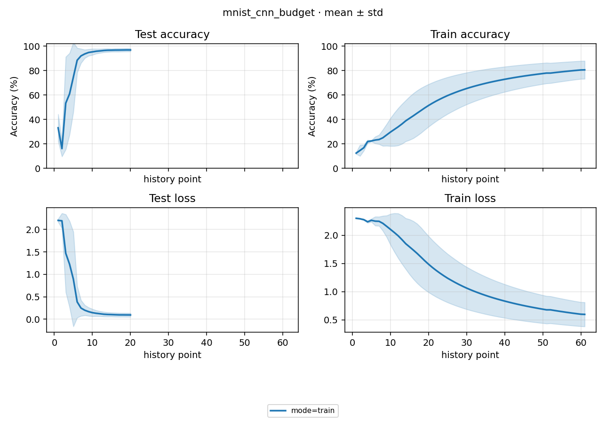

# Study Report: MNIST CNN 600-step

执行于 2026-10-02 23:59 至 2026-10-03 00:00（Asia/Shanghai）。计划见 [PLAN](PLAN.md)，自动数字表见 [NUMBERS](NUMBERS.md)。

## 1. 结论

lr 0.03、cosine T_max=600 的配方能让现有 CNN 明显学起来：最终 test Accuracy 分别为 **95.58%、98.07%、97.14%**，best / last 均在 step 600，三组独立 eval 与 best 一致。最终 6/6 succeeded；seed 0 / 1 无中断，seed 2 因一次 checkpoint 文件替换失败从 step 480 恢复。后三 seed 的汇总包含一条恢复训练，不能称作三条无中断复测。

早期仍有明显回落：step 30→60 的 Accuracy，seed 0 为 30.50→11.39%，seed 1 为 45.37→23.47%，seed 2 为 23.66→13.52%。随后分别在 step 240 / 120 / 180 超过 90%，末段保持较高准确率。现有证据支持“短预算可能停在早期不稳定阶段”，不证明单类别塌缩的机制，也不证明 lr 0.03 全局最优。

## 2. 配方与比较边界

MNIST 全量 train 60000 / test 10000；batch 250、test batch 1000。CNN 四层通道 [64,128,256,512]、1,554,954 参数，无 BN / dropout；沿用 Normalize（train mean 0.130660、std 0.308108），MNIST 的 augment=true 不增加 flip / crop。SGD lr 0.03、momentum 0.9、Nesterov、weight decay 0.0005、无梯度裁剪；cosine T_max=600、eta_min=0。

train 每 10 step 记录，test 每 30 step 全量评估，latest 每 30 step。best 按 test Loss 最低选择，独立 eval 在同一个 test split 复算 sibling best；这验证权重来源和执行一致性，不是额外未见数据的泛化估计。每条干净训练 600 次更新 / 150000 次采样，约为训练集规模的 2.5 倍。

版本 `cnn-600step-20261002`。运行环境 Python 3.13.9、torch 2.11.0+cu128、torchvision 0.26.0+cu128、Kornia 0.8.3、RTX 5090 D v2；deterministic=false、cudnn_benchmark=true。代码为 HEAD `359713704ea06f26409fa059705142d5b1389688` 加现有未提交改动（含 checkpoint / 重试修复），不是仅由该 commit 可重现的环境。

旧 [60-step 轮](../../mnist_cnn_lr/docs/STUDY_REPORT.md) 的 lr 0.03 last Accuracy 为 46.4533±6.8611%；本轮观察到更高分数。但 T_max 60→600 使前 60 步 lr 轨迹不同，评测频率 5→30 改变 best 候选集合，不能将全部差异归因于多训练步数。两轮软件状态也有保存 / 日志修复差异。

## 3. Experiment 汇总与逐 seed 证据

以下 std 均为样本标准差（n−1），Accuracy 单位为 %，Loss 为交叉熵。三条 best 均等于 last，所以 best / last 的聚合相同。

| 纳入范围 | n | last / best Accuracy mean±std | last / best Loss mean±std |
|---|---:|---:|---:|
| 无中断 seed 0 / 1 | 2 | 96.8250±1.7607 | 0.101692±0.057774 |
| 当前 index 全部 seed，含恢复 seed 2 | 3 | 96.9300±1.2582 | 0.096323±0.041897 |

NUMBERS 的 n=3 聚合是当前清单的描述性统计，不能替代三个 seed 的无中断对照。尤其 seed 2 的 `elapsed_seconds=6.911s` 只计最后一次恢复执行，不是完整训练成本；train mean 是累积段均值，恢复后段边界改变，不能当作最后 batch 或相同窗口比较。

| seed | 执行 | last Loss / Accuracy | best step | best Loss / Accuracy | 独立 eval Loss / Accuracy |
|---:|---|---|---:|---|---|
| 0 | 无中断 | 0.142544 / 95.58% | 600 | 0.142544 / 95.58% | 0.142544 / 95.58% |
| 1 | 无中断 | 0.060839 / 98.07% | 600 | 0.060839 / 98.07% | 0.060839 / 98.07% |
| 2 | step 480 恢复 | 0.085587 / 97.14% | 600 | 0.085587 / 97.14% | 0.085587 / 97.14% |

Loss best 不必是 Accuracy 最大的点：seed 1 Accuracy 峰值为 step 570 的 98.08%，seed 2 为恢复后 step 540 的 97.26%。seed 0 的 best 与 Accuracy 峰值均在 600。末段小幅 Accuracy 波动与继续下降的 Loss 可以同时出现。

## 4. 曲线

主图按 `scalars.jsonl` 中的实际 optimizer step 绘制，每个 seed 一条线，不按观测序号跨 seed 对齐。seed 2 的 step 510 有两个观测：主线采用恢复后观测；保存失败前的旧观测以空心圈保留，step 480 竖虚线标出恢复起点。该图是本轮诊断输出，不修改通用 process 契约。

step 480→600，seed 0 Loss 0.149975→0.142544、Accuracy 95.38→95.58%；seed 1 Loss 0.064844→0.060839、Accuracy 97.98→98.07%。改善已减缓，但 cosine 也接近零，不能据此证明更长训练不会改善，或已经达到模型上限。最终 95% 以上的全量 test 准确率排除了最终“全部预测同一类别”的情况；没有额外执行预测分布探针。

框架原生图保留如下，横轴遵循现有“history point”契约：

seed 0 / 1 各有 61 个 train、20 个 test 观测；seed 2 为 64 个 train、21 个 test（包含重播记录）。原生聚合按观测序号对齐，重复 step 后各 seed 不再对应同一步，尾部有效 n 也会变化。该图只作原始输出展示，跨 seed 的实际 step 走势以主图为准。train 的末尾重复和恢复前后累积段均值也不能当作局部 batch 学习曲线。

## 5. 执行成本、恢复与文件保护

单 GPU 0、最多 2 并发：train wait [seed 0,1] → [seed 2] → train 重试 → eval wait [seed 0,1] → [seed 2]。整轮内置估时 126s，人工保守参考 256s；实际 launcher（含 process）**72.311s**，首个 flow start 至最后一个 succeeded **69.961s**。实际并发训练流约 26s，未据这一轮修改通用估时模型。

| wait | mode | seed | Run / log | est 本机 / 内置（s） | actual flow（s） |
|---:|---|---:|---|---:|---:|
| 1 | train | 0 | [cb3e0009eae4d66b](../runs/cb3e0009eae4d66b/assets/logs/run.log) | 120 / 58 | 26.223 |
| 1 | train | 1 | [7a73df1b02869b59](../runs/7a73df1b02869b59/assets/logs/run.log) | 120 / 58 | 26.127 |
| 2 + retry | train | 2 | [032cf3b849f5673a](../runs/032cf3b849f5673a/assets/logs/run.log) | 120 / 58 | 31.220（含失败、重启间隔） |
| 3 | eval | 0 | [dcb6b5e904073e97](../runs/dcb6b5e904073e97/assets/logs/run.log) | 8 / 5 | 5.494 |
| 3 | eval | 1 | [c88be77461e7326c](../runs/c88be77461e7326c/assets/logs/run.log) | 8 / 5 | 5.234 |
| 4 | eval | 2 | [d18a81b715f60ab8](../runs/d18a81b715f60ab8/assets/logs/run.log) | 8 / 5 | 4.649 |

2026-10-03 00:00:23.838，seed 2 在 step 510 保存 latest 时，`.latest.writing/meta.json` 替换 `latest/meta.json` 报 `PermissionError: [WinError 5]`，落点 `system/factory.py` 的 `source.replace(target)`。进程退出 1；调度器在 eval 之前重试，00:00:27.112 明确恢复 `latest epoch=1 step=480`，最终继续到 600。整包提交保护生效，未从部分更新的分件误读 step 510；三条 eval 都加载各自最终 best step 600。

seed 2 实际执行了 510+120=630 次更新，其中 30 次随后回滚；保存的最终步数仍为 600。恢复会重播采样前缀，完整 RNG / 迭代位置未恢复，因此其训练轨迹不等价于无中断运行。原始日志 / scalars 保留失败前观测。新的文件替换问题记录为 [B-013](../../../docs/BUGS.md)，尚未定位锁定来源；不把自动恢复称为机器环境问题已修复，也不凭该现象重新打开已关闭的 B-007。

验证脚本核对了新配置 / 身份、wait 波次、实际使用 lr 的 cosine 轨迹、最终 latest / best optimizer 与 scheduler 状态（T_max=600、last_epoch=step）、3 组权重来源与指标一致性，以及旧 main_base / mnist_cnn_lr / checkpoint_recovery 的 index、process、result、日志内容哈希和 checkpoint 大小 / mtime 均未变。MNIST 10 个缓存文件复制后 SHA-256 一致。临时证据在 `.tmp/cnn-budget-20261002/`；正式报告、配置和图片可入库，Run / 缓存 / 调度产物按 gitignore 忽略。

## 6. 下一步

2026-10-03 跟进：B-013 的有界原子替换修复已通过原生 Windows 句柄与回归验证，seed 2 新 version 无中断补测 97.12%，见 [补测报告](../../mnist_cnn_budget_repeat/docs/STUDY_REPORT.md)。上文保留本轮实际恢复证据，三 seed 无中断描述性统计见补测报告；小型矩阵已完成 24/24，见 [矩阵报告](../../local_model_matrix/docs/STUDY_REPORT.md)。

本轮完成时的建议（现已按上面的跟进收口）：先针对 B-013 定位 checkpoint 文件替换失败的来源，再用新 version 补 seed 2 的无中断复测。现有实验已经回答“CNN 能否在本地更长预算学起来”，但未满足“三 seed 全无中断”。补齐后再考虑 MNIST / CIFAR10 中少量既有模型的多 seed 对照，单独固定预算、评测与学习率策略并估时，不立即扩大为全网格。
