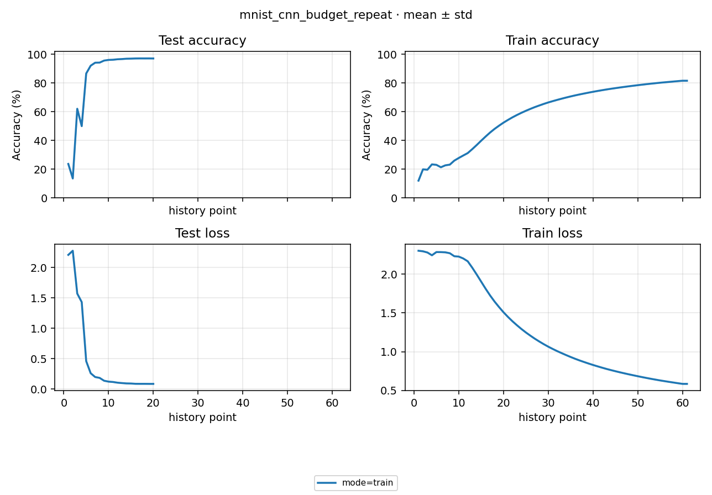

# Study Report: seed 2 无中断补测与 B-013 验证

2026-10-03 00:24:22–00:24:47（Asia/Shanghai），计划见 [PLAN](PLAN.md)，数字见 [NUMBERS](NUMBERS.md)。

## 1. 结果

新 version `cnn-600step-seed2-fixed-20261003` 的 seed 2 train / eval **2/2 succeeded**。train 从头完成 600 steps，没有训练恢复或 execute 错误；20 次全量 test、61 个 train 观测。last / best 均在 step 600：Loss **0.086707**，Accuracy **97.12%**；独立 eval Loss 0.086707317、Accuracy 97.12%，与 best 一致。

与原 [600-step Study](../../mnist_cnn_budget/docs/STUDY_REPORT.md) 的无中断 seed 0 / 1（95.58% / 98.07%）合起来，三 seed 的描述性统计为 Accuracy **96.9233±1.2566%**、Loss **0.096697±0.041758**（样本 std，n=3；已从原始 result 复核）。其中 seed 2 来自不同 version / 启动轮及文件 IO 修复后的工作区；不把原恢复 seed 2 重复计入。n=1 的 NUMBERS 显示 std=0 是工具约定，不代表已估计稳定性。

早期仍有回落：step 30 / 60 Accuracy 23.66% / 13.52%，step 90 / 120 为 62.09% / 49.97%；step 180 达 92.10%，末段约 97%。Loss 最低在 600，Accuracy 峰值 97.16% 在 510 / 570，符合按 Loss 选 best 的契约。单次未再失败不证明原占用进程消失。

## 2. 图与配方

横轴为原生观测序号；本轮只有一个 seed，不涉及跨 seed 对齐。train mean 为累积段均值，不是末批准确率。完整配方沿用原 Study：全量 MNIST、batch 250 / test 1000、CNN、Normalize、SGD lr 0.03 / momentum 0.9 / Nesterov / weight decay 0.0005、cosine T_max=600，无梯度裁剪；train log 10、test / latest 30、best=test Loss。deterministic=false、cudnn_benchmark=true，不承诺逐位重现。

Python 3.13.9、torch 2.11.0+cu128、torchvision 0.26.0+cu128、Kornia 0.8.3、RTX 5090 D v2；HEAD `359713704ea06f26409fa059705142d5b1389688` 加未提交改动。原 60-step 的 scheduler / 评测频率不同，仍不能将提升全归因于步数。独立 eval 在同 test split 复算，属于来源 / 执行一致性验证。

## 3. B-013 原因与修复验证

原失败是 step 510 的 `.latest.writing/meta.json` → `latest/meta.json` 裸 Path.replace 报 WinError 5。事后文件非只读、ACL 未见显式 Deny，不能重建失败时占用者身份。

本机以 CreateFileW 打开目标、未指定 FILE_SHARE_DELETE，真实 Path.replace 复现 winerror=5；释放句柄后成功。Windows 对删除共享的规定见 [Microsoft CreateFileW 文档](https://learn.microsoft.com/en-us/windows/win32/api/fileapi/nf-fileapi-createfilew)。这证明一种匹配的失败机制，不证明原事件由哪个进程造成。

代码缺口是 checkpoint 分件、旧快照迁移和最终整包替换没有有限重试。现在与文本原子写入共用 `artifact._atomic.atomic_replace`：只对 Windows 5 / 32 / 33 最多尝试 6 次，间隔 50 / 100 / 150 / 200 / 250ms，总等待最多 750ms；持续失败抛原异常，不删除目标、不改 ACL、不绕过整包提交。

原生 Windows 探针在 latest/meta.json 与 latest.pt 两个位置各验证一次短暂占用和一次持续占用：200ms 释放后保存约 0.309s 成功、没有重启训练；持续占用约 0.760s 后报错，旧整包内容哈希不变，目录加载也返回旧整包；释放后下一次保存正常。这验证有界处理与旧档保护，不能承诺所有外部 IO 故障均消失。

代码验证：定向 63 项通过（首次使用默认 pytest 临时目录的执行在 setup 遇到目录拒绝访问，失败记录保留；改用新的 `.tmp/` 子目录后通过）；core **225 passed**，报告 `.tmp/test-results/20261002T161753Z_31f622/report.md`；本地 integration **14 passed**，报告 `20261002T161847Z_bf04db/report.md`。真实句柄证据 `.tmp/checkpoint-winlock-20261003/native_evidence.json`。core / integration 时间戳使用 UTC，换算本地为 10-03。

## 4. 排班、成本与保护

GPU 0，train 成功后单独 eval，两组 wait。内置估时 63s，人工参考 68s；实际 launcher（含 process）**28.486s**，flow 包络 **25.299s**。

| mode | seed | Run / log | est 内置 / 人工（s） | actual flow（s） |
|---|---:|---|---:|---:|
| train | 2 | [488fd0974795ae18](../runs/488fd0974795ae18/assets/logs/run.log) | 58 / 60 | 19.508 |
| eval | 2 | [0825131829b320a8](../runs/0825131829b320a8/assets/logs/run.log) | 5 / 8 | 5.005 |

preflight 身份和缓存哈希通过；结束后验证实际 cosine lr、latest / best scheduler 和 optimizer 与 step 一致、eval 权重来源与指标一致，以及原 main_base / mnist_cnn_lr / checkpoint_recovery / mnist_cnn_budget 的配置、index / process / result / 日志内容哈希和 checkpoint 大小 / mtime 未变。临时脚本 / 证据留 `.tmp/b013-followup-20261003/`，运行产物按 gitignore 忽略。

B-013 的代码鲁棒性修复和补测已完成；原外部文件占用者尚未识别，若后续持续拒绝，保留原错误并按具体环境证据处理。后续已授权的小型矩阵也已完成 24/24，见 [矩阵报告](../../local_model_matrix/docs/STUDY_REPORT.md)。

## 5. 360 开关诊断（2026-10-03 跟进）

用户先报告关闭杀毒软件，后明确产品为 360 并重新开启；两轮均沿用上面的 seed 2 / 600-step 配方和 IO 修复。具体防护组件、例外名单及全程状态未独立核验。进程局部观察器记录每次 checkpoint Path.replace 的返回及原异常，不改变重试策略。

| 用户报告的状态 / version | 本地执行时间 | train / eval | 替换成功 / 尝试 | OSError | best / eval Accuracy、Loss | launcher |
|---|---|---|---:|---:|---|---:|
| 关闭 / `cnn-600step-seed2-av-off-20261003` | 01:29:30–01:29:54 | 2/2 成功 | 380 / 380 | 0 | 96.77%、0.097044474 | 26.550s |
| 重新开启 / `cnn-600step-seed2-av-on-20261003` | 01:44:58–01:45:24 | 2/2 成功 | 390 / 390 | 0 | 97.39%、0.079771136 | 28.159s |

两轮都从头完成 600 步，原失败 step 510 正常保存，无 execute 错误、训练恢复或重启；best 均在 600，与独立 eval 一致。各有 21 次 latest 保存（含收尾重复），best 分别保存 17 / 18 次，因此后一轮多 10 次文件替换。每条 train 的 20 个 test / 61 个 train 观测、optimizer / scheduler / 实际 lr、eval 来源和旧产物保护检查通过。

观察器的训练进程记录均存在，分别为 `.tmp/av-off-retest-20261003/io/43868.json` 与 `.tmp/av-on-retest-20261003/io/107960.json`；故零错误不仅指最终成功，也包括没有被有界重试处理掉的 Path.replace 错误。观察器只覆盖该路径，不是全系统句柄跟踪，且正常退出时才落盘。两轮均未复现，不能据此确定或排除 360 为原占用者；单轮耗时、精度差异也不能归因于开关状态。

整理时，两份一次性诊断目录完整移到 `.tmp/diagnostics/360-retest-20261003/`，配置、结果、权重、图与日志均保留。它们不再作为正式 Study 入库，也不纳入本报告 §1 的无中断三 seed 聚合。以下为仅本机可用的原始日志：

| 状态 | train 日志 | eval 日志 |
|---|---|---|
| 关闭 | [7994521c8f038f19](../../../.tmp/diagnostics/360-retest-20261003/mnist_cnn_budget_repeat_av_off/runs/7994521c8f038f19/assets/logs/run.log) | [0b0ae371f5e88c8d](../../../.tmp/diagnostics/360-retest-20261003/mnist_cnn_budget_repeat_av_off/runs/0b0ae371f5e88c8d/assets/logs/run.log) |
| 重新开启 | [8ce010056f4949f4](../../../.tmp/diagnostics/360-retest-20261003/mnist_cnn_budget_repeat_av_on/runs/8ce010056f4949f4/assets/logs/run.log) | [345926d075d2f80f](../../../.tmp/diagnostics/360-retest-20261003/mnist_cnn_budget_repeat_av_on/runs/345926d075d2f80f/assets/logs/run.log) |

原始检查与计时仍在 `.tmp/b013-followup-20261003/` 的两个同名诊断子目录；其中历史绝对路径描述当时位置，不据此直接在正式 studies 目录重新启动。正式结论以上表为准，Git clone 不包含 `.tmp/` 的本地证据。
