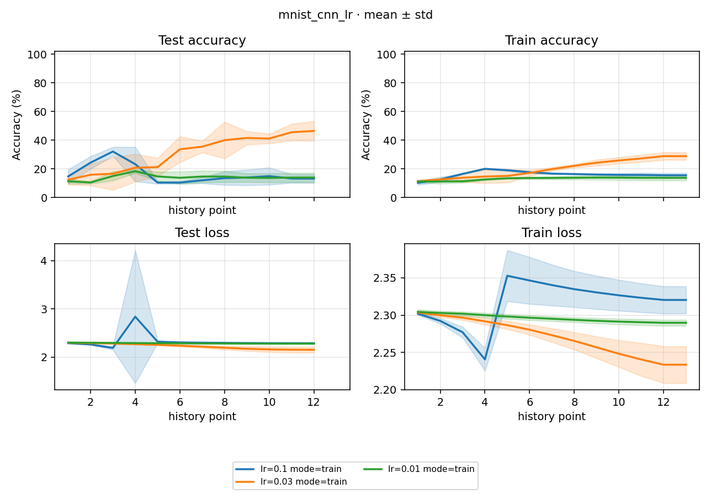

# Study Report: mnist_cnn_lr

> Date: 2026-10-02 · [PLAN.md](PLAN.md) · [NUMBERS.md](NUMBERS.md)
> 比较版本：`cnn-lr-clean-20261002`，18/18 Run succeeded，无失败、无 retry。
> 首轮 `cnn-lr-20261002` 留作故障证据，整轮不进入下列比较。Accuracy 为百分制，Loss 为原量纲。

## 1. 结论与范围

在固定 60-step 的 MNIST CNN 实验中，lr 0.03 的三个 seed 均比 lr 0.1 有更高的最终 Accuracy，也均高于后者 Loss-best checkpoint 的 Accuracy。最终 Accuracy 从 **13.16 ± 3.09%** 提高至 **46.45 ± 6.86%**；lr 0.01 为 **13.92 ± 3.28%**。这里是三个 seed 的均值 ± 样本标准差，不是置信区间。

这支持“原配方在该短预算下对学习率敏感”，不能证明 0.03 是最优学习率，也不能证明具体梯度机制。尤其 lr 0.1 的平均 best Loss 仍低于 0.03：Accuracy 改善不等于所有指标改善。本轮不修改 main_base 默认配方，不把一次调参变成其他模型或数据集的结论。

干净比较耗时 **86.049s**，初始排班估计 150s。期间还确认了 checkpoint 发布、恢复和 eval 依赖方面的问题；本轮完成时建议先处理可靠性缺陷，再扩大训练预算，后续进展见 §9。

## 2. 实验设计与执行

三档初始 lr（0.1 / 0.03 / 0.01）× seed 0 / 1 / 2 × train / eval，共 9 train + 9 独立 eval。配方变量只有初始 lr，其余保持一致：

- MNIST train 60000 / test 10000；batch 250、test batch 1000；60 optimizer step 即 15000 次训练采样，**不是 60 epoch**。
- CNN hidden=[64,128,256,512]，1,554,954 个参数；仅 Normalize，mean 0.130660、std 0.308108。配置虽为 augment=true，MNIST 不施加随机增强。
- SGD、momentum 0.9、Nesterov、weight decay 5e-4、无 clipping；cosine T_max=60、eta_min=0。
- 每 5 step 记录 train 并评完整 test；latest 每 30 step，best 按最低 test Loss；eval 读取同 lr / seed / version 的 sibling best。
- GPU 0，最多两条 Run 并发，5 个 train wait 后接 5 个 eval wait；不将并行墙钟时间当成单算法耗时。

执行前复用了 main_base 的 MNIST 缓存副本，10 个文件哈希一致，没有重新下载。原 main_base 的 370 个 Run / index / process 文件前后哈希一致。旧 main CNN 与当前 CNN 的结构、初始化和参数张量对照一致；该检查不是旧 main 完整训练的重新运行。

环境沿用 [main_base 报告](../../main_base/docs/STUDY_REPORT.md)：Windows 11（10.0.26200）、Python 3.13.9（`D:\anaconda3\python.exe`）、torch 2.11.0+cu128、torchvision 0.26.0+cu128、Kornia 0.8.3、RTX 5090 D v2（24455 MiB）。本轮 `deterministic=false`、`cudnn_benchmark=true`，不承诺逐位确定性；HEAD `359713704ea06f26409fa059705142d5b1389688` 加未提交改动，不是仅 checkout 此 SHA 即可复现的干净提交。

实际命令（第二轮先将 version 改为 `cnn-lr-clean-20261002`，再核对 fresh config / checkpoint）：

```powershell
python -B -m rpipe make studies/mnist_cnn_lr --num-gpus 1 --init-gpu 0 --round 2 --console shared
python -B -m rpipe launch studies/mnist_cnn_lr --num-gpus 1 --init-gpu 0 --round 2 --console shared
python -B -m rpipe report studies/mnist_cnn_lr
```

干净版本从 22:10:50.377 至 22:12:16.426（UTC+08:00）。复跑采用标准提权执行，没有修改 ACL 或安全软件配置；成功复跑不证明首轮 Windows 失败的根因已被找到或修复。

## 3. Learning curves

[](./figures/learning_curves.png)

每档线为三个 seed 的均值，阴影为 ± 样本标准差（`statistics.stdev`，分母 n−1）；不是置信区间。曲线来自 train Run 的密集 JSONL，独立 eval 不拼进学习曲线。

横轴是**观测序号，不是 optimizer step**。每条 train 有 13 个观测：前 12 个对应 step 5、10、…、60，第 13 个为 step 60 收尾快照；每条 test 有 12 个 full-test 观测。train 指标是本 epoch 起到观测时的样本加权累积均值，不是最近五步窗口均值。全部九条已核验点数、最终 step 60 与实际 cosine LR。

## 4. 跨 seed 汇总

下表直接采用当前 `process.json` 的聚合口径；每档 n=3，std 为样本标准差。last 指 step 60 的 test；best/eval 指最低 test Loss 对应权重的独立评测。

| lr | last Accuracy (%) | last Loss | best/eval Accuracy (%) | best/eval Loss |
|---|---:|---:|---:|---:|
| 0.1 | 13.1567 ± 3.0860 | 2.2891 ± 0.0086 | 31.3467 ± 7.1086 | 2.0789 ± 0.0593 |
| 0.03 | 46.4533 ± 6.8611 | 2.1534 ± 0.0591 | 46.4533 ± 6.8611 | 2.1534 ± 0.0591 |
| 0.01 | 13.9233 ± 3.2773 | 2.2802 ± 0.0059 | 13.9233 ± 3.2773 | 2.2802 ± 0.0059 |

lr 0.1 的 best 位于 step 15–20，之后三个 seed 均退化；0.03 与 0.01 的 Loss-best 都在 step 60。0.01 在该预算下学习不足，不能由此推断更长训练时也差。0.03 的最后 Accuracy 较好，但仍只有 40.57–53.99%，不是已经训好的 MNIST 基线。

## 5. 九组 last / best / eval 明细

Loss 六位小数、Accuracy 两位小数；best 不按最高 Accuracy 选择。九组 eval 的 Accuracy 与 best 相同，Loss 最大绝对差约 2.39e-8（核验容差 1e-5）；未将微小浮点差异写成“逐位相同”。

| lr | seed | last Loss / Acc (%) | best step | best Loss / Acc (%) | eval Loss / Acc (%) |
|---|---:|---:|---:|---:|---:|
| 0.1 | 0 | 2.282566 / 11.35 | 20 | 2.043166 / 23.14 | 2.043166 / 23.14 |
| 0.1 | 1 | 2.285927 / 16.72 | 15 | 2.147297 / 35.59 | 2.147297 / 35.59 |
| 0.1 | 2 | 2.298872 / 11.40 | 20 | 2.046204 / 35.31 | 2.046204 / 35.31 |
| 0.03 | 0 | 2.202136 / 44.80 | 60 | 2.202136 / 44.80 | 2.202136 / 44.80 |
| 0.03 | 1 | 2.087745 / 53.99 | 60 | 2.087745 / 53.99 | 2.087745 / 53.99 |
| 0.03 | 2 | 2.170468 / 40.57 | 60 | 2.170468 / 40.57 | 2.170468 / 40.57 |
| 0.01 | 0 | 2.285202 / 11.49 | 60 | 2.285202 / 11.49 | 2.285202 / 11.49 |
| 0.01 | 1 | 2.273767 / 17.65 | 60 | 2.273767 / 17.65 | 2.273767 / 17.65 |
| 0.01 | 2 | 2.281698 / 12.63 | 60 | 2.281698 / 12.63 | 2.281698 / 12.63 |

## 6. 预测分布：低分是否只是指标展示问题

只读加载九条 train 的 latest 权重，在相同 runtime 设置下重新推理全部 10000 张 test 图片，没有更新权重。重算 Accuracy 与原始记录的差值均小于 6e-7 个百分点。

| lr | seed | 最常预测类别 | 该类别预测数 / 10000 | 有预测的类别数 |
|---|---:|---:|---:|---:|
| 0.1 | 0 | 1 | 10000 | 1 |
| 0.1 | 1 | 7 | 5286 | 5 |
| 0.1 | 2 | 7 | 9885 | 2 |
| 0.03 | 0 | 2 | 3442 | 7 |
| 0.03 | 1 | 3 | 3111 | 8 |
| 0.03 | 2 | 3 | 3573 | 7 |
| 0.01 | 0 | 3 | 9859 | 3 |
| 0.01 | 1 | 0 | 8420 | 5 |
| 0.01 | 2 | 0 | 8707 | 4 |

lr 0.1、seed 0 确实将所有图片预测为类别 1，正好命中 test 中的 1135 个“1”，因此 Accuracy 为 11.35%；seed 2 的 98.85% 预测集中在类别 7。此处确认的是输出退化现象，不是仅凭分布就确认梯度爆炸、ReLU 死亡或其他内部机制。lr 0.03 分布有所展开，但仍有从未预测的类别，不能宣称已经解决学习不足。

首次独立诊断未对齐 runtime 设置，严格数值比较未通过；对齐原运行配置后才形成上述记录。这是只读诊断条件校正，不是新的训练失败。完整计数留在本地 `.tmp/cnn-lr-20261002/predictions.json`。

## 7. Run 证据与时间

初始估计来自启动前 jobs；flow 是该 Run 的 `[flow] start` 到 `[flow] succeeded`；algorithm 是结果中的 `elapsed_seconds`，不含完整 prepare。并发 Run 耗时不能相加冒充墙钟时间。

| lr | seed | mode | Run / log | 初估 (s) | flow (s) | algorithm (s) |
|---|---:|---|---|---:|---:|---:|
| 0.1 | 0 | train | [08fb0e1aa3cf17ef](../runs/08fb0e1aa3cf17ef/assets/logs/run.log) | 25 | 11.995 | 9.911 |
| 0.1 | 1 | train | [f6fa5a0350b95007](../runs/f6fa5a0350b95007/assets/logs/run.log) | 25 | 11.945 | 9.864 |
| 0.1 | 2 | train | [35a3d6e02c308f83](../runs/35a3d6e02c308f83/assets/logs/run.log) | 25 | 11.771 | 9.644 |
| 0.1 | 0 | eval | [97ff6196b8fba398](../runs/97ff6196b8fba398/assets/logs/run.log) | 5 | 4.283 | 2.135 |
| 0.1 | 1 | eval | [6d9539d2b1f80a48](../runs/6d9539d2b1f80a48/assets/logs/run.log) | 5 | 4.164 | 2.154 |
| 0.1 | 2 | eval | [f1882e668fe1b0a9](../runs/f1882e668fe1b0a9/assets/logs/run.log) | 5 | 4.295 | 2.182 |
| 0.03 | 0 | train | [2eda04535e772538](../runs/2eda04535e772538/assets/logs/run.log) | 25 | 11.818 | 9.820 |
| 0.03 | 1 | train | [bf8c6ebdac8a3ccc](../runs/bf8c6ebdac8a3ccc/assets/logs/run.log) | 25 | 12.083 | 9.915 |
| 0.03 | 2 | train | [f493d5b849231020](../runs/f493d5b849231020/assets/logs/run.log) | 25 | 11.927 | 9.965 |
| 0.03 | 0 | eval | [6410dec8361d1575](../runs/6410dec8361d1575/assets/logs/run.log) | 5 | 4.169 | 2.183 |
| 0.03 | 1 | eval | [ba1fbdf378fca44a](../runs/ba1fbdf378fca44a/assets/logs/run.log) | 5 | 4.326 | 2.199 |
| 0.03 | 2 | eval | [9a5dc2507839f579](../runs/9a5dc2507839f579/assets/logs/run.log) | 5 | 4.177 | 2.200 |
| 0.01 | 0 | train | [4de794f042702dae](../runs/4de794f042702dae/assets/logs/run.log) | 25 | 12.329 | 10.101 |
| 0.01 | 1 | train | [2b7981b59a6e97bf](../runs/2b7981b59a6e97bf/assets/logs/run.log) | 25 | 12.181 | 10.133 |
| 0.01 | 2 | train | [a650655c70c84980](../runs/a650655c70c84980/assets/logs/run.log) | 25 | 10.036 | 7.974 |
| 0.01 | 0 | eval | [643b7374faff35c1](../runs/643b7374faff35c1/assets/logs/run.log) | 5 | 4.290 | 2.167 |
| 0.01 | 1 | eval | [5cfbb45c3608ba1e](../runs/5cfbb45c3608ba1e/assets/logs/run.log) | 5 | 4.107 | 2.129 |
| 0.01 | 2 | eval | [2c35bbe1f69d7fcc](../runs/2c35bbe1f69d7fcc/assets/logs/run.log) | 5 | 3.946 | 2.045 |

当前 index / process 仅覆盖干净版本的 18 条 Run；首轮目录保留但不参与聚合。运行产物、原始日志和 `.tmp/` 均被 Git 忽略，clone 不包含这些本地链接目标；本报告、计划、数字表和图片保留可分享的主要证据。

## 8. 首轮故障及当时开放的问题

首轮 `cnn-lr-20261002` 不是干净比较，不能仅因最终状态显示 18/18 succeeded 就纳入结果：

1. 22:07:19，lr 0.03 / seed 0 的 [train 7cf84c35085a4225](../runs/7cf84c35085a4225/assets/logs/run.log) 在 step 35 保存 best 时，`.best.writing` → `best` 重命名抛出 `PermissionError: [WinError 5]`。bundle 已写入，分件发布未完成（B-011）。
2. [eval b441f601bec9f193](../runs/b441f601bec9f193/assets/logs/run.log) 于 22:08:11 加载该 step 35 best，得到 Loss 2.240645504 / Accuracy 35.57%。
3. 全部 eval 之后，train 于 22:08:33 从 latest step 30 自动恢复，最终 best 更新到 step 60，Loss 2.194670486 / Accuracy 34.67%；先前 eval 没有重跑，已与最终 best 脱节（B-012）。
4. 恢复前后同为 step 35 的实际 LR 从 0.0118813246 变为 0.0126534830，验证了 checkpoint scheduler 落后一步的问题（B-009）。恢复还重播采样前缀，不能将指标差异只归因于 LR。

首轮完整 Run / 日志、`.tmp/cnn-lr-20261002/launch.log` 及 `interrupted/` 的 index / jobs / process 保留。换新 version 后整矩阵从头复跑，未删除失败证据，也未手动拼接个别成功格。上文 86.049s 只指干净版本，不含首次失败轮和诊断时间。

本轮完成时，[BUGS.md](../../../docs/BUGS.md) 中 B-009～B-012 仍开放；B-010 是按 Loss 选 best 时，终态 checkpoint 将 `best_accuracy` 错填为 Loss 的元数据问题。本报告读取 best 的 `test_accuracy` 与独立 eval，不使用错误的 latest `best_accuracy`。这些问题并非因干净复跑成功而关闭；之后经专项修复和验收收口，见 §9。B-007 本轮未复现，后来按用户维护决定关闭，而非由本次结果证明根因消除。

## 9. 代码验证与下一步

本轮代码只修正 native train 的 LR 日志：报告刚完成 optimizer step 实际使用的第一参数组 LR，周期 train / test 与收尾统一；已完成预算的恢复评测报告恢复后的当前 LR。没有改变模型、optimizer / scheduler 更新顺序或 checkpoint 时机，也没有改写旧日志。

- CPU toy 回归先在旧代码失败，再在新代码通过：3 optimizer step、每步 2 microbatch，LR 为 0.1 / 0.075 / 0.025；周期与终态评测、恢复无新 step、权重与独立 SGD 参考一致。定向 35 项通过，报告 `.tmp/test-results/20261002T140551Z_83210d/report.md`。
- core 168 项通过、17 项未选择，报告 `.tmp/test-results/20261002T140732Z_ab56a2/report.md`；未将未选择项算作通过。
- 真实 Study 核验 18/18、九条 13/12 点曲线、60 step、cosine LR、九对 best / eval 一致；核验摘要 `.tmp/cnn-lr-20261002/evidence.json`。单位测试通过不替代这轮真实运行的验收。

本轮完成时的建议：先处理 checkpoint 一致性与失败 train → eval 的依赖 / 重试，补中断恢复和发布失败注入验证；可靠性门通过后，再为 0.03 的候选配方设计更长预算、多 seed 的正式学习实验。本轮不增加训练预算，不宣布达到模型基准精度，不提交或推送。

2026-10-03 跟进：B-009～B-012 已修复并完成 [checkpoint_recovery 验收](../../checkpoint_recovery/docs/STUDY_REPORT.md)，后续 [600-step Study](../../mnist_cnn_budget/docs/STUDY_REPORT.md) 和 [多模型矩阵](../../local_model_matrix/docs/STUDY_REPORT.md) 已完成。B-007 于 2026-10-02 按维护决定关闭，当前待办以 BUGS / BRAINSTORM 为准；上述旧日志与原实验结论保留。
