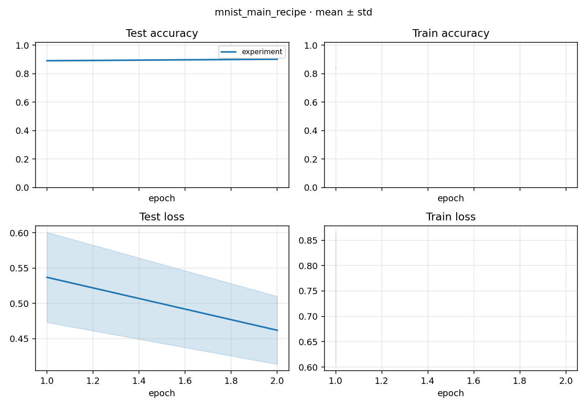

# Study Report: mnist_main_recipe

> Plan: [PLAN.md](PLAN.md)
> Date: 2026-09-07
> Recipe: git `main` 的 MNIST_linear 默认超参（60 step SGD+cosine），4 seeds。
> Location: `studies/mnist_main_recipe/docs/`。

## 1. Conclusion

4 次 train Run 全部 `succeeded`。最后一次 test Accuracy **mean 0.902**（std ~0.0006），和 main README 旧图饱和区（约 **0.90**）同量级、同学形。底座用这份 yaml extras 就能复现旧配方，没有把 native 训歪。

| | step 30 test acc | step 60 test acc |
|--|------------------|------------------|
| 本 Study（4-seed mean） | ~0.891 | **0.902** |
| main 旧图 | 从 ~0.1 升到约 **0.90** 后变平 | 同左（横轴归一化到 1） |

未做 bit-identical：这边是 **cpu**，main 默认 cuda；Normalize 是 torchvision 固定 0.1307/0.3081，main 是 kornia + 预计算 stats。差在小数第三位以外，对「配方有没有接上」足够。

`best` 按 **test Loss min**（对齐 main）。四次 seed 都是 step 60 的 Loss 更好，所以 best 和 last 是同一份权重。

## 2. Learning curves

process 画 mean±std。重画：`python studies/mnist_main_recipe/docs/plot_curves.py`。



[打开 learning_curves.png](./figures/learning_curves.png)

评测只有 **step 30 / 60** 两个点（`eval_period: 30`），所以图比旧 README 那条密曲线稀——旧图还叠了更密的 log。饱和值已经对上。

## 3. Runs

| seed | Run id | accuracy | best_value (test Loss) | train_loss |
|------|--------|----------|------------------------|------------|
| 0 | fe502b93cd174b63 | 0.9011 | 0.527 | 0.879 |
| 1 | 67623d1e8d0f6637 | 0.9021 | 0.458 | 0.766 |
| 2 | 83345f2e4d8c4e83 | 0.9024 | 0.453 | 0.732 |
| 3 | 5073509a9269e0bd | 0.9025 | 0.411 | 0.565 |
| **mean** | | **0.902** | **0.462** | **0.736** |

## 4. 合同

- yaml：`num_steps: 60`、`progress_unit: step`、SGD momentum/nesterov/wd、`best_metric: Loss`、`model.config.zero_bias`。
- 全量 MNIST train，batch 250，test batch ×4。
- 不做 TensorBoard。

## 5. Reproduce

```bash
python -m rpipe run studies/mnist_main_recipe
```
