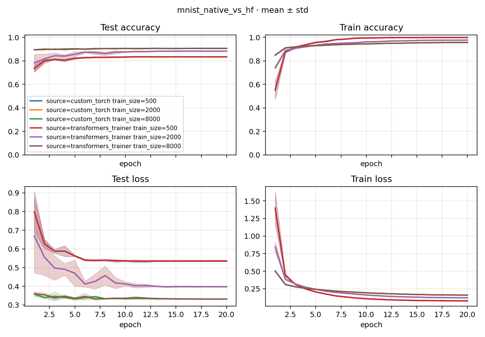

# Study Report: mnist_native_vs_hf

> Plan: [PLAN.md](PLAN.md)
> Date: 2026-09-04
> Recipe: MNIST + linear，**同一套键**：SGD lr=0.1、cosine、`max_grad_norm: 0`、`num_epochs: 20`、`progress_unit: epoch`。轴是 `algorithm.source` × `train_size`。
> Location: `studies/mnist_native_vs_hf/docs/`。

## 1. Conclusion

18 次 train Run 全部 `succeeded`。关掉 HF Trainer 默认 clip（`max_grad_norm: 0`）并复用 native DataLoader 之后，**500 / 2000 三颗 seed 的 accuracy、best_accuracy、train_loss 与 native 逐点相同**。8000 仍有约 **0.0008** 的 mean accuracy 差（seed 标准差量级），train_loss 已对齐。

| train_size | native last acc | HF last acc | Δ (HF − native) | native best | HF best | native train_loss | HF train_loss |
|------------|-----------------|-------------|-----------------|-------------|---------|-------------------|---------------|
| 500 | 0.834 | 0.834 | **0** | 0.836 | 0.836 | 0.080 | 0.080 |
| 2000 | 0.883 | 0.883 | **0** | 0.884 | 0.884 | 0.123 | 0.123 |
| 8000 | 0.906 | 0.907 | **+0.001** | 0.907 | 0.908 | 0.161 | 0.161 |

排序一致：8000 > 2000 > 500。剩下的 8000 差多半来自 Trainer 内部步进 / cosine 包一层 `_EpochScheduler`，不是 clip、也不是两套 shuffle。

`max_grad_norm` 是算法层超参（extras，非 Control 必须表）：缺省 / `0` = 不裁。不写的话 HF 会用 Trainer 自带的 `1.0`，train_loss 会对不齐。

## 2. Learning curves

process 按 Experiment 画 mean±std（6 条：2 source × 3 size）。图在 `docs/figures/learning_curves.png`。



[打开 learning_curves.png](./figures/learning_curves.png)

## 3. Native (`custom_torch`)

| train_size | seed | Run id | accuracy | best_accuracy | train_loss |
|------------|------|--------|----------|---------------|------------|
| 500 | 0 | 7c48352c847b2096 | 0.8329 | 0.8346 | 0.080 |
| 500 | 1 | 5662540f720e8797 | 0.8343 | 0.8347 | 0.079 |
| 500 | 2 | 5bb24f8a4b518994 | 0.8359 | 0.8375 | 0.080 |
| 2000 | 0 | c96de76cbb910155 | 0.8819 | 0.8841 | 0.123 |
| 2000 | 1 | 7d8d11439fd02689 | 0.8827 | 0.8835 | 0.124 |
| 2000 | 2 | 71a8ba2c73de2c4f | 0.8845 | 0.8851 | 0.123 |
| 8000 | 0 | e971cf5220878f98 | 0.9065 | 0.9069 | 0.161 |
| 8000 | 1 | a34e2f965d427746 | 0.9056 | 0.9072 | 0.161 |
| 8000 | 2 | 8de79ab58f66b2bb | 0.9062 | 0.9078 | 0.161 |

## 4. HuggingFace Trainer (`transformers_trainer`)

| train_size | seed | Run id | accuracy | best_accuracy | train_loss |
|------------|------|--------|----------|---------------|------------|
| 500 | 0 | 6b3522139506555d | 0.8329 | 0.8346 | 0.080 |
| 500 | 1 | 7036783459b4dee3 | 0.8343 | 0.8347 | 0.079 |
| 500 | 2 | e006258b46e5e54c | 0.8359 | 0.8375 | 0.080 |
| 2000 | 0 | 529a5bf98413e51e | 0.8819 | 0.8841 | 0.123 |
| 2000 | 1 | c5847d1f3f2da766 | 0.8827 | 0.8835 | 0.124 |
| 2000 | 2 | 6ab372aeaa9bd64a | 0.8845 | 0.8851 | 0.123 |
| 8000 | 0 | 021d59955431eda9 | 0.9067 | 0.9070 | 0.161 |
| 8000 | 1 | 38b06b38804eb60e | 0.9069 | 0.9083 | 0.161 |
| 8000 | 2 | 71be2847ca254e8e | 0.9071 | 0.9078 | 0.161 |

HF 循环是真的 `transformers.Trainer`。优化器 / cosine / clip 走同一套算法键；Train DataLoader 复用 native 的 shuffle Generator。cosine 按 **epoch** 步进（`_EpochScheduler`）。

## 5. 合同

- 同一套 yaml 键：`optimizer` / `lr` / `scheduler` / `max_grad_norm` / `num_epochs` / `progress_unit`。
- `algorithm.source` 只换落实，不换超参表。
- 需要 `pip install transformers accelerate`（extras `nlp` + `train`）。
- 不做 TensorBoard。

## 6. Reproduce

```bash
pip install -e ".[nlp,train]"
python -m rpipe run studies/mnist_native_vs_hf
```
