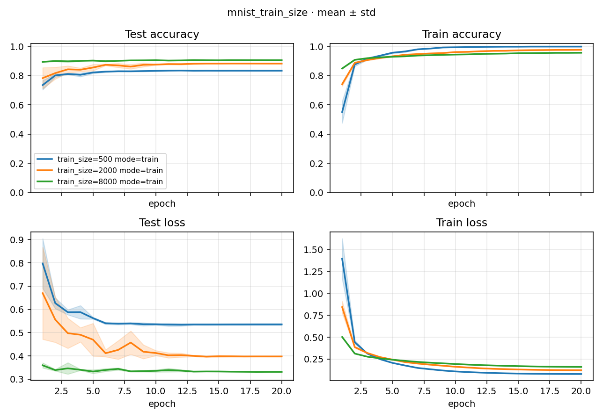

# Study Report: mnist_train_size

> Plan: [PLAN.md](PLAN.md)
> Date: 2026-09-04
> Recipe: native `custom_torch`；MNIST + linear；`num_epochs: 20`；`progress_unit: epoch`；SGD + cosine；axes = `train_size` × `{train, eval}`
> Location: Study `docs/`。产物在 `../index.json`、`../process.json`、`../runs/<id>/`。

## 1. Conclusion

18 次 Run 全部 `succeeded`（9 train + 9 独立 eval）。`process.complete: true`。

独立 eval 加载 sibling train 的 `best.pt`，口径与 train 的 `best_accuracy` **一致**（不是 last-segment `accuracy`）。比大小仍按样本量：

| train_size | train last acc | train best | **eval (best.pt)** | vs eval 500 | train_loss |
|------------|----------------|------------|--------------------|-------------|------------|
| 500（baseline train） | 0.834 | 0.836 | **0.836** | — | 0.080 |
| 2000 | 0.883 | 0.884 | **0.884** | +0.049 | 0.123 |
| 8000 | 0.906 | 0.907 | **0.907** | +0.072 | 0.161 |

结论不变：数据越多 test 越好；`train_loss` 随样本量上升是过拟合，不是 bug。最终口径用 **eval** 列。

## 2. Learning curves

只画 **train** Run（eval 没有 epoch 曲线）。`progress_unit: epoch` + `eval_period: 1`。process 出图。重画：`python studies/mnist_train_size/docs/plot_curves.py`。



[打开 learning_curves.png](./figures/learning_curves.png)

读图与上次相同：500 过拟合；8000 一上来就在 0.89 附近。

## 3. Train Runs

| train_size | seed | tags | Run id | accuracy | best_accuracy | train_loss |
|------------|------|------|--------|----------|---------------|------------|
| 500 | 0 | baseline | 2d659b2c099b25e6 | 0.8329 | 0.8346 | 0.080 |
| 500 | 1 | baseline | 3e714a56b6225dfb | 0.8343 | 0.8347 | 0.079 |
| 500 | 2 | baseline | c23d6263a6e139b0 | 0.8359 | 0.8375 | 0.080 |
| 2000 | 0 | — | ef6ae9e8570637f2 | 0.8819 | 0.8841 | 0.123 |
| 2000 | 1 | — | 7c4f3acfcea735b1 | 0.8827 | 0.8835 | 0.124 |
| 2000 | 2 | — | a1cc94ece60bbc76 | 0.8845 | 0.8851 | 0.123 |
| 8000 | 0 | — | 56ff93a07451c135 | 0.9065 | 0.9069 | 0.161 |
| 8000 | 1 | — | ee33efe18e4ddb85 | 0.9056 | 0.9072 | 0.161 |
| 8000 | 2 | — | 5466fa50bbce47d3 | 0.9062 | 0.9078 | 0.161 |

## 4. Eval Runs（独立 Algorithm，加载 sibling `best.pt`）

| train_size | seed | Run id | eval_accuracy | matches train best |
|------------|------|--------|---------------|--------------------|
| 500 | 0 | b236b38c493dffaf | 0.8346 | 0.8346 |
| 500 | 1 | bff88945bb26cdae | 0.8347 | 0.8347 |
| 500 | 2 | 3680f8042cdac8a5 | 0.8375 | 0.8375 |
| 2000 | 0 | bff41a5435320ea9 | 0.8841 | 0.8841 |
| 2000 | 1 | 67a0f537f62cc1e3 | 0.8835 | 0.8835 |
| 2000 | 2 | 7e94b60cb280f6c2 | 0.8851 | 0.8851 |
| 8000 | 0 | 1f214b8c7c5473af | 0.9069 | 0.9069 |
| 8000 | 1 | 9aa8af39a28221de | 0.9072 | 0.9072 |
| 8000 | 2 | ba70dfa1cfac4fd3 | 0.9078 | 0.9078 |

数字来自 `process.paired`。eval 不是 Flow 第二阶段。

## 5. 这次钉死的合同

- **native 循环**不再看 `data.name == MNIST`；有 `module` + `iter_batches` 就训。线性层才 flatten。
- **独立 eval Run**：`algorithm.mode: eval`，默认 resume `best`；本 Run 没有文件则按 index 找同 seed、同 `train_size` 的 train `best.pt`。
- **HF Trainer**：`algorithm.source: transformers_trainer` 把同一套 `optimizer` / `scheduler` / `resume` 映射到 `TrainingArguments`（optional extra `nlp`）。本 Study 仍是 `custom_torch`。
- **不做 TensorBoard**。

## 6. Reproduce

```bash
python -m rpipe run studies/mnist_train_size
```
