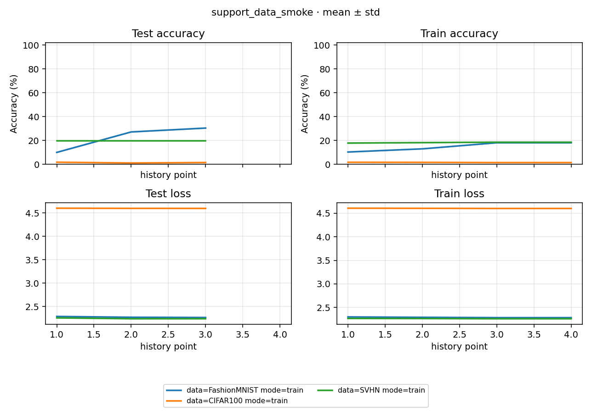

# Study Report: support_data_smoke

2026-10-03，计划见 [PLAN](PLAN.md)，自动数字见 [NUMBERS](NUMBERS.md)。Accuracy 为百分制。

## 1. 验收结论

**6/6 succeeded，三条 train 各完成 30 optimizer step，三组 checkpoint 来源与 Loss 核对通过；严格 Accuracy 一致 3/3。** 三条训练均一次启动，无错误、重试或 checkpoint resume。真实 split 和标签范围、参数更新、有限性、checkpoint 进度及评测权重来源验证通过。本 Study 与另一 support smoke Study 合计只覆盖批准的六个组合。

| 数据 / 模型 | last Accuracy / Loss | best step | best Accuracy / Loss | 独立 eval Accuracy / Loss | 已更新参数张量 / 总数 |
|---|---|---:|---|---|---|
| SVHN / cnn | 19.5874% / 2.241769 | 20 | 19.5874% / 2.241099 | 19.5874% / 2.241099 | 10/10 |
| FashionMNIST / cnn | 30.4000% / 2.266975 | 30 | 30.4000% / 2.266975 | 30.4000% / 2.266975 | 10/10 |
| CIFAR100 / cnn | 1.5000% / 4.598913 | 30 | 1.5000% / 4.598913 | 1.5000% / 4.598913 | 10/10 |


每个 Experiment 只有 seed 0（n=1），这些数为单次描述；process 的 std=0 不代表稳定性。30-step 只验收可运行性，不作收敛、模型排序、全部 5×7 组合或严格重放的结论。best 按 test Loss 选择；独立 eval 在同一 test split 复算 best，是来源与执行一致性检查。

## 2. 真实数据与模型入口

| 条件 | train / test 张数 | test batch NCHW | train / test 标签 [min,max,类数] | 参数量 |
|---|---|---|---|---:|
| SVHN / cnn | 73257 / 26032 | [256, 3, 32, 32] | [0, 9, 10] / [0, 9, 10] | 1556106 |
| FashionMNIST / cnn | 60000 / 10000 | [256, 1, 28, 28] | [0, 9, 10] / [0, 9, 10] | 1554954 |
| CIFAR100 / cnn | 50000 / 10000 | [256, 3, 32, 32] | [0, 99, 100] / [0, 99, 100] | 1602276 |

官方数据下载 / 数据构造 / make 总计 735.735s；包含网络、解压及构造，未分离纯下载时间。 torchvision 构造器按其官方 MD5 校验原始资源；没有使用 fake dataset 或 stub。7 个原始资源额外重算官方 MD5，全部一致，合计 446196260 bytes，证据 `.tmp/support-smoke-20261003/official-dataset-integrity.json`。sample 像素为 0–1、全部标签范围通过。Normalize、训练态增强与是否使用 stats.yaml 见 PLAN。

30-step 结束时 FashionMNIST 为 30.40%、CIFAR100 为 1.50%；SVHN 的三次完整 test Accuracy 均为 19.5874%，Loss-best 在 step 20。这里没有增加训练预算或预测分布诊断，不把有限步数的低分或相同精度直接解释为框架缺陷、收敛或预测塌缩。

## 3. 权重、优化器与评测核对

按 prepare 相同顺序重建 seed 0 初始化（model 在创建数据迭代器之前），以参数张量 SHA-256 对比 latest，确认实际更新；模型参数与 optimizer 状态有限。latest step=30、scheduler.last_epoch=30、T_max=30、下一步 lr=0；三次完整 test 对应日志里的 optimizer step 10 / 20 / 30。best Loss 等于三个候选的最低值。

每条 eval 的日志路径明确指向配对 train 的 best.pt，step 与 best 一致；Loss 差 ≤1e-5。严格 Accuracy 比较容差为 1e-4 百分点，通过 3/3；差异单独解释并保留判定。未将成功总数代替以上来源检查。

## 4. 曲线

[](figures/learning_curves.png)

原生图横轴为观测序号，test 三点对应 optimizer step 10 / 20 / 30。scalars.jsonl 的 step 是 tracker 累计 batch 计数（含 test），不能直接当 optimizer step。train 记录为区间累计均值，包含末尾重复记录，不是末尾单个 batch；曲线用于确认采集链路。

## 5. 排班与实际成本

make 共 2 wait，内置预估 24s；launcher 含 Study process 实测 **31.176s**，从 2026-10-03T04:38:58.952811+08:00 到 2026-10-03T04:39:30.128507+08:00。内置预估仅供排班参考，逐 Run 实测见下表。启动前清单与人工保守预算见 PLAN。所有 train wait 完成后再 eval，默认跳过成功项，最终无 retry。

| wait | 条件 | mode | seed | Run ID | 内置 est（s） | 成功 flow actual（s） | 日志 |
|---:|---|---|---:|---|---:|---:|---|
| 1 | FashionMNIST / cnn | train | 0 | c0781b98329e2173 | 9 | 10.504 | [run.log](../runs/c0781b98329e2173/assets/logs/run.log) |
| 1 | CIFAR100 / cnn | train | 0 | cb5270edd40d52f2 | 9 | 13.014 | [run.log](../runs/cb5270edd40d52f2/assets/logs/run.log) |
| 1 | SVHN / cnn | train | 0 | bdb9054f3029855c | 16 | 16.512 | [run.log](../runs/bdb9054f3029855c/assets/logs/run.log) |
| 2 | FashionMNIST / cnn | eval | 0 | 311740c40612d085 | 5 | 7.654 | [run.log](../runs/311740c40612d085/assets/logs/run.log) |
| 2 | CIFAR100 / cnn | eval | 0 | f38b8e8751159448 | 5 | 9.068 | [run.log](../runs/f38b8e8751159448/assets/logs/run.log) |
| 2 | SVHN / cnn | eval | 0 | 177b25ca3b231bdd | 8 | 10.728 | [run.log](../runs/177b25ca3b231bdd/assets/logs/run.log) |

actual 从每条 flow start 到 succeeded；并行行不能相加作墙钟。下载 / make、launcher、验证 / 写报告分开记录。

数据准备曾遇到沙箱网络限制，官方下载获准在沙箱外执行；随后沙箱内预检无法读取 CIFAR100 解压目录，预检及这 6 个 Run 获准在沙箱外完成。没有修改缓存 ACL 或旧 Study。下载 / 构造 / make 共 735.735s，超过起初 10 分钟参考；模型 Study 在下载期间运行，两个 launcher 时间与下载准备不能直接相加作为整轮墙钟。

## 6. 复现与证据

```powershell
python -m rpipe make studies/support_data_smoke --num-gpus 1 --init-gpu 0
python -m rpipe launch studies/support_data_smoke --num-gpus 1 --init-gpu 0 --console shared
python -m rpipe report studies/support_data_smoke
```

环境与配方见 PLAN：Python 3.13.9、torch 2.11.0+cu128、torchvision 0.26.0+cu128、scipy 1.16.3、RTX 5090 D v2；HEAD d938874 加 B-014 / B-015 未提交修复。本轮用已有环境，未验收全新环境完整安装。需要保留新的独立实测时先换 version，再 make；不清除已有 checkpoint。

本地原始证据 `.tmp/support-smoke-20261003/support_data_smoke-preflight.json`、`support_data_smoke-verification.json`、`support_data_smoke-launch.log` 与计时 JSON。旧 Study 保护检查和两轮总收口结果统一记录到 BRAINSTORM。配置、PLAN、报告、NUMBERS 与图可入库，原始 Run / shared / scripts 按既有 gitignore 保留本地。
