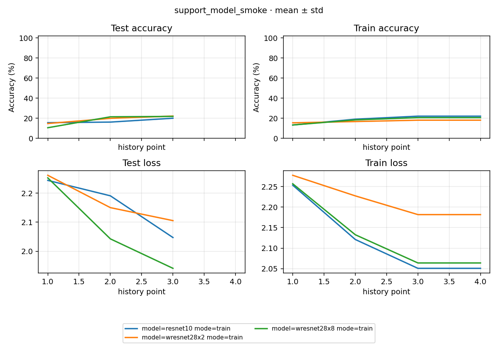

# Study Report: support_model_smoke

2026-10-03，计划见 [PLAN](PLAN.md)，自动数字见 [NUMBERS](NUMBERS.md)。Accuracy 为百分制。

## 1. 验收结论

**6/6 succeeded，三条 train 各完成 30 optimizer step，三组 checkpoint 来源与 Loss 核对通过；严格 Accuracy 一致 2/3。** 三条训练均一次启动，无错误、重试或 checkpoint resume。真实 split 和标签范围、参数更新、有限性、checkpoint 进度及评测权重来源验证通过。本 Study 与另一 support smoke Study 合计只覆盖批准的六个组合。

| 数据 / 模型 | last Accuracy / Loss | best step | best Accuracy / Loss | 独立 eval Accuracy / Loss | 已更新参数张量 / 总数 |
|---|---|---:|---|---|---|
| CIFAR10 / resnet10 | 20.0200% / 2.047117 | 30 | 20.0200% / 2.047117 | 20.0100% / 2.047117 | 32/32 |
| CIFAR10 / wresnet28x2 | 22.2000% / 2.105330 | 30 | 22.2000% / 2.105330 | 22.2000% / 2.105331 | 80/80 |
| CIFAR10 / wresnet28x8 | 21.8400% / 1.941142 | 30 | 21.8400% / 1.941142 | 21.8400% / 1.941142 | 80/80 |


**严格 Accuracy 复算有一组差异：** ResNet10 的 train Loss-best 为 20.02%，独立 eval 为 20.01%，正确计数相差 1/10000；Loss 差约 4.89e-7。原始 result / 日志保留，不把本组标成严格 Accuracy 一致。整包与分件模型所有 state tensor 逐个完全相等；额外只读复算同一权重得到 2002 个正确样本，改变卷积 TF32 设置后为 2003，6 个预测改变、改变样本的 top-two margin 为 8.70e-6–2.22e-4，最大 logits 差 0.001265。使用相同正式 EvalAlgorithm 和 runtime 设置的另一次诊断也得到 20.02% / Loss 2.047118975，评测结束后的模型 state 与 checkpoint 每个 tensor 完全相等。近边界预测对浮点路径敏感已有实测；原 train / eval 的逐样本 logits 未保存，不能据此证明历史具体哪条样本或哪种 kernel 导致差异。当前配方 deterministic=false / cudnn_benchmark=true，不承诺逐位复算；本组训练、checkpoint 来源与近似 Loss 核对通过，严格 Accuracy 判定保持未通过。原始诊断为 `.tmp/support-smoke-20261003/resnet-eval-diagnostic.json`、`.pt` 和 `native-eval-diagnostic.json`，没有新增正式 Run 或重写评测结果。


每个 Experiment 只有 seed 0（n=1），这些数为单次描述；process 的 std=0 不代表稳定性。30-step 只验收可运行性，不作收敛、模型排序、全部 5×7 组合或严格重放的结论。best 按 test Loss 选择；独立 eval 在同一 test split 复算 best，是来源与执行一致性检查。

## 2. 真实数据与模型入口

| 条件 | train / test 张数 | test batch NCHW | train / test 标签 [min,max,类数] | 参数量 |
|---|---|---|---|---:|
| CIFAR10 / resnet10 | 50000 / 10000 | [256, 3, 32, 32] | [0, 9, 10] / [0, 9, 10] | 4901450 |
| CIFAR10 / wresnet28x2 | 50000 / 10000 | [256, 3, 32, 32] | [0, 9, 10] / [0, 9, 10] | 1467610 |
| CIFAR10 / wresnet28x8 | 50000 / 10000 | [256, 3, 32, 32] | [0, 9, 10] / [0, 9, 10] | 23354842 |

CIFAR10 复制自 local_model_matrix 的可读缓存，10 个文件 SHA-256 一致（排除新 Study 的 .ready 来源标记）；未重新下载。 torchvision 构造器按其官方 MD5 校验原始资源；没有使用 fake dataset 或 stub。sample 像素为 0–1、全部标签范围通过。Normalize、训练态增强与是否使用 stats.yaml 见 PLAN。

## 3. 权重、优化器与评测核对

按 prepare 相同顺序重建 seed 0 初始化（model 在创建数据迭代器之前），以参数张量 SHA-256 对比 latest，确认实际更新；模型参数与 optimizer 状态有限。latest step=30、scheduler.last_epoch=30、T_max=30、下一步 lr=0；三次完整 test 对应日志里的 optimizer step 10 / 20 / 30。best Loss 等于三个候选的最低值。

每条 eval 的日志路径明确指向配对 train 的 best.pt，step 与 best 一致；Loss 差 ≤1e-5。严格 Accuracy 比较容差为 1e-4 百分点，通过 2/3；差异单独解释并保留判定。未将成功总数代替以上来源检查。

## 4. 曲线

[](figures/learning_curves.png)

原生图横轴为观测序号，test 三点对应 optimizer step 10 / 20 / 30。scalars.jsonl 的 step 是 tracker 累计 batch 计数（含 test），不能直接当 optimizer step。train 记录为区间累计均值，包含末尾重复记录，不是末尾单个 batch；曲线用于确认采集链路。

## 5. 排班与实际成本

make 共 6 wait，内置预估 55s；launcher 含 Study process 实测 **107.944s**，从 2026-10-03T04:26:35.045488+08:00 到 2026-10-03T04:28:22.989549+08:00。WideResNet 默认内置估时没有区分 widen factor；保留逐 Run 实测，不将估时当性能门槛。启动前清单与人工保守预算见 PLAN。所有 train wait 完成后再 eval，默认跳过成功项，最终无 retry。

| wait | 条件 | mode | seed | Run ID | 内置 est（s） | 成功 flow actual（s） | 日志 |
|---:|---|---|---:|---|---:|---:|---|
| 1 | CIFAR10 / resnet10 | train | 0 | 2af8136e19fcf399 | 11 | 20.766 | [run.log](../runs/2af8136e19fcf399/assets/logs/run.log) |
| 2 | CIFAR10 / wresnet28x2 | train | 0 | 7429d8becac81998 | 13 | 18.522 | [run.log](../runs/7429d8becac81998/assets/logs/run.log) |
| 3 | CIFAR10 / wresnet28x8 | train | 0 | c1c44f78c5f41f0a | 13 | 24.183 | [run.log](../runs/c1c44f78c5f41f0a/assets/logs/run.log) |
| 4 | CIFAR10 / resnet10 | eval | 0 | 985f35834578aec2 | 6 | 12.582 | [run.log](../runs/985f35834578aec2/assets/logs/run.log) |
| 5 | CIFAR10 / wresnet28x2 | eval | 0 | 7406744f10c86a5b | 6 | 11.664 | [run.log](../runs/7406744f10c86a5b/assets/logs/run.log) |
| 6 | CIFAR10 / wresnet28x8 | eval | 0 | a0cd82740b13ba00 | 6 | 14.340 | [run.log](../runs/a0cd82740b13ba00/assets/logs/run.log) |

actual 从每条 flow start 到 succeeded；并行行不能相加作墙钟。下载 / make、launcher、验证 / 写报告分开记录。

## 6. 复现与证据

```powershell
python -m rpipe make studies/support_model_smoke --num-gpus 1 --init-gpu 0
python -m rpipe launch studies/support_model_smoke --num-gpus 1 --init-gpu 0 --console shared
python -m rpipe report studies/support_model_smoke
```

环境与配方见 PLAN：Python 3.13.9、torch 2.11.0+cu128、torchvision 0.26.0+cu128、scipy 1.16.3、RTX 5090 D v2；HEAD d938874 加 B-014 / B-015 未提交修复。本轮用已有环境，未验收全新环境完整安装。需要保留新的独立实测时先换 version，再 make；不清除已有 checkpoint。

本地原始证据 `.tmp/support-smoke-20261003/support_model_smoke-preflight.json`、`support_model_smoke-verification.json`、`support_model_smoke-launch.log` 与计时 JSON。旧 Study 保护检查和两轮总收口结果统一记录到 BRAINSTORM。配置、PLAN、报告、NUMBERS 与图可入库，原始 Run / shared / scripts 按既有 gitignore 保留本地。
