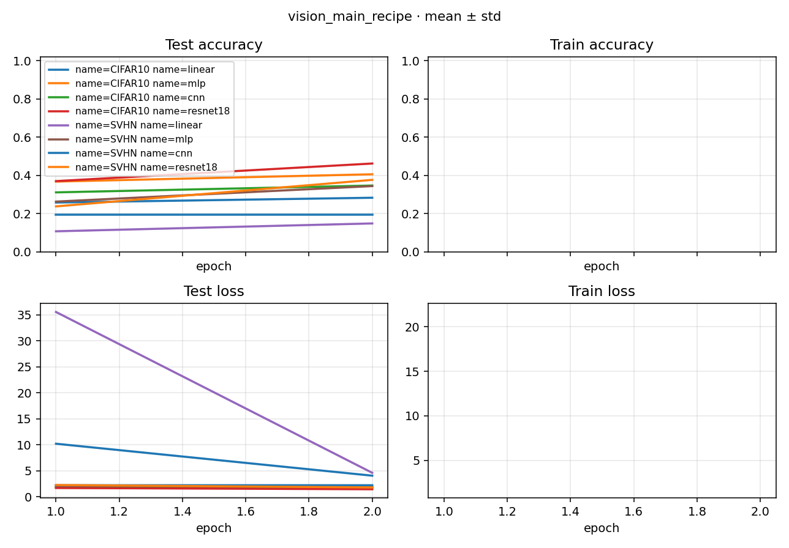

# Study Report: vision_main_recipe

> Plan: [PLAN.md](PLAN.md)
> Date: 2026-09-07（60-step 短跑）。**400 epoch + CUDA 长训尚未收口**，调度见 PLAN §4：`--round auto`（按 resnet18 显存估并发）。
> Recipe（已跑完的表）：git `main` 的 `hyper.py` 默认 **60 step** SGD+cosine，CIFAR10/SVHN × linear/mlp/cnn/resnet18，seed 0。

## 1. Conclusion

8 个 Experiment 全部 `succeeded`。cnn/resnet 走 NCHW，linear/mlp 在模块内 flatten；`Data.meta.data_size` 在 prepare 交给 model factory。60 step × batch 250 只是 main 的短预算，test acc 远低于长训是预期。

Last test Accuracy（seed 0，step 60）：

| | linear | mlp | cnn | resnet18 |
|--|--------|-----|-----|----------|
| CIFAR10 | 0.284 | 0.406 | 0.347 | **0.463** |
| SVHN | 0.149 | 0.345 | 0.196 | **0.377** |

## 2. Learning curves

`eval_period: 30`，test 只有 step 30 / 60 两个点；train 按 epoch 记一段。重画：`python studies/vision_main_recipe/docs/plot_curves.py`。



[打开 learning_curves.png](./figures/learning_curves.png)

## 3. 和 main 的差

- 增强在 DataLoader（torchvision），main 在模型外包 kornia。
- Normalize 用常用 torchvision 统计量，不是 `output/stats` 文件。
- cpu、1 seed；main 画图 4 seed、默认 cuda。

## 4. Runs

| data | model | Run id | accuracy | best Loss |
|------|-------|--------|----------|-----------|
| CIFAR10 | linear | 69678f9967a838b0 | 0.284 | 4.067 |
| CIFAR10 | mlp | 386a3919902356da | 0.406 | 1.677 |
| CIFAR10 | cnn | e9fdd774a685325e | 0.347 | 1.792 |
| CIFAR10 | resnet18 | d1be694e8d2ff4d4 | 0.463 | 1.458 |
| SVHN | linear | 4270c5888036e2cc | 0.149 | 4.618 |
| SVHN | mlp | 74921a11deb7ec9c | 0.345 | 1.975 |
| SVHN | cnn | 8b3388c232bfc967 | 0.196 | 2.224 |
| SVHN | resnet18 | c1c2cbac8d9cfbe8 | 0.377 | 1.803 |

## 5. Reproduce

60-step 旧表当时用的是 `python -m rpipe run`（顺序）。400 epoch 长训用：

```bash
python -m rpipe make studies/vision_main_recipe --num-gpus 1 --init-gpu 0
python -m rpipe launch studies/vision_main_recipe --num-gpus 1 --init-gpu 0
```
